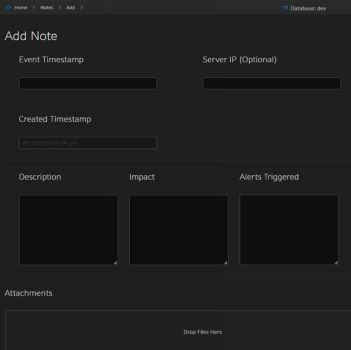
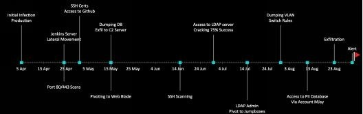

# 第10章 赛后——分析报告

> 译者：[@Snowming](https://github.com/Snowming04)

在之前的 THP 书籍中，我们有介绍如何编写渗透测试报告的示例，并提供了大量报告模板。这些示例非常适合那些按部就班的做渗透测试的活动，但是不适合红队的活动。正如本书所述，红队的焦点不是识别漏洞本身（虽然这也是工作的一部分），而是测试人、工具、工作流程和员工的技能组合。如果你的公司被授权的渗透测试者或者未授权的坏人攻击并成功入侵，你会给自己的业绩打几分？我一直反对使用差距评估分数、ISO 分数、成熟度模型分数、标准风险分析、热度图和类似类型的报告来展示公司安全项目的真实状况。

就我个人而言，我喜欢看到公司从之前的红队活动中采取措施进行控制，以测试是否真的取得了进展。例如，对于一个使用了近似域名方法的网络钓鱼活动，我们看到公司启用了以下一些功能：
- 使用 dnstwist 对与其公司类似的域名发出警报；
- 设置一个外部电子邮件域的可信列表。任何与之不匹配的外部邮件都将在最终用户可见的电子邮件中附加一个标题，说明它是外部（非公司）的、未经批准的电子邮件源。这将帮助你的用户更容易识别网络钓鱼。
- 来自代理中未分类的域的电子邮件中的任何链接至少应单击一次并警告用户改链接未分类。
- 禁止 Office 宏附件、强制使用受保护的视图和对文档进行沙盒处理。

这只是一个公司可以实施的可以阻止攻击的一些简单方法。

请记住，红队人员只需要找到一个漏洞就可能破坏整个内网环境。但是蓝队成员只需要识别攻击者的 TTP（战术，技术和过程）之一，就可以阻止这威胁。因此，现在的问题是，如果这些 TTP 中的一个已经引起防御系统发出警报，你的应急响应团队发现警报并处理威胁的速度有多快？所以红队风格的报告应该包括哪些内容呢？由于红队这个概念还很新，目前还没有标准的报告模板，我们可以根据客户的需求进行定制。在我看来，因为我们可能会在一个完整的红队活动中多次尝试进入一个内网环境(且被抓住几次)，所以我们想要把好的方面和不好的方面都在报告中都展示出来。

在活动期间、记笔记方面，许多工具如 Empire 和 Cobalt Strike 在红队活动期间都有很好的活动日志记录，但这些可能还远远不够。我发现对我们团队的活动非常有用的是，建立一个简单的 Web 服务器来记录红队成员执行的每个操作。记录过程中只收集最基本的信息，其中包括特定的事件、服务器、描述、影响、任何警报和屏幕截图。大多数红队/渗透测试人员都不喜欢做笔记，但这类记录提供了一种简单的跟踪活动的方法。

一旦活动结束，我们将收集所有笔记并将其组合在一起，以构建一个能讲述故事的红队报告。红队报告的主要组成部分可能包括：

- **简介/范围**：本节需要明确说明活动的目标。例如，有些客户要求我们访问特定的数据、获得域管理权限、获取 PII（个人身份信息）、获取 IP 或在找到他们的生产环境的服务器的标志（flag）。

- **指标**：在一场交战之后获得攻击报告是对应急响应团队/取证团队非常有帮助的。我们还想确定他们的防范工具或安全传感器可能遗漏的地方，那些使他们无法执行取证或检测恶意活动的纰漏。因此，我们希望给出C2服务器的IP地址、使用的域名、二进制文件的 MD5/SHA1 哈希、电子邮件地址和 IP 信息、被钓鱼的受害者列表以及任何其他可能有助于取证/应急响应团队的信息。

- **攻击时间轴**：这是红队行动中最重要的部分之一，做好笔记是有回报的。时间轴应该充分说明所有的主要活动，任何触发警报的 TTP，以及主要的活动。这将允许蓝队比较他们的时间轴和笔记，看看他们错过了什么。在一次真正的攻击中，你有机会询问那些坏人关于他们做的每坏件事吗？这对防守团队来说是非常有利的。一个时间轴示例可能是这样的:

  

- **检测时间（TTD）/解决时间（TTM）**：这通常是我们可以使用蓝队报告构建 TTD/TTM 统计数据的地方。我们都想要确定蓝队发现一次多重入侵所需的时间；扫描事件触发调查之前花费的时间（如果调查了的话）；以及蓝队需要多长时间来识别网络钓鱼活动。
第二部分应该讨论有关采取行动之前花费的时间的统计数据。如果有已警告的 C2 通信或已识别的网络钓鱼，那么在防火墙或 DNS 服务器上封锁这些域需要花费的时间是多久？我们经常看到公司可能擅长屏蔽域名，但是当 C2 服务器通过 IP 进行通信时会很快失败（反之亦然）。我们希望确保跟踪此活动并帮我们的客户来识别它。另一个很有用的 TTM 衡量标准是他们最快的情况下要花多久来隔离一个已经确认受损的系统。随着恶意软件变得越来越自动化，我们需要开始利用智能化和自动化的流程将系统或网络的一部分与组织的其他部分隔离开来。

- **来自应急响应/应急人员的反馈**：我最喜欢记录的东西之一是来自蓝队的反馈：他们是如何从防守的角度看待整个活动的。我想知道的是，他们是否觉得自己遵守了安全政策，事件负责人是否推动了调查，管理层是否过度介入，安全部门如何与 IT 部门进行安全方面的互动，从而促进任何与 IT 相关的改变（防火墙屏蔽、DNS 修改等等）。以及他们中间的哪些人过于慌张、哪些人过于冷静。

如前所述，红队的目的不是寻找漏洞或破坏环境（尽管这是非常有趣的部分），而是改善客户组织的整体安全程序和规划并证明其环境中存在某些漏洞。如今，许多公司对自己的安全程序过于自信，只有当他们被攻破时才会做出改变。现在有了红队，我们可以模拟攻击行为并鼓励客户做出改变，而不是等到真实入侵的事件，那时或许已为时太晚。
