# 第2章 发球前——红队侦察

> 译者：[@Snowming](https://github.com/Snowming04)


在 The Hacking Playbook 2 中，前面的发球部分重点介绍了一些不同的工具，如 Recon-NG、Discover、Spiderfoot、Gitrob、Masscan、Sparta、HTTP Screenshot、漏洞扫描器（包括 nessus，openvas）、Burp 套件等。这些工具我们可以在外网或内网络使用，对目标的基础设施进行侦察或扫描。在本书中我们将延续这一做法，然后从红队的角度对侦察阶段进行拓展。

## 环境探测
对于红队来说，这往往是进攻的好时机。你不仅需要随时准备好去攻击基础设施，还需要不断地寻找它的漏洞。我们可以通过使用不同的工具来进行环境扫描、服务探测、检索云计算配置错误。这些活动有助于你收集有关目标基础设施的更多信息，并找到攻击的最好方法。

### 扫描结果差异化分析
对于所有客户机，我们要做的第一件事就是设置不同的监视脚本。这些通常只是一些能快速完成的 bash 脚本，它们每天通过电子邮件向我们发送客户机网络的差异。当然，在扫描之前，确保你有适当合法的授权来执行扫描。
 
对于一般不太大的客户机网络，我们设置简单的 cronjob 来执行外部端口差异化分析。例如，我们可以创建一个快速的 Linux bash 脚本来完成这项艰巨的工作（请记住替换下面脚本中的 IP 范围）:
- #!/bin/bash
- mkdir /opt/nmap_diff
- d=$(date +%Y-%m-%d)
- y=$(date -d yesterday +%Y-%m-%d)
- /usr/bin/nmap -T4 -oX /opt/nmap_diff/scan_$d.xml 10.100.100.0/24 ><br>
 /dev/null 2>&1
- if [ -e /opt/nmap_diff/scan_$y.xml ]; then
- /usr/bin/ndiff /opt/nmap_diff/scan_$y.xml /opt/nmap_diff/scan_$d.xml ><br>
/opt/nmap_diff/diff.txt
- fi
> 译者注：上面这段脚本中使用了正则表达式。所以本小节的英文名字叫 Regular Nmap Diffing。

这是一个非常简单的脚本，它每天用默认的端口运行 nmap，然后使用 ndiff 比较结果。然后，我们可以获取这个脚本的输出结果，并让它把每天发现的新端口及时通知我们的团队。<br>

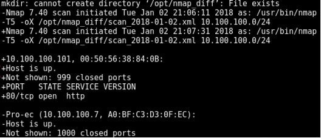

在上一本书中，我们着重讨论了 [Masscan](https://github.com/robertdavidgraham/masscan) 的好处，以及它比 nmap 的速度快多少。Masscan 的开发者说，如果你的网络带宽足够大，你可以在6分钟内扫描完毕整个互联网。所以说，当扫描大的范围时，Masscan 是很可靠的。Masscan 对我们最初的侦察很有用，但通常不用于比较差异。

**实验**:<br>
本书中的实验是选修的。在某些部分中，我添加了一些实验方便你进行测试或者扩展更多的领域。这都是基于读者的个人兴趣的，如果对某方面感兴趣，我强烈推荐你花时间改进我们的工具，并与社区共享它。<br>
建立一个更好的网络 diff 扫描器:
- 构建一个比默认的 nmap 更好的端口列表(例如，nmap 默认的漏掉一些端口，比如 Redis 6379/6380 和其他端口)
- 实现 nmap banner
- 保持对端口的历史跟踪
- 建立电子邮件提醒/通知系统
- 参考 [diff Slack 警报](http://bit.ly/2H1o5AW)


### Web 应用程序监控
除了定期扫描开放的端口和服务之外，红队还应该监视不同的 Web 应用程序，这一点很重要。我们可以使用以下两个工具来帮助监视应用程序的变化。

我们常用的第一个工具是 [HTTPScreenshot](https://github.com/breenmachine/httpscreenshot) 。HTTPScreenshot 很强大的原因是它使用 Masscan 快速扫描大型网络，并使用 phantomjs 捕捉它检测到的任何网站的屏幕截图。这是快速获得大的内网或外网布局架构的一个好方法。

请记住，本书中的所有工具都是在上一版改进的 Kali 虚拟机中运行的。你可以在[这里](https://securepla.net/training/)找到虚拟机。
用户名密码是默认的：root/toor。

- cd /opt/httpscreenshot/
- 编辑 networks.txt 文件来选择你想扫描的网络:
	-  gedit networks.txt
- ./masshttp.sh
- firefox clusters.html

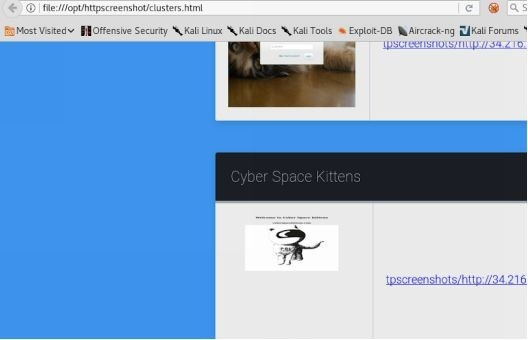

另一个可以用到的工具是 [Eyewitness](https://github.com/ChrisTruncer/EyeWitness)。

Eyewitness 是另一个很好的工具，它用 XML 文件的方式输出 nmap 的扫描结果、获取到的 Web 页面截图、RDP 服务器信息以及 VNC 服务器信息，。

> **实验**:<br>
>
>- cd /opt/EyeWitness
>- nmap [IP Range]/24 —open -p 80,443 -oX scan.xml
>- python ./EyeWitness.py -x scan.xml —web
>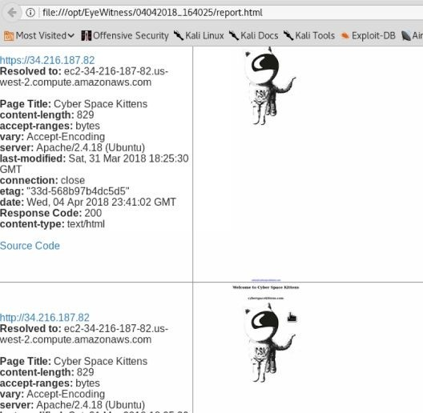

### 云扫描 
随着越来越多的公司转向使用不同的云基础设施，一些围绕云服务的新型攻击和传统攻击逐渐形成。这通常是由于公司错误的配置和缺乏对云基础设施上公共条款的确切了解。无论是选择亚马逊 EC2、Azure、谷歌云还是其他云服务提供商，使用不同的云基础设施都已成为一种全球趋势。

对于红队队员来说，一个问题是如何在不同的云环境中进行探索。由于许多目标公司使用动态 IP，他们的服务器可能不仅变化很快，而且也不在云提供商的某个列表中列出。例如，如果你使用 AWS，它们在全世界范围内拥有巨大的范围。根据你选择的区域，你的服务器将随机放入一个大的范围。对于外人来说，发现并监控这些服务器并不容易。

首先，很重要的一点是要弄清楚不同提供者拥有的 IP 范围。其中一些例子是:
- [Amazon IP 范围](http://bit.ly/2vUSjED)
- [Azure IP 范围](http://bit.ly/2r7rHeR)
- [谷歌云 IP 范围](https://cloud.google.com/compute/docs/faq#find_ip_range)

可以看出，这些范围非常大，手动扫描非常困难。在本章中，我们将讨论如何获取这些云系统上的信息。

### 网络和服务的搜索引擎
要寻找云服务器，互联网上有很多免费的资源，可以对我们的目标进行侦察。我们可以使用谷歌和第三方扫描服务。使用这些资源，我们可以深入了解一家公司，顺利地查找关于服务器、开放服务、banner 和其他细节的信息。而目标公司永远不会知道你通过查询获取了这类信息。让我们看看如何作为红队使用这些资源。

#### Shodan
[Shodan](https://www.shodan.io) 是一个伟大的网络服务，它定期扫描互联网，抓取 banners、端口、网络信息等等。他们甚至会扫描到漏洞信息，如心脏滴血漏洞。Shodan 最有趣的用途之一是浏览开放式网络摄像头并使用它们。从红队的角度来看，我们想要找到关于目标受害者的信息。

一些基本的搜索查询:
- title: 搜索从 HTML 标记中提取的内容
- html: 搜索返回页面的完整 HTML 内容
- product: 搜索 banner 中标识的软件或产品的名称
- net: 搜索一个指定的网段(例如:204.51.94.79/18)

我们可以在 Shodan 上搜索 cyberspacekittens 网站:
- cyberspacekittens.com
- 使用 HTML 的 title 标签进行搜索
	- title:cyberspacekittens
- 搜索页面内容
	- html:cyberspacekittens.com
	
请注意，我观察到 Shodan 的扫描有点慢。Shodan 花了超过一个月的时间才扫描完我添加的扫描任务，并将扫瞄结果放入 Shodan 数据库。

#### Censys.io
[Censys.io](https://censys.io/) 持续监控 Internet 上的每一台可访问的服务器和设备，以便你可以实时搜索和分析它们。通过 Censys 你能够了解你的网络攻击面，发现新的威胁，并评估其全球影响。

Censys 的最佳特性之一是它从 SSL 证书中提取信息。通常，红队队员的主要困难之一是找到目标服务器在云服务器上的位置。幸运的是，我们可以使用 Censys.io 来查找这些信息，因为他们已经解析了这些数据

这些扫描的一个问题是它们可能会延迟几天或几周。在这种情况下，需要用一天的时间来扫描标题信息。另外，在我的站点上创建 SSL 证书之后，信息在 Censys.io 站点上显示花费了四天时间。但是在数据准确性方面，Censys.io 相当可靠。

下面，我们通过扫描找到目标网站 cyberspacekittens.com 的信息。通过解析服务器的 SSL 证书，我们能够确定受害者的服务器托管在 AWS 上。<br>
<br>

还有一个 [Censys脚本工具](https://github.com/christophetd/censys-subdomain-finder)，可以通过脚本的方式来进行查询。

### 手动解析 SSL 证书
我们发现，很多公司没有意识到他们在互联网上暴露的东西。特别是随着云服务使用量的增加，许多公司没有正确地配置安全的访问控制列表。他们相信他们的服务器是受保护的，但我们可以发现他们是暴露在互联网上的。包括 Redis 数据库、Jenkin 服务器、Tomcat 管理、NoSQL 数据库等等——其中许多可以导致远程代码执行以致利益损失。

找到这些云服务器的轻松而又不为人知的方法是在网络上以自动化的方式手动扫描 SSL 证书。我们可以获取云服务提供商的 IP 范围列表，并定期扫描所有这些列表以提取 SSL 证书。通过查看 SSL 证书，我们可以了解有关目标公司的大量信息。从下面对 cyberspacekittens 范围的扫描中，我们可以看到 .int 证书中的主机名。对于内部服务器，.dev. 用于开发, vpn.用于 VPN 服务器等。很多时候你会在结果中看到一些没有对应公网 IP 的内部主机名或者一些他们内部信任的白名单网段。

为了帮助扫描证书中的主机名，我为本书开发了 **sslScrape**。这个工具利用 Masscan 快速扫描大型网络。一旦它识别到443端口的服务，它就会在 SSL 证书中提取主机名。

[sslScrape](https://github.com/cheetz/sslScrape)
- cd /opt/sslScrape
- python ./sslScrape.py [IP 地址 CIDR 范围]

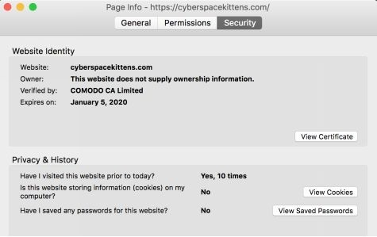<br>

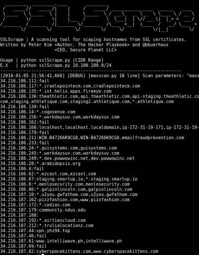<br>

云 IP 地址的例子:
- Amazon: http://bit.ly/2vUSjED
- Azure: http://bit.ly/2r7rHeR
- Google Cloud: http://bit.ly/2HAsZFm

在本书中，我会尝试提供一些代码示例和一个初步的程序框架。然而，是否在示例和初始框架的基础上进一步学习这取决于你自己。我强烈建议你从这段代码（也就是 sslScrape 的源码）开始，试着将所有获得的主机名保存到一个数据库里，再做一个 Web UI 前端作为展示页面。然后去连接其他可能有证书的端口，比如 8443 端口，这样可以从证书中获取主机的信息。甚至可以加上扫描 .git 或者 .svn 等源码信息泄露的功能。
> 译者注： .git/.svn 源码信息泄露，可以参考：https://www.secpulse.com/archives/55286.html 进行理解。

### 子域名发现
在识别 IP 范围方面，我们通常可以从区域互联网注册管理机构这样的公共资源来查找某个公司。比如美洲互联网号码注册管理机构（American Registry for Internet Numbers，ARIN）管理北美和部分加勒比地区事务，网址为 https://www.arin.net/ 。我们可以查找 IP 地址的拥有者、某个公司的网络、组织的自治系统编号等等。如果我们要看北美以外的地区，我们可以通过 AFRINIC(非洲)、APNIC(亚洲)、LACNIC(拉丁美洲)和 RIPE NCC(欧洲)查找。这些都是公开可用的，并在其服务器上列出。

你可以通过许多可用的公共源查找任何主机名或 FQDN 以找到该域的所有者(我最喜欢的快速查找域名所有者的网站是 https://centralops.net/co/domaindossier.aspx )。但是子域名就很难搜集。因为子域名并不是在某些公开注册系统上集中注册的，而是存储在目标的 DNS 服务器上。你必须知道要怎样搜索才能找到有效的子域名。

为什么子域名对于你的攻击目标如此重要?有几个原因:
- 一些子域可以表明它是什么类型的服务器(即 dev、vpn、mail、internal、test)。例如, mail.cyberspacekittens.com。
- 一些网站服务器无法通过 IP 去访问，也就是多个服务器共享一个出口 IP 的情况。这些服务器可能位于共享的基础设施上（比如 virtual host)，如果你要访问这些网站，就只能通过域名去访问。这样的情况在云基础架构中非常常见。这种情况下，如果你使用 nmap 扫描这个 IP，只能得到主机的端口开放信息，不能进一步获取更多的 Web 指纹，必须要使用对应的子域名来访问站点，然后使用类似于 WhatWeb 的工具来获得 Web 指纹。
- 收集子域名可以获得目标在哪托管他们服务器的信息。这是通过找出目标全部子域名、针对子域名反向查询 IP 以及查询托管 IP 的地方来完成。一家公司可能会使用多个云服务提供商和数据中心来托管他们的服务器。

在上一本书（The hacker playbook第二版）中我们讲了很多用于子域名收集的工具，因此让我们回顾一些当前仍然可用的工具的和一些新工具，来更好的进行子域名收集。欢迎扫描 cyberspacekittens.com 域名！

#### Discover Scripts
上一本书里面谈论的 [Discover Scripts](https://github.com/leebaird/discover) 工具仍然是我最喜欢的子域名收集工具之一。因为它结合了Kali Linux 上的所有的子域名侦察工具，并定期进行维护更新。被动信息收集将利用下列所有的工具: `Passive uses ARIN`, `dnsrecon`, `goofile`, `goog-mail`, `goohost`, `theHarvester`, `Metasploit`, `URLCrazy`, `Whois`, `multiple websites` and `recon-ng`.

```shell
git clone https://github.com/leebaird/discover /opt/discover/
/cd /opt/discover/
/./update.sh.
/discover.sh
Domain
Passive
[Company Name]
[Domain Name]
firefox /root/data/[Domain]/index.htm
```
Discover Scripts 最棒的地方在于，它基于已收集到的信息滚雪球式搜索。
例如，通过对公开的 PGP 仓库进行搜索，它可能会识别电子邮件，然后使用这些信息继续在 [Have I Been Pwned 网站](https://haveibeenpwned.com/)进行搜索（通过 Recon-NG 工具）。这将让我们知道是否可以通过公开发布的数据泄露危害找到一些泄露出的密码。

#### KNOCK
接下来，我们希望了解公司可能使用的所有服务器和域名。尽管没有存储子域的中心位置，但我们可以使用 Knock 等工具暴力破解不同的子域名，来识别哪些服务器或主机可以攻击。

Knockpy 是一个 python 工具，它通过一个 wordlist 来枚举目标域中的子域名。

Knock 是一个很好的子域名扫描工具，它生成一个子域名列表，并检查这些生成的子域名是否可以解析。因此，如果你想扫描 cyberspacekittens.com, Knock 将使用 [此 wordlist](http://bit.ly/2JOkUyj)，并查看 [subdomain].cyberspacekittens.com 是否有任何子域。在此要注意的一点是，更好的 wordlist 会增加找到子域名的机会。

我最喜欢的一个子域名字典是由 jhaddix 创建的([点此查看](http://bit.ly/2qwxrxB))。子域名字典是你应该持续收集的东西之一。其他一些好的子域名字典可以在你的 THP Kali 镜像的 /opt/SecLists 文件夹下找到或者在 [这里](https://github.com/danielmiessler/SecLists/tree/master/Discovery/DNS) 找到。
> 译者注：The Hacker Playbook Kali 镜像在本书的第一章的【本章总结】里面有介绍，是本书作者专门针对于本书中的实验创建的基于 Kali Linux 并且添加了所有工具的完整版虚拟机([点此获取](http://thehackerplaybook.com/get.php?type=THP-vm))。

**实验:**<br>
搜集 cyberspacekittens.com 的所有子域名。
- cd /opt/knock/knockpy
- python ./knockpy.py cyberspacekittens.com
- 这将使用 Knock 中内置的基础子域名字典。尝试下载并使用更大的子域名字典。使用`-u`参数切换到 http://bit.ly/2qwxrxB 字典。即：
```shell
python ./knockpy.py cyberspacekittens.com -w all.txt
```

你从 Discover Scripts 中发现了哪些类型的差异？什么类型的域将是你的第一个攻击目标，或与钓鱼式域攻击一起使用？去现实世界试试吧！去找一个 bug 赏金程序，并寻找丰富的子域。

#### Sublist3r
正如前面提到的，Knock 的问题是，它严重的依赖字典的质量。有些公司有非常独特的子域名，无法通过通用的子域名字典找到。下一个最好的资源是搜索引擎。当网站被爬虫爬行时，带有链接的文件会被分析并被收集到公开的资源，这意味着我们可以使用搜索引擎为我们做子域名收集的工作。

在这种情况下，我们可以借助 Sublist3r 这样的工具。注意，这种工具使用不同的 “google dork” 风格的查询语句进行搜索，容易被谷歌人机检查识别成机器人。这可能会使你暂时被列入黑名单，并要求你为每个请求填写验证码，这可能会限制扫描的结果。

运行 Sublist3r：
> 译者注：原书这里存在笔误，作者写成了 To run **Sublister**，但实际上应该是 To run **Sublist3r**.
- cd /opt/Sublist3r
- python sublist3r.py -d cyberspacekittens.com -o cyberspacekittens.com

看看 Sublist3r 跑出来的结果，跟用子域名暴力破解出的结果对比一下，是不是有一些之前没发现的？同样的，再次针对一个 bug 赏金项目尝试 Sublist3r 方法来收集子域名，对比感受暴力破解和使用搜索引擎之间的显著区别。

*Sublist3r 有一个分支版本，这个分支版本包含额外的特性（特别是子域名劫持的检查）:* https://github.com/Plazmaz/Sublist3r 

#### SubBrute
最后一个要介绍的子域名收集工具是 [SubBrute](https://github.com/TheRook/subbrute)。SubBrute 是一个社区项目，目标是创建最快、最准确的子域枚举工具。SubBrute 背后的神奇之处在于，它使用开放的解析器作为代理来绕过 DNS 速率限制( https://www.us-cert.gov/ncas/alerts/TA13-088A )。这种设计还提供了一层匿名性，因为 SubBrute 不直接向目标的域名服务器发送流量。

SubBrute 不仅速度非常快，它还执行 DNS 爬虫功能，爬取枚举的 DNS 记录。

运行 SubBrute:
```shell
cd /opt/subbrute 
./subbrute.py cyberspacekittens.com
```

我们还可以将 SubBrute 的性能提升一下，将其与 [MassDNS](http://bit.ly/2EMKIHg) 结合，以执行非常高性能的 DNS 解析。

### Github
Github 是一个有惊人数据的宝库。在一些渗透测试和红队评估中，我们能够获得密码，API 密钥，旧的源代码，内部主机名/ IPs 以及更多。这些要么导致直接攻击沦陷，要么帮助发动另一场攻击。我们看到的是，许多开发人员要么将代码保存到错误的仓库(将其发送到他们的公开仓库而不是公司的私有仓库)，要么意外地保存敏感数据(如密码)，然后试图删除它。Github 的一个优点是，它可以在每次修改或删除代码时进行记录。这意味着如果有一次将敏感数据保存到仓库中，那么即使删除了该敏感数据，那么它仍然会在数据更改中被记录。只要仓库是公开的，你就能够查看所有这些更改。

我们可以使用 Github 搜索来识别某些主机名/组织名，或者甚至仅仅使用简单的 Google Dork 搜索，例如: 
- site:github.com + “cyberspacekittens”

尝试使用不同的方法搜索 bug 赏金程序，而不是仅仅搜索 cyberspacekittens。

通过你所有的搜索，你会遇到: 
https://github.com/cyberspacekittens/dnscat2 (为 GitHub 实验准备的修改过的示例)。你可以手动检索这个仓库，但通常它非常大，你很难遍历所有的项目来找到一些有趣的东西。

如前所述，当你在 Github 中编辑或删除文件时，一切都会被跟踪记录。对于红队队员来说，幸运的是，许多人忘记了这个特性。因此，我们经常看到人们把敏感信息放到 Github 中，然后删除，却没有意识到它还在那里!让我们看看能不能找到这些珍宝。

#### Truffle Hog
Truffle Hog工具会扫描不同的提交历史记录和分支来获取高机密的密钥，并输出它们。这对于查找机密数据、密码、密钥等非常有用。让我们看看能否在 cyberspacekittens 的 Github 仓库中找到一些敏感的数据。

**实验:**
- cd /opt/trufflehog/truffleHog
- python truffleHog.py https://github.com/cyberspacekittens/dnscat2

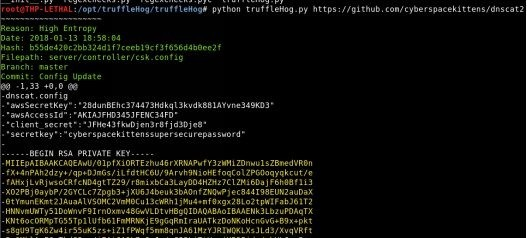

正如我们在 commit 历史记录中看到的，AWS 密钥和 SSH 密钥被从 server/controller/csk.config 文件中删除了。但是如果查看[当前仓库](https://github.com/cheetz/dnscat2/tree/master/server/controller)，你找不到这个文件。

更好的设置(但是设置起来有点复杂)是 [git-all-secrets](https://github.com/anshumanbh/git-all-secrets)。在查看大型项目时，Git-all-secrets 非常有用。你只需指定某个项目并在本地克隆该项目代码，然后使用 Truffle-hog 和 repo-supervisor 扫描它。在此之前你需要创建一个 Github 访问令牌，令牌是免费的，通过创建一个 Github 并在设置中选择 Generate New Token 选项来生成。

运行 git-all-secrets:
- cd /opt/git-all-secrets
- docker run -it abhartiya/tools_gitallsecrets:v3 -repoURL=https://github.com/cyberspacekittens/dnscat2 -token=[API Key] -
output=results.txt
- 这将克隆仓库并开始扫描。你甚至可以使用`-org`参数跑完该组织在 Github 上的所有内容。
- 容器(container)运行完成后，输入以下命令检索容器 ID:
```shell
docker ps -a
```
- 有了容器 ID 后，就可以输入以下命令将结果文件从容器(container)发送到主机:
```shell
docker cp <container-id>:/data/results.txt ./results.txt
```

### Cloud
正如我们前面所说的，cloud 是我们看到的许多公司有不安全环境配置的一个领域。最常见的一些问题是:

- Amazon S3 Missing Buckets: https://hackerone.com/reports/121461
- Amazon S3 Bucket Permissions: https://hackerone.com/reports/128088
- Being able to list and write files to public AWS buckets:
    - aws s3 ls s3://[bucketname]
    - aws s3 mv test.txt s3://[bucketname]
- Lack of Logging

在开始测试不同的 AWS 存储桶上的错误配置之前，我们需要首先发现它们。我们将尝试一些不同的工具，看看我们能在受害者的 AWS 基础设施上发现什么。

#### S3 Bucket Enumeration（[S3 存储桶](https://docs.aws.amazon.com/zh_cn/AmazonS3/latest/dev/UsingBucket.html) 枚举）
有许多工具可以为 AWS 执行 S3 bucket 枚举 。这些工具通常利用关键字或列表，应用多种排列，然后尝试去发现不同的 bucket。例如，我们可以使用一个名为 [Slurp](https://github.com/bbb31/slurp) 的工具来查找关于目标 CyberSpaceKittens 的信息:
- cd /opt/slurp
- ./slurp domain -t cyberspacekittens.com
- ./slurp keyword -t cyberspacekittens

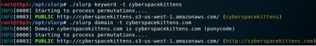

#### Bucket Finder
另一个工具 Bucket Finder 不仅会尝试查找不同的 bucket，还会从这些 bucket 中下载所有的内容进行分析:

- wget https://digi.ninja/files/bucket_finder_1.1.tar.bz2 -O bucket_finder_1.1.tar.bz2
- cd /opt/bucket_finder
- ./bucket_finder.rb —region us my_words —download

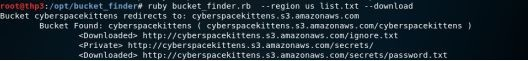

你一直在基于 Cyber Space Kittens 的基础设施进行搜寻，并发现了他们的一个 S3 bucket( cyberspacekittens.s3.amazonaws.com )。在 S3 bucket 中检索可见的和不可见的内容时，你的第一步要做什么呢？你可以首先把它弹到浏览器中来看一些信息:

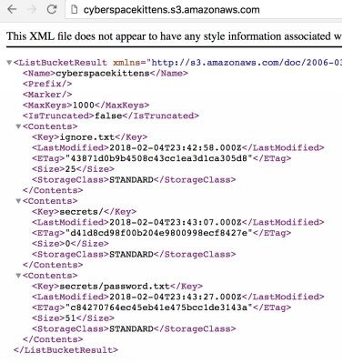

在开始之前，我们需要创建一个 AWS 帐户来获得一个访问密钥 ID。你可以在 Amazon [免费创建你的帐户](https://aws.amazon.com/s/dm/optimization/server-side-test/free-tier/free_np/)。创建帐户后，登录 AWS，转到你的[安全凭据](https://amzn.to/2ItaySR)，然后转到访问密钥。一旦你有了 AWS Access ID 和密钥，我们就可以查询 S3 bucket 了。

查询 S3 并下载一切内容：
- 下载 awscli：
    - sudo apt install awscli
- 配置凭证：
    - aws configure
- 查看 CyberSpaceKittens 的 S3 bucket 的权限:
    - aws s3api get-bucket-acl --bucket cyberspacekittens
- 从 S3 Bucket 中读取文件：
    - aws s3 ls s3://cyberspacekittens
- 下载存在 S3 Bucket 中的所有内容：
    - aws s3 sync s3://cyberspacekittens 

除了查询 S3 之外，接下来要测试的是写入该 bucket。如果我们有写的权限，可能就可以对它们的应用程序完成 RCE（远程命令执行）。我们经常看到，当 S3 bucket 上存储的文件被用于它们的所有页面时(并且如果我们可以修改这些文件)，那么我们就可以将恶意代码放到它们的 Web 应用服务器上。

写入 S3:
```shell
echo “test” > test.txt
aws s3 mv test.txt s3://cyberspacekittens
aws s3 ls s3://cyberspacekittens
```
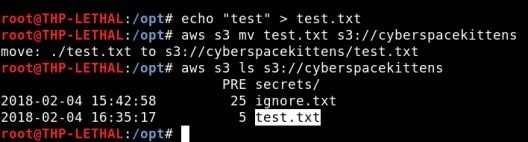

*注意，write 已被从 Everyone 组中删除。这只是为了示范。*

#### 修改 AWS Buckets 中的访问控制
在分析 AWS 的安全性时，我们需要检查关于对象和 bucket 的权限控制。对象是单独的文件，bucket 是存储的逻辑单元。如果配置不正确，任何用户都可能修改这些权限。

首先，我们可以查看每个对象来判断这些权限是否配置正确:
- aws s3api get-object-acl —bucket cyberspacekittens —key ignore.txt

我们可以看到只有一个名叫 “secure” 的用户对该文件有写的权限。文件不是对所有人开放的。如果我们有写的权限，就可以使用 s3api 中的`put对象`来修改该文件。

接下来，我们看看是否可以修改这些 bucket 本身。这可以通过以下命令来完成:
- aws s3api get-bucket-acl —bucket cyberspacekittens
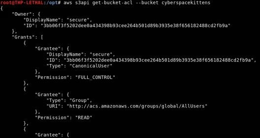

同样，在这两种情况下，读权限都是全局允许的，但是完全控制或任何写入的权限只有名为 “secure” 的帐户才有。如果我们可以进入 bucket，那么我们可以使用`—grant-full-control`来赋予我们自己对 bucket 和对象的完全控制权限。

资源:
- https://labs.detectify.com/2017/07/13/a-deep-dive-into-aws-s3-access-controls-taking-full-control-over-your-assets/

#### 子域名劫持
子域名劫持是一个常见的漏洞，如今我们几乎可以从每一个公司看到这个漏洞。如果一个公司使用用一些第三方 CMS/内容/云提供商，并将它们的子域名指向这些平台，那么就有可能发生子域名劫持漏洞。如果公司忘记配置第三方服务或从该服务器注销，攻击者就可以使用第三方来劫持该主机名。

举个例子，你使用 testlab.s3.amazonaws.com 这个域名注册了一个 S3 Amazon Bucket。然后，你让你公司的子域名 testlab.company.com 指向了 testlab.s3.amazonaws.com。一年后，你不再需要 testlab.s3.amazonaws.com 这个 S3 bucket 并注销了它，但是忘记了 testlab.company.com 的 CNAME 重定向。现在，一些人可以去 AWS 搭建 testlab.s3.amazon.com，并在受害者的域中有一个有效的 S3 bucket。

一个检查子域名漏洞的工具叫做`tko-subs`。我们可以用这个工具来检查是否有任何我们找到的子域名指向了一个 CMS 提供商(Heroku, Github, Shopify, Amazon S3, Amazon CloudFront 等)，这样该子域名可能可以被劫持。

运行 tko-subs:
```shell
cd /opt/tko-subs/
./tkosubs -domains=list.txt -data=providers-data.csv -output=output.csv
```

如果我们找到了一个`悬挂记录`，我们可以使用 tko-subs 来劫持 Github 页面和 Heroku 应用程序。否则，我们将不得不手工操作。
> 译者注: dagling CNAME, 即为 dangling DNS record，简称 Dare, 一般翻译为`悬挂记录`。这类 DNS 记录指向的资源无效，但记录本身尚未从 DNS 清除，攻击者可以借此实现 DNS 劫持。
> 拓展阅读：[Understanding the Security Threats of Dangling DNS Records](https://zhuanlan.zhihu.com/p/30786805)

另外两个可以帮助域名劫持的工具是:
- [HostileSubBruteforcer](https://github.com/nahamsec/HostileSubBruteforcer)
- [autoSubTakeover](https://github.com/JordyZomer/autoSubTakeover)

想了解更多关于AWS漏洞的信息吗?一个很棒的的 CTF AWS 演练 -> http://flaws.cloud/

### 电子邮件
所有的社会工程学攻击的一个重要部分都是查找 email 地址和员工姓名。我们在前几节中使用了 Discover Script 工具，它非常适合用来收集这些数据。我个人通常从 Discover Script 开始，并用其他工具进行深入挖掘。每种工具的功能略有不同，尽可能多地使用自动化流程是有益的。

一旦你得到了一个小的 email 列表，最好去了解他们的 email 格式。是`名.姓氏@cyberspacekitten.com`这样的格式吗？还是`名的第一个字母.姓氏@cyberspacekittens.com`这样的？一旦你弄清楚了他们的格式，我们就可以使用像 LinkedIn 这样的工具来寻找更多的员工，并尝试找到他们的 email 地址。

#### SimplyEmail
我们都知道[鱼叉式网络钓鱼](https://searchsecurity.techtarget.com.cn/whatis/11-25390/)仍然是比较成功的攻击手段之一。如果我们没有找到任何外部漏洞，那么下一步就是攻击用户。要建立一个好的 email 地址列表，我们可以使用像 SimplyEmail 这样的工具。此工具的作用是可以输出公司的 email 地址格式和有效用户列表。

**实验**:<br>
找出 cnn.com 的所有 email 帐户。
- cd /opt/SimplyEmail
- ./SimplyEmail.py -all -v -e cyberspacekittens.com
- firefox cyberspacekittens.com<date_time>/Email_List.html

这可能需要很长时间来运行，因为它检查 Bing、Yahoo、Google、Ask Search、PGP 仓库、文件等等。这也可能让你的网络被搜索引擎们识别成机器人。并且如果你产生了太多的搜索请求，那么可能需要填写验证码。

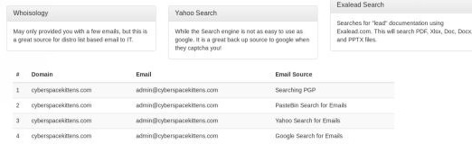

针对你自己的公司进行此操作。你看到任何你可以识别的 email 地址了吗？这可能是可以在一个大规模红队活动中被设为靶子的第一个 email 地址。

#### 过去的违规行为（email 信息泄露）
获取 email 帐户的最佳方法之一是持续监控和捕捉过去的违规行为。我不想直接链接到违规文件，但我给出一些我认为有用的参考:
- 1.4 亿密码泄露（2017年）： https://thehackernews.com/2017/12/data-breach-password-list.html
- Adobe 信息泄露（2013年）： https://nakedsecurity.sophos.com/2013/11/04/anatomy-of-a-password-disaster-adobes-giant-sized-cryptographic-blunder/
- Pastebin Dumps： http://psbdmp.ws/
- Exploit.In Dump
- Pastebin 的 Google Dork: site:pastebin.com intext:cyberspacekittens.com

## 额外的开源资源
我不知道该把这些资源放在哪里，但我想提供一个用于红队活动的额外的优秀资源集合。它可以帮助识别人、位置、域名信息、社交媒体、图像分析等。
- OSINT 链接合集: https://github.com/IVMachiavelli/OSINT_Team_Links
- OSINT 框架: http://osintframework.com/

>译者注: 公开资源情报计划（Open source intelligence），简称`OSINT`，是美国中央情报局（CIA）的一种情报搜集手段，从各种公开的信息资源中寻找和获取有价值的情报。

## 本章总结
在这一章中，我们学习了各种不同的侦察战术和侦察工具。这只是一个开始，因为这些技术许多都是手工的，并且需要大量的时间来执行。这取决于你自己是否能提高自己的功力，自动化使用所有这些工具，并使侦察工作快速和高效。

