# 第6章 短传——物理访问攻击 

> 译者：[@Snowming](https://github.com/Snowming04)


作为安全评估的一部分，CSK 要求你的团队对基础设施进行物理评估。这就需要检查他们的门和安保设施是否合格。在得到了授权的前提下可以进行现场测试，以确定他们警卫的反应和响应时间。

*快速说明：在进行任何物理评估之前，请务必与当地、州和联邦法律核实。例如，在密西西比州、俄亥俄州、内华达州或弗吉尼亚州，仅仅是持有开锁工具就可能是犯法的。我不是律师，所以你最好先咨询一下专业法律人士。此外，确保你获得适当的批准，尽量与该机构的物理安全团队协同工作，并有一个书面的免责核准文件，以防被警察抓到后需要承担额外的法律责任。在实际参与之前，要与该机构的物理安全团队讨论如果保安抓住你，你是否可以逃跑，或是立马停止。以及还要注意，该公司是否安装了无线电监听。最后，确保警卫不会将你的试验行动上报到当地执法部门，毕竟谁都不想去蹲号子。*

现在，是时候侵入 Cyber Space Kittens 的秘密基地了。从他们网站上预留下来的信息看，他们的实际位于 299792458 Light Dr。利用谷歌街景做了一番侦察后，我们注意到他们有一个大门，还有一两个警卫室。在翻越栅栏前，我们需要了解多个可能的进入点和进入区域。通过初步观察，我们还发现了一些摄像头、门、入口点和读卡器系统。


## ID 卡复制器
上一版书里，讲了很多有关 ID 卡复制器的东西，所以在本书中我将把重点放在更新的内容上。在大多数情况下，那些由 HID 公司生产的、不需要任何私有/公开握手认证的感应卡，我们仍然可以很轻易地克隆它们，并暴力破解它们的 ID 号。

上一版书里，我提到了我很喜欢复制 ProxCard Ⅱ 卡，因为它们没有任何保护措施，所以易于克隆。并且 ProxCard Ⅱ 卡一般都可以成批购买，用来暴力破解，简直再方便不过。破解的过程都是基于 Proxmark3 工具完成的。现在，它发布了一个主打便携的新型号，叫 [Proxmark3 RDV2 Kit](http://hackerwarehouse.com/product/proxmark3-rdv2-kit/)。新版的可插电池用，并且体积也小巧很多。

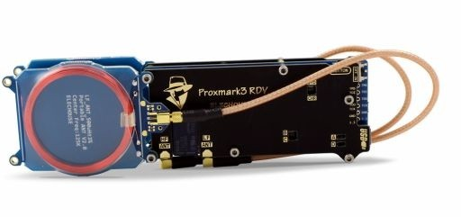

还有一些常见的可供破解的卡：
- HID iClass (13.56 MHz)
- HID ProxCard (125 kHz)
- EM4100x (125 kHz)
- MIFARE Classic (13.56 MHz)

可以参考这篇博客了解更多：[RFID Hacking with The Proxmark 3](https://blog.kchung.co/rfid-hacking-with-the-proxmark-3/)


## 绕过入口点的物理工具
本书不会深入研究物理工具及其操作方法，因为纸上得来终觉浅，若要真正深入了解物理工具及其操作方法，实践是最好的老师。进行物理评估的最佳方法，一直都是实践、建立物理实验环境，搞清楚哪些方法可行，哪些不可行。我来盘点一下过去我们团队用过的一些很酷的工具：

- [Lock Picks](https://www.southord.com/) —— SouthOrd 公司生产的开锁工具一直是我们的首选。质量好，效果好。
- [Gate Bypass Devices](https://www.lockpickshop.com/GATE-BYPASS.html) —— 用来绕过锁着的门的工具。
- [Shove-it Tool](https://www.lockpickshop.com/SJ-50.html) —— 简单的工具，用于门和门闩之间有足够的空间的情况下。类似于贴卡打开感应门，你使用此工具拉开锁里的活塞。
- [Under the Door 2.0](https://shop.riftrecon.com/products/under-the-door-tool) —— 拉开带有手柄的门的工具。我们可以用 Under the Door 工具从门下直接进去，绕着把手，然后往下拉。在过去酒店中经常会安装这种门，但我们肯定也会在业务中遇到这种门。
- Air Canisters —— 这是一个价格便宜又构造简单的工具，可以通过内部的运动传感器打开门锁。看看这段视频，看看 Samy Kamkar 如何绕过此类型的门：
https://www.youtube.com/watch?v=xcA7iXSNmZE

记住，使用这些工具和物理评估的目的是跟踪并监控公司物理安全的问题，并得到反馈。因此，我们不仅要确保充分记录了系统中的缺陷，还要考察事件的响应时间和处理措施是否是可以接受的。

### LAN Turtle
[LAN Turtle](https://shop.hak5.org/products/lan-turtle) 是我最喜欢的工具之一，由 Hak5 公司生产。前书中我们研究了如何把树莓派和 ODROID 作为攻击武器：给这些设备安装 Kali Linux 系统，让它们通过 SSH 或者 VPN 连接到我们的攻击者机器中，这是做物理渗透测试的一个好方法。

多年来，这些工具一直在不断进步。现在，LAN Turtle 小巧到可以藏在任何设备的后面，依赖 USB 供电，让用户难以轻易觉察。LAN Turtle 的 USB 网卡可代理以太网的所有流量。

LAN Turtle 还有一个无线蜂窝版（支持SIM卡），暂且不提。

设置 LAN Turtle：
LAN Turtle 的目的是取代 dropbox（一款可以同步本地文件的网络存储在线网盘应用）。尽管它带有许多其他功能和应用程序工具，如自动连接 SSH、DNS 欺骗、meterpreter、ptunnel、script2email、urlsnarf、responder 等等，但红队使用的主要功能是“使用 LAN Turtle 获得进入网络的权限”。

过去，甚至在前几版书中，我们使用 SSH 反向代理 shell。这样通常管用，但对于更深入的扫描/复杂的攻击，我们需要完全访问网络。为此，我们必须配置反向的 VPN 连接。那么，怎样进行反向 VPN 连接？

是这样的，因为 LAN Turtle 会被插入入侵目标组织内网中的某个台式机的后面，所以我们不能直接连接到它。因此，我们将让 LAN Turtle 首先通过端口 443 外连到 VPN，然后作为服务器返回到我们的 OpenVPN 。从我们用来做攻击的 Kali 机器中，我们也必须登录进 VPN 服务器。一旦 LAN Turtle 和我们的攻击者机器都通过VPN 连接到我们的服务器中，我们就可以把流量从 LAN Turtle 转发到攻击机器来进行扫描或漏洞利用。

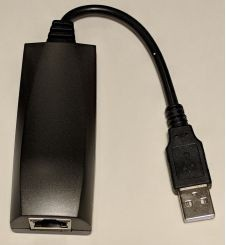

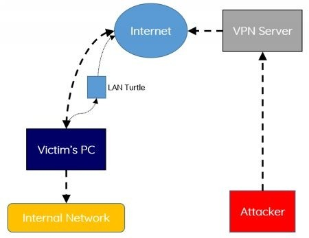

虽然 OpenVPN 反向代理通道不是什么新技术，但 Hak5 的团队在整合教程方面做得非常好。我不得不修改了以下一些命令，如果你想了解更多，请观看他们的 YouTube 视频：https://www.youtube.com/watch?v=b7qr0laM8kA 。

具体的使用步骤主要是以下三步：
1. 在 Internet 上配置一个 OpenVPN 访问服务器（OpenVPN AS）；
2. 其次，配置 LAN Turtle ;
3. 最后，配置攻击者机器 。

设置运行 OpenVPN 服务的 VPS ：
* 我们要确保我们的 VPN 服务器对外提供服务。我们通常喜欢在 VPS 服务器提供商上托管我们的 VPN 服务器，因为它们非常容易和快速设置。提前警告一声，请向你的 VPS 提供商咨询，确保他们允许你搞事。
* 常见的 VPS 提供商有 Linode 和 Amazon Lightsail 。因为他们的 VPS 速度快、价格便宜且易于设置。AWS Lightsail VPS 就不错，选择它的另一个原因是：有许多攻击者都会采用 AWS 做攻击，躲在这些如洪水般的流量背后，受害者将更难以察觉是谁攻击他们的。
* 去 Lightsail.aws.amazon.com 创建一个新的 VPS
* 创建后，转到“管理”->“联网”
    添加两个安全组设置 TCP 端口（443和943）
* 创建 VPS 服务器后，登录：
    * 确保 chmod 600 你的 SSH 密钥并登录到你的服务器
    * ssh -i LightsailDefaultPrivateKey-us-west-2.pem ubuntu@[IP]
* 通过 SSH 进入服务器之后
    * 切换到 root 用户:
    ```shell
    sudo su -
    ```
    * 更新服务器：
    ```shell
    apt-get update && apt-get upgrade
    ```
    * 安装 OpenVPN AS。请点击[此处](https://openvpn.net/index.php/access-server/download-openvpn-as-sw/113.html?osfamily=Ubuntu)查找最新版本
    * 复制链接并下载到 VPS 。示例：
    ```shell
    wget http://swupdate.openvpn.org/as/openvpn-as-2.1.12-ubuntu16.amd_64.deb
    ```
    * 安装 OpenVPN AS：
    ```shell
    dpkg -i openvpn-as-2.1.12-Ubuntu16.amd_64.deb 
    ```
    * 删除当前配置文件并配置 OpenVPN ：
        * /usr/local/openvpn_as/bin/ovpn-init 
        * 安装过程中：
            * 确保为所有接口设置管理员界面
            * 将“通过内部数据库使用本地身份验证”设置为“是”
    * 更新 OpenVPN  密码：
        * passwd openvpn
    * 将943端口的 IPTables 设置为仅允许来自你的网络的连接

设置 OpenVPN 服务器：
* 转到 https://[vps服务器的IP地址]:943/admin/
* 使用用户名 “openvpn” 和你刚刚设置的密码登录
* 如果使用的是 AWS Lightsail：
    * 转到服务器网络设置，确保：主机名或IP地址是正确的公网 IP 地址，而不是私有 IP 地址
    * 保存并更新
* 验证身份验证是否设置为本地：
    * Authentication -> General -> Local -> Save Settings -> Update Server
* 创建两个启用了“允许自动登录”的用户（我创建的是 `lanturtle` 和 `redteam`）：
    * User Management -> User Permissions
    * 对于每个用户：
        * 设置允许自动登录
        * 确保为这两个用户都分别设置密码
    * 对于 lanturtle 帐户，为了允许通过 VPN 连接，我们需要启用一些权限：
        * 确保在用户权限选项下启用/配置：
            * 所有服务端私有子网
            * 所有其他的 VPN 客户端
            
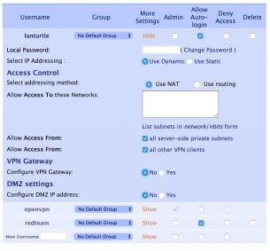

下载 OpenVPN 配置文件：
* 连接下载配置文件：
    * https://[你的VPS]:943/?src=connect 
    * 对于每个用户（ redteam 和 lanturtle ）
        * 登录并下载个人资料（自动登录配置文件）
        * 分别保存为 turtle.ovpn 和 redteam.ovpn

设置 LAN Turtle 和初始配置：

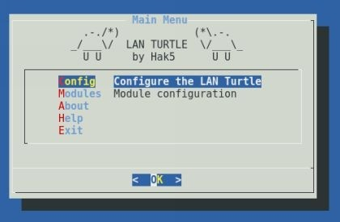

* 插入 USB 并且自动连入网络
* nmap 扫描本地 22 端口
    * nmap x.x.x.x/24 -p22 -T5 --open
* 通过 SSH 连接 root 用户（root@[ip]），密码为 sh3llz
* 更新你的 LAN TURTLE
* 更改 MAC 地址很重要。LAN Turtle 使用类似制造商的 MAC 地址，所以你要做些修改来确保你看起来像个随机的设备：
    * 更改你的 MAC 地址
* 安装 OpenVPN :
    * 选择 Modules -> Select -> Configure -> Directory ，然后点击确定
    * 安装 OpenVPN
* 设置你的 OpenVPN 配置文件：
    * 返回 Modules-> OpenVPN -> configure->粘贴所有来自 turtle.opvn 的内容并保存
* 我们还希望确保 LAN Turtle OpenVPN 服务器在服务器启动时自动开启运行：
    * 选择 Modules-> OpenVPN ->Enable
* 最后，我们需要修改 LAN Turtle 上的防火墙规则：
    * 退出 Turtle 菜单并编辑防火墙规则(使用 nano 文本编辑器编辑 /etc/config/firewall 文件)
        * nano /etc/config/firewall
    * 接着，在文件中修改 vpn 这一部分的设置
        * 确保“option forward”设置为“ACCEPT”
        * 添加以下配置转发规则：
* 配置转发
    * option src    wan
    * option dest   lan
* 配置转发
    * option src    vpn
    * option dest   wan
* 配置转发
    * option src    wan
    * option dest   vpn
* 重新回到 Turtle 菜单 -> Modules -> openvpn -> start
* 上面的操作应该会启动我们的 Turtle 上的 OpenVPN 客户端。为了确保设置生效，回到我们的 OpenVPN AS 服务器并检查连接。

我们现在已经配置了 LAN Turtle，这样每当它连接到一个网络时，它就会回连到我们的 VPN 服务器。并且我们可以通过 SSH 连进 LAN Turtle 了。让我们通过一个例子来感受一下这个过程：

从 Kali 攻击主机访问 VPN 服务器：
* openvpn -config ./redteam.ovpn
* 获取对方所在网络的IP地址，以便从我们的 redteam vpn 传输所有流量。
    * SSH 进入 LAN Turtle
    * 退出 Turtle 菜单，获取受害者网络内部接口（ifconfig）的 IP 地址。根据 IP 和 BCAST（广播地址）计算出 IP 范围。在我们的示例中，Turtle 所在的网络是 10.100.100.0/24

* 最后，开启流量转发：
    * 返回 OpenVPN AS并编辑 `lanturtle` 这个用户
    * 用户权限（User Permissions）页面->搜索用户名 lanturtle->显示
    * 将 VPN 网关编辑为“是”并添加内部范围（例如 10.100.100.0/24）
    * 保存并更新
* 通过 LAN Turtle 上的 SSH 连接，使用 `reboot` 命令重启

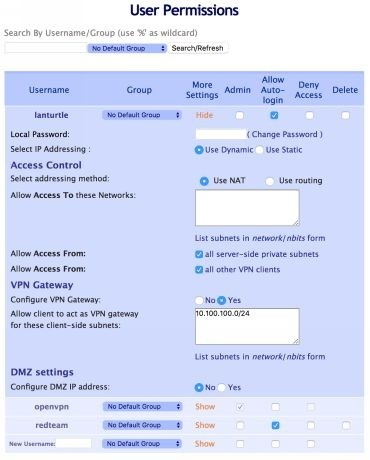

现在，我们可以让攻击机透过在 LAN Turtle 上架设的 VPN 通道，将我们的所有流量传输到受害者公司内网。在下图中，我们登录进入 VPN 服务器，扫描 LAN Turtle 的范围为 10.100.100.0/24 的内部网络。我们可以看到，我们已经成功地配置了从 VPN 网关通过 LAN Turtle 到公司网络的路由传输。现在，在 Kali 攻击机上面，可以运行完整的漏洞扫描、网络抓取、Masscans 扫描甚至更多其他操作。

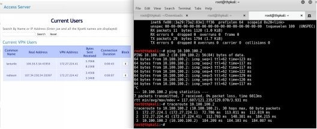

好的！现在你有了一个快速插入的设备，它让你与受害者网络保持全局连接。为了做的更好，还可以完善一下：
* 设置一个每天重启设备的定时任务。VPN 隧道连接可能会断开，但每当 LAN Turtle 重新启动时，VPN 连接会重新启动。
* 某些公司封锁了某些可通往外网的端口。在本例中，我们使用了443端口，在许多环境中，这个端口可以和外网通信。对于使用 Web 代理的某些公司网络，可能会阻止通过 443 端口直接连接外网。可能需要配置 LAN Turtle ，以在启动连接时，自动尝试多个不同的端口或协议（TCP/UDP）。
* 如果要安装两个或更多设备，请确保这些设备的 VPN 服务器和 MAC 地址是不一样的。曾有几个真实的案例，我们的设备几乎在每次入侵时都被发现了，然而这完全是偶然事。原因是 IT 基础设施正在被移动或者更换了计算机。

## Packet Squirrel
Packet Squirrel 使用 Micro-USB 接口充电，但是并非是通过 USB 接口那一端插入有线 USB 网卡，Packet Squirrel 两端都接网线，这是另一种捕获流量或创建 VPN 连接的方式。

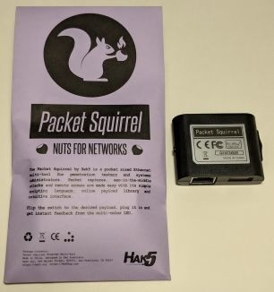

配置 Packet Squirrel 的方法和 LAN Turtle 差不多；
* 编辑 /root/payloads/switch3/payload.sh
    * FOR_CLIENTS=1
* 编辑 /etc/config/firewall
    * 对防火墙进行当时你为 LAN Turtle 所做的完全相同的更改
* 将 LANTurtle.ovpn 文件上传到 /root/payloads/switch3/config.ovpn

现在你有了另一个和 LAN Turtle 有类似功能的设备，一旦连接到网络，就会有一个反向的 VPN 连接，从你这儿连接回对方公司。

对了，你还可以对 Packet Squirrel 进行自己的升级和优化，如果你把它琢磨透了的话，就可以用 SWORD（software optimization for the retrieval of data， 数据检索软件优化）轻松地将 Packet Squirrel 转换为基于 OpenWRT 的渗透测试工具箱（ https://medium.com/@tomac/a-15-openwrt-based-diy-pen-test-dropbox-26a98a5fa5e5 ）。

参考资源：
* https://www.hak5.org/episodes/hak5-1921-access-internal-networks-with-reverse-vpn-connections
* http://www.ubuntuboss.com/how-to-install-openvpn-access-server-on-ubuntu-15-10/
* https://trick77.com/how-to-set-up-transparent-vpn-internet-gateway-tunnel-openvpn/
* https://www.hak5.org/gear/packet-squirrel/docs

## Bash Bunny

前书中我们讨论了 [Rubber Ducky](https://hakshop.com/collections/usb-rubber-ducky) 以及它是如何模拟 HID 设备（如键盘）来存储命令。对红队成员而言，Rubber Ducky 仍然是个不错的工具，因为它可以加速 PowerShell 命令的传递，用于社会工程学攻击，并且可以在没有键盘但有 USB 插槽的柜台系统（如 ATM 机、自动售货机等）上做出入侵操作。

Bash Bunny 是 Rubber Ducky 的升级版本。它不仅可以执行 HID 攻击（HID 是 Human Interface Device的缩写，意思是人机接口设备），还有许多其他操作。Bash Bunny 有两个独立的设置选项来分别保存对 BunnyTap 和 QuickCreds 这两种攻击的设置（以及一个额外的管理设置）。这些 payload 可以执行攻击来窃取凭证、进行网络钓鱼、执行 Ducky  攻击、运行 PowerShell 命令、执行扫描和侦察、执行 Metasploit autopwn 等。

> 译者注 ：HID Attack 是最近几年流行的一类攻击方式。HID 是 Human Interface Device的缩写，意思是人机接口设备。它是对鼠标、键盘、游戏手柄这一类可以操控电脑设备的统称。<br>由于电脑对这类设备缺少严格的检测措施，只是简单的识别设备类型，就允许设备对电脑进行各项操作。所以，通过修改篡改设备反馈信息，就可以很轻松的让电脑将其他设备误认为 HID 设备，从而获取控制权限。尤其是 USB 和蓝牙这类即插即用接口出现，导致 HID Attack 成为重要方式。例如，Bad USB 就是 USB 类攻击的典型代表。<br>参考资料：[WHID Injector：将 HID 攻击带入新境界](http://www.mottoin.com/geek/111834.html)

前书，我们谈到了使用 [KonBoot](https://www.piotrbania.com/all/kon-boot/) 来绕过你没有密码的机器。KonBoot 在未加密的机器上工作时，可以从 U 盘启动并覆写本地管理员的密码。尽管这个操作需要完整地重启客户机，但一旦重启完成，你就可以不用借助任何凭证的访问被攻击的机器。我们团队一直使用 KonBoot 并且取得了很好的效果。所以如果你还没尝试过 KonBoot 的话，不妨一试。

但是，仍然有两个理由使你不想选择 KonBoot：
1. 此攻击在加密的计算机上不起作用；
2. 你可能不想重启受害者的计算机。<br>
那么如何从被锁定的系统中获取信息，以访问网络上的其他内容或者取得哈希、身份凭据？这就是 Bash Bunny 初显身手的地方。

我们将使用 Bash Bunny 运行两种不同攻击的 payload。在我们可以进入该目标组织的机房的前提下，这两种攻击都允许我们从一个被锁定（或未锁定）的系统中获取信息。下面演示如何使用 BunnyTap 和 QuickCreds 。

### 闯入 Cyber Space Kittens
几个小时后你终于进到 Cyber Space Kittens 部门内。没被人察觉，所以你有几小时的时间来进行入侵行动。你入侵第一台机器，装上 KonBoot 并重启机器，但你注意到这些机器的系统是加密的。然后你转到下一台处于屏幕锁定保护状态的计算机。你两次插入 Bash Bunny，运行 BunnyTap 和 QuickCreds 。几分钟后，通过运行 Responder，QuickCreds 收集到了Net-NTLMv2 哈希值。将它放进 Hashcat 运行，片刻钟就破解了用户密码！在我们无法获取或破解哈希的机器上，BunnyTap 会运行 PosionTap，它可以对常见的站点捕获 cookie，这可以用于对内部应用程序进行配置。我们把这些窃取到的 cookie 保存到我们的攻击者笔记本电脑，将我们的攻击者笔记本电脑连接到他们的网络，用本地保存的窃取到的 cookie 来替换敏感 Web 应用程序中现在的cookie，这样我们就在不知道密码的情况下获取了这些 Web 应用程序的访问权限。

 在 Kali 环境下设置 Bash Bunny
 * 下载最新固件：https://bashbunny.com/downloads
 * 将 Bash Bunny 的开关3（最靠近 USB 端口那个）设置为启用模式。
 * 将下载的固件放在 USB 挂载的根目录， 拔出 Bash Bunny，再重新插入，然后等待大约 10 分钟，直到它呈蓝色闪烁。
 * 完成后，重新进入 Bash Bunny 并编辑 payloads>switch1>payload.txt 这个文件。
 ```
 # System default payload
 LED B SLOW
 ATTACKMODE ECM_ETHERNET STORAGE
 ```      
* 拔出你的设备
* 在你的 Kali 系统中，设置 Internet 共享：
```
wget bashbunny.com/bb.sh
chmod +x bb.sh
./bb.sh
Guided Mode（所以选项都保留默认值）
```
* 在 Bash Bunny 上，打开开关1（离 USB 插孔最远的那个开关）上，然后插入。完成后，请确保连接到 Bash Bunny，在那里你可以看到 Cloud <-> Laptop <-> Bunny image
* 在你的 Kali 机器上，用密码 hak5bunny 通过 SSH 进入 Bash Bunny

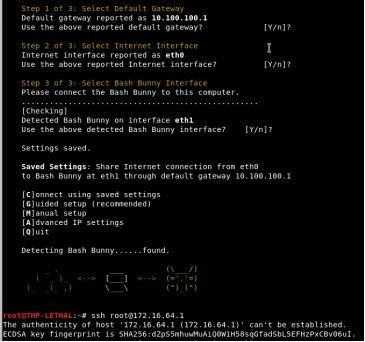

登陆进入你的 Bash Bunny
* 在你的 Kali 机器上，用密码 hak5bunny 通过 SSH 进入 Bash Bunny
* ssh root@172.16.64.1
* 让我们更新 Bash Bunny 并安装一些工具
```shell
apt-get update
apt-get upgrade
export GIT_SSL_NO_VERIFY=1
git clone https://github.com/lgandx/Responder.git/tools/responder
git clone https://github.com/CoreSecurity/impacket.git/tools/impacket
cd /tools/impacket && python ./setup.py install
apt-get -y install dsniff
```
* 在 Kali 机器的另一个终端上，安装你想要的所有模块。
```
git clone https://github.com/hak5/bashbunny-payloads.git /opt/bashbunny-payloads 
```   
* 你可以选择任何类型的 payload ，但是在我们的例子中，我们将使用 BunnyTap 和 QuickCreds 这两个 payload 来设置 Bash Bunny
```
cp -R /opt/bashbunnypayloads/payloads/library/credentials/BunnyTap/* /media/root/BashBunny/payloads/switch1/
cp -R /opt/bashbunnypayloads/payloads/library/credentials/QuickCreds/* /media/root/BashBunny/payloads/switch2/
```
> 注意，在 switch1 和 switch2 文件夹中都有一个名为 payload.txt 的文件。而对于每一个这个文件，你需要将其配置为攻击 Windows 或 Mac 计算机。对于 Windows 机器，确保 AttackMode 设置为 RNDIS_ETHERNET，对于 Mac，将 AttackMode 配置为 ECM_ETHERNET。

### QuickCreds
QuickCreds 是一个很棒的工具，它使用 Responder 攻击从锁定和未锁定的机器上捕获 NTLMv2 Challenge 哈希。假设你在做一次物理评估，为此你闯进一栋大楼，碰到了一堆锁着的机器。你使用 QuickCreds 的开关插入 Bash Bunny ，每台机器等待大约 2 分钟。Bash Bunny 将接管网络适配器，使用 Response 重新传输任何共享和身份验证请求，然后记录这些数据。它将所有凭证保存到 USB 磁盘上的 loot 文件夹中。
> 译者注: 如若不懂“NTLMv2 Challenge 哈希”，可以参考此篇：[Windows 下的密码 hash——NTLM hash 和 Net-NTLM hash 介绍](https://3gstudent.github.io/Windows%E4%B8%8B%E7%9A%84%E5%AF%86%E7%A0%81hash-NTLM-hash%E5%92%8CNet-NTLM-hash%E4%BB%8B%E7%BB%8D/)

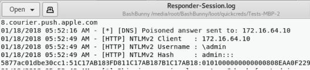

参考资料：
* https://github.com/hak5/bashbunny-payloads/tree/master/payloads/library/credentials/QuickCreds 
* https://room362.com/post/2016/snagging-creds-from-locked-machines/

### BunnyTap
BunnyTap 基于由 Samy Kamkar 开发的知名工具 PoisonTap ( https://www.youtube.com/watch?v=Aatp5gCskvk )。PoisonTap 是一个非常优秀的工具，即使是在锁定的机器上，也可以执行以下操作：
* 通过 USB（或 Thunderbolt ）模拟以太网设备。
* 劫持所有来自机器的网络流量（尽管是通过低优先级或未知的网络接口）。
* 从 Web 浏览器中提取和存储位居 Alexa 排行榜最受欢迎的前100,0000 站的 HTTP cookie 和会话。
* 将内部路由器暴露给攻击者，这样攻击者就可以通过连接外网的 WebSocket 和 DNS 重新绑定攻击来远程访问内部路由器。（感谢 Matt Austin 提供的关于“DNS 重新绑定攻击”的思路！）
* 在 HTTP 缓存中，为数十万个域名和常见的 JavaScript CDN URL 安装一个基于 Web 的持久后门。通过缓存投毒的方式，我们可以获取用户对于这些资源的 cookie 。
* 允许攻击者通过在任何有后门的域中获取的用户 cookie，来远程强制用户来发起 HTTP 请求（包括 GET 和 POST）和通过代理传回响应。
* 不需要将机器解锁。
* 后门和远程访问权限即使在设备被移除且攻击者离开后仍然存在（ https://samy.pl/poisontap/ ）。

从一次物理评估的角度来看，你进入他们的办公室，在每台机器上插上 Bash Bunny，然后等待大约2分钟。Bash Bunny 会让电脑中的所有流量都走 Bash Bunny 转发。如果他们有一个打开并且活动的浏览器（如广告或任何定期更新的页面），BunnyTap 将启动并向所有 Alexa Top 100,0000 网站发出请求。此时，受害者用户若登录到这些站点中的任何一个，BunnyTap 将捕获受害者的所有 cookie。现在，我们可以将这些 cookie 发回到自己的计算机上，把我们的 cookie 替换成他们的，这样即可在不知道他们密码的情况下，冒充他们的身份进入网站。

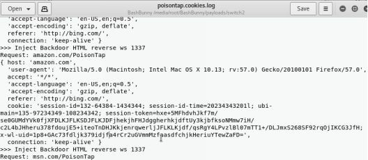

请务必查看所有 Bash Bunny 的 payload：
* https://github.com/hak5/bashbunny-payloads/tree/master/payloads/library 

## WiFi
 WiFi 攻击方面，我们攻击受害者的方式没有什么大变化。虽然 WEP 加密网络的使用显著减少，但攻击方式仍包括反认证、aireplay-ng 和捕获 IV 数据包。对于 WPA 无线网络，最好的攻击手段，依旧是对客户端进行反认证 、捕获握手包、将其传递给 hashcat 对密码进行破解。以上这几种方法屡试不爽。工具方面，我最爱的工具是 [Wifite2 的完全重写的版本](https://github.com/derv82/wifite2)，这个新版本带有一个 Alfa AWUS036NHA 无线网卡。这是一个非常易于使用的接口，可以支持多种攻击，基于 aircrack 工具套装，令它可以很容易地破解捕获的哈希值。

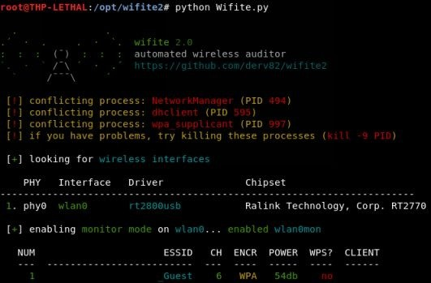

关于发动 WiFi 攻击的装备，除了使用一对 Alfa 无线网卡，执行更加隐蔽的 WiFi 攻击的简单方法是使用 [WiFi Pineapple Nano](https://www.wifipineapple.com/pages/nano)。如果你想建立一个假的主无线接入点，通过天线改变他们流量的通信路径，用伪造页面捕获身份验证，执行所有的中间人攻击，运行 Responder 和其他攻击的话，WiFi Pineapple Nano 是一个能执行此操作的轻量级硬件工具。

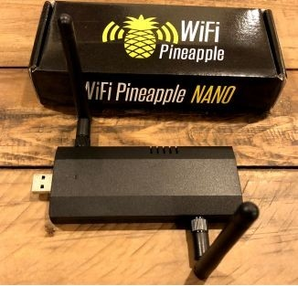

除了 Pineapple，还有其他一些工具可以用来攻击公司网络。其中一个就是 [eaphammer](https://github.com/s0lst1c3/eaphammer)。

eaphammer 的功能：
* 从 WPA-EAP 和 WPA2-EAP 网络窃取 RADIUS 凭据。
* 执行恶意门户攻击，以窃取 AD 凭证，并执行间接无线枢轴。
* 执行 captive portal 攻击。
* 内置响应器集成。
* 支持开放网络和 WPA-EAP/WPA2-EAP。
* 大多数攻击无需手动配置。
* 安装和设置过程无需手动配置。
* 使用最新版本的 hostapd（2.6）。
* 支持恶意的 twin 攻击和 karma 攻击。
* 为间接无线枢轴生成定时 PowerShell payload。
* 针对恶意门户攻击的集成 HTTP 服务器。
* 支持 SSID 隐藏。

eaphammer 最好的地方是使用自定义攻击功能来执行 responder 攻击或捕获 NTLM challange 身份验证哈希以进行破解( https://github.com/s0lst1c3/eaphammer#iii---stealing-ad-credentials-using-hostile-portal-attacks ) 以及间接的无线枢轴( https://github.com/s0lst1c3/eaphammer#iv---indirect-wireless-pivots )。
> 为避免读者没看到上面的注释，所以译者再次注: 如若不懂“NTLMv2 Challenge 哈希”，可以参考此篇：[Windows 下的密码 hash——NTLM hash 和 Net-NTLM hash 介绍](https://3gstudent.github.io/Windows%E4%B8%8B%E7%9A%84%E5%AF%86%E7%A0%81hash-NTLM-hash%E5%92%8CNet-NTLM-hash%E4%BB%8B%E7%BB%8D/)

## 本章总结
物理攻击是最有趣的事情之一。这会加速你的肾上腺素分泌，让自己觉得像个罪犯，迫切地想行恶。在我们的许多红队行动中，我们可能会花上几天的时间来为一家公司进行踩点，观察警卫的轮换，并弄清楚他们都有什么类型的门。我们可能会尝试拍摄他们的工卡的照片，记录人们离开大楼的时间，并找出能让我们进入大楼的薄弱环节。

从红队的角度来看，我们不仅要观察他们物理设施方面的安全薄弱点，也要注意他们内部的人。
* 如果触发了警报，相关员工要过久才能觉察并应对？
* 摄像头是否开启全天候监控？是这样的话，如果发现什么可疑，到相关人员来排查，能有多长空余时间？
* 有人看守后门等其他的不常用出口吗？
* 如果行踪败露，你有办法脱身吗？
* 如果乔装打扮成该公司(或任何为该公司提供第三方服务）的员工，对方公司会对你的入侵行为做什么反应？

最后要注意的是，在开始入侵行动之前，确保要有一个明确的攻击范围、一封入侵目标公司给你做的书面授权证明、首席安全官或物理设施安全负责人的电话号码，并确保与对方达成共识、进行合作。准备措施做得越好，就能更好的避免不必要的误会和麻烦。但是因为这终究是一种危险的委托，所以我也无法保证精心准备就一定能万无一失。
