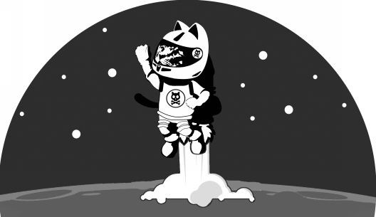
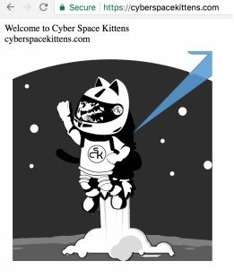
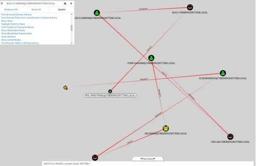

# 第9章 两分钟的训练——从零到英雄

> 译者：[@Snowming](https://github.com/Snowming04)
> 
> 校对者：@匿名jack

随着时间的推移，直到测试的最后一天你都还没有从目标外部网络取得比较好的突破。因为你需要进入目标内网，了解他们公司的网络布局，获得一些敏感文件或者代码，然后找到更多的网段和高权限用户，最终需要拿到 Cyber Space Kittens 公司太空计划的相关资料，此时你感觉压力很大。你的任务是窃取最新的太空计划相关的绝密信息并且不能失败...现在是两分钟操练的时候了。只剩一点点时间了，你需要从10码线开始运球，突破所有的防守保护，扫清路上的障碍，最终把球带到90码线安全着陆。

## 10码线
你重新翻阅自己之前做的笔记，找出自己可能遗漏的一些信息。你的眼睛聚焦在一个网页屏幕截图...这是一个 CSK（Cyber Space Kittens）的论坛网站。你暂时没法找到这个网站程序的漏洞，但是你注意到这个 CSK 论坛网站是给 CSK 内部员工和普通用户共同使用的，用于发布他们太空项目相关的问题、评论和其他事情。

你在网站上收集那些看上去是属于公司员工的账户。然后你根据账户名提炼信息制作比较靠谱的密码表（可能使用的密码）。你使用常用密码及其变体对所有这些账户进行密码爆破尝试。你看到你的 python 脚本正在缓慢的输出… 失败 … 失败 … 失败 … 密码已找到 ！ 当你看到一个名为 Chris Catfield 的用户使用了 `Summer2018!` 这个密码时会心一笑。这个比你预想的要简单的多。接下来，你使用 Chris 的凭证登录论坛，查阅他的私信和帖子，找出那些能帮助更好的开展下一步行动的信息。你发现 Chris 经常与论坛上的另一位内部员工 Neil Pawstrong 谈论太空项目。看起来他们不是现实中的朋友，但他们有很融洽的协同工作关系。这对你开展受信任的钓鱼攻击非常有利。这两个用户之间已经建立了融洽的关系，所以如果你使用 Chris 的帐号发钓鱼邮件给 Neil，成功的可能性将会很大。

## 20码线
你在纠结要不要直接向 Neil 发送恶意的 payload，但是那样太明显了。于是你向他发送了一个你刚搭建好的一个带有猫猫照片的网站的链接，“嘿，Neil，我知道你喜欢猫！看看我做的这个页面吧！”

几分钟之后，你在论坛网站上收到的 Neil 的回复：“哈哈，我喜欢这个太空猫啦！”Neil 没有意识到他访问的网页有一个定制的 JavaScript 的 payload，这段 JS 代码在他的机器后台运行，扫描机器所在的 CSK 内部网络，并且危及未经身份验证的 Jenkins 和 Tomcat Web 服务器。几秒钟之后，你得到了一个弹回来的 Empire 的 shell，你终于松了一口气。

## 30码线
当你顺利撕开目标的一道口子，你意识到 CSK 的网络防御部门重新设置防火墙配置、DNS 配置和进行主机屏蔽只是时间问题，所以你需要快速移动。幸运的是，你已经配置了一些自动化的程序和脚本来处理那些繁琐的工作。受感染的主机已经激活 beacon 并且开始运行 Bloodhound 等工具，查找本地存储的密码相关文件，设置注册表的值来使 Mimikatz 工具能够捕获 LSASS 进程存储的密码，运行 SPN（Kerberos 服务主体名称）并转储所有 Kerberos 票证，当然还可以在计划任务中做一些持久化渗透的设置。

## 40码线
你清楚自己需要快速离开这个第一台主机。于是你将所有拿回的 Kerberos ticket（票据）导入到 Hashcat 程序中，然后开始破解。你发现用那些额外的 BUG 赏金购买了几块1080Ti显卡是个非常正确的决定。当 hash 开始破解的时候，你注意到有一些服务账户的密码已经破解完毕，但是你现在还没时间去处理这些。你仔细阅读 Bloodhound 的输出结果，发现这台受害的机器是属于 Neil Pawstrong 的，并且 Neil 的 AD 账户（域账户）可以访问另一个属于 Buzz Clawdrin 的机器。通过使用 WMI 进行连接，你远程生成一个新的 payload 到 Buzz 的机器中，然后注入到属于 Buzz 账户进程中。

## 50码线
幸运的是，你的账户（Neil 的域账户）在 Buzz 主机的本地管理员成员组中，这意味着你能在这个主机上做更多的协同工作。 使用 Bloodhound 进行信息收集，你能够遍历整个 CSK-LAB 域的网络，但你意识到你在这个主机中并没有 `system` 权限。不用担心，你可以加载 `powerup` 这个 powershell 脚本文件来查找这个主机的错误配置，进而让你权限提升到 `system` 权限。如你所料，服务二进制文件有大量没加引号的路径，你可以在那写入你自己的 payload。你可以快速做一个新的恶意的二进制文件来获得 `system` 权限。

## 60码线
你在第二台主机上运行一个新的 Cobalt Strike 的 payload 获得了一个新的 beacon，这让你即使被他们发现了一些痕迹，也能保持访问权限。这是一个 system 权限的 beacon 连接，你可以通过该主机查找机器中存储在浏览器、WinSCP 配置文件等文本文件中的大量凭据。这台主机是个金矿，它可以连接到多个服务器和数据库。你注意到此主机位于不同的 VLAN 上。看起来这个主机可以访问那些从 Neil 的主机无法看到的这个内网中的更多的网段和主机。你再次运行命令进行内网信息收集，通过 Bloodhound 来了解你当前能访问的网段和主机。你注意到这些网络中的很多主机无法连接到外网，因此你无法获得 HTTP 的 `beacon`。但是因为你使用的是 Cobalt Strike（https://www.cobaltstrike.com/help-smb-beacon ），因此你知道它有一个强大的功能，可将内网断网主机和你当前已控的 `beacon` 进行 SMB 管道连接上线。这就意味着整个实验室的 VLAN 网络中其他受到攻击的机器都可以利用当前这个 CSK-LAB 主机访问到外网。另外，你发现这些在半隔离网络中的主机并没有获取系统更新。看上去，这些运行着 Windows 7系统的客户端主机中并没有为 EternalBlue（永恒之蓝漏洞）打补丁。

## 70码线
通过这台 CSK-LAB 主机，你可以使用经过修改的 EternalBlue 漏洞、利用 payload 在这个 lab 域中的大多数 windows 7机器中中获得 SMB 的 `beacon`。你开始使用这些新的 shell 来获得更多的信息。你发现其中一个主机和一个名为 Restricted 的远程 Microsoft SQL 服务器保持着活跃的连接。你尝试了在这个 lab 域中收集的所有账户，但这些凭证都不适用于这个数据库服务器。你感到难过，你回头看看自己所有的笔记，然后意识到你忘了那些正在破解的 Kerberos 票据！你通过 SSH 连接到负责破解 hash 的机器，查看那些破解结果，在结果中找出那些链接 Restricted 数据库的凭证。当你找到这个服务帐号的密码时，你浑身得到了巨大的解脱感。

## 80码线
你登录到名为 Restricted 的数据库服务器并对整个数据库进行了脱库。 你很想直接在数据库服务器中直接查看，但你知道时间有限。 你使用一些 PowerShell 脚本对数据进行加密压缩，然后在不同的内网已控主机之间慢慢传递，最后将压缩数据利用网络转移到自己的 C2 服务器上。

你告诉你自己，你做到了！但是当你逐渐从飘了的感觉中冷静下来，你发现自己仍然有工作要做。你回过头来翻阅那些之前导出的 Bloodhound 收集的信息，发现一台名为 Purri Gagarin 的主机，它属于 IT 技术支持部门的工作组 。很好，我们可以使用它来远程桌面连接或者使用 Windows ACE 连接到域管理员的机器，然后我们可以将域管理员的密码重置为我们自定义的密码。我们接着操作，重置域管理员 Elon Muskkat 的密码，然后做一些 AD 持久化的设置来维持持久的域管权限。

## 90码线
我们需要做的最后一件事情是从域控制器中导出所有的哈希，并且设置其他的后门，最后擦除我们的痕迹。你可以使用 Mimikatz 应用的的 DCsync 功能来获取所有用户的哈希，包括 krbtgt 票据。而不是使用动静很大的方法（卷影复制服务）来获取域里所有用户的哈希。我们现在拥有了黄金票据！这意味着我们如果重新回到内网中，我们可以创建自己的 Kerberos 票据并且让它成为域管理员。
> 译者注: 卷影复制服务（Volume Shadow Copy Service,简称 VSS）是微软 Windows 的一项组件服务。卷影复制服务是一项定时为分卷作复制的服务。服务会在分卷新增一个名为“阴影复制”（Shadow Copy）的选项。此服务可为离线用户提供离线文件服务。

为了留下更多的后门，我们在不同主机中使用了不同的技术。我们在一个主机中设置了 shift 后门；使用 backdoorfactory 技术将我们的恶意软件隐藏在另一个主机中的常用二进制可执行文件中；将系统的计划任务设置为每周运行一次回连我们的 C2 服务器；使用一个和 lab 域分离的主机，使用 dnscat 的可执行二进制文件代替系统中一个没啥用的运行服务；还删除了几个主机的启动文件夹中的 payload。

我们是幸运的（当然与之对应我们的幸运建立在他们的不幸之上），我们到目前为止都没有被发现。但你要记住，红队渗透评估的目的是为了了解公司或组织发现恶意攻击活动的速度有多快（CSK 公司并没有发现），以及他们执行应急响应、取证和缓解攻击带来的负面影响的速度有多快。所以在最后你尝试触发 CSK 的蓝队采取行动，运行了一个 powershell 脚本（ https://github.com/EmpireProject/Empire/blob/master/data/module_source/trollsploit/Get-RickAstley.ps1 ）。你满意的笑了，然后关闭笔记本电脑。

任务完成 :)

