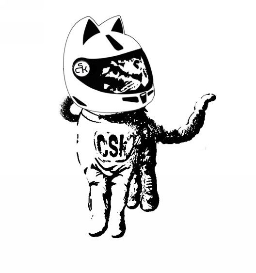
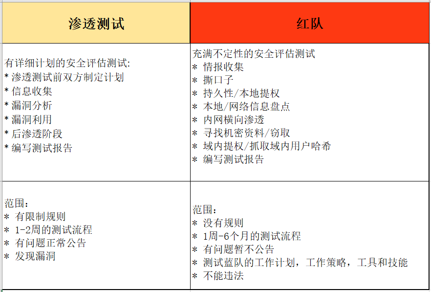

# 介绍

> 译者：[@Snowming](https://github.com/Snowming04)

在本书的上一版本（The Hacker Playbook 2）中，你的任务是渗透 SUCK 公司的武器设备库。然而他们现在又建立了新的部门，称之为 Cyber Space Kittens （CSK）。这个新部门吸取了之前安全评估的所有经验教训，加强了他们的系统，建立了本地安全操作中心，甚至还创建了安全策略。所以他们再次聘用你作为渗透人员，来测试一下他们所做的所有安全限制是否有助于公司的整体防御。

我们能够收集到的关于此部门的信息很少。从有限的信息收集结果来看，我们发现，CSK 部门似乎发现了一颗秘密的行星，位于仙女座大星云或仙女座星系。这颗行星坐落于于两个旋臂中的一个，被称为 KITT-3n。它的大小是地球的两倍，位于一个被叫做 OI 31337 的双星系统中，而另一颗星星的大小也是地球的两倍。看起来这可以创造一个可能很适合居住的环境，有海洋，有湖泊，有植物，甚至可能有生命...

伴随着对新生命和另一个可居住星球的向往，太空竞赛也成为事实了。CSK 已经聘用我们作为红队进行安全评估，确保他们在网络世界的安全，并且能够检测和及时的阻止外在的破坏行为。他们的老板已经知道了去年所有的重大安全攻击行为，所以他现在只想聘用最好的员工，这个公司是你要开展工作的地方...

如果你选择接受这个任务，那你就必须找到所有的内部和外部的漏洞，并且用最新的 exp 和组合漏洞，去看看他们的防御团队是否能够发现或阻止你。

你要决定用什么类型的 TTP（战术策略，威胁情报和恶意程序）去进行你的工作呢？在这场战斗中，你前期需要做大量的信息收集工作，去观察寻找他们外部基础设施的薄弱点，社工他们公司的员工，提升你的权限，获取内部网络的信息，在整个内网中进行漫游，并且能够最终窃取有关 KITT-3n 行星的系统和数据库的信息。

## 渗透测试团队与红队
在我们深入了解红队背后的技术理念之前，我需要说明一下我对**渗透测试**和**红队**的理解。这两个词语经常被一起讨论，所以可能会让人感觉到有些混淆。在这本书里，我会谈一下我是如何理解渗透测试团队和红队这两个不同的术语的。

渗透测试团队更多的是对网络、应用程序以及硬件等方面进行严格的、全方位的测试。如果你之前没接触过渗透测试，我建议你先阅读一下[渗透测试执行标准 PTES](http://www.pentest-standard.org)——这是一个关于如何进行渗透评估的非常好的指导手册。简而言之，你会经历确定渗透测试范围，然后对其进行详细的信息收集，下一步的漏洞挖掘，漏洞利用，以及后渗透阶段和最终的完成渗透测试报告等所有工作。在传统的网络测试中，我们经常会用扫描器扫描漏洞，去寻找可利用的漏洞点和应用或者系统，可能会稍微的再进行一点深入的工作，去找到域管理员，最后写一份报告。这种类型的测试创造了一个漏洞挖掘、漏洞修补以及可控性的测试方法的整体模型。即使是在确定范围期间内，渗透测试也非常明确，首先测试评估期间是在一周或两周内，其次通常会向公司内部的安全团队进行结果公布，因为公司仍然需要渗透测试人员作为其安全软件开发周期(S-SDLC)不可或缺的组成部分。

现在，即使很多公司遵循安全软件开发生命周期，拥有漏洞防护程序，渗透测试人员，应急响应团队或应急程序，并且可能还有很多昂贵的安全防火墙，但他们仍然会有被入侵的威胁。如果我们看看最近爆出来的任何一个[漏洞](https://informationisbeautiful.net/visualizations/worlds-biggest-data-breaches-hacks)，我们会发现有很多大公司都会中招。而且我们可以在一些安全报告中看到一些在六个月以前就被入侵的[案例](https://en.wikipedia.org/wiki/Sony_Pictures_hack)。下面这份[报告](https://www.esecurityplanet.com/network-security/almost-a-third-of-all-u.s.-businesses-were-breached-in-2017.html)指出，2017年几乎三分之一的业务遭到了攻击破坏。我想问问所有的公司，如果你们公司遭遇了同样的攻击，你能检测到吗？会用多长时间发现？被入侵以后你可以从攻击中恢复吗？你能准确的知道入侵者对你的公司做了什么吗？
 
这就是红队存在的意义。红队的任务就是模仿入侵者的TTP（战术和技术手段）。红队的目标是测出公司应对入侵事件的真实状况，找到安全计划中的问题和员工对安全项目的理解中的不足，最终提高他们对安全计划的理解。

对于红队来说，它不像渗透测试那样有条不紊。因为我们是在模拟现实的入侵事件，所以每个测试过程都会有很大的差异。比如一些测试项目可能侧重于窃取员工个人的身份信息(PII) 或者信用卡，而有的测试项目可能侧重于进行域环境的接管。说到域管，我就是在这个地方看到了渗透测试和红队的最不一样之处。对于网络测试，我们喜欢通过获取域管理员（DA）权限以获得对域控制器（DC）的访问权。但对于红队来说，我们完全可以忽略域控制器（DC）。 其中一个原因是我们可以看到许多公司会在其分布式控制系统周围放置了大量的保护设施。它们可能采取程序白名单，流量监控，大量的IDS/IPS/HIPS规则，甚至更多防护措施。因为我们的任务是尽可能的不被发现，所以必须低调谨慎行事。我们遵循的另一条规则就是，几乎不会对内部网络进行大规模的漏洞扫描。你见过有多少入侵者会对内部网络进行大规模的扫描？几乎没有吧，为什么呢，因为漏洞扫描会对网络造成很明显的冲击，在现在这个社会很容易被发现。

渗透测试和红队的另一个主要区别是时间范围，对于渗透测试，不出意外的话我们会很幸运的有两周的时间。然而，红队的测试短达两周，长达六个月。这是因为我们需要模拟真实的攻击、社会工程学、远控木马等等。最后要说的是，还有一个显著的区别是红队的测试结果是两种团队的共同努力。并非使用漏洞列表，红队的调查结果需要更多地针对蓝队团队流程，政策，工具和技能等方面。在你最终的报告中，你可能会有一些能用于模拟入侵的漏洞方面的发现，但更多的是需要发现应用程序中的漏洞。要永远记住，模拟入侵的结果是要针对制定的安全计划，而不是单纯的信息技术。

作为红队，我们要向公司展示自己的价值，这和挖掘到的漏洞数量和漏洞严重性无关；它和能证明安全计划如何正常运行有关。红队的目的是模拟真实入侵事件，所以我们要尽可能的低调。从这些测试计划中抽取出的两个强有力的衡量指标是检测时效（TTD）和缓解时效（TTM）。虽然这些不是新的概念，但对红队来说仍然很有价值。

什么是检测时效（TTD）？这是从入侵事件的初始发生到安全分析人员检测并开始处理入侵事件之间的时间。假设你有一封社工钓鱼邮件，然后用户会在他们的系统上执行恶意软件。即使他们的杀毒软件，防火墙，或检测工具可能会报警，但这个时效是安全分析人员发现并第一次记录的时间。

缓解时效（TTM）是测试记录的次要指标。当进行防火墙阻止入侵，DNS 污染，或者网络隔绝这些操作的时候，会记录这个时间。要记录的另一个有价值的信息是安全团队如何使用信息技术，管理层如何处理重大事件，以及员工是否惊慌失措。基于这所有的时效，我们可以用真实的测试结果计算你的公司是否是有风险的，或者它被入侵破坏的可能性有多大。

## 总结
我想要尽力推动管理者使其摆脱依赖审计指标的心态。我们有合法的授权，肯定能促使老板们的程序更加成熟，但并不总是能提供足以模拟现实世界的安全保障。作为红队队员，我们的工作是测试整个安全计划是否有效。

当你读完这本书时，我希望你把自己当作一名红队队员，并把注意力集中于以下几点：
- 应用程序的安全漏洞而不是信息技术的漏洞
- 模拟真实世界的入侵事件
- 为红队持续的发展做出极大努力

挑战所有的安全系统......提供真实的数据来证明安全漏洞。
        
